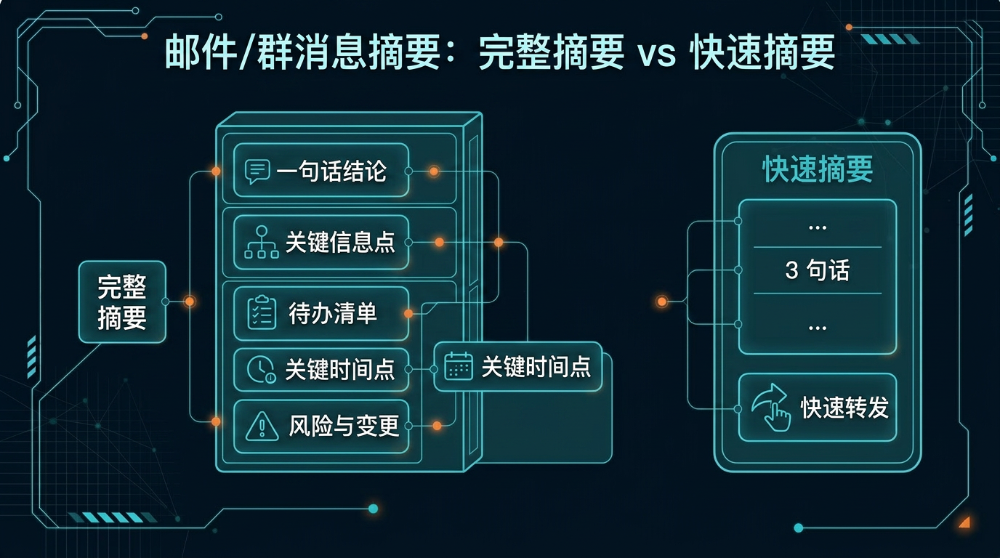
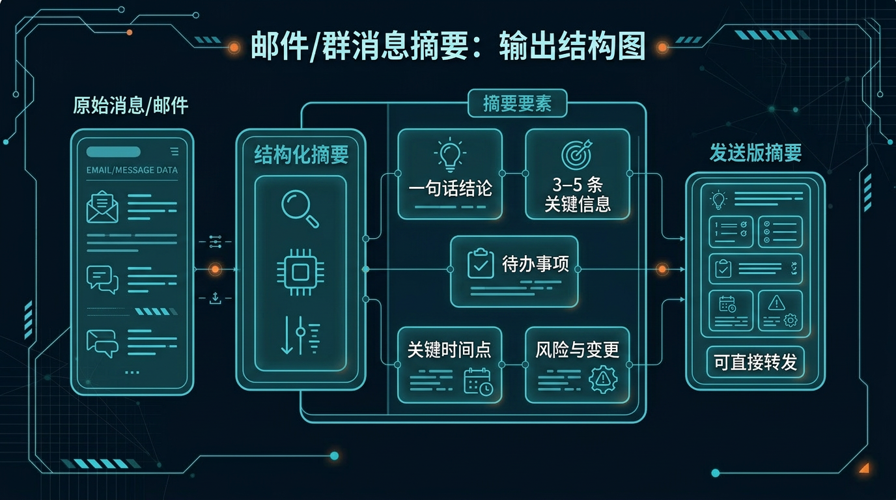

# 06-邮件群消息摘要助手

> 一句话先说清楚：这一页不是教你系统学信息管理，而是帮你把一封长邮件或一堆飞书/企微/钉钉群消息，直接压成一段"能转发、能同步、不用再解释"的结构化摘要。

## 🔍 这页在回答什么

如果你搜的是"群消息太多怎么快速看"、"邮件太长不想逐字读"或者"飞书企微消息怎么快速总结"，这页就是你要找的。这里提供一个用 Hermes Agent（AI 智能助手框架）做消息和邮件摘要的现成方案——把几百条群聊或长邮件压缩成一段带结论、待办、时间点的结构化摘要，拿到就能转发。整套流程不涉及写代码，直接用中文对话就能跑。

---

## 👀 先看结论

如果你现在想的是：
- 出差两天回来，飞书/企微/钉钉群里有 200+ 条未读，只想知道"到底发生了什么、有没有要我做的"
- 收到一封 3000 字的项目邮件，只想知道"结论是什么、我要做什么"
- 跨部门群里讨论了半天，只想知道"跟我相关的有哪几条"
- 我想先让 Hermes 帮我把消息压成一段能直接转发的摘要

那这一页就是给你用的。

你用完这页，先拿到的不是一堆原文节选，而应该是这些东西：
- 核心结论（到底在说什么）
- 待办事项（有没有要你做的）
- 关键时间点（截止日期、会议时间等）
- 需要关注的风险或变更
- 一段可以直接转发的发送版摘要
- 跑完第一轮后下一句该怎么继续

## 🗺 如果你现在只想看最短路线
- 想先看这套东西值不值得用：直接看「⚡ 5 分钟跑一轮」
- 想看最后会拿到什么：直接看「📦 你最后会拿到什么」
- 想看第一轮跑完以后怎么继续：直接看「🪜 跑完第一轮后，下一句怎么说」

---

## 🧩 一个真实用例：这页到底怎么帮人

假设你休假两天回来，打开企业微信，看到项目群里 300 条消息。

你脑子里可能只有这些想法：
- 到底发生了什么
- 有没有要我做的
- 有没有什么重要时间点我错过了
- 有没有什么变了需要我知道的

但真正麻烦的是：
- 200+ 条消息逐条看完要半小时
- 关键信息散落在不同人的回复里
- 待办和闲聊混在一起，分不清哪些要我处理
- 截止时间和会议时间容易被聊天淹没

这一页做的事，就是先把这些零散消息压成一段能转发的结构化摘要。

比如你跑完第一轮后，Hermes 应该先给你：
- 1 句话核心结论
- 3-5 条关键信息点
- 1 份待办清单（标注负责人）
- 1 份关键时间点
- 1 份风险与变更提醒
- 1 段可直接转发的发送版摘要

这样你就不是"还在翻聊天记录"，而是已经有一版能直接转发的摘要。

---

## 🚦 先选哪一种：完整摘要 or 快速摘要

先别被方法论吓到，直接按你现在的状态选。

| 如果你现在更像这样 | 直接走哪条 | 你真正会拿到什么 |
|---|---|---|
| 出差回来，群消息太多，想全面了解发生了什么 | 完整摘要 | 结论 + 信息点 + 待办 + 时间点 + 风险 |
| 只想知道结论和待办，不需要细节 | 快速摘要 | 一句话结论 + 待办清单（3 条以内） |
| 收到一封超长邮件，只想知道结论和我要做什么 | 完整摘要 | 先把邮件压成结构化摘要 |
| 管理多个项目群，需要逐个掌握进展 | 快速摘要 | 每个群一段快速摘要，批量掌握状态 |
| 需要把群消息同步给领导或同事 | 完整摘要 | 先出完整版，再提炼转发版 |

如果你现在拿不准，默认先走：
- 完整摘要

原因很简单：
- 先出完整版，保证信息不丢
- 再从完整版里提炼 3 句话快速摘要，方便转发
- 两版都有，正式场景用完整版、日常场景用快速版



---

## 📝 完整摘要：适合谁，跑完会得到什么

### 适合谁
适合你现在是下面这种状态：
- 消息量大，需要全面了解发生了什么
- 想先拿一版完整的结构化摘要
- 后面可能还要转发或汇报

### 不适合谁
不适合你现在是下面这种状态：
- 想让 Agent 自动回复邮件或群消息（这页只做摘要，不做自动回复）
- 需要一个实时消息监控看板或仪表盘（这页是按需跑一轮，不是持续监控）
- 想用这个替代你的邮件客户端或 IM 工具（这页是辅助总结，不是通信工具替代品）

### 它会帮你做什么
你把原始内容喂进去后，它会先帮你：
- 提炼一句话结论
- 拉出关键信息点（3-5 条）
- 提取待办事项（标注负责人）
- 标出关键时间点
- 提醒风险和变更
- 输出一版可直接转发的发送版摘要

### 你最终应该看到什么
一个合格输出，应该至少让你看懂这些：
- 一句话结论：这段对话/邮件到底在说什么
- 关键信息点：最重要的 3-5 条信息
- 待办清单：谁承诺了什么，谁要做什么
- 关键时间点：截止日期、会议时间、里程碑
- 发送版摘要：一段可以直接转发的 3-5 句话摘要

如果它只给你一堆"建议整理后再确认"这种空话，那就不对。

---

## ⚡ 快速摘要：适合谁，跑完会得到什么

### 适合谁
适合你现在是下面这种状态：
- 只想知道结论和待办
- 准备快速转发给同事或领导
- 不需要细节，只要关键信息

### 不适合谁
- 需要逐条回溯每条消息的原文（快速摘要会丢细节，你要的应该走完整版）
- 想做合规审计或法律留档（快速摘要信息不完整，不适合正式存档）

### 它和完整版最大的区别
- 完整版：全面覆盖，适合存档和正式汇报
- 快速版：只保留结论 + 待办（3 条以内），适合快速同步

### 你会拿到什么

| 你会拿到什么 | 它在输出里大概长什么样 | 你拿它立刻能干嘛 |
|---|---|---|
| 一句话结论 | "首页改版设计稿出了，CTA 位置待调整" | 30 秒掌握核心 |
| 待办清单 | "张三改 CTA → 今天 3 点前 / 赵六出埋点初版 → 下班前" | 直接确认和跟进 |
| 发送版摘要 | 一段 3 句话的转发消息 | @某人 快速同步 |

---

## 📦 你最后会拿到什么

别把它想得太抽象。

你跑完后，真正拿到的通常会长这样：

| 你会拿到什么 | 它在输出里大概长什么样 | 你拿它立刻能干嘛 |
|---|---|---|
| 核心结论 | "新版首页设计稿出了，CTA 位置待调整，明天评审" | 先掌握发生了什么 |
| 关键信息点 | 3-5 条最重要的信息 | 快速扫一遍 |
| 待办清单 | 每项含任务/负责人/截止时间 | 确认谁该做什么 |
| 关键时间点 | "今天 3 点出新版 / 明天下午 2 点评审 / 下班前给埋点初版" | 提醒自己和团队 |
| 风险与变更 | "埋点方案可能阻塞前端联调" | 提前规避 |
| 发送版摘要 | 一段可直接转发的同步消息 | 粘贴到飞书/企微/钉钉 |



---

## ⚡ 5 分钟跑一轮

如果你现在只想先跑通一次，默认走"完整摘要"。

### 第一步：准备原始内容

从飞书、企微或钉钉复制一段群消息，比如：

```
[10:02] 张三：新版首页设计稿已经出了，大家看一下
[10:05] 李四：看了一下，配色方案我觉得可以，但 CTA 按钮位置需要调整
[10:08] 王五：我这边前端已经把基础结构搭好了，等设计稿定稿就可以开始
[10:12] 张三：好，我下午改一下 CTA 位置，3 点前出新版
[10:15] 赵六：数据埋点方案我明天出，不阻塞你们
[10:20] 李四：@赵六 埋点方案能不能今天先给个初版？我们想明天一起评审
[10:22] 赵六：可以，今天下班前给
[10:25] 张三：那我们明天下午 2 点评审，会议室 B
[10:28] 王五：收到，我明天上午把前端 demo 准备好
```

### 第二步：喂给 Hermes

```
请帮我把以下群消息整理成一份结构化摘要。

要求：
1. 一句话结论
2. 关键信息点（3-5 条）
3. 待办事项（标注负责人）
4. 关键时间点
5. 最后附一版可以直接转发到其他群的同步消息

群消息内容：
[粘贴你的内容]
```

### 第三步：拿到结果后检查

重点看这 3 件事：
1. **有没有漏关键信息**：待办、截止时间是否都覆盖了？
2. **待办负责人对不对**：谁承诺了什么，有没有张冠李戴？
3. **转发版是否可以直接发**：复制粘贴到飞书/企微/钉钉，格式和语气是否合适？

如果这 3 件事都 OK，直接转发。

---

## 🧍 超级个体版：一个人用

适合你是自由职业者、独立顾问或需要处理大量邮件/消息的个人。

**你的输入方式**：
- 直接把邮件全文或聊天记录粘贴给 Hermes
- 不需要标注团队角色（摘要以你为中心）
- 重点看待办和时间点

**示例 Prompt**：

```
我出差两天没看邮件，请帮我总结下面这封邮件的要点。

我只想知道：
1. 结论是什么
2. 有没有要我做的
3. 有没有截止日期

邮件内容：
[粘贴邮件]
```

**你会拿到**：一句话结论 + 待办 + 截止时间。30 秒掌握核心。

---

## 🤝 团队协作版：多人用

适合你是项目经理、团队负责人或需要做跨团队同步的人。

**你的输入方式**：
- 提供跨部门群消息或多封邮件
- 告诉 Hermes 你的团队角色和你关心的维度
- 要求输出可转发的同步消息

**示例 Prompt**：

```
我是前端团队负责人。以下是产品群的讨论记录，请帮我整理一份跟我团队相关的摘要。

我关心的维度：
1. 有没有影响前端排期的变更
2. 有没有需要前端配合的新任务
3. 关键时间节点

最后输出一版我可以直接发到前端群的同步消息。

讨论记录：
[粘贴内容]
```

**你会拿到**：
- 跟你团队相关的摘要（过滤无关信息）
- 待办清单（只保留跟前端相关的）
- 可直接转发到飞书/企微/钉钉前端群的同步消息

---

## 🪜 跑完第一轮后，下一句怎么说

很多人卡在这里：第一轮跑完了，然后呢？

你不用自己想复杂，直接这样继续说就行：

```text
基于刚才的摘要，继续往"能直接转发"收：
1. 从完整摘要里提炼一版 3 句话的快速摘要
2. 帮我检查一下有没有漏待办
3. 帮我检查一下截止时间有没有冲突
4. 输出一版可以直接发到前端群的同步消息（只保留跟前端相关的）
```

你可以把这段理解成：
- 第一轮：先拿一版完整摘要
- 第二轮：开始把它收成能直接转发的内容

---

## 📁 你现在直接能用的东西

**Pack 下载与安装**：

- Pack 详情与元数据：[manifest.yaml](../../../packs/message-summary-lab/manifest.yaml)
- 超级个体版下载：[01-super-individual.zip](../../../packs/message-summary-lab/01-super-individual.zip)
- 安装说明：[INSTALL.md](../../../packs/message-summary-lab/INSTALL.md)
- 一键安装到 Profile：[install_to_profile.sh](../../../packs/message-summary-lab/01-super-individual/install_to_profile.sh)
- 使用说明：当前页里的「⚡ 5 分钟跑一轮」就是默认 doc 入口

**可直接使用的 Prompt 模板**：

**模板 1：群消息摘要**

```
请帮我整理以下 [飞书/企微/钉钉] 群消息的结构化摘要。

要求：
1. 一句话结论
2. 关键信息点（3-5 条）
3. 待办事项（标注负责人和截止时间）
4. 风险或需要注意的变更
5. 附一版可直接转发的同步消息（不超过 5 句话）

群消息内容：
[在此粘贴]
```

**模板 2：邮件摘要**

```
请帮我总结以下邮件的核心内容。

我只想知道：
1. 这封邮件的核心结论或请求是什么
2. 有没有要我执行的动作
3. 截止时间是什么时候

邮件内容：
[在此粘贴]
```

**模板 3：跨团队同步摘要**

```
我是 [角色/团队] 的负责人。以下是 [来源] 的讨论/邮件内容。

请帮我提取跟我团队相关的信息，整理成一份可发到 [飞书/企微/钉钉] 群的同步消息。

要求：
- 只保留跟我团队相关的待办和变更
- 标注每个待办的负责人和截止时间
- 输出不超过 5 句话的同步消息

原始内容：
[在此粘贴]
```

---

## ❓ 常见问题

### 支持哪些平台的消息？

飞书、企业微信、钉钉的群消息都支持。本质上只要你能把聊天记录复制粘贴出来，Hermes 就能帮你做摘要。邮件也一样——Gmail、Outlook、QQ 邮箱等都可以，把邮件正文贴过来就行。

### 我的消息内容会被上传或存储吗？

不会。你和 Hermes 的对话内容取决于你所使用的模型服务商的隐私政策。建议不要在摘要中包含高度敏感的个人隐私或商业机密信息，或在发送前对敏感字段做脱敏处理。

### 长对话（几百条消息）摘要准确吗？

消息越多，AI 越有可能遗漏细节中的待办或时间点。建议做法是：如果消息超过 300 条，先按时间段或主题分段喂给 Hermes，每段出一份摘要，最后再做一次合并总结。

### 能总结语音消息吗？

目前 Hermes 处理的是文本内容。如果你的群消息里有语音，需要先用飞书、企微或钉钉自带的语音转文字功能转成文本，再把文本贴过来做摘要。

### 群消息和邮件可以一起处理吗？

可以。你可以把群消息和邮件内容一起贴给 Hermes，让它统一做摘要。对于跨渠道信息汇总（比如同时看群消息和邮件里关于同一件事的讨论），这个场景特别有用。

---

## ➡️ 下一步

完成后进入：

- [01-总览｜应用开发与快速原型](../03-应用开发与快速原型/01-总览.md)

如果你想先回到当前位置重新确认：

- [01-总览｜办公效率与知识整理](./01-总览.md)

---

**🔗 相关入口**

- Pack 详情：[邮件群消息摘要助手 Pack](/packs/message-summary-lab)，先确认适合谁用、安装入口和下载入口。
