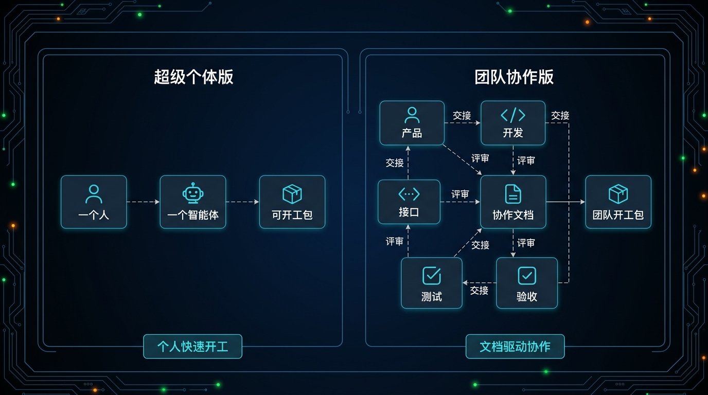
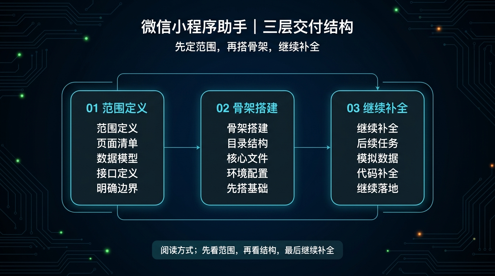
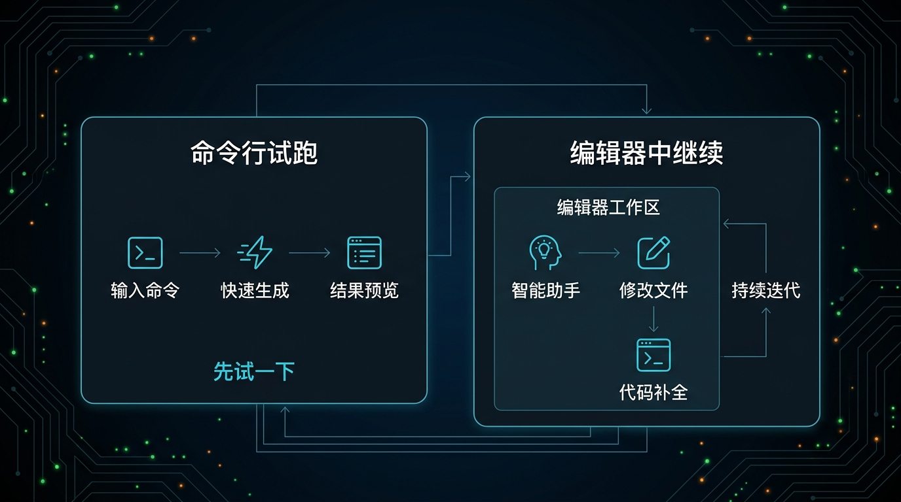
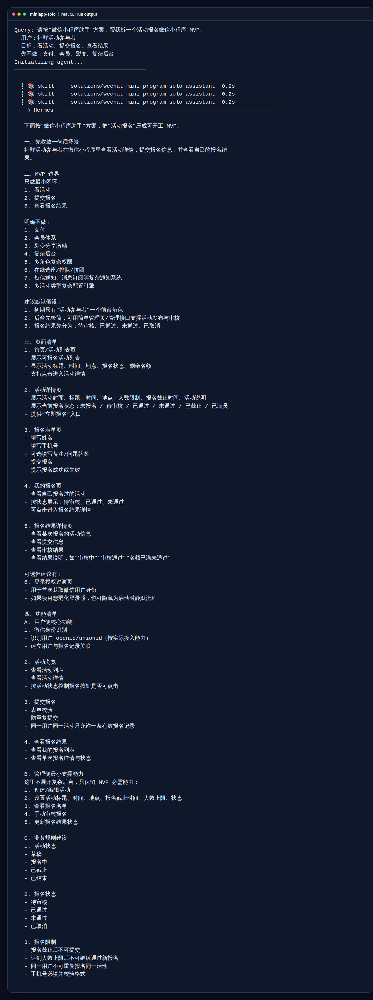
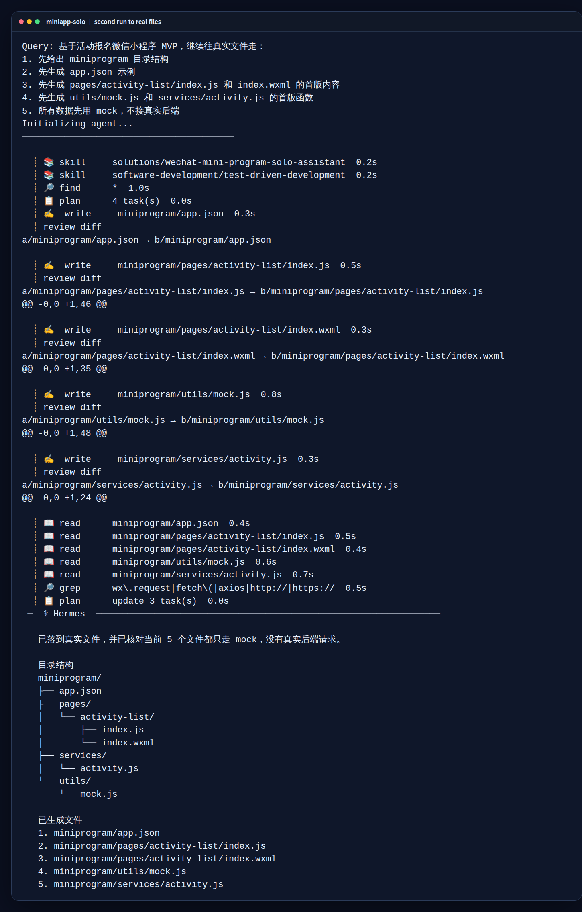
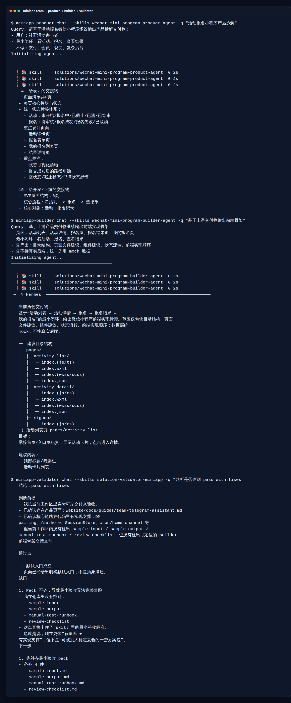

# 02-微信小程序助手

> 一句话先说清楚：这一页不是教你写方案，而是帮你把一个微信小程序想法，直接推进到“能开始搭代码”的状态。

---

## 👀 先看结论

如果你现在想的是：
- 我有个小程序想法，但不知道怎么开工
- 我不想先自己拆页面、拆接口、拆目录
- 我想先让 Hermes 帮我把第一版骨架搭起来

那这一页就是给你用的。

你用完这页，应该拿到的不是一篇分析文，而是这些东西：
- 要做哪些页面
- 每个页面大概干什么
- 目录先怎么建
- 哪些文件先写
- mock 数据先怎么跑
- 后面怎么继续补代码

## 🗺 如果你现在只想看最短路线
- 想先试一次能不能跑：直接看「⚡ 5 分钟用起来」
- 想直接跑团队协作版：直接看「🤝 团队协作版怎么安装和开跑」
- 想看第二轮怎么补真实文件：直接看「🪜 跑完第一步后，下一句怎么说」
- 想看多人协作到底怎么接力：直接看「🧪 再用刚才那个真实用例看一遍」里的团队协作版

---

## 🧩 一个真实用例：这页到底怎么帮人

假设你现在要做一个“活动报名微信小程序”。

你脑子里可能只有一句话：
- 用户可以看活动
- 点进去看详情
- 填表报名
- 提交后看到结果

很多人会卡在这里，因为不知道下一步该干嘛：
- 先写页面？
- 先想接口？
- 先建目录？
- 先找前端同学？

这一页做的事，就是先帮你把这件事压成第一版开工包。

比如你跑完后，Hermes 应该先给你：
- 4 个页面：活动列表、活动详情、报名表单、结果页
- 一版目录结构：pages、services、utils、components
- 一版接口草案：活动列表、活动详情、提交报名、报名结果
- 一版首批文件建议：app.json、activity-list、activity-detail、mock.js、activity.js

这样你就不是“还在想”，而是已经能开始搭。

---

## 🚦先选哪一种：超级个体版 or 团队协作版

先别被名字吓到，直接按你当前情况选。

| 如果你现在更像这样 | 直接选 | 你真正会拿到什么 |
|---|---|---|
| 先想今天就把第一版骨架跑出来 | 超级个体版 | 一次输出页面、目录、第一批文件、下一句续跑指令 |
| 还在验证这个想法值不值得做 | 超级个体版 | 先看 Hermes 能不能把需求压成可开工骨架 |
| 已经准备多人协作推进 | 团队协作版 | product、builder、api、qa、validator 分角色接力 |
| 不想让一个 Agent 什么都包 | 团队协作版 | 每个角色只管自己那一段，交接更清楚 |



这张图可以先这样理解：
- 左边看“一个人 + 一个 Agent + 直接产出”
- 右边看“多角色 + 协作中枢 + 分段交接”

如果你现在拿不准，默认先选：
- 超级个体版

原因很简单：
- 先跑通
- 再变复杂

---

## 🧍 超级个体版：适合谁，跑完会得到什么

### 适合谁
适合你现在是下面这种状态：
- 先想把东西做出来
- 还不需要多人分工
- 先把第一版代码骨架搭起来最重要

### 它会帮你做什么
你把需求喂进去后，它会先帮你：
- 压 MVP 范围
- 拆页面
- 拆数据
- 拆接口
- 给出目录骨架
- 告诉你第一批该写哪些文件

### 你最终应该看到什么
一个合格输出，应该能让你看懂这些：
- 小程序先建哪些目录
- 先出哪些页面文件
- mock 数据放哪
- 请求函数放哪
- 下一步怎么继续让 Hermes 补文件

如果它只给你一堆概念分析，没有往“文件、目录、页面”走，那就不对。

---

## 🤝 团队协作版：适合谁，和超级个体版差在哪

### 适合谁
适合你已经进入下面这种状态：
- 你准备把事情交给多个 Agent 分开做
- 你希望产品、前端、接口、验收各管一段
- 你要的是更稳的协作流程，不只是最快起步

### 它和超级个体版最大的区别
超级个体版：
- 一个 Agent 先把第一版骨架搭出来
- 重点是快
- 适合先验证、先起步

团队协作版：
- 多个 Agent 分开接力
- 重点是边界清楚
- 适合准备正式推进

### 团队协作版里每个角色干什么

| 角色 | 它主要产出什么 | 下一个角色拿它干嘛 |
|---|---|---|
| 01-product | 页面清单、功能边界、状态说明、交接物 | 给 builder 一个明确的实现起点 |
| 02-builder | 前端目录骨架、页面文件建议、组件建议、mock 方案 | 给 api 和 qa 一个可落实现状 |
| 03-api | 数据结构、接口约定、返回字段 | 让 builder 知道接口最终怎么接 |
| 04-qa | 检查项、风险点、是否能开工 | 提前发现这套方案哪里还虚 |
| 99-solution-validator | 最终结论：pass / pass with fixes / fail | 帮你判断这套方案现在能不能继续推进 |

如果你现在只是第一次试这套方案，不建议一上来就团队版。
先把超级个体版跑通，通常更容易理解这套方案到底在干嘛。

---

## 📦 你到底会拿到什么

别把它想得太抽象。

你跑完后，真正拿到的通常会长这样：

| 你会拿到什么 | 它在输出里大概长什么样 | 你拿它立刻能干嘛 |
|---|---|---|
| 页面清单 | `活动列表页 / 活动详情页 / 报名表单页 / 结果页` | 先知道最小页面要做哪几个，不会一上来乱扩 |
| 数据草案 | `activity` 有哪些字段、`signup` 有哪些字段 | 先把假数据和表单字段定下来 |
| 接口草案 | `获取活动列表 / 获取活动详情 / 提交报名 / 查询报名结果` | 先把前后端对接点占住 |
| 目录骨架 | `pages/ / services/ / utils/ / components/ / app.json` | 先把项目目录搭起来 |
| 第一批文件 | `app.json / pages/activity-list/index.js / utils/mock.js / services/activity.js` | 直接开始建文件，不停留在嘴上 |
| 下一句续跑指令 | `先补列表页，再补详情页，再补表单页` | 你不用自己想 prompt，直接继续让 Hermes 干下一轮 |



如果你觉得表格还是偏文字，这张图可以帮助你更快扫一眼：
- 第一层看范围
- 第二层看骨架
- 第三层看怎么继续补文件

### 你可以把它理解成 3 层

#### 第一层：先知道要做什么
你会先拿到：
- 页面清单
- 数据草案
- 接口草案

这层解决的是：
- 这件事到底要做哪几块

#### 第二层：开始落项目骨架
你会继续拿到：
- 目录骨架
- 第一批文件建议

这层解决的是：
- 这个小程序第一版目录该怎么起

#### 第三层：继续往真实文件走
你还会拿到：
- 下一句怎么继续补文件
- 哪些先用 mock
- 哪些后面再接真实接口

这层解决的是：
- 不是只看懂，而是真的能继续做下去

---

## 🖥 CLI 和 ACP，到底怎么选

这里尽量说得像人话一点。

| 你现在要干嘛 | 用哪个 | 跑完你会看到什么 |
|---|---|---|
| 我先想试试这个方案靠不靠谱 | CLI | 一次完整输出：页面、接口、目录、下一步续跑指令 |
| 我还没进工程目录 | CLI | 先确认这套方案值不值得继续投时间 |
| 我已经准备真的开始搭项目 | ACP | 会继续往文件、目录、代码片段走，不只停在分析 |
| 我已经在编辑器里了 | ACP | 可以顺着结果继续补 app.json、页面文件、mock、service |



看这张图时，你可以只抓两个判断点：
- 左边 CLI：命令一跑，先拿一版结果预览
- 右边 ACP：进入编辑器后继续推进文件和代码

### 最简单的记法
- CLI：先看它会不会给你一版像样的开工包
- ACP：确认方向对了以后，继续让它往真实文件走

### 如果你还是拿不准，就直接这样选
- 今天只想先看结果：CLI
- 今天已经准备开始建文件：ACP

---

## ⚡ 5 分钟用起来

如果你现在只想先跑通一次，直接走超级个体版。

### 第一步：下载它
先拿这个包：
- [01-super-individual.zip](../../../packs/miniapp-lab/01-super-individual.zip)

### 第二步：解压后进入目录
```bash
cd /path/to/01-super-individual
```

### 第三步：创建一个独立 profile
```bash
hermes profile create miniapp-solo --clone
```

### 第四步：安装
```bash
bash ./install_to_profile.sh miniapp-solo
```

### 第五步：直接跑现成示例
```bash
miniapp-solo chat --skills wechat-mini-program-solo-assistant -q "$(cat skills/solutions/01-微信小程序/wechat-mini-program-solo-assistant/examples/sample-input.md)"
```



上面这张图不是示意图，是我这次实际跑出来的一次真实输出截图。
你可以把它理解成：
- 这套东西不是停在说明里
- 真的可以跑
- 跑完后会开始给你页面、边界、功能这些可开工内容

如果你只记一个最短路径，就记这 5 步。

### 🤝 团队协作版怎么安装和开跑
如果你已经准备多人协作推进，就不要再只看团队版说明入口，直接把第一棒跑起来。

#### 第一步：下载团队包
先拿这个包：
- [02-team.zip](../../../packs/miniapp-lab/02-team.zip)

#### 第二步：解压后进入目录
```bash
cd /path/to/02-team
```

#### 第三步：先创建 5 个 profile
```bash
hermes profile create miniapp-product --clone
hermes profile create miniapp-builder --clone
hermes profile create miniapp-api --clone
hermes profile create miniapp-qa --clone
hermes profile create miniapp-validator --clone
```

#### 第四步：一键安装
```bash
bash ./install_all.sh
```

#### 第五步：先跑 product 这一棒
```bash
hermes -p miniapp-product chat --skills wechat-mini-program-product-agent -q "$(cat 01-product/skills/solutions/01-微信小程序/wechat-mini-program-product-agent/examples/sample-input.md)"
```

跑完以后，先看这 4 件事：
- 有没有先把需求、页面和边界拆清楚
- 有没有产出 builder 能继续接的交接物
- 有没有知道第二棒该进 builder 而不是乱跳角色
- 有没有把这条链真正跑起来，而不只是停在说明里

如果第一棒没有把页面和边界压清楚，就不要急着往 builder / api / qa 后面接。

### 🏃 跑完第一棒，怎么接第二棒？
当 `miniapp-product` 已经把页面、功能和边界压出来以后，第二棒就交给 `miniapp-builder` 开始搭前端骨架。

```bash
hermes -p miniapp-builder chat --skills wechat-mini-program-builder-agent -q "$(cat 02-builder/skills/solutions/01-微信小程序/wechat-mini-program-builder-agent/examples/sample-input.md)"
```

更稳的用法是：
- 先把 product 那一棒已经确定的页面清单、状态说明和交接物贴进去
- 再让 builder 产出页面骨架与目录结构建议
- 如果产品边界还在变，就先别急着往 builder 这棒接

### 🤝 全链路接力图谱
| 这一棒是谁 | 这一棒主要做什么 | 交给下一棒时，手里应该有什么 |
|---|---|---|
| 第一棒：`miniapp-product` | 定页面清单、功能边界、状态说明 | 一版明确的产品交接物 |
| 第二棒：`miniapp-builder` | 搭目录骨架、页面文件建议、组件建议 | 一版可继续落实现状 |
| 第三棒：`miniapp-api` | 定数据结构、接口约定、返回字段 | 一版可接前后端的接口方案 |
| 第四棒：`miniapp-qa` | 查风险点、查缺页缺链路、列必须补的项 | 一版开工前 QA 结论 |
| 终点站：`miniapp-validator` | 判断 pass / pass with fixes / fail | 最终“这套方案现在能不能继续推进”的结论 |

你可以把这条链理解成：
- `miniapp-product` 先回答做什么
- `miniapp-builder` 再回答前端骨架怎么起
- `miniapp-api` 负责把接口和数据占位补齐
- `miniapp-qa` 负责开工前把关
- `miniapp-validator` 最后只回答一件事：这套小程序方案现在能不能继续推进

### ⚡ 团队协作：最短命令总览
| 第一棒：产品（Product） | 第二棒：搭骨架（Builder） | 最终棒：验收（Validator） |
|---|---|---|
| `hermes -p miniapp-product chat --skills wechat-mini-program-product-agent -q "$(cat 01-product/skills/solutions/01-微信小程序/wechat-mini-program-product-agent/examples/sample-input.md)"` | `hermes -p miniapp-builder chat --skills wechat-mini-program-builder-agent -q "$(cat 02-builder/skills/solutions/01-微信小程序/wechat-mini-program-builder-agent/examples/sample-input.md)"` | `hermes -p miniapp-validator chat --skills solution-validator-miniapp -q "$(cat 99-solution-validator/skills/solutions/01-微信小程序/solution-validator-miniapp/examples/sample-input.md)"` |
| 先拿页面清单、功能边界、状态说明 | 先拿目录骨架、页面文件建议、组件建议 | 最后拿到 `pass / pass with fixes / fail` |

### 🚦 什么时候不要往下一棒走
- 不要交第二棒：如果 `miniapp-product` 还没把页面清单、功能边界和状态说明压清楚。
- 不要交第三棒：如果 `miniapp-builder` 还没搭出目录骨架、页面文件建议和组件建议。
- 不要交第四棒：如果 `miniapp-api` 还没把数据结构、接口约定和返回字段补齐。
- 不要交 Validator：如果 `miniapp-qa` 还没把缺页、缺链路、风险点和可开工判断压清楚。

### 🛠️ 交付验收：怎么交给 Validator？
当 `miniapp-qa` 已经把缺页、缺链路、风险点和可开工判断压清楚以后，再把这一版交给 `miniapp-validator`。

交过去前，最少要准备这 3 类东西：
- 当前方案稿：页面清单、目录骨架、页面文件建议
- 技术占位：数据结构、接口约定、返回字段
- QA 结论：风险点、必须补的项、当前是否建议继续推进

`miniapp-validator` 主要只看这几件事：
- 这套小程序方案现在是不是已经能继续推进
- 页面、接口、状态流和交接物是不是已经闭合
- 有没有明显缺页、缺链路、缺字段或先后顺序错位的问题

如果返回的是 `pass with fixes`，默认这样回：
- 页面骨架、目录、前端落地物还没收干净：回 `miniapp-builder`
- 接口字段、数据结构、返回约定还没压清：回 `miniapp-api`
- 风险点、缺链路、开工判断还没压清：回 `miniapp-qa`

### ✅ 团队协作版最小通过标准
- 产出的目录结构、页面逻辑及 API 约定具备高度可实现性，且经由 `miniapp-validator` 判定为 `pass`，才算这一页的团队版真的跑通。

---

## ✅ 跑完以后，看这几件事就够了

不要被长输出吓到。

你只要检查这 5 件事：
- 有没有把页面拆出来
- 有没有把目录骨架说清楚
- 有没有告诉你先写哪些文件
- 有没有把 mock 和接口分开
- 有没有告诉你下一步怎么继续补代码

如果这 5 件事都没有，那说明输出不合格。

---

## 🪜 跑完第一步后，下一句怎么说

很多人卡在这里：
第一轮跑完了，然后呢？

你不用自己想复杂，直接这样继续说就行：

```text
基于刚才这版活动报名小程序骨架，继续往可运行代码走：
1. 先创建 miniprogram 目录结构
2. 先生成 app.json、app.js、app.wxss
3. 先生成 pages/activity-list/index.js、index.wxml、index.wxss、index.json
4. 先生成 pages/activity-detail/index.js、index.wxml、index.wxss、index.json
5. 先生成 utils/mock.js 和 services/activity.js
6. 所有数据先用 mock，不接真实后端
7. 每生成一组文件，都说明这个文件负责什么
```

你可以把这段理解成：
- 第一轮：先拿骨架
- 第二轮：开始补真实文件



这张图证明的不是“又分析了一轮”，而是：
- 它已经开始写真实文件
- 写的是页面文件和基础服务文件
- 这一轮已经从“骨架建议”走到“文件级动作”

这样就不会停在“懂了，但还是不会用”。

---

## 🧪 再用刚才那个真实用例看一遍

还是“活动报名小程序”这个例子。

### 如果你选超级个体版
你会更快拿到：
- 页面列表
- 一版目录结构
- 一版 mock 数据
- 第一批文件建议
- 一句句继续补代码的指令

适合：
- 你自己先做
- 你先验证值不值得做
- 你先把第一版搭起来

### 如果你选团队协作版
你会拿到更分工化的过程：
- 产品 Agent 先拆需求
- Builder Agent 再搭页面骨架
- API Agent 再拆接口
- QA Agent 再验是不是能开工



上面这张图要证明的是：
- 团队版不是一个名字，而是真的分角色接力
- 不是所有事都塞给一个 Agent
- 最后还有 validator 给出结论，而不是只停在“看起来差不多”

适合：
- 你已经准备认真推进
- 你希望职责非常清楚
- 你不想让一个 Agent 什么都包

---

## 🎯 这页写对了，用户应该一眼看懂什么

一页合格的“微信小程序助手”，用户应该一眼就能看懂这 4 件事：

- 这页是帮我开始搭代码，不是只写方案
- 我现在应该先选超级个体版还是团队协作版
- 我第一步具体要怎么跑
- 我跑完后下一句该怎么继续

如果这 4 件事看不出来，这页就还没写对。

---

## 📁 你现在直接能用的东西

- 超级个体版 zip：[01-super-individual.zip](../../../packs/miniapp-lab/01-super-individual.zip)
- 团队协作版 zip：[02-team.zip](../../../packs/miniapp-lab/02-team.zip)
- 超级个体版输入示例：[sample-input.md](../../../packs/miniapp-lab/01-super-individual/skills/solutions/01-微信小程序/wechat-mini-program-solo-assistant/examples/sample-input.md)
- 超级个体版输出示例：[sample-output.md](../../../packs/miniapp-lab/01-super-individual/skills/solutions/01-微信小程序/wechat-mini-program-solo-assistant/examples/sample-output.md)
- 团队版说明入口：[02-team README](../../../packs/miniapp-lab/02-team/README.md)

---

## ➡️ 下一步

完成后进入：

- 如果你现在想直接试，继续看包入口：[packs / miniapp-lab / INSTALL.md](../../../packs/miniapp-lab/INSTALL.md)

如果你想先回到这一层入口重新确认位置：

- [01-总览｜现成方案](../01-总览.md)