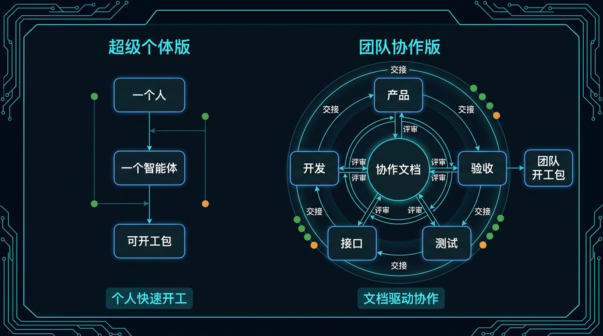
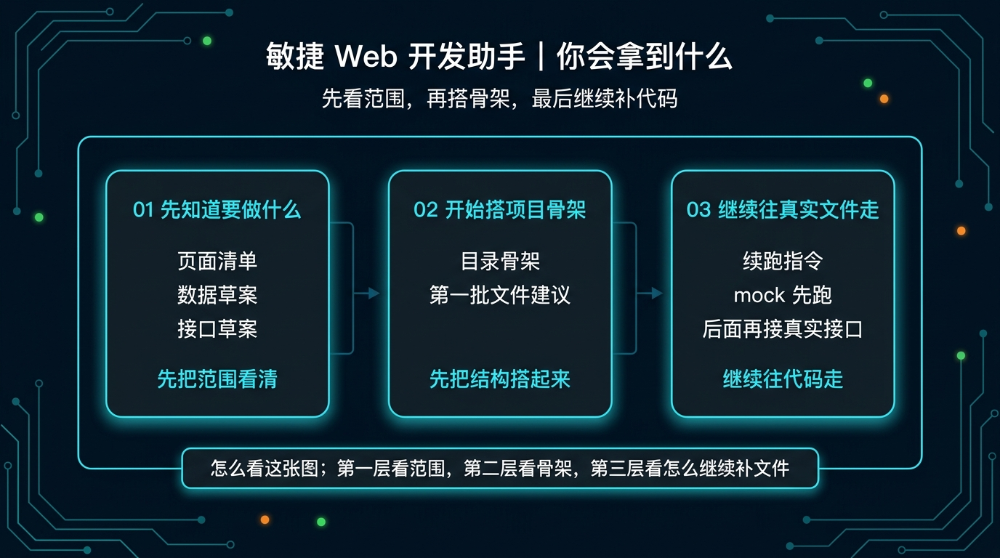
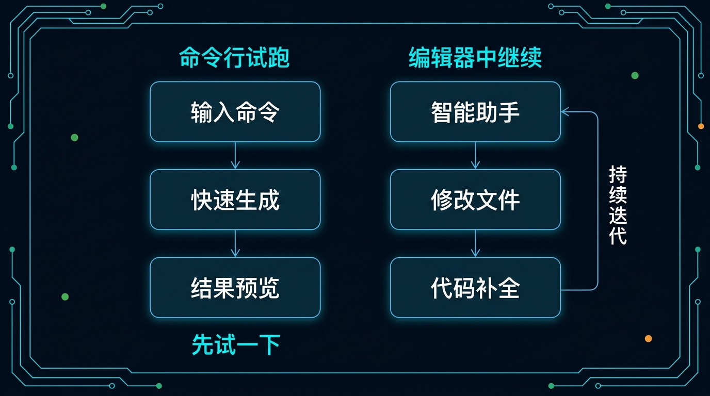

# 03-敏捷 Web 开发助手

> 一句话先说清楚：这一页不是教你系统学 Web 开发，而是帮你把一个 Web 工具想法，直接推进到“能开始搭页面、接口和代码骨架”的状态。

---

## 👀 先看结论

如果你现在想的是：
- 我想做一个后台、控制台、表单系统或内部运营工具
- 我不想先自己拆页面、拆数据、拆接口
- 我想先让 Hermes 帮我把第一版 Web 原型骨架搭起来

那这一页就是给你用的。

你用完这页，应该先拿到的不是一篇泛泛分析，而是这些东西：
- 要做哪些页面
- 页面之间怎么跳
- 数据结构先怎么定
- 接口先怎么占位
- 前端目录先怎么起
- 哪些文件应该先生成
- 跑完第一轮后下一句该怎么继续

## 🗺 如果你现在只想看最短路线
- 想先看这套东西值不值得用：直接看「⚡ 5 分钟跑一轮」
- 想直接跑团队协作版：直接看「🤝 团队协作版怎么安装和开跑」
- 想看它最后会产出什么：直接看「📦 你最后会拿到什么」
- 想看第一轮跑完以后怎么继续补代码：直接看「🪜 跑完第一轮后，下一句怎么说」
- 想直接下载安装包：直接看「📁 你现在直接能用的东西」

---

## 🧩 一个真实用例：这页到底怎么帮人

假设你现在要做一个“销售线索管理后台”。

你脑子里可能只有这些想法：
- 线索列表要能看
- 点进去能看详情
- 能录入跟进记录
- 能筛选状态、来源、负责人
- 能在后台看一眼每个人跟进到了哪一步

很多人会卡在这里，因为不知道先做什么：
- 先画页面？
- 先写表结构？
- 先定接口？
- 先起前端目录？
- 先让 AI 帮我搭一个后台骨架？

这一页做的事，就是先把这件事压成第一版可开工包。

比如你跑完第一轮后，Hermes 应该先给你：
- 5 个页面：线索列表、线索详情、跟进记录、新建线索、统计概览
- 一版目录骨架：pages、components、services、stores、utils
- 一版接口草案：获取线索列表、获取详情、提交跟进、筛选查询、统计概览
- 一版首批文件建议：app.tsx、router.ts、lead-list、lead-detail、services/lead.ts

这样你就不是“还在想”，而是已经能开始搭第一版 Web 原型。

---

## 🚦先选哪一种：超级个体版 or 团队协作版

先别被名字吓到，直接按你当前情况选。

| 如果你现在更像这样 | 直接选 | 你真正会拿到什么 |
|---|---|---|
| 先想今天把第一版后台骨架跑出来 | 超级个体版 | 一次输出页面、数据、接口、目录和第一批文件建议 |
| 还在验证这个工具值不值得做 | 超级个体版 | 先把需求压成最小可开工 Web 原型 |
| 已经准备多人一起推进 | 团队协作版 | product、builder、api、qa、validator 分角色接力 |
| 不想把所有事都塞给一个 Agent | 团队协作版 | 每个角色只管自己那一段，边界更清楚 |



这张图可以先这样理解：
- 左边看“一个人 + 一个智能体 + 可开工包”
- 右边看“多角色 + 协作文档 + 团队开工包”

如果你现在拿不准，默认先选：
- 超级个体版

原因很简单：
- 先跑通
- 再变复杂

---

## 🧍 超级个体版：适合谁，跑完会得到什么

### 适合谁
适合你现在是下面这种状态：
- 先想把后台原型做出来
- 还不需要多人协作
- 先把第一版页面、接口和代码骨架搭出来最重要

### 它会帮你做什么
你把需求喂进去后，它会先帮你：
- 压 MVP 范围
- 拆页面
- 拆数据结构
- 拆接口草案
- 给出目录骨架
- 告诉你第一批该生成哪些文件

### 你最终应该看到什么
一个合格输出，应该至少让你看懂这些：
- 这个后台先做哪几个页面
- 每个页面分别负责什么
- 列表、详情、表单、筛选分别怎么组织
- 哪些前端文件先建
- 哪些接口先占位
- 下一步怎么继续让 Hermes 往代码走

如果它只给你一堆抽象概念，没有往“页面、接口、目录、文件”走，那就不对。

---

## 🤝 团队协作版：适合谁，和超级个体版差在哪

### 适合谁
适合你已经进入下面这种状态：
- 你准备把事情交给多个 Agent 分开做
- 你希望产品、前端、接口、验收各管一段
- 你要的是更稳的协作流程，不只是最快起步

### 它和超级个体版最大的区别
超级个体版：
- 一个 Agent 先把第一版 Web 原型骨架搭出来
- 重点是快
- 适合先验证、先起步

团队协作版：
- 多个 Agent 分开接力
- 重点是边界清楚
- 适合准备正式推进

### 团队协作版里每个角色干什么

| 角色 | 它主要产出什么 | 下一个角色拿它干嘛 |
|---|---|---|
| 01-product | 页面清单、状态说明、操作流、交接物 | 给 builder 一个明确的实现起点 |
| 02-builder | 前端目录骨架、页面文件建议、组件建议、状态流转 | 给 api 和 qa 一个可落实现状 |
| 03-api | 数据结构、接口约定、请求返回字段 | 让 builder 知道接口怎么接 |
| 04-qa | 检查项、风险点、是否能开工 | 提前发现方案哪里还虚 |
| 99-solution-validator | 最终结论：pass / pass with fixes / fail | 帮你判断这套方案现在能不能继续推进 |

如果你现在只是第一次试这套方案，不建议一上来就团队版。
先把超级个体版跑通，通常更容易理解这套方案到底在干嘛。

---

## 📦 你最后会拿到什么

别把它想得太抽象。

你跑完后，真正拿到的通常会长这样：

| 你会拿到什么 | 它在输出里大概长什么样 | 你拿它立刻能干嘛 |
|---|---|---|
| 页面清单 | `线索列表 / 线索详情 / 跟进记录 / 新建线索 / 统计概览` | 先知道最小页面要做哪几个 |
| 数据草案 | `lead`、`follow_up`、`owner` 有哪些字段 | 先把列表和表单字段定下来 |
| 接口草案 | `获取列表 / 获取详情 / 提交跟进 / 查询筛选 / 概览统计` | 先把前后端对接点占住 |
| 目录骨架 | `pages/ / components/ / services/ / stores/ / utils/` | 先把前端项目目录搭起来 |
| 第一批文件 | `router.ts / pages/lead-list / pages/lead-detail / services/lead.ts` | 直接开始建文件，不停留在嘴上 |
| 下一句续跑指令 | `先补列表页，再补详情页，再补表单流` | 你不用自己想 prompt，直接继续让 Hermes 干下一轮 |



如果你觉得表格还是偏文字，这张图可以帮助你更快扫一眼：
- 第一层看范围
- 第二层看骨架
- 第三层看怎么继续补文件

---

## 🖥 CLI 和 ACP，到底怎么选

这里尽量说得像人话一点。

| 你现在要干嘛 | 用哪个 | 跑完你会看到什么 |
|---|---|---|
| 我先想试试这个工具方向靠不靠谱 | CLI | 一次完整输出：页面、接口、目录、下一步续跑指令 |
| 我还没进工程目录 | CLI | 先确认这套方案值不值得继续投时间 |
| 我已经准备真的开始搭项目 | ACP | 会继续往文件、目录、代码片段走，不只停在分析 |
| 我已经在编辑器里了 | ACP | 可以顺着结果继续补页面文件、状态管理、service 与 mock |



看这张图时，你可以只抓两个判断点：
- 左边 CLI：命令一跑，先拿一版结果预览
- 右边 ACP：进入编辑器后继续推进文件和代码

### 最简单的记法
- CLI：先看它会不会给你一版像样的后台骨架
- ACP：确认方向对了以后，继续让它往真实文件走

### 如果你还是拿不准，就直接这样选
- 今天只想先看结果：CLI
- 今天已经准备开始建文件：ACP

---

## ⚡ 5 分钟跑一轮

如果你现在只想先跑通一次，默认走超级个体版。

### 第一步：下载它
先拿这个包：
- [packs/webdev-lab/01-super-individual.zip](../../../packs/webdev-lab/01-super-individual.zip)

### 第二步：解压后进入目录
```bash
cd /path/to/01-super-individual
```

### 第三步：创建一个独立 profile
```bash
hermes profile create webdev-solo --clone
```

### 第四步：安装
```bash
bash ./install_to_profile.sh webdev-solo
```

### 第五步：直接跑现成示例
```bash
hermes -p webdev-solo chat --skills agile-web-development-solo-assistant -q "$(cat skills/solutions/agile-web-development-solo-assistant/examples/sample-input.md)"
```

跑完以后，先看这 5 件事：
- 有没有把页面拆出来
- 有没有把目录骨架说清楚
- 有没有把接口和数据先占位
- 有没有告诉你先生成哪些文件
- 有没有告诉你下一轮该怎么继续

如果这 5 件事都没有，那说明输出不合格。

### 🤝 团队协作版怎么安装和开跑
如果你已经不想让一个 Agent 什么都包，而是准备按 product / builder / api / qa / validator 接力推进，就直接走团队协作版。

#### 第一步：下载团队包
先拿这个包：
- [packs/webdev-lab/02-team.zip](../../../packs/webdev-lab/02-team.zip)

#### 第二步：解压后进入目录
```bash
cd /path/to/02-team
```

#### 第三步：先创建 5 个 profile
```bash
hermes profile create webdev-product --clone
hermes profile create webdev-builder --clone
hermes profile create webdev-api --clone
hermes profile create webdev-qa --clone
hermes profile create webdev-validator --clone
```

#### 第四步：一键安装
```bash
bash ./install_all.sh
```

#### 第五步：先跑 product 这一棒
```bash
hermes -p webdev-product chat --skills agile-web-product-agent -q "$(cat 01-product/skills/solutions/agile-web-product-agent/examples/sample-input.md)"
```

跑完以后，先看这 4 件事：
- 有没有先把页面、功能和边界拆清楚
- 有没有产出 builder 能继续接的前置交接物
- 有没有知道第二棒该交给 builder 而不是继续让 product 包完
- 有没有把团队版真正跑成接力链，而不是停在概念层

如果第一棒还没把需求和边界压清楚，就不要急着让 builder / api 往后接。

### 🏃 跑完第一棒，怎么接第二棒？
当 `webdev-product` 已经把页面、功能和边界压出来以后，第二棒就交给 `webdev-builder` 开始搭前端骨架。

```bash
hermes -p webdev-builder chat --skills agile-web-builder-agent -q "$(cat 02-builder/skills/solutions/agile-web-builder-agent/examples/sample-input.md)"
```

更稳的用法是：
- 先把第一棒已经确认的页面结构、功能边界和交接物贴进去
- 再让 builder 产出前端骨架与目录建议
- 如果 product 这一棒还没把需求讲清楚，就先不要急着往 builder 接

### 🤝 全链路接力图谱
| 这一棒是谁 | 这一棒主要做什么 | 交给下一棒时，手里应该有什么 |
|---|---|---|
| 第一棒：`webdev-product` | 定页面清单、操作流、功能边界 | 一版明确的产品交接物 |
| 第二棒：`webdev-builder` | 搭前端目录骨架、页面文件建议、组件结构 | 一版可继续落实现状 |
| 第三棒：`webdev-api` | 定数据结构、接口约定、请求返回字段 | 一版可接前后端的接口方案 |
| 第四棒：`webdev-qa` | 查风险点、查缺页缺链路、列必须补的项 | 一版开工前 QA 结论 |
| 终点站：`webdev-validator` | 判断 pass / pass with fixes / fail | 最终“这套 Web 方案现在能不能继续推进”的结论 |

你可以把这条链理解成：
- `webdev-product` 先回答做什么
- `webdev-builder` 再回答前端骨架怎么起
- `webdev-api` 负责把接口和数据占位补齐
- `webdev-qa` 负责开工前把关
- `webdev-validator` 最后只回答一件事：这套 Web 方案现在能不能继续推进

### ⚡ 团队协作：最短命令总览
| 第一棒：产品（Product） | 第二棒：搭骨架（Builder） | 最终棒：验收（Validator） |
|---|---|---|
| `hermes -p webdev-product chat --skills agile-web-product-agent -q "$(cat 01-product/skills/solutions/agile-web-product-agent/examples/sample-input.md)"` | `hermes -p webdev-builder chat --skills agile-web-builder-agent -q "$(cat 02-builder/skills/solutions/agile-web-builder-agent/examples/sample-input.md)"` | `hermes -p webdev-validator chat --skills solution-validator-webdev -q "$(cat 99-solution-validator/skills/solutions/solution-validator-webdev/examples/sample-input.md)"` |
| 先拿页面清单、操作流、功能边界 | 先拿前端目录骨架、页面文件建议、组件结构 | 最后拿到 `pass / pass with fixes / fail` |

### 🚦 什么时候不要往下一棒走
- 不要交第二棒：如果 `webdev-product` 还没把页面清单、操作流和功能边界压清楚。
- 不要交第三棒：如果 `webdev-builder` 还没搭出前端目录骨架、页面文件建议和组件结构。
- 不要交第四棒：如果 `webdev-api` 还没把数据结构、接口约定和请求返回字段补齐。
- 不要交 Validator：如果 `webdev-qa` 还没把缺页、缺链路、风险点和可开工判断压清楚。

### 🛠️ 交付验收：怎么交给 Validator？
当 `webdev-qa` 已经把缺页、缺链路、风险点和可开工判断压清楚以后，再把这一版交给 `webdev-validator`。

交过去前，最少要准备这 3 类东西：
- 当前方案稿：页面清单、前端目录骨架、页面文件建议
- 技术占位：数据结构、接口约定、请求返回字段
- QA 结论：风险点、必须补的项、当前是否建议继续推进

`webdev-validator` 主要只看这几件事：
- 这套 Web 方案现在是不是已经能继续推进
- 页面、接口、操作流和交接物是不是已经闭合
- 有没有明显缺页、缺链路、缺字段或实现顺序错位的问题

如果返回的是 `pass with fixes`，默认这样回：
- 页面骨架、目录、前端落地物还没收干净：回 `webdev-builder`
- 接口字段、数据结构、请求返回约定还没压清：回 `webdev-api`
- 风险点、缺链路、开工判断还没压清：回 `webdev-qa`

### ✅ 团队协作版最小通过标准
- 产出的页面结构、前端骨架及接口约定已经能支撑继续进入真实实现，且经由 `webdev-validator` 判定为 `pass`，才算这一页的团队版真的跑通。

---

## 🪜 跑完第一轮后，下一句怎么说

很多人卡在这里：
第一轮跑完了，然后呢？

你不用自己想复杂，直接这样继续说就行：

```text
基于刚才这版销售线索管理后台骨架，继续往可运行代码走：
1. 先生成 router.ts 和基础页面目录
2. 先生成线索列表页和详情页的页面文件
3. 先生成新建线索表单页
4. 先生成 services/lead.ts 和 mock 数据文件
5. 先把列表、筛选、详情三条最小链路接起来
6. 所有数据先用 mock，不接真实后端
7. 每生成一组文件，都说明这个文件负责什么
```

你可以把这段理解成：
- 第一轮：先拿骨架
- 第二轮：开始补真实文件

---

## 📁 你现在直接能用的东西

- 超级个体版下载：[packs/webdev-lab/01-super-individual.zip](../../../packs/webdev-lab/01-super-individual.zip)
- 团队协作版下载：[packs/webdev-lab/02-team.zip](../../../packs/webdev-lab/02-team.zip)
- 安装说明：[packs/webdev-lab/INSTALL.md](../../../packs/webdev-lab/INSTALL.md)
- 使用说明：当前页里的「⚡ 5 分钟跑一轮」和「🤝 团队协作版怎么安装和开跑」就是默认 doc 入口

---

## 🎯 这页写对了，用户应该一眼看懂什么

一页合格的“敏捷 Web 开发助手”，用户应该一眼就能看懂这 4 件事：

- 这页是帮我开始搭 Web 工具代码骨架，不是只写方案
- 我现在应该先选超级个体版还是团队协作版
- 我第一步具体该怎么跑
- 我跑完后下一句该怎么继续

如果这 4 件事看不出来，这页就还没写对。

---

## ➡️ 下一步

完成后进入：

- [回 01-总览｜现成方案](../01-总览.md)

如果你想继续留在这一条线里：

- [回 02-微信小程序助手](./02-微信小程序助手.md)
