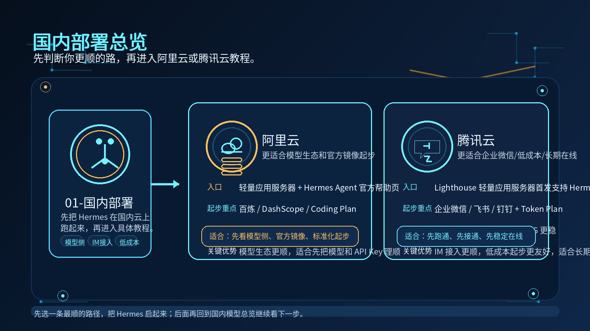

# 🚀 01-国内部署

这一页的作用很简单：先帮你选对国内部署入口，再进入对应教程。

---

## 🧭 先看你现在更像哪种情况

<table>
  <colgroup>
    <col style="width: 26%;" />
    <col style="width: 28%;" />
    <col style="width: 46%;" />
  </colgroup>
  <thead>
    <tr>
      <th>你的情况</th>
      <th>先去哪里</th>
      <th>这一页会帮你什么</th>
    </tr>
  </thead>
  <tbody>
    <tr>
      <td>🟠 更看重模型侧、官方镜像、百炼 / DashScope / Qwen</td>
      <td><a href="../阿里云轻量服务器部署教程.md"><strong>阿里云轻量服务器部署教程</strong></a></td>
      <td>
        <ul>
          <li>先把模型和 API Key 这条线理顺</li>
          <li>按官方镜像和标准化起步</li>
          <li>走更偏模型生态的国内部署路径</li>
        </ul>
      </td>
    </tr>
    <tr>
      <td>🔵 更看重 IM 接入、低成本起步、长期在线</td>
      <td><a href="../腾讯云轻量服务器部署教程.md"><strong>腾讯云轻量服务器部署教程</strong></a></td>
      <td>
        <ul>
          <li>先把部署和聊天通道接起来</li>
          <li>优先企业微信 / 飞书 / 钉钉</li>
          <li>走更稳、更适合长期在线的国内部署路径</li>
        </ul>
      </td>
    </tr>
    <tr>
      <td>🟢 OpenClaw 老用户，想顺着原来的工作重心迁移</td>
      <td>先选最像你原来用法的那条路</td>
      <td>
        <ul>
          <li>聊天通道重心更强 → 先看腾讯云</li>
          <li>模型生态重心更强 → 先看阿里云</li>
          <li>先跑通第一台机器，比一次性想全更重要</li>
        </ul>
      </td>
    </tr>
  </tbody>
</table>

---

## ✨ 快速判断

- 你更在意模型和标准化镜像 → 先去阿里云
- 你更在意企业微信和低成本起步 → 先去腾讯云
- 你还没部署过一次 → 先把国内部署跑通
- 你已经部署完了 → 再去看国内模型总览

---

## 📌 这页只负责什么

这一页只负责把入口分清楚。

它不负责：

- 继续展开所有模型选择
- 继续讲日常使用
- 继续讲 IM 接入细节
- 继续讲后续自动化能力

这些内容都放到后面的具体页面里。

---

## ➡️ 下一步

完成后进入：

- [阿里云轻量服务器部署教程](../阿里云轻量服务器部署教程.md)
- [腾讯云轻量服务器部署教程](../腾讯云轻量服务器部署教程.md)

如果你想先回到国内落地总入口重新确认位置：

- [03-国内落地总览](../01-总览.md)
