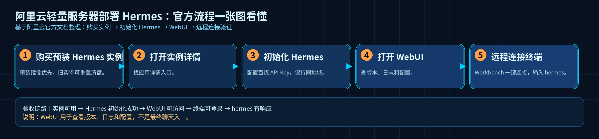
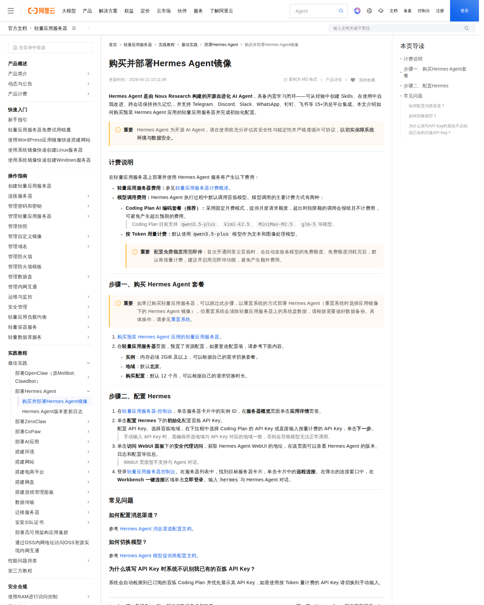

# 02-阿里云轻量服务器部署教程

这一页只做一件事：把阿里云上的 Hermes 环境按官方路径跑通。

你会在这页里完成三件事：

1. 买到或准备好阿里云轻量应用服务器
2. 成功进入远程终端
3. 启用 Hermes 并确认它真的可用

## 先看结果

做完这一页，你应该已经看到下面这些结果：

- 控制台里有一台可用的轻量应用服务器
- 你能进入这台服务器的远程连接终端
- Hermes 已完成初始化
- 你知道 WebUI 在哪里
- 你也知道 WebUI 主要用于看版本、日志和配置，不是主要聊天入口

如果你要继续：

- 学会最短使用路径，去 [《快速开始》](../../01-从这开始/总览.md)
- 继续看模型配置，去 [《中国模型总览》](../中国模型总览.md)
- 继续接飞书 / 企微 / 钉钉，去 [《01-国内部署》](./01-总览.md)

## 先确认官方路径长什么样

阿里云官方文档把这条路径分成三段：

- 购买预装 Hermes 的轻量应用服务器
- 初始化 Hermes，并配置百炼 API Key
- 通过远程连接登录终端，输入 `hermes` 验证

这张图的作用不是让你记住每个字，而是先确认：

- 这是阿里云官方帮助中心的正式教程页
- 页面主题就是 Hermes 部署
- 官方写法本身就是“购买 → 配置 → 远程验证”

## 第一步：购买预装 Hermes 的轻量应用服务器

阿里云官方推荐的最省事路径，是直接购买预装 Hermes Agent 的轻量应用服务器。

如果你已经有轻量应用服务器，也可以走重置系统的方式切换到 Hermes 镜像，但这会清空系统盘数据，所以先备份再动手。

这一部分你要记住三件事：

- 实例内存至少 2 GiB
- 购买页默认地域是北京
- 购买时长默认 12 个月，可按需调整

这张官方截图里能看到“步骤一、购买 Hermes Agent 套餐”，说明阿里云的官方入口确实先让你把实例买对，而不是先去折腾模型或聊天入口。

## 第二步：进入实例详情，找到 Hermes 的应用页

买完实例后，进入轻量应用服务器控制台，点进目标服务器卡片的实例 ID。

接着打开应用详情页签，先只看两块内容：

- 配置 Hermes
- 访问 WebUI 面板

不要在这里展开别的配置，不然很容易把部署和后续使用混在一起。

## 第三步：初始化 Hermes

在配置 Hermes 这一块，点击初始化，开始配置百炼 API Key。

这里最容易踩坑的是地域。

如果你手动输入 API Key，一定要确认：

- 你选的百炼地域
- 这个 API Key 对应的地域

两者必须一致。否则模型调用会失败。

这张图里同时能看到两个关键点：

- 官方教程里明确写了“步骤二、配置 Hermes”
- 还明确说明了 WebUI 主要用于查看版本、日志和配置，不是聊天入口

## 第四步：找到 WebUI，但不要把它当成聊天入口

完成初始化后，在访问 WebUI 面板里点安全代理访问，就能拿到 Hermes Agent 的 WebUI 地址。

这个页面主要看三样东西：

- Hermes Agent 版本
- 日志
- 配置

这页最重要的一句是：

**WebUI 页面暂不支持与 Agent 直接对话。**

所以在这条路径里，WebUI 不是聊天入口，它更像是管理和查看状态的地方。

## 第五步：登录远程终端，验证 Hermes 已经可用

回到阿里云轻量应用服务器控制台，在服务器列表里找到目标服务器，点击远程连接。

在弹出的连接窗口里，用 Workbench 一键连接进入终端。

进入终端后，按阿里云官方教程的说法，输入 `hermes` 与 Hermes Agent 对话，确认它能正常响应。

这张截图证明的是：官方教程把“远程连接 + Workbench 一键连接 + 输入 hermes 验证”写得很明确。真正的完成标准，还是你在自己的终端里能跑通一次交互。

## 这页最常见的误区

### 误区一：买完实例就算部署完成
不是。买完实例只是把环境准备好了，真正的部署完成至少还包括初始化 Hermes、配置百炼 API Key、进入终端验证 `hermes` 可以运行。

### 误区二：WebUI 就是聊天页
不是。阿里云官方文档已经明确写了，WebUI 主要看版本、日志和配置，暂不支持和 Agent 直接对话。

### 误区三：API Key 地域无所谓
不是。手动输入百炼 API Key 时，地域必须一致，不然模型调用会失败。

### 误区四：已有实例重置系统没有风险
不是。重置系统会清空系统盘数据，这一步一定要在确认无误后再做。

## 做完后，你应该检查什么

请用下面这张清单确认自己已经完成：

- 轻量应用服务器已创建完成
- 实例详情页能正常打开
- 应用详情里的初始化已完成
- WebUI 地址可访问
- 远程连接可登录
- 在终端里输入 `hermes` 后，Hermes 可以正常进入交互状态

如果这些都成立，这页的任务就完成了。

## ➡️ 下一步

完成后进入：

- [中国模型总览](../中国模型总览.md)
- [01-国内部署](./01-总览.md)

如果你想先回到国内落地总入口重新确认位置：

- [03-国内落地总览](../01-总览.md)

## 🔹 官方依据

- https://help.aliyun.com/zh/simple-application-server/use-cases/purchase-and-deploy-hermes-agent
- https://www.aliyun.com/solution/tech-solution/hermes-agent
- https://hermes-agent.nousresearch.com/docs/getting-started/quickstart
