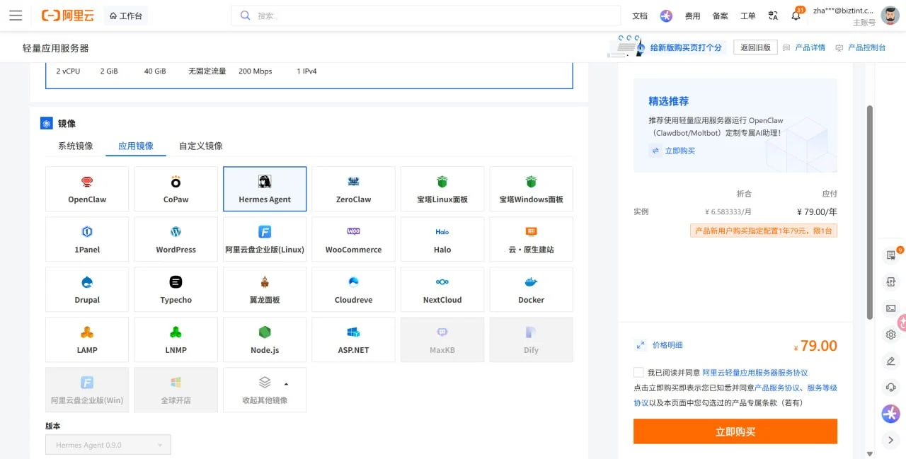
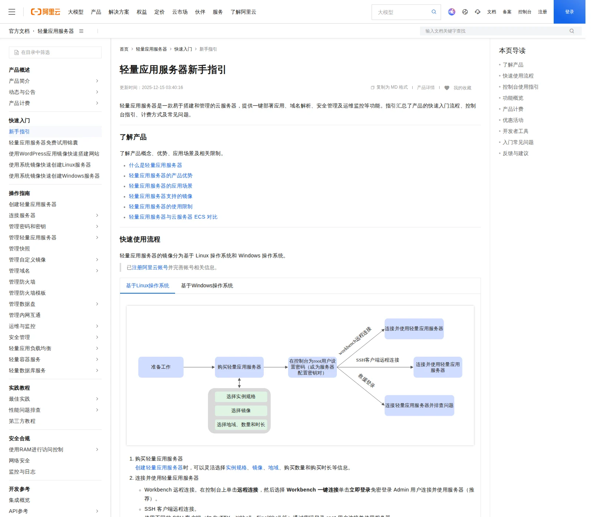
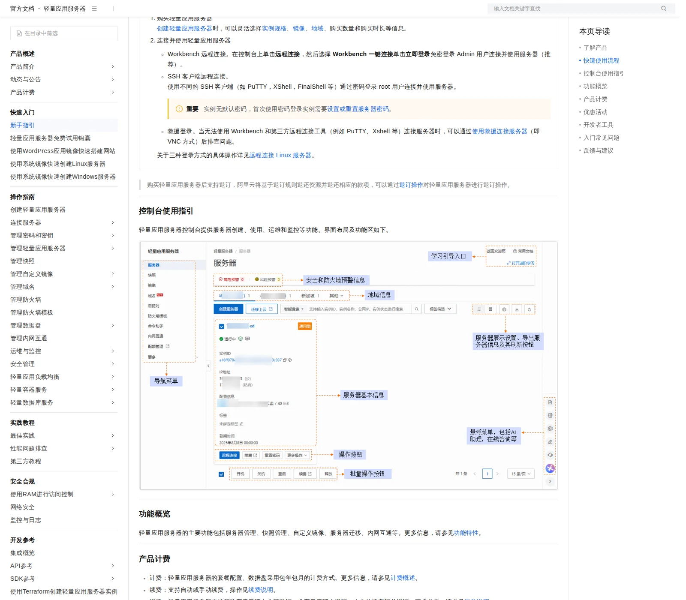
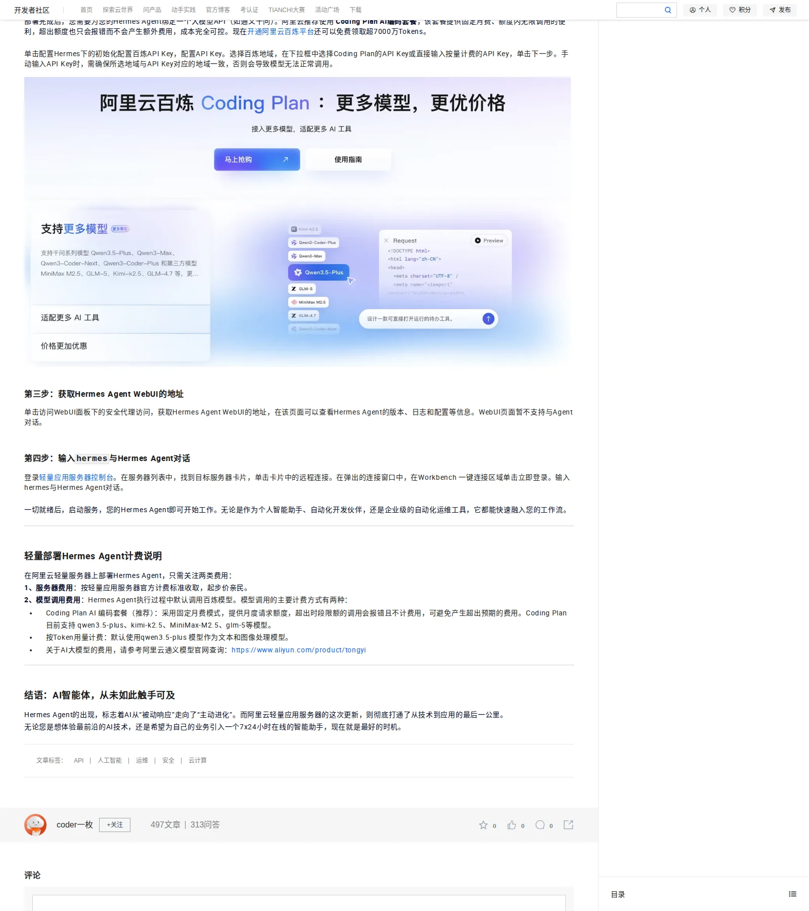

# 02-阿里云轻量服务器部署教程



> 💡 **速答**：在阿里云轻量应用服务器购买页选择 Hermes Agent 应用镜像，创建实例后用 Workbench 或 SSH 连上终端，直接执行 `hermes` 即可启动——从买到跑通最快 10 分钟，不需要手工装系统。

> 一句话先说清楚：这一页不教你选模型，也不教你接入口，它只做一件事——用阿里云轻量应用服务器的官方 Hermes 镜像，把第一台国内机器真正跑起来。

这页只讲四件事：
- 购买带 Hermes 镜像的轻量应用服务器
- 连上服务器拿到终端
- 在终端里启动 Hermes
- 用一次最小验证确认它真的可用

如果你还没决定国内到底用阿里云还是腾讯云，先回：
- [01-国内部署 | 总览](./01-总览.md)

---

## 🎯 这页做完以后，你应该得到什么

看完这页，你应该能明确回答这 4 个问题：
1. 我是不是已经买到一台带 Hermes 镜像的阿里云轻量服务器
2. 我是不是已经用 Workbench 或 SSH 连上了那台服务器
3. 我是不是已经在终端里把 Hermes 启起来了
4. 我是不是已经做完一次最小验证，确认这台机器真的能用

如果这 4 个问题你还答不出来，就先别急着跳去模型页或入口页。

---

## 🧭 一眼看完：最短部署链路

| 步骤 | 你现在要做什么 | 成功标志 |
|---|---|---|
| 1 | 在购买页选中 Hermes Agent 镜像并创建实例 | 控制台里出现新的轻量应用服务器 |
| 2 | 进入阿里云官方新手指引，确认 Workbench / SSH 怎么连 | 你知道自己用哪条连接方式 |
| 3 | 用 Workbench 或 SSH 进入服务器终端 | 你已经看到命令行提示符 |
| 4 | 在终端里输入 `hermes` 启动并做最小验证 | Hermes 能正常响应 |

---

## 🛒 Step 1｜直接买 Hermes 镜像

### 现在做什么
在阿里云轻量应用服务器购买页里，直接选择 Hermes Agent 镜像并创建实例。

### 为什么做
阿里云已经提供 Hermes Agent 镜像，最短路径不是自己从零装系统再手工部署，而是直接用官方镜像先把第一台机器跑通。

### 具体怎么做
1. 进入阿里云轻量应用服务器购买页
2. 在应用镜像里选择 `Hermes Agent`
3. 确认实例规格、时长和地域
4. 创建实例
5. 如果你已经有轻量服务器，也可以重置系统切到 Hermes 镜像，但要先备份，因为重置会清空系统盘

### 看到什么算成功
- 购买页里能清楚看到 `Hermes Agent` 已选中
- 右侧有清晰的价格和购买入口
- 创建完成后，控制台里出现一台新的轻量应用服务器

### 不成功先查什么
- 地域有没有选对
- 镜像是不是选成了别的应用
- 订单有没有提交成功
- 实例是不是还在创建中

### 📸 购买页真实截图
这张图就是你应该看到的购买页状态：Hermes Agent 镜像已经选中，右侧能看到价格和购买入口。

---

## 🌏 Step 1.5｜地域怎么选

### 现在做什么
先确认这台机器主要给谁用、主要在哪个区域用。

### 为什么做
地域选对了，连接速度、访问体验和后续使用都会更稳。

### 具体怎么做
- 如果你的主要使用者在国内，优先按阿里云控制台推荐地域先跑通
- 如果你的主要使用者在海外，按业务实际位置选择更合适的地域或国际型方案
- 如果你只是想先把 Hermes 启起来，先别纠结复杂比较，按官方默认推荐先跑通第一台

### 看到什么算成功
- 你已经知道自己准备选哪个地域
- 你不会因为地域反复犹豫而卡住购买

### 不成功先查什么
- 你是不是把“先跑通”变成了“先做最优解”
- 你是不是在不同地域之间反复切换
- 你是不是把后面的长期架构问题提前到这一步了

---

## 📘 Step 2｜先看官方新手指引，确认连接方式

### 现在做什么
先看阿里云官方新手指引，确认这类轻量服务器应该怎么连、怎么用。

### 为什么做
因为官方已经把新手入门流程写好了。先看官方说明，能少走很多弯路，尤其是远程连接这一步。

### 具体怎么做
1. 打开阿里云轻量应用服务器新手指引
2. 先看“了解产品”和“快速使用流程”
3. 重点确认 Workbench 远程连接、SSH 客户端连接、密码 / 密钥这些入口
4. 先记住：这页的核心是“先连上，再启动”，不是先研究大模型

### 看到什么算成功
- 你知道这类服务器的官方入门流程
- 你知道 Workbench 和 SSH 都是可用入口
- 你知道先连接服务器，再开始使用 Hermes

### 不成功先查什么
- 你是不是没分清“购买页”和“使用页”
- 你是不是还没确认连接方式
- 你是不是把这页当成模型说明页了

### 📘 官方新手指引截图


---

## 🔌 Step 3｜进入服务器，拿到命令行

### 现在做什么
用 Workbench 或 SSH 连上你刚买好的轻量应用服务器。

### 为什么做
因为 Hermes 的启动和验证，最终都要在终端里完成。没有拿到终端，这页就还没真正开始执行。

### 具体怎么做
1. 回到轻量应用服务器控制台
2. 找到你的实例
3. 点击远程连接
4. 新手优先用 Workbench 一键连接
5. 如果你更习惯 SSH，也可以按官方方式连入
6. 登录后，先确认你已经看到命令行提示符

### 看到什么算成功
- 你已经打开终端窗口
- 你已经看到命令行提示符
- 你已经可以输入命令

### 不成功先查什么
- 密码或密钥是不是没配对
- 实例是不是还没创建好
- 安全组 / 访问权限是不是挡住了连接
- 你是不是点错了实例

### 🔌 官方连接说明截图


---

## 🚀 Step 4｜输入 `hermes` 启动并做最小验证

### 现在做什么
在终端里输入 `hermes`，按官方说明启动 Hermes，并确认它能响应。

### 为什么做
因为这一步才是“买来就能用”是否成立的最终验证。前面买好、连上都不代表已经闭环，真正闭环是 Hermes 能在终端里回应你。

### 具体怎么做
1. 确认你已经进入服务器终端
2. 按官方文章里的提示输入：

```bash
hermes
```

3. 等待 Hermes 进入可交互状态
4. 用一句最简单的话测试，例如：
   - 你好，Hermes
   - 请用一句中文确认你已经可以正常工作

### 看到什么算成功
- Hermes 进入可对话状态
- 终端有正常响应
- 你确认这台机器已经真的可以用

### 不成功先查什么
- 你是不是还没连到正确实例
- 你是不是还停留在登录页，没有真正进入终端
- 你是不是把 WebUI 当成终端了
- 如果 Hermes 没起来，先回看上一层连接是否真的完成

### 🚀 启动 Hermes 的官方步骤截图


---

## 💡 常用技巧

- 新手先用官方镜像，别先自己手工搭一整套环境
- 先用 Workbench 一键连接，SSH 作为备选
- 连接不上先查密码、密钥、地域和安全组
- 如果你只是想先启动 Hermes，就先把“能连上、能输入、能响应”这条链跑通
- 这页不负责配置入口，不负责模型切换，不负责复杂接入

---

## ✅ 做完后你应该检查什么

请按下面这份清单收口：
- 轻量应用服务器已经创建完成
- 远程连接入口可用
- SSH / Workbench 能正常登录
- 终端里能执行 `hermes`
- Hermes 已经开始响应

如果这些都成立，这页就算完成。

---

## ❓ 阿里云部署常见问题

### Hermes Agent 在阿里云轻量服务器上需要什么配置？

最低 2 核 2 GB 即可跑通。Hermes 不跑本地模型，推理是远程 API 调用。如果你同时要接消息 Gateway（飞书/钉钉/企微），建议 4 GB RAM 更稳。

### 阿里云 Hermes Agent 镜像和手工安装有什么区别？

镜像预装了 Hermes 运行时和全部依赖，创建实例后直接可用。手工安装需要自己装 Python、Node.js、git 等依赖，适合有特定环境需求的用户。新手优先选镜像。

### 已经有阿里云轻量服务器，能切到 Hermes 镜像吗？

可以。在控制台里选重置系统，切到 Hermes Agent 镜像即可。但重置会清空系统盘，务必先备份重要数据。

### 阿里云部署 Hermes 后，还需要做什么？

镜像只负责把 Hermes 跑起来。跑起来之后还需要：(1) 配置模型 API Key（推荐先走 [DeepSeek 按量计费接口](../02-国内模型/07-DeepSeek按量计费接口.md)）；(2) 决定使用入口（CLI / 飞书 / 钉钉 / 企微）。不要跳过模型配置直接接入口。

---

## 🧾 R2 官方同步记录

- source_id: `aliyun-lightweight-server`
- checked_at: `2026-05-02`
- change_type: `official-source-confirmation`
- affected_doc: `docs/03-国内落地/01-国内部署/02-阿里云轻量服务器部署教程.md`
- 本轮结论：已确认阿里云轻量应用服务器购买/连接、Workbench/SSH、Linux 默认端口、防火墙最小授权和 22/80/443 等检查点。
- 后续规则：涉及价格、套餐、可用模型、控制台按钮和额度限制时，仍以厂商官方页面实时显示为准，不在本文复制长期易变表格。
- 官方来源：
  - https://help.aliyun.com/zh/simple-application-server/getting-started/getting-started
  - https://help.aliyun.com/zh/simple-application-server/user-guide/manage-the-firewall-of-a-server

## ➡️ 下一步

完成后进入：
- [03-腾讯云轻量服务器部署教程](./03-腾讯云轻量服务器部署教程.md)

如果你想先回到上一阶段入口重新确认位置：
- [01-国内部署 | 总览](./01-总览.md)

## 🔹 官方依据

- https://help.aliyun.com/zh/simple-application-server/getting-started/getting-started
- https://help.aliyun.com/zh/simple-application-server/use-cases/purchase-and-deploy-hermes-agent
- https://www.aliyun.com/product/swas

---

## 🔗 国内落地关联路径

- 先选机器和部署方式：看[国内部署](/docs/china/deploy)。
- 再选模型接口：看[国内模型](/docs/china/models)，重点比较[DeepSeek 按量计费接口](/docs/china/models/deepseek-metered-api)、[Kimi 登月计划](/docs/china/models/kimi-plan)和[自定义兼容接口](/docs/china/models/openai-compatible-endpoint)。
- 最后选使用入口：看[国内入口](/docs/china/entry)，在 CLI、API、Open WebUI、飞书、企业微信、钉钉和个人微信之间做取舍。
- 如果网络、SSH、Docker 或远程后端卡住：直接看[Docker / Nix / SSH 与远程后端问题](/docs/issues/docker-nix-remote)。
