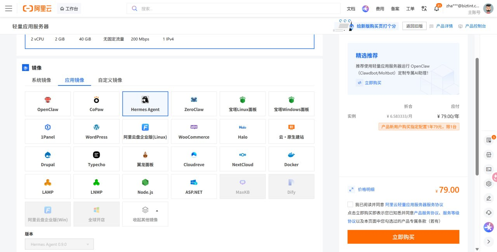
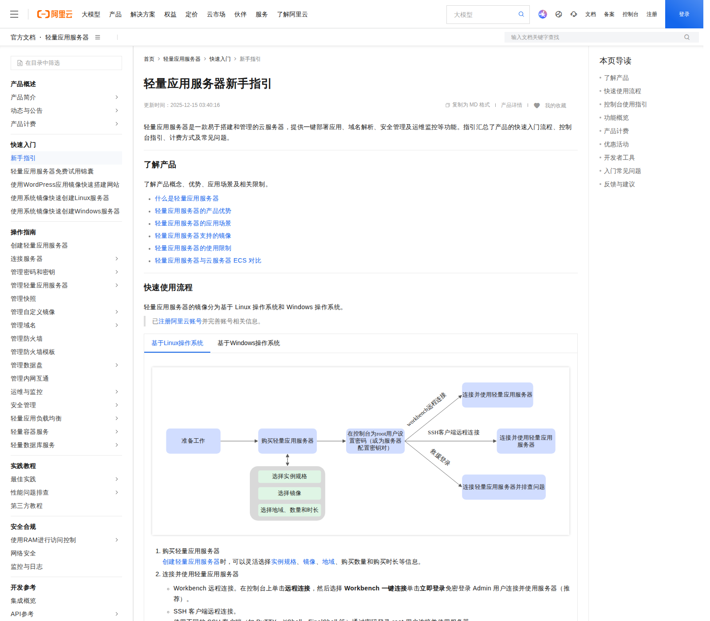
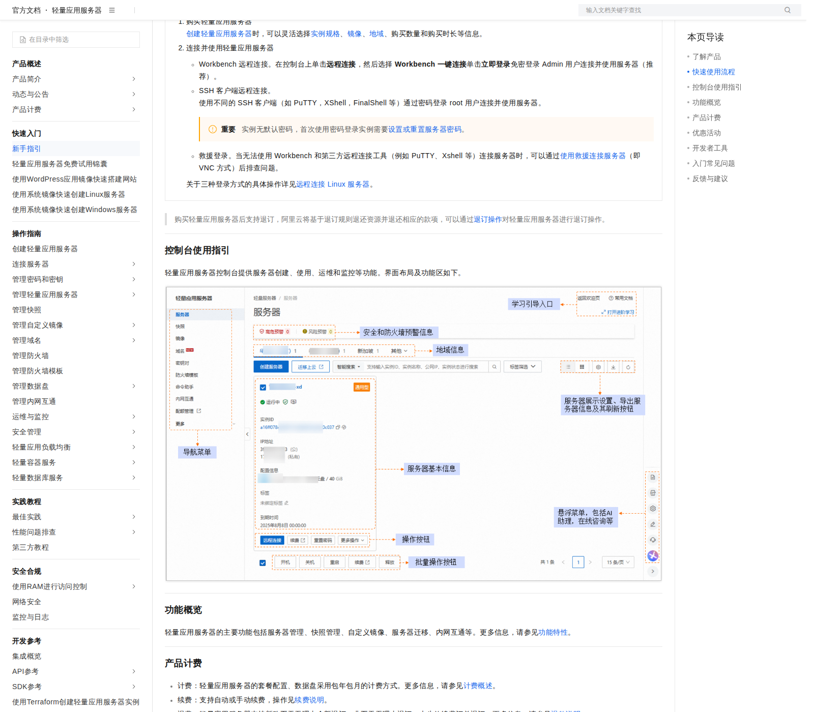
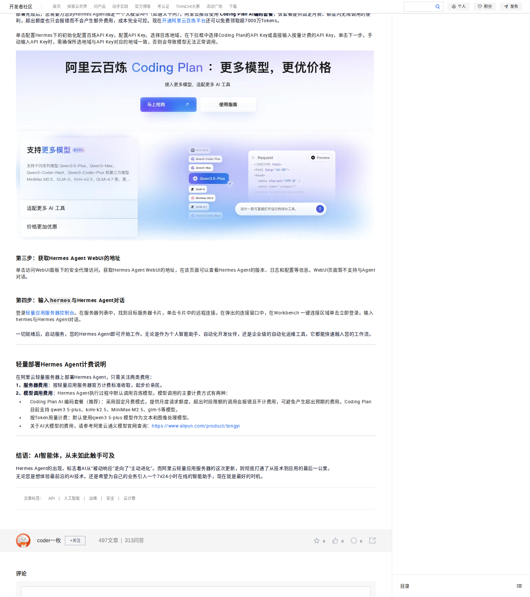

# 02-阿里云轻量服务器部署教程

这一页只做一件事：让你用阿里云轻量应用服务器，直接把 Hermes 跑起来。

这页不讲模型选择，不讲网关入口，不讲复杂接入，只讲四件事：购买、连接、启动、验证。

## 🧭 一眼看完

| 步骤 | 你要做什么 | 成功标志 |
|---|---|---|
| 1 | 购买带 Hermes 镜像的轻量应用服务器 | 控制台里出现实例 |
| 2 | 看官方新手指引，确认连接方式 | 知道 Workbench / SSH 怎么进 |
| 3 | 进入服务器，拿到命令行 | 看到终端提示符 |
| 4 | 输入 `hermes` 启动并验证 | Hermes 开始响应 |

## 🛒 Step 1｜直接买 Hermes 镜像

### 现在做什么
在阿里云轻量应用服务器里，直接选择 Hermes Agent 镜像并购买。

### 为什么做
阿里云已经提供 Hermes 镜像，最短路径不是自己装，而是直接买官方镜像，用现成环境先跑通。

### 具体怎么做
- 进入阿里云轻量应用服务器购买页
- 在应用镜像里选择 Hermes Agent
- 确认实例规格、时长和地域
- 直接创建实例
- 如果你已经有轻量服务器，也可以重置系统切换到 Hermes 镜像，但要先备份，因为重置会清空系统盘

### 看到什么算成功
- 你能在页面里看到 Hermes Agent 已选中
- 购买页有清晰的价格和购买入口
- 控制台里出现一台新的轻量应用服务器

### 不成功先查什么
- 地域有没有选对
- 镜像是不是选成了别的应用
- 订单有没有提交成功
- 实例是不是还在创建中

### 📸 购买页真实截图
这张图就是你应该看到的购买页：Hermes Agent 镜像已经选中，右侧能看到价格和购买入口。

## 🌏 国内 / 国外地域怎么选

### 现在做什么
先确认你这台机器主要给谁用、用在哪个区域。

### 为什么做
地域选对了，连接速度、访问体验和后续使用都会更稳。

### 具体怎么做
- 如果你的主要使用者在国内，优先按阿里云控制台推荐地域先跑通
- 如果你的主要使用者在海外，按业务实际位置选择更合适的地域或国际型方案
- 如果你只是想先把 Hermes 启起来，先别纠结复杂比较，按官方默认推荐先跑通第一台

### 看到什么算成功
- 你知道自己要选哪个地域
- 你不会因为地域反复犹豫而卡住购买

### 不成功先查什么
- 你是不是把“先跑通”变成了“先做最优解”
- 你是不是在不同地域之间反复切换
- 你是不是把后面的长期架构问题提前到这一步了

## 📘 Step 2｜先看官方新手指引

### 现在做什么
先看阿里云官方新手指引，知道这类轻量服务器应该怎么连、怎么用。

### 为什么做
因为官方已经把新手入门流程写好了，先看官方说明，能少走很多弯路。

### 具体怎么做
- 打开阿里云轻量应用服务器新手指引
- 先看“了解产品”和“快速使用流程”
- 重点确认 Workbench 远程连接、SSH 客户端连接、密码/密钥这些入口
- 先记住：这页的核心是“先连上，再启动”，不是先研究大模型

### 看到什么算成功
- 你知道这类服务器的官方入门流程
- 你知道 Workbench 和 SSH 都是可用入口
- 你知道先连接服务器，再开始使用 Hermes

### 不成功先查什么
- 你是不是没分清“购买页”和“使用页”
- 你是不是还没确认连接方式
- 你是不是把这页当成模型说明页了

### 📘 官方新手指引截图
这张图是阿里云轻量应用服务器的新手指引页，能看到产品概览、快速使用流程和控制台使用入口。

## 🔌 Step 3｜进入服务器，拿到命令行

### 现在做什么
用 Workbench 或 SSH 连上你刚买好的轻量应用服务器。

### 为什么做
因为 Hermes 的启动验证，最终还是要在终端里完成。

### 具体怎么做
- 回到轻量应用服务器控制台
- 找到你的实例
- 点击远程连接
- 优先用 Workbench 一键连接
- 如果你更习惯 SSH，也可以按官方方式连入
- 登录后，先确认你已经看到命令行提示符

### 看到什么算成功
- 你打开了终端窗口
- 你看到了命令行提示符
- 你已经可以输入命令

### 不成功先查什么
- 密码或密钥是不是没配对
- 实例是不是还没创建好
- 安全组/访问权限是不是挡住了连接
- 你是不是点错了实例

### 🔌 官方连接说明截图
这张图能看到阿里云官方新手指引里的连接方式说明，重点就是 Workbench 远程连接、SSH 客户端远程连接，以及密码/救援登录等入口。

## 🚀 Step 4｜输入 `hermes` 启动并验证

### 现在做什么
在终端里输入 `hermes`，按官方说明启动 Hermes，并确认它能响应。

### 为什么做
因为这一步就是“买来就能用”是否成立的最终验证。

### 具体怎么做
- 确认你已经进入服务器终端
- 按官方文章里的提示输入 `hermes`
- 继续按终端返回进行交互
- 如果提示还没准备好，先看上一层是否有遗漏

### 看到什么算成功
- Hermes 进入可对话状态
- 终端有正常响应
- 你确认这台机器已经真的可以用

### 不成功先查什么
- 你是不是还没连到正确实例
- 你是不是漏了前面的最小初始化
- 你是不是还停留在登录页、没有进入终端
- 你是不是把 WebUI 当成终端了

### 🚀 启动 Hermes 的官方步骤截图
这张图来自阿里云开发者社区文章，能清楚看到“第四步：输入 hermes 与 Hermes Agent 对话”的步骤说明。

## 💡 常用技巧

- 新手先用官方镜像，别先自己手工搭一整套环境
- 先用 Workbench 一键连接，SSH 作为备选
- 连接不上先查密码、密钥、地域和安全组
- 如果你只是想先启动 Hermes，就先把“能连上、能输入、能响应”这条链跑通
- 这页不负责配置入口，不负责模型切换，不负责复杂接入

## ✅ 做完后你应该检查什么

请按下面这份清单收口：

- 轻量应用服务器已经创建完成
- 远程连接入口可用
- SSH / Workbench 能正常登录
- 终端里能执行 `hermes`
- Hermes 已经开始响应

如果这些都成立，这页就算完成。

## ➡️ 下一步

完成后，你可以直接开始使用 Hermes。

如果你想回到目录重新确认位置：

- [01-国内部署总览](./01-总览.md)
- [03-国内落地总览](../01-总览.md)
- [文档总览](../../00-文档总览.md)

## 🔹 官方依据

- https://help.aliyun.com/zh/simple-application-server/getting-started/getting-started
- https://help.aliyun.com/zh/simple-application-server/use-cases/purchase-and-deploy-hermes-agent
- https://developer.aliyun.com/article/1728761
- https://www.aliyun.com/product/swas
