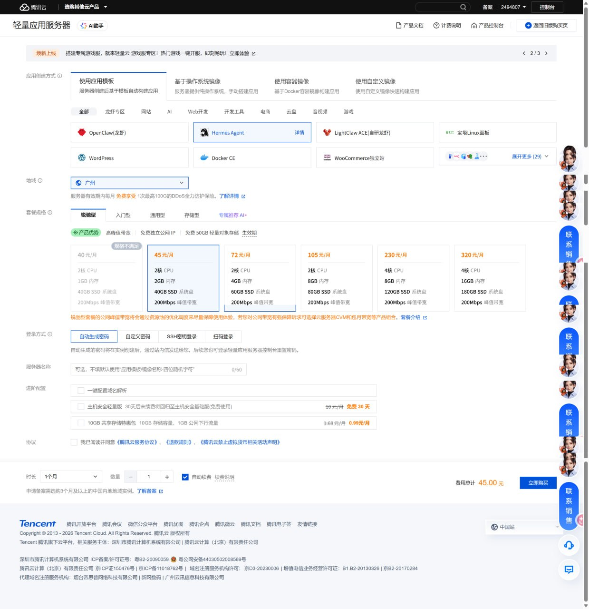
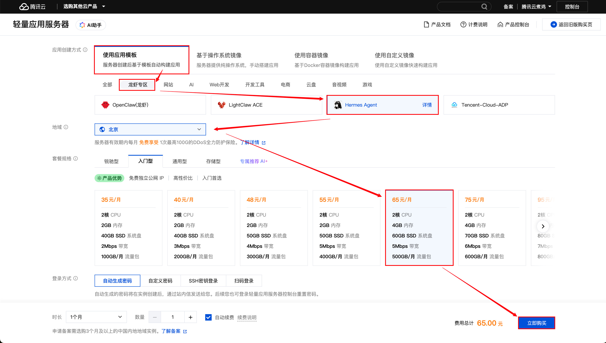
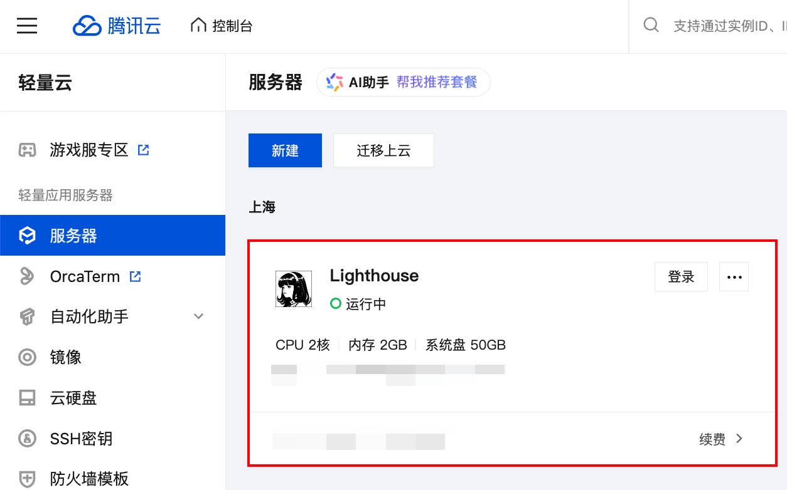
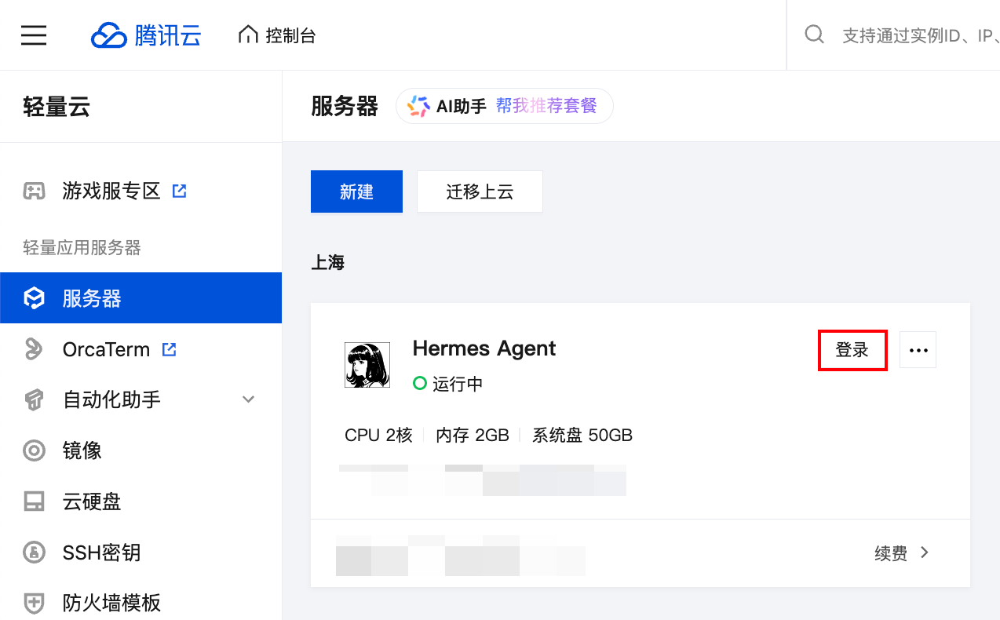
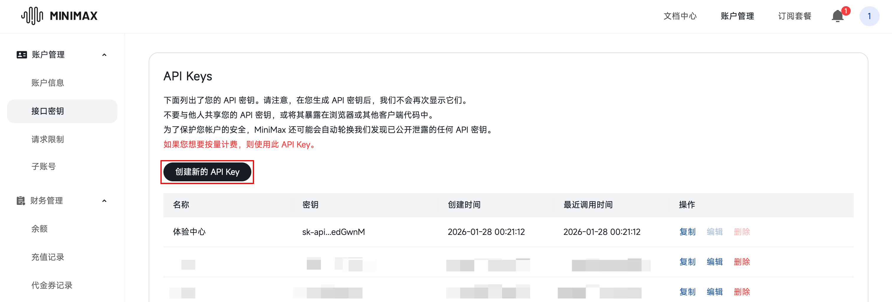
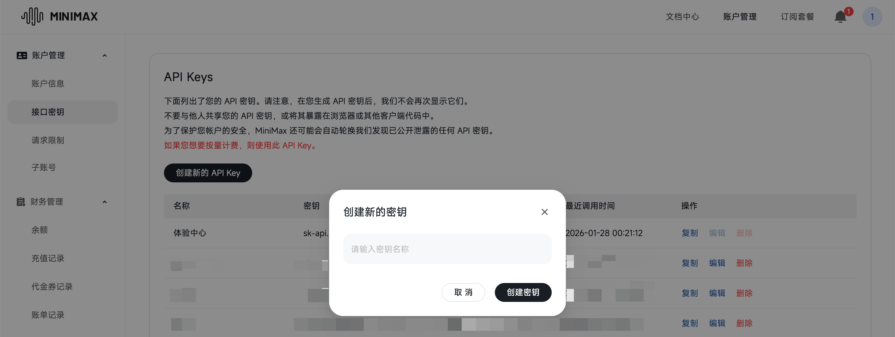
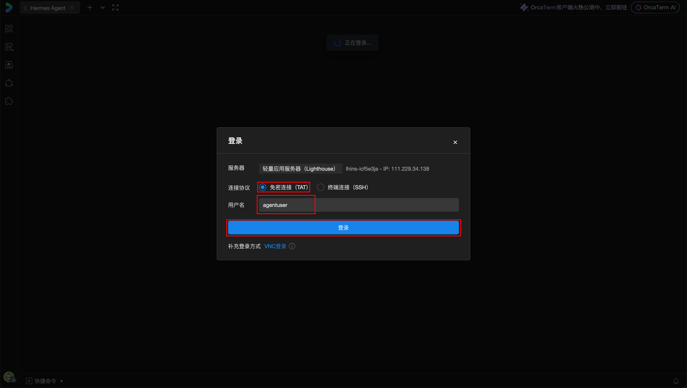
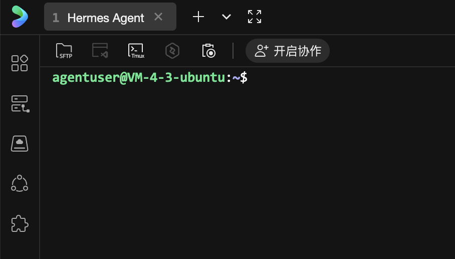

# 03-腾讯云轻量服务器部署教程



> 一句话先说清楚：这一页不讲模型选型，也不展开入口接入，它只做一件事——用腾讯云轻量应用服务器的 Hermes Agent 模板，把第一台国内机器真正跑起来。

这页只讲四件事：
- 在购买页把模板、地域和套餐选对
- 创建实例后连进服务器终端
- 跑完 Hermes 的基础初始化
- 用最简单的问题做一次验证

如果你还没决定国内到底用腾讯云还是阿里云，先回：
- [01-国内部署 | 总览](./01-总览.md)

---

## 🎯 这页做完以后，你应该得到什么

看完这页，你应该能明确回答这 4 个问题：
1. 我是不是已经买到一台带 Hermes Agent 模板的腾讯云轻量服务器
2. 我是不是已经用腾讯云 Web 终端或 SSH 连上了那台服务器
3. 我是不是已经在终端里把 Hermes 初始化完成了
4. 我是不是已经做完一次最小验证，确认这台机器真的能用

如果这 4 个问题你还答不出来，就先别急着跳去模型页或入口页。

---

## 🧭 一眼看完：最短部署链路

| 步骤 | 你现在要做什么 | 成功标志 |
|---|---|---|
| 1 | 在购买页把 Hermes Agent 模板、地域和套餐选对 | 页面里能看到 Hermes Agent 已选中，费用总计 45.00 元 |
| 2 | 创建实例后进入 SSH 或腾讯云 Web 终端 | 你已经看到命令行提示符 |
| 3 | 跑完 Hermes 的基础初始化 | Hermes 不再卡在未配置状态 |
| 4 | 用最简单的问题做一次验证 | 你确认这台机器真的能用 |

---

## 🛒 Step 1｜先把购买页选对

### 现在做什么
打开腾讯云轻量应用服务器购买页，直接按页面把关键选项对齐。

### 为什么做
腾讯云已经把 Hermes Agent 做成应用模板，最短路径不是先从空系统装，而是直接用现成模板把第一台机器跑起来。

### 具体怎么做
1. 进入腾讯云轻量应用服务器购买页
2. 在创建方式里选择：`使用应用模板`
3. 选择模板：`Hermes Agent`
4. 地域先按官方示例走：`广州`
5. 套餐先按当前最小闭环走：`2核 2GB，45 元/月`
6. 登录方式先选：`自动生成密码`
7. 先买 1 个月、1 台，跑通第一台就够
8. 勾选协议并购买

### 看到什么算成功
- Hermes Agent 卡片已经高亮
- 地域、套餐、登录方式都已选好
- 右下角总价是 45.00 元
- 购买按钮可点击

### 不成功先查什么
- 你是不是选成了操作系统镜像
- 你是不是没选 Hermes Agent
- 你是不是把地域改掉了
- 你是不是选了别的套餐档位

### 📸 购买页真实截图
这张图就是你应该看到的状态：Hermes Agent 已选中，广州地域，45 元/月。

官方教程里也有同一路径的购买页示例，路径是一样的，只是套餐档位可能不同：



---

## 🔌 Step 2｜进入服务器，先拿到命令行

### 现在做什么
实例创建完成后，先进入控制台，再用 SSH 或腾讯云 Web 终端登录服务器。

### 为什么先做这一步
Hermes 后面的初始化和验证，最终都要在终端里完成。没有拿到终端，这页就还没真正闭环。

### 具体怎么做
1. 回到实例控制台
2. 找到刚创建好的轻量应用服务器
3. 点击远程连接
4. 新手优先用腾讯云 Web 终端
5. 如果你更习惯本地 SSH，也可以直接 SSH 登录
6. 登录后先确认看到了命令行提示符

### 看到什么算成功
- 你已经进入服务器
- 你已经能输入命令
- 你看到的是终端，不是购买页

### 不成功先查什么
- 实例是不是还没创建好
- 密码 / 密钥是不是没配对
- 安全组是不是挡住了登录
- 你是不是点错了实例

### 📸 官方连接入口截图
官方文章里的两个关键确认画面分别是：先在服务器列表里找到实例，再在登录弹窗里选对连接方式和用户名。





---

## 🚀 Step 3｜把 Hermes 初始化跑完

### 现在做什么
在终端里跑 Hermes 的初始化向导，把基础能力先配起来。

### 为什么做
Hermes Agent 模板已经把底层准备得差不多了，但你仍然需要完成最基本的初始化，才能进入真正可用状态。

### 具体怎么做
如果你还没跑过初始化，就先执行：

```bash
hermes setup
```

如果你已经跑过一轮，只是想重配模型或提供商，可以直接重跑向导，或者按官方提示只重配对应项。

### 看到什么算成功
- Hermes 不再卡在未配置状态
- 终端能进入正常工作流程
- 你可以继续往下做验证

如果你还没把模型 Key 准备好，可以先按腾讯云 Token Plan 官方文档里的“获取 API Key”说明把密钥生成并复制出来；如果你已经准备好了，就直接回到终端执行 `hermes setup`。







### 不成功先查什么
- 你是不是还没连到正确实例
- 你是不是漏了前面的登录步骤
- 你是不是把 Web 页面当成终端了
- 你是不是还没把最基本的 Key 配完

---

## ✅ Step 4｜做一次最简单的验证

### 现在做什么
用一个最简单的问题测试 Hermes 是否已经能正常响应。

### 为什么做
因为这一步才是“模板买来就能用”是否成立的最终验证。只有当 Hermes 真正回应你，这条部署链路才算闭环。

### 具体怎么做
1. 先启动 Hermes
2. 发一条最容易验证的问题
3. 观察它是否正常回复
4. 如果报错，先回头查模型、Key 和初始化步骤

### 看到什么算成功
- Hermes 已经能正常对话
- 你确认这台机器真的可用
- 这条部署链路已经闭环

如果前面都已经完成，这一步就看你能不能在终端里继续正常跑下一条最简单的验证命令。



### 不成功先查什么
- 初始化是不是还没跑完
- 模型 Key 是不是没配对
- 你是不是以为终端能打开，就等于 Hermes 已经完成初始化
- 当前实例是不是还在异常状态

---

## 💡 常用技巧

- 新手先按官方模板走，不要先自己手工拼环境
- 购买页里先把 Hermes Agent、地域、套餐和登录方式对齐，再点购买
- 先把基础聊天跑通，再去接飞书、企微、钉钉之类的通道
- 如果初始化填错了，优先重跑向导，不要一上来手改很多配置
- 这页只负责把服务器买好、连上、初始化并确认可用

---

## ✅ 做完后你应该检查什么

- 轻量应用服务器已经创建完成
- 远程连接入口可用
- SSH 或 Web 终端可以正常登录
- 终端里能执行 Hermes 初始化
- Hermes 已经开始响应

如果这些都成立，这页就算完成。

---

## ➡️ 下一步

完成后进入：
- [02-国内模型 | 总览](../02-国内模型/01-总览.md)

如果你想先回到上一阶段入口重新确认位置：
- [01-国内部署 | 总览](./01-总览.md)

## 🔹 官方依据

- https://cloud.tencent.com/act/pro/hermesagent?from=29842&Is=home
- https://cloud.tencent.com/developer/article/2653159
- https://cloud.tencent.com/developer/article/2655946
- https://developer.cloud.tencent.com/article/2655723
- https://hermes-agent.nousresearch.com/docs/getting-started/quickstart
