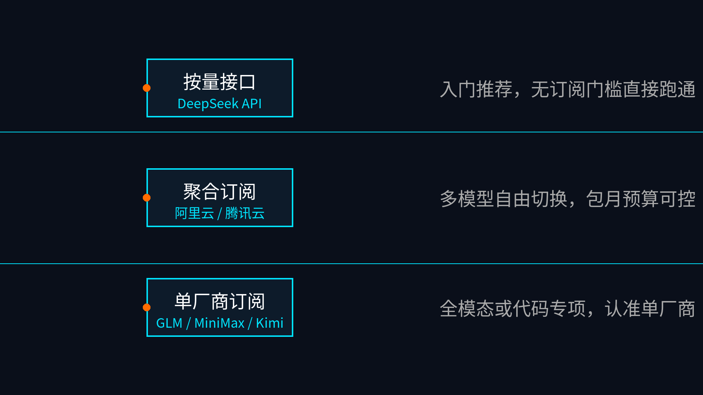

# 国内模型总览

如果你已经把 Hermes 跑起来，这一页就不再帮你空谈“谁最强”，而是直接把我们已经完成的国内模型路线放到一张对比图里：哪条适合先跑通，哪条适合包月统一入口，哪条适合深用单厂商，哪条只是给已经有兼容层的人。

## 🚀 国内模型核心路径指引

## 先看结论：先选路线，再选厂商

这一组页面现在已经覆盖 7 条实际可走的路线：

- 聚合订阅：阿里云百炼 Token Plan、腾讯云 Token Plan
- 单厂商订阅：智谱 GLM Coding Plan、MiniMax Token Plan、Kimi 登月计划
- 按量接口：DeepSeek 按量计费接口
- 高级适配：自定义兼容接口

真正有用的判断顺序不是“我先喜欢哪家”，而是：

1. 我要先跑通，还是先买套餐
2. 我更想要统一入口，还是单厂商深用
3. 我是不是已经有现成兼容层

## 🧭 先看最短决策

| 你的情况 | 最优先看哪页 | 为什么 |
|---|---|---|
| 你只想最低门槛先跑通 Hermes | [07-DeepSeek按量计费接口](./07-DeepSeek按量计费接口.md) | 无订阅门槛、按量付费、Hermes 原生支持，路径最干净 |
| 你想用一份订阅切多家国产模型 | [02-阿里云百炼 Token Plan](./02-阿里云百炼Token%20plan.md) / [03-腾讯云 Token Plan](./03-腾讯云Token%20Plan.md) | 更像统一入口，减少频繁换厂商 |
| 你已经认准单一厂商，要深用其生态 | [04-智谱GLM Coding Plan](./04-智谱GLM%20Coding%20Plan.md) / [05-MiniMax Token Plan](./05-MiniMax%20Token%20Plan.md) / [06-Kimi登月计划](./06-Kimi登月计划.md) | 单厂商路线更直接，页面里已经把价格、权益、接法拆开了 |
| 你已经有本地服务、聚合网关或企业兼容层 | [08-自定义兼容接口](./08-自定义兼容接口.md) | 适合复用已有 OpenAI-Compatible 入口，不适合第一次上手 |

如果你只想记一句：

- 先跑通 → DeepSeek
- 想统一订阅入口 → 阿里云 / 腾讯云
- 想深用单厂商 → GLM / MiniMax / Kimi
- 已有兼容层 → 自定义兼容接口

## 📊 已完成页面横向对比

| 路线 | 付费方式 | Hermes 接入形态 | 最适合谁 | 最强卖点 | 不适合谁 |
|---|---|---|---|---|---|
| [02-阿里云百炼 Token Plan](./02-阿里云百炼Token%20plan.md) | 包月订阅 | 兼容模式接入 / 聚合入口 | 想一份套餐切多家模型、又已经在阿里云生态里的人 | 多模型统一入口、预算相对稳定、工具兼容面广 | 只想最低成本先试一下的人 |
| [03-腾讯云 Token Plan](./03-腾讯云Token%20Plan.md) | 包月订阅 | 套餐 + 专属 Key + 工具接入 | 已在腾讯云生态、想把国产模型和 AI 编程工具一起串起来的人 | 套餐、密钥、工具三件事收得很紧，适合先省心跑起来 | 不熟悉腾讯云、又不想先买套餐的人 |
| [04-智谱GLM Coding Plan](./04-智谱GLM%20Coding%20Plan.md) | 单厂商订阅 / Coding Plan | Hermes 原生 provider 优先 | 已认准 GLM、重视中文编码与单厂商清晰路径的人 | 官方 provider 路线明确，不必先走 custom endpoint | 还在多家之间摇摆的人 |
| [05-MiniMax Token Plan](./05-MiniMax%20Token%20Plan.md) | 订阅制 | Hermes 原生 provider | 想把文本、图像、语音、音乐、视频和 AI 编程工具一起纳入一份订阅的人 | 全模态一站式、M2.7 / M2.7-highspeed、单 Key 多场景 | 只想买最便宜文本接口的人 |
| [06-Kimi登月计划](./06-Kimi登月计划.md) | 会员权益 + 开放平台按量接口双路线 | Kimi Code 与 Kimi API 分开理解 | 想比较“会员型 Coding 体验”和“开放平台 API”差异的人 | 一页内把 Kimi Code 与 Kimi API 两条路线彻底拆开 | 只想最低门槛接通、不想先理解双路线的人 |
| [07-DeepSeek按量计费接口](./07-DeepSeek按量计费接口.md) | 按量计费 | Hermes 原生 provider | 想最低门槛、最低前置决策先把 Hermes 跑通的人 | 无订阅门槛、OpenAI 兼容清楚、原生支持、适合作为第一把钥匙 | 更看重会员权益 / 套餐体验的人 |
| [08-自定义兼容接口](./08-自定义兼容接口.md) | 取决于你的上游 | Custom endpoint / OpenAI-Compatible | 已经有 LM Studio、Ollama、OneAPI、NewAPI 或企业网关的人 | 复用已有 base_url / api_key / model 映射，减少重复改造 | 第一次上手 Hermes、还没有稳定入口的人 |

## 🔍 这 7 条路线到底怎么分

### 1）如果你优先要“最低门槛先跑通”
优先顺序很明确：

1. [07-DeepSeek按量计费接口](./07-DeepSeek按量计费接口.md)
2. [06-Kimi登月计划](./06-Kimi登月计划.md) 里的 Kimi API 路线
3. [08-自定义兼容接口](./08-自定义兼容接口.md)（前提是你已经有稳定兼容入口）

其中真正最适合作为默认起点的，仍然是 DeepSeek：

- 没有会员门槛
- 不用先买套餐
- provider 原生支持
- 文档路径最干净

### 2）如果你优先要“一个订阅统一入口”
这时重点看聚合订阅：

- [02-阿里云百炼 Token Plan](./02-阿里云百炼Token%20plan.md)
- [03-腾讯云 Token Plan](./03-腾讯云Token%20Plan.md)

二者差异可以直接这么理解：

| 维度 | 阿里云百炼 Token Plan | 腾讯云 Token Plan |
|---|---|---|
| 路线感觉 | 更像多模型聚合入口 | 更像云生态里的统一订阅入口 |
| 适合谁 | 已经在阿里云生态里、想多模型可切换的人 | 已在腾讯云生态、想把套餐、密钥、工具一起管理的人 |
| 页面重点 | 档位、Credits、兼容工具、Token Plan 专属 Key | Lite / Standard / Pro / Max、专属 Key、工具入口 |
| 默认理解 | 想少换平台、又想统一入口 | 想先用最省心方式把工具链串起来 |

### 3）如果你优先要“单厂商深用”
重点看这三页：

- [04-智谱GLM Coding Plan](./04-智谱GLM%20Coding%20Plan.md)
- [05-MiniMax Token Plan](./05-MiniMax%20Token%20Plan.md)
- [06-Kimi登月计划](./06-Kimi登月计划.md)

它们的差异不是价格高低，而是路线形态不同：

| 路线 | 你最该关注的核心点 |
|---|---|
| GLM Coding Plan | Hermes 原生 provider 路线已经很清楚，适合认准智谱的人 |
| MiniMax Token Plan | 不只是文本，而是全模态 + AI 编程工具 + 单 Key 统一使用 |
| Kimi 登月计划 | 必须先分清 Kimi Code（会员权益）和 Kimi API（按量接口） |

### 4）如果你手里已经有兼容层
那就不要再把自己塞回“选官方 provider 还是买哪家套餐”的逻辑里。

直接看 [08-自定义兼容接口](./08-自定义兼容接口.md)，因为那页已经把三种实际入口拆开了：

- 本地兼容服务：LM Studio / Ollama
- 第三方聚合层：OneAPI / NewAPI / 自建聚合池
- 企业私有网关：统一鉴权、限流、审计与路由

这条线真正的价值不是“更高级”，而是“少重复劳动”。

## 🏆 默认推荐顺序

如果你让我直接按 Hermes 中文站用户的现实使用顺序给推荐，我会这样排：

### 默认推荐 1：先跑起来
[07-DeepSeek按量计费接口](./07-DeepSeek按量计费接口.md)

原因：最少前置决策、最容易验证链路、最适合做整个模块的第一把钥匙。

### 默认推荐 2：想要统一入口
先看：

- [02-阿里云百炼 Token Plan](./02-阿里云百炼Token%20plan.md)
- [03-腾讯云 Token Plan](./03-腾讯云Token%20Plan.md)

原因：这两页最适合“先买一套入口，再慢慢细化模型”。

### 默认推荐 3：认准单厂商再深用
按你认准的对象去看：

- 认准智谱 → [04-智谱GLM Coding Plan](./04-智谱GLM%20Coding%20Plan.md)
- 认准 MiniMax → [05-MiniMax Token Plan](./05-MiniMax%20Token%20Plan.md)
- 认准 Kimi → [06-Kimi登月计划](./06-Kimi登月计划.md)

### 默认推荐 4：已有兼容层再接 Hermes
[08-自定义兼容接口](./08-自定义兼容接口.md)

原因：这不是默认起点，而是“你已经有稳定入口之后”的高级适配页。

## ✅ 这页真正帮你解决什么问题

看完这页，你应该能立刻做出下面 3 个判断：

1. 我要先跑通，还是先买订阅
2. 我要统一入口，还是单厂商深用
3. 我要官方 provider，还是已有兼容层复用

如果这 3 个判断已经清楚，你就不需要继续在总览页犹豫了，直接进对应单页。

## ➡️ 下一步

完成后进入：

- 如果你想直接从最低门槛路线开始，继续看 [07-DeepSeek按量计费接口](./07-DeepSeek按量计费接口.md)
- 如果你想按目录顺序继续看，继续看 [02-阿里云百炼 Token Plan](./02-阿里云百炼Token%20plan.md)
