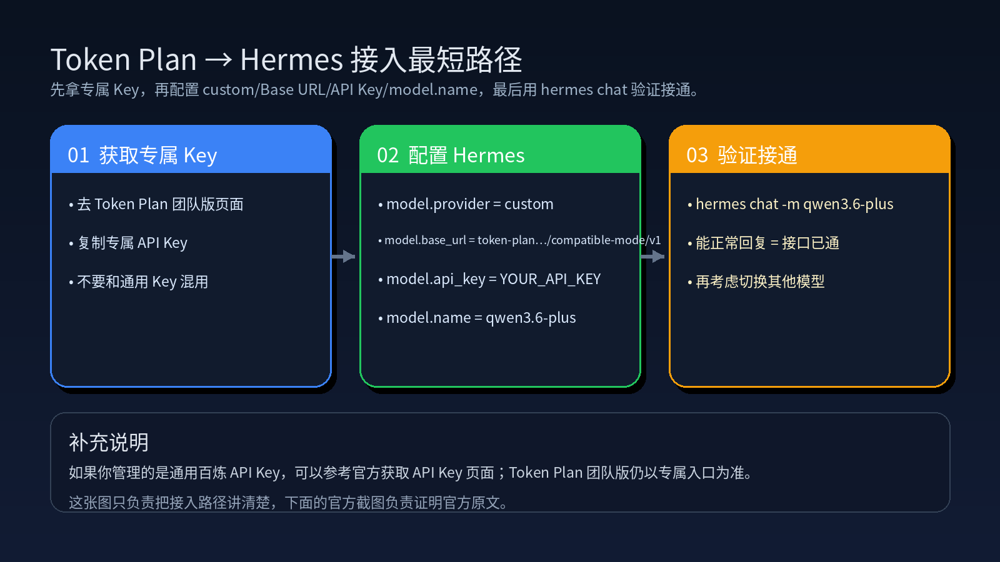
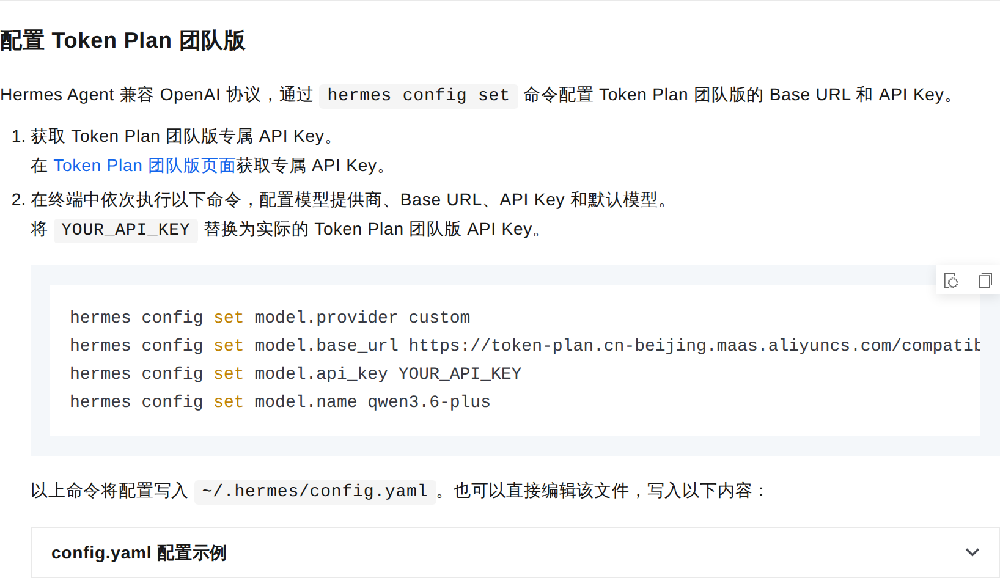
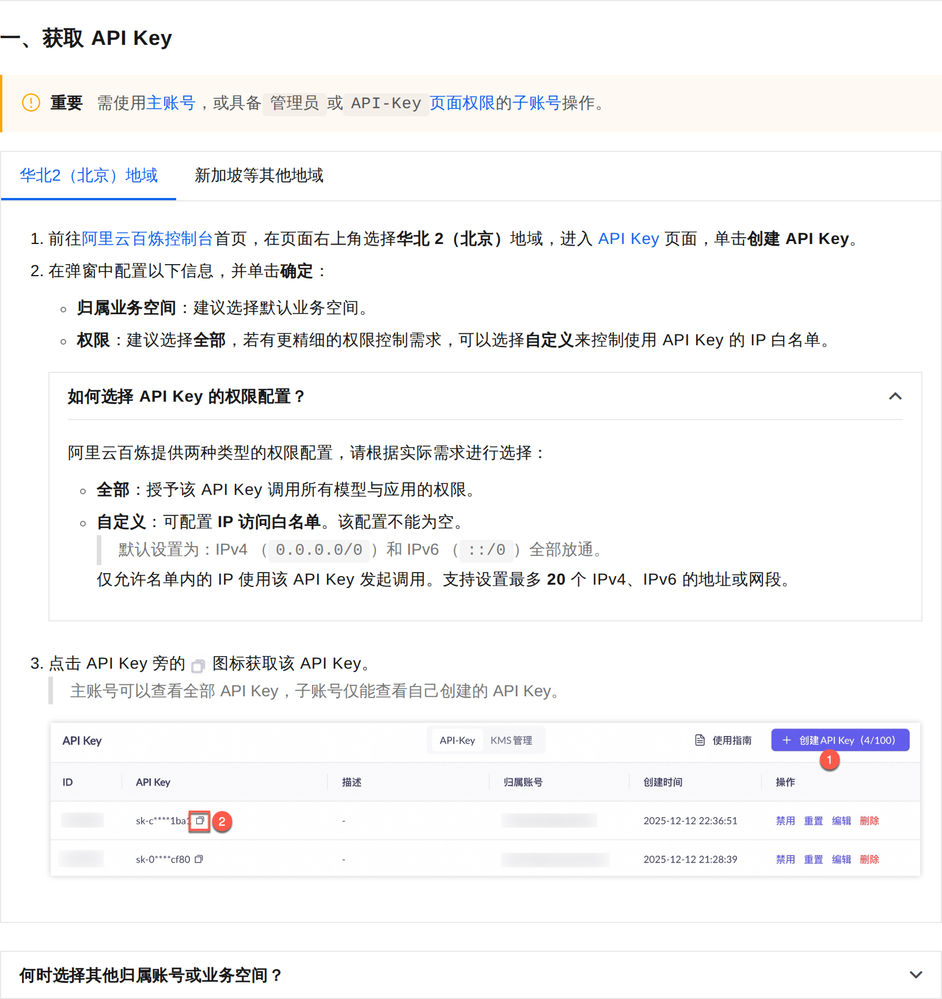

# 02-阿里云百炼 Token Plan

> 🎯 一句话结论：如果你想要「多模型可切换 + 包月预算可控 + 工具兼容度高」的一条统一订阅路径，阿里云百炼 Token Plan 值得先看。

## 🚀 最短接入图



先看图，再看下面的细节，你会更快抓住这页的主线。

## ✨ 这条路适合谁

- 你想要一份订阅里能切多家模型
- 你已经在阿里云生态里，想少换平台
- 你希望先把 Hermes 跑起来，再慢慢细化模型选择
- 你更关心包月预算，而不是每次调用单独计费
- 你会同时接触多种 AI 工具，不想每个工具都重新找一套路

## 🧭 先看最短决策

| 场景 | 建议 |
|---|---|
| 先试水、预算压得最稳 | 标准版 |
| 已经打算高频使用 | 高级版 |
| 核心重度用户 / 多人使用 | 尊享版 |

## 🎛️ 三档套餐怎么选

阿里云百炼 Token Plan 官方给了三档套餐：

| 套餐 | 月费 | Credits | 适合谁 | 我怎么理解 |
|---|---:|---:|---|---|
| 标准版 | ¥198 / 月 | 25,000 Credits / 月 | 轻度使用 AI 的用户 | 先试水，预算压得最稳 |
| 高级版 | ¥698 / 月 | 100,000 Credits / 月 | 高频使用 AI 的用户 | 更适合作为日常主力 |
| 尊享版 | ¥1,398 / 月 | 250,000 Credits / 月 | 重度依赖 AI 的核心开发者 | 更适合多人或高频重度场景 |

## 🤖 它支持哪些模型

官方页面给出的多模型支持里，能看到这些代表项：

- Qwen3.6-Plus
- Qwen-Image-2.0
- Qwen-Image-2.0-Pro
- Wan2.7-Image
- Wan2.7-Image-Pro
- GLM-5
- MiniMax-M2.5
- DeepSeek-V3.2

这说明它的价值不只是“买一个模型”，而是“买一个可以换模型的统一入口”。

## 🧰 它兼容哪些工具

阿里云官方明确提到，这条路适配多种主流编程工具和 Agent 工具，包括：

- Hermes Agent
- OpenClaw
- Qwen Code
- Qoder
- Claude Code
- OpenCode

对 Hermes 来说，重点不是工具数量，而是：

- Hermes 能不能顺着这条路接上
- 接入后是不是能稳定切换模型
- 你的日常工作流会不会被打散

## 🔑 怎样获得 Key 并接入 Hermes

Token Plan 这条路的关键，不是背参数，而是先拿到“专属入口”。

### 1）先拿 Token Plan 团队版专属 API Key

按官方说明，先到 Token Plan 团队版页面获取专属 API Key，再继续配置 Hermes。

### 2）在 Hermes 里写入连接参数

拿到 Key 之后，直接把下面四项写进 Hermes：

- `model.provider = custom`
- `model.base_url = https://token-plan.cn-beijing.maas.aliyuncs.com/compatible-mode/v1`
- `model.api_key = 你在 Token Plan 团队版页面复制的 Key`
- `model.name = qwen3.6-plus`

```bash
hermes config set model.provider custom
hermes config set model.base_url https://token-plan.cn-beijing.maas.aliyuncs.com/compatible-mode/v1
hermes config set model.api_key YOUR_API_KEY
hermes config set model.name qwen3.6-plus
```

### 3）验证是否接通

```bash
hermes chat -m qwen3.6-plus
```

如果返回正常回复，说明 Token Plan → Hermes 的连接已经通了。

### 4）如果你走的是通用百炼 API Key 流程

如果你在阿里云百炼控制台里管理的是“通用 API Key”，而不是 Token Plan 团队版专属 Key，可以参考官方 API Key 创建页。

但这页的主线仍然是：Token Plan 团队版专属 Key + Hermes 的兼容模式接入。

## 🖼️ 官方截图

### 1. Token Plan 团队版接入说明



这张截图对应官方 Hermes Agent 接入页，重点展示：

- 去 Token Plan 团队版页面拿专属 API Key
- 在 Hermes 里配置 Base URL / API Key / 默认模型
- 配置写入 `~/.hermes/config.yaml`

### 2. 通用百炼 API Key 创建页（补充参考）



这张截图是阿里云百炼的通用 API Key 创建流程，适合作为“阿里云 API Key 怎么创建”的补充参考。

注意：Token Plan 团队版的主流程仍以官方 Token Plan 团队版页面为准。

## ✅ 这页对 Hermes 的默认建议

如果你的目标是“先把 Hermes 跑顺”，阿里云百炼 Token Plan 可以作为一条稳定的聚合订阅路线来考虑。

它适合：

- 你想先走阿里云生态
- 你想要多模型切换
- 你想要包月预算可控
- 你想让 Hermes 接入工具链时少做重复判断

但如果你现在最关心的是“先跑起来、先少花钱、先别做太多选择”，那它未必是第一优先；这时通常会先看按量接口。

## ⛔ 什么时候先别选它

- 你现在只想最低门槛先试跑
- 你不想一开始就决定套餐档位
- 你更想先看按量计费接口是否够用
- 你还没确认自己是不是要走阿里云生态

## ➡️ 下一步

如果你已经决定走阿里云百炼这条聚合订阅路线，下一步就是继续看官方使用指南，先把 API Key 和工具接入跑通。

如果你还没决定，建议先回到模型总览页：

- [国内模型总览](../01-总览.md)

如果你想先比一比其他路线，再看：

- [腾讯云 Token Plan](./03-腾讯云Token Plan.md)
- [DeepSeek 按量计费接口](./07-DeepSeek按量计费接口.md)

## 📎 官方依据

- https://www.aliyun.com/benefit/scene/tokenplan
- https://help.aliyun.com/zh/model-studio/hermes-agent-token-plan
- https://help.aliyun.com/zh/model-studio/get-api-key
