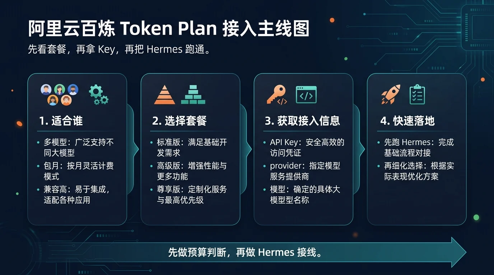
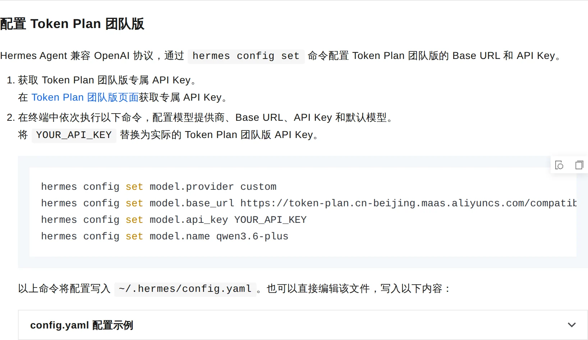
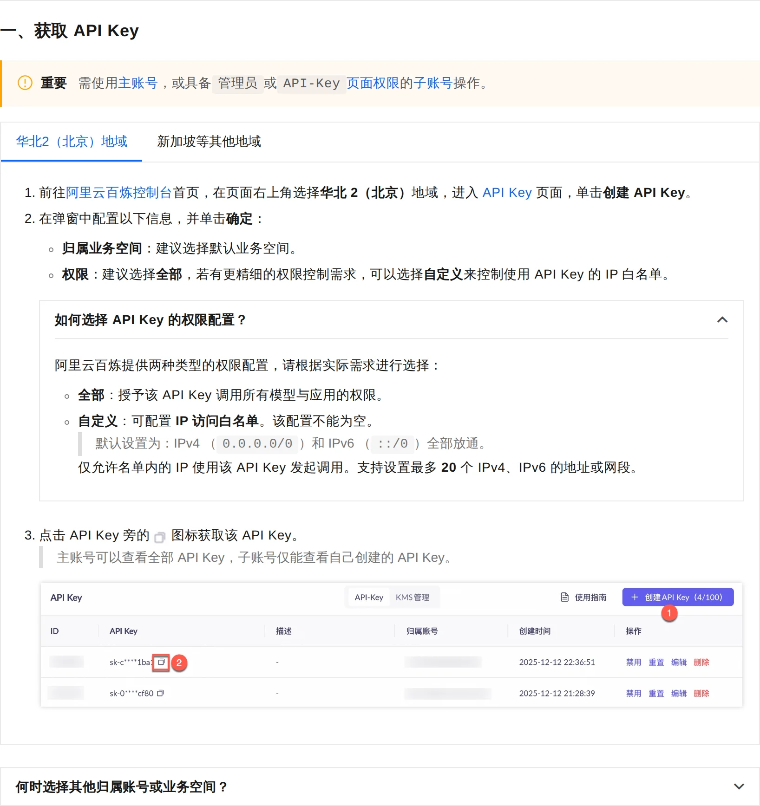

---
quick_reference:
  - checkedAt: '2026-10-03'
    hermesVersion: v2026.9.24
    verification: docs-reviewed
    kind: model
    id: aliyun-token-plan-personal-openai
    vendor: 阿里云百炼
    product: Token Plan 个人版
    region: 中国区（北京）
    connection: compatible
    provider: custom
    protocol: openai
    endpoint: 'https://token-plan.cn-beijing.maas.aliyuncs.com/compatible-mode/v1'
    modelIds:
      - auto
      - qwen3.8-max
    permissions: 使用个人版专属 Key，仅限本人在允许的 AI 工具中交互使用；不用于脚本、应用后端或非交互批量调用。auto 自动路由；模型权限以订阅为准。
    configExample: |-
      hermes config set model.provider custom
      hermes config set model.base_url https://token-plan.cn-beijing.maas.aliyuncs.com/compatible-mode/v1
      hermes config unset model.api_mode
      hermes config set model.api_key "<YOUR_API_KEY>"
      hermes config set model.default auto
    diagnostics:
      - /docs/issues/provider-endpoint
    sources:
      - url: 'https://help.aliyun.com/zh/model-studio/hermes-agent'
      - url: 'https://help.aliyun.com/zh/model-studio/token-plan-personal-overview'
      - url: 'https://raw.githubusercontent.com/NousResearch/hermes-agent/v2026.9.24/hermes_cli/auth.py'
        revision: v2026.9.24
      - url: 'https://github.com/NousResearch/hermes-agent/blob/v2026.9.24/website/docs/integrations/providers.md'
        revision: v2026.9.24
  - checkedAt: '2026-10-03'
    hermesVersion: v2026.9.24
    verification: docs-reviewed
    kind: model
    id: aliyun-token-plan-personal-anthropic
    vendor: 阿里云百炼
    product: Token Plan 个人版
    region: 中国区（北京）
    connection: compatible
    provider: custom
    protocol: anthropic
    endpoint: 'https://token-plan.cn-beijing.maas.aliyuncs.com/apps/anthropic'
    modelIds:
      - auto
      - qwen3.8-max
    permissions: 使用个人版专属 Key，仅限本人在允许的 AI 工具中交互使用；不用于脚本、应用后端或非交互批量调用。auto 自动路由；模型权限以订阅为准。
    configExample: |-
      hermes config set model.provider custom
      hermes config set model.base_url https://token-plan.cn-beijing.maas.aliyuncs.com/apps/anthropic
      hermes config set model.api_mode anthropic_messages
      hermes config set model.api_key "<YOUR_API_KEY>"
      hermes config set model.default auto
    diagnostics:
      - /docs/issues/provider-endpoint
    sources:
      - url: 'https://help.aliyun.com/zh/model-studio/hermes-agent'
      - url: 'https://help.aliyun.com/zh/model-studio/token-plan-personal-overview'
      - url: 'https://raw.githubusercontent.com/NousResearch/hermes-agent/v2026.9.24/hermes_cli/auth.py'
        revision: v2026.9.24
      - url: 'https://github.com/NousResearch/hermes-agent/blob/v2026.9.24/website/docs/integrations/providers.md'
        revision: v2026.9.24
  - checkedAt: '2026-10-03'
    hermesVersion: v2026.9.24
    verification: docs-reviewed
    kind: model
    id: aliyun-token-plan-team-openai
    vendor: 阿里云百炼
    product: Token Plan 团队版
    region: 中国区（北京）
    connection: compatible
    provider: custom
    protocol: openai
    endpoint: 'https://token-plan.cn-beijing.maas.aliyuncs.com/compatible-mode/v1'
    modelIds:
      - auto
      - qwen3.8-max
    permissions: 使用团队坐席专属 Key，每坐席绑定成员，不能共享；团队版目前仅北京地域。auto 自动路由；额度与允许用途以订阅为准。
    configExample: |-
      hermes config set model.provider custom
      hermes config set model.base_url https://token-plan.cn-beijing.maas.aliyuncs.com/compatible-mode/v1
      hermes config unset model.api_mode
      hermes config set model.api_key "<YOUR_API_KEY>"
      hermes config set model.default auto
    diagnostics:
      - /docs/issues/provider-endpoint
    sources:
      - url: 'https://help.aliyun.com/zh/model-studio/hermes-agent'
      - url: 'https://help.aliyun.com/zh/model-studio/token-plan-team-overview'
      - url: 'https://raw.githubusercontent.com/NousResearch/hermes-agent/v2026.9.24/hermes_cli/auth.py'
        revision: v2026.9.24
      - url: 'https://github.com/NousResearch/hermes-agent/blob/v2026.9.24/website/docs/integrations/providers.md'
        revision: v2026.9.24
  - checkedAt: '2026-10-03'
    hermesVersion: v2026.9.24
    verification: docs-reviewed
    kind: model
    id: aliyun-token-plan-team-anthropic
    vendor: 阿里云百炼
    product: Token Plan 团队版
    region: 中国区（北京）
    connection: compatible
    provider: custom
    protocol: anthropic
    endpoint: 'https://token-plan.cn-beijing.maas.aliyuncs.com/apps/anthropic'
    modelIds:
      - auto
      - qwen3.8-max
    permissions: 使用团队坐席专属 Key，每坐席绑定成员，不能共享；团队版目前仅北京地域。auto 自动路由；额度与允许用途以订阅为准。
    configExample: |-
      hermes config set model.provider custom
      hermes config set model.base_url https://token-plan.cn-beijing.maas.aliyuncs.com/apps/anthropic
      hermes config set model.api_mode anthropic_messages
      hermes config set model.api_key "<YOUR_API_KEY>"
      hermes config set model.default auto
    diagnostics:
      - /docs/issues/provider-endpoint
    sources:
      - url: 'https://help.aliyun.com/zh/model-studio/hermes-agent'
      - url: 'https://help.aliyun.com/zh/model-studio/token-plan-team-overview'
      - url: 'https://raw.githubusercontent.com/NousResearch/hermes-agent/v2026.9.24/hermes_cli/auth.py'
        revision: v2026.9.24
      - url: 'https://github.com/NousResearch/hermes-agent/blob/v2026.9.24/website/docs/integrations/providers.md'
        revision: v2026.9.24
---
# 阿里云百炼 Token Plan：套餐、API Key 与 Hermes 接入

> 速查核验（2026-10-03）：本次速查仅收录已核验的 custom 兼容路线。固定标签 Provider 文档列出原生 Token Plan，但当前可读取的注册代码与该说明不一致；原生映射本次尚未核实，请查看[官方 Provider 资料](https://github.com/NousResearch/hermes-agent/blob/v2026.9.24/website/docs/integrations/providers.md)，不要据此认为原生 provider 不存在。

内容更新：2026-10-03（同源配置迁移）；原教程复核日期：2026-09-30；速查条目核验日期见配置卡。接入配置对照 Hermes 稳定标签 v2026.9.24；厂商模型与套餐按下列官方来源复核。未调用 API、购买套餐或完成桌面安装实测。

> 💡 **速答**：阿里云当前提供 Hermes Agent 专项接入说明，Token Plan 个人版和团队版
> 都可通过兼容端点接入。套餐价格、模型清单和促销会变化；配置前仍应以当前官方
> Hermes Agent 页与套餐页确认 Key 类型、Base URL、协议和模型名。

> 🎯 一句话先说清楚：如果你想先买一个"多模型统一入口"，并且希望预算按包月控制、后面还能在阿里云生态里继续扩展，那么阿里云百炼 Token Plan 值得先看。

这一页只解决一件事：帮你判断阿里云百炼 Token Plan 值不值得选，以及怎么按官方 Token Plan 团队版路线把它接进 Hermes。

这一页先不解决：
- 最低门槛起步该选哪条按量接口
- 单厂商会员权益型 Coding Plan 怎么买
- 你已经有 OneAPI / NewAPI / LM Studio / Ollama 时该怎么复用现成兼容层

## 🔎 搜索收录速答

阿里云百炼 Token Plan 适合想用一个 OpenAI-Compatible 入口管理 Qwen、DeepSeek 等模型的 Hermes 用户。你需要重点确认三件事：套餐是否覆盖目标模型、endpoint 是否能按 OpenAI 兼容格式调用、Hermes 里是否把 provider 与 model name 分开配置。想比较其它国内模型，可以继续看[腾讯云 Token Plan](/docs/china/models/tencent-token-plan)、[MiniMax Token Plan](/docs/china/models/minimax-token-plan)和[自定义兼容接口](/docs/china/models/openai-compatible-endpoint)。


## 🚀 先看主线



这张图只想帮你先抓住 4 个点：
- 这是一条“统一套餐入口”路线，不是单模型按量页
- 核心价值是多模型可切换、预算更稳定
- 阿里云当前有 Hermes Agent 专项文档，主线是用团队版专属 Key 走兼容协议
- 真正要跑通的是「拿专属 Key → 写入 Hermes → 选模型 → 做最小验证」

如果你现在更想先把第一条链路跑通、先少花钱、先少做选择，这页通常不是第一优先；那种情况通常会先回看 [07-DeepSeek按量计费接口](./07-DeepSeek按量计费接口.md)。

## ✨ 这条路最适合谁

- 你想先买一个统一套餐入口，而不是一个个比较单次调用价格
- 你已经在阿里云生态里，后面也大概率会继续用阿里云相关产品
- 你想让 Hermes 后面能切多家模型，但又不想分别维护多套上游账号
- 你更看重“包月预算可控”，而不是“每次调用是否最低价”
- 你希望把接入、换模型、后续扩展都留在同一个生态里处理

## 🧭 先按你的当前状态分流

| 你的当前情况 | 直接建议 |
|---|---|
| 我只想先最低门槛把 Hermes 跑起来 | 先回看 [07-DeepSeek按量计费接口](./07-DeepSeek按量计费接口.md) |
| 我已经决定优先走阿里云生态 | 留在这页继续 |
| 我想买一个统一套餐，再慢慢切模型 | 留在这页继续 |
| 我已经有稳定 OpenAI-Compatible 兼容层 | 优先看 [08-自定义兼容接口](./08-自定义兼容接口.md) |
| 我还在比较阿里云和腾讯云两条统一套餐路线 | 这页看完后继续看 [03-腾讯云 Token Plan](<./03-%E8%85%BE%E8%AE%AF%E4%BA%91Token%20Plan.md>) |

如果你只记一句话：
- 想先买统一入口、又偏阿里云生态 → 看阿里云百炼 Token Plan
- 只想先跑通 Hermes → 不要先在这页做套餐决策

## 💰 先看价格，再决定值不值得买

阿里云百炼 Token Plan 团队版当前给出三种坐席。下表记录的是官方基础价和固定额度；
标准、高级坐席可能另有短期促销，购买前应再次查看官方页面。

| 坐席 | 官方基础价 | Credits | 适合谁 | 我怎么理解 |
|---|---:|---:|---|---|
| 标准坐席 | ¥198 / 坐席 / 月 | 25,000 Credits / 坐席 / 月 | 轻度使用、先试水 | 最稳的起步档 |
| 高级坐席 | ¥698 / 坐席 / 月 | 100,000 Credits / 坐席 / 月 | 高频使用 AI | 更适合作为团队主力 |
| 尊享坐席 | ¥1,398 / 坐席 / 月 | 250,000 Credits / 坐席 / 月 | 重度依赖 AI 的核心成员 | 更像长期生产力入口 |

### 这页该怎么判断套餐

最简单的判断方式不是先比“理论最划算”，而是先问三件事：
- 你是不是已经接受“先买套餐”这件事
- 你后面会不会真的切多家模型
- 你是不是想把预算控制在固定包月范围内

如果答案都是“是”，这页就值得继续看；如果你对这些还没想清楚，先回 [07-DeepSeek按量计费接口](./07-DeepSeek按量计费接口.md) 这种按量起步页通常更省心。

## 🤖 它为什么值得单独看

### 1）它卖的不是一个模型，而是一个多模型入口

已核验的默认与固定模型 ID 见[本页同源模型配置卡](/docs/china/models/alibaba-bailian-token-plan#model-quick-reference)。自动路由不能当作某个固定模型的成本或能力保证。

模型会更新或下线，完整可用范围应回到 Token Plan 个人版或团队版的“支持的模型”页面确认。

所以它的核心价值不是“押中某一个模型”，而是：
- 先买一个统一入口
- 后面再根据任务切模型
- 把模型选择留到真正开始使用时再细化

### 2）它和阿里云生态的协同更自然

如果你本来就在阿里云里做事，这条路的优势很直接：
- 账号体系更统一
- 后续扩展路径更清楚
- 不需要把“模型套餐”单独拆到另一家生态去维护

### 3）它对工具兼容场景更友好

阿里云官方明确提到，这条路线适配多种主流编程与 Agent 工具，包括：
- Hermes Agent
- OpenClaw
- Qwen Code
- Qoder
- Claude Code
- OpenCode

对 Hermes 用户来说，真正重要的是：
- 这不是只能在官网里用的套餐
- 官方已经明确给了 Hermes 的接法
- 后面换模型时不用重搭整条链路

## 🔀 个人、团队与接入协议

团队坐席基础价格仍为每月 ¥198 / ¥698 / ¥1,398，对应 25,000 / 100,000 / 250,000 Credits。个人版的价格与权益另查官方个人版说明，不能套用团队坐席表。

**个人版限本人交互使用，不用于后台脚本、Cron、应用后端或批量调用。**需要自动化时先确认团队版或按量产品的许可与账户权益，不因 Hermes 有定时任务就推断套餐允许。

本次可复制的兼容协议配置与个人/团队权益集中在[本页同源模型配置卡](/docs/china/models/alibaba-bailian-token-plan#model-quick-reference)。原生映射尚未核实的边界见页首说明；迁移前记录旧配置，选择一条协议路线。

## 🧰 怎么把阿里云百炼 Token Plan 接进 Hermes

这里的主线按阿里云官方 Hermes 接入文档来走：
- Token Plan 团队版专属 API Key
- 兼容模式 Base URL
- Hermes 写入 custom 配置
- 再做最小验证

### Step 1. 先确认你要走的是 Token Plan 团队版主线

现在做什么：
- 先确认你接入的是 Token Plan 团队版专属入口

为什么做：
- 因为下面以团队版为例；个人版应使用自己的套餐专属 Key，普通百炼按量 Key 不能混用

怎么做：
- 先进入官方 Token Plan 团队版页面
- 确认你拿的是这条套餐路线的专属 Key

看到什么算成功：
- 你已经明确本页主线是 Token Plan 团队版，不是普通 API Key 教程

失败先查什么：
- 如果你手上只有普通百炼按量 Key，说明你看的可能不是这页主线

### Step 2. 获取 Token Plan 团队版专属 API Key

现在做什么：
- 去官方页面拿专属 API Key

为什么做：
- 因为 Hermes 后面要接的就是这把 Key，而不是你自己猜的任意阿里云 Key

怎么做：
- 进入官方 Token Plan 团队版页面
- 找到专属 API Key 的获取入口
- 复制并妥善保存

看到什么算成功：
- 你已经拿到 Token Plan 团队版专属 API Key

失败先查什么：
- 是否进错到通用 API Key 页面
- 是否拿到的不是 Token Plan 团队版专属 Key

### Step 3. 按当前官方 Hermes Agent 说明写入连接参数

现在做什么：
- 把 provider、base_url、api_mode、api_key、model.default 写进 Hermes

为什么做：
- 因为阿里云当前 Hermes Agent 页面默认使用 Anthropic 兼容协议，并明确给出这五项配置

怎么做：
- 打开[本页同源模型配置卡](/docs/china/models/alibaba-bailian-token-plan#model-quick-reference)，按已购买的个人版或团队版选择协议。
- 复制对应最小配置，替换密钥占位符并在所用 profile 中执行；两套协议不要混写。

看到什么算成功：
- 这些配置已经写进 Hermes
- 官方说明里的五项映射都对齐了

失败先查什么：
- 是否把 Base URL 写错
- 是否把 Anthropic 与 OpenAI 兼容端点、`api_mode` 混在一起
- 是否把模型名、Key 或 provider 写错

### Step 4. 先用默认文本模型做最小验证

现在做什么：
- 先用一个文本模型确认链路可用

为什么做：
- 因为先证明文字链路能通，比先折腾多模态模型更重要

怎么做：
- 执行：

```bash
hermes chat -q "你好"
```

看到什么算成功：
- Hermes 能正常返回一条文本回复
- 不再报 Base URL / API Key / 模型错误

失败先查什么：
- Key 是否正确
- Base URL 是否仍指向兼容模式入口
- `model.default` 是否仍是当前套餐支持的模型

### Step 5. 需要补充时，再回看通用 API Key 流程

现在做什么：
- 只有在你确实管理的是通用百炼 API Key 时，才去补看那条资料

为什么做：
- 因为这页的主线不是“所有阿里云 Key 的总教程”，而是 Token Plan 团队版接 Hermes

怎么做：
- 把通用 API Key 页面当作补充参考
- 但不要把它和 Token Plan 团队版主线混成一条

看到什么算成功：
- 你已经分清“主线接法”和“补充参考”的边界

失败先查什么：
- 如果你越看越混，说明你把两种 Key 流程混在一起了

## 📎 官方依据截图

### 1. Token Plan 团队版接入说明



这张图只证明三件事：
- 先去 Token Plan 团队版页面拿专属 API Key
- 在 Hermes 里配置 Base URL / API Key / 默认模型
- 配置最终会写入 `~/.hermes/config.yaml`

### 2. 通用百炼 API Key 创建页（补充参考）



这张图是通用 API Key 创建页，只适合作为补充参考，不应替代 Token Plan 团队版主线。

## ❓FAQ

### 1. 这页为什么不是默认起步页？

因为这页要求你先接受“统一套餐 + 包月预算 + 生态选择”这组决策。

如果你现在只想先跑通 Hermes，按量接口通常更轻、更快。

### 2. 阿里云百炼 Token Plan 和通用百炼 API Key 是一回事吗？

不是。

这页主线强调的是 Token Plan 团队版专属 Key。通用 API Key 页面只是补充参考，不应替代这页主线。

### 3. 我接进 Hermes 后，为什么建议先用文本模型验证？

因为先验证最小文本链路，最容易判断问题究竟在 Key、Base URL、模型名，还是在更复杂的多模态能力上。

## ⚠️ 风险点与默认建议

### 风险点
- 把 Token Plan 团队版专属 Key 和通用百炼 API Key 混为一谈
- 一上来就想测图像模型，结果文字链路都还没跑通
- 其实只想先试跑，却过早做了包月套餐决策

### 默认建议
- 如果你已经明确走阿里云生态，再看这页最值
- 默认先用官方页面当前示例模型做最小验证，并在运行前复核支持列表
- 默认先把文本链路跑通，再去扩展多模态能力

## 🖥️ 桌面短配置卡

1. 先在[本页同源模型配置卡](/docs/china/models/alibaba-bailian-token-plan#model-quick-reference)确认产品、区域、接入方式与对应密钥字段，再选择同一条路线。
2. 打开 **Settings → Model** 设置当前 profile 默认模型，填[本页同源模型配置卡](/docs/china/models/alibaba-bailian-token-plan#model-quick-reference)中的精确模型 ID。聊天输入框的模型选择只用于当前聊天，不能用它代替默认模型验收；首次选择及持久化行为以对应版本为准。
3. 若菜单没有模型，使用手动 ID 入口；空目录行为有版本差异，见[桌面教程](/docs/start/personalize/desktop-app)。远端连接时核对服务实际运行的 profile 和凭据位置。
4. 自行发送一条短问答，再执行一个只读取测试文件的工具任务；核对实际 provider、模型、结果及厂商用量记录。**Test、问答和工具任务会发请求，可能收费**，点击前确认余额与套餐允许的用法。
5. 本页只完成文档与源码复核，未进行真实 API、桌面安装或国内网络测试；保存配置或显示连接成功不等于任务和计费路线验证通过。

## 📚 本次复核来源

- [百炼 Hermes 接入](https://help.aliyun.com/zh/model-studio/hermes-agent)
- [团队版](https://help.aliyun.com/zh/model-studio/token-plan-team-overview)
- [个人版及限制](https://help.aliyun.com/zh/model-studio/token-plan-personal-overview)
- [Hermes 稳定 Provider 文档](https://github.com/NousResearch/hermes-agent/blob/v2026.9.24/website/docs/integrations/providers.md)
- [稳定凭据注册与覆盖变量](https://github.com/NousResearch/hermes-agent/blob/v2026.9.24/hermes_cli/auth.py)

## ➡️ 下一步

完成后进入：
- [03-腾讯云 Token Plan](<./03-%E8%85%BE%E8%AE%AF%E4%BA%91Token%20Plan.md>)

如果你想先回到上一阶段入口重新确认位置：
- [02-国内模型总览](./01-总览.md)

## 📎 官方依据

- https://www.aliyun.com/benefit/scene/tokenplan
- https://help.aliyun.com/zh/model-studio/hermes-agent
- https://help.aliyun.com/zh/model-studio/token-plan-team-overview
- https://help.aliyun.com/zh/model-studio/token-plan-team-quickstart
- https://help.aliyun.com/zh/model-studio/get-api-key

## 🧾 R2 官方同步记录

- source_id: `aliyun-bailian`
- checked_at: `2026-09-30`
- change_type: `official-source-confirmation`
- affected_doc: `docs/03-国内落地/02-国内模型/02-阿里云百炼Token plan.md`
- 本轮结论：已从阿里云当前 Hermes Agent 专项页确认个人版/团队版接入、Anthropic/OpenAI 兼容端点、专属 API Key、`model.default` 字段与验证命令。
- 后续规则：价格仅保留官方基础价快照；促销、可用模型、控制台按钮和额度限制仍以厂商官方页面实时显示为准。
- 官方来源：
  - https://help.aliyun.com/zh/model-studio/hermes-agent
  - https://help.aliyun.com/zh/model-studio/token-plan-team-overview
  - https://help.aliyun.com/zh/model-studio/token-plan-team-quickstart

---

## 🔗 模型接入关联路径

- 还没部署 Hermes：先回到[国内部署](/docs/china/deploy)确认服务器和远程环境。
- 要换国内模型：优先比较[腾讯云](/docs/china/models/tencent-token-plan)和[MiniMax](/docs/china/models/minimax-token-plan)。
- 使用非内置平台：看[自定义兼容接口](/docs/china/models/openai-compatible-endpoint)，再对照[模型 Provider 与自定义 endpoint 问题](/docs/issues/provider-endpoint)。
- 要查环境变量和配置项：进入[环境变量参考](/docs/reference/environment-variables)和[Profile 命令参考](/docs/reference/profile-commands)。
