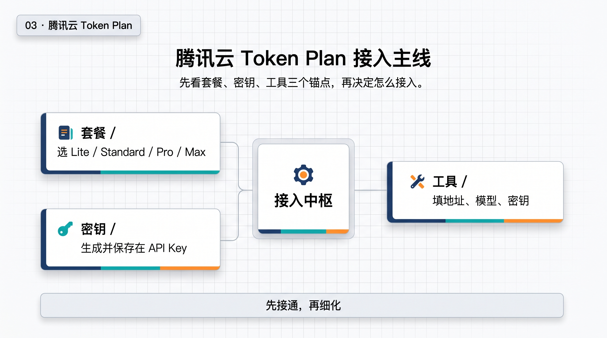

# 03-腾讯云 Token Plan

> 🎯 一句话结论：如果你已经在腾讯云生态里，或者你想用一份统一订阅把国产主流模型和 AI 编程工具先串起来，腾讯云 Token Plan 值得先看。

## 🚀 接入主线图

先看图，先抓住套餐、密钥、工具这三个锚点，再看下面的细节。

## ✨ 这条路适合谁

- 你已经在腾讯云生态里，想少管多套账号
- 你想用一份订阅统一管理 AI 编程工具
- 你更在意“先跑起来、再细化”，而不是一开始就做复杂接入
- 你希望模型、工具、成本都先有一个稳定入口
- 你想先用最省心的方式把国产主流模型串起来

## 🧭 先看最短决策

| 套餐 | 月费 | Tokens | 适合谁 | 我怎么理解 |
|---|---:|---:|---|---|
| Lite | ¥39 / 月 | 3500 万 Tokens / 月 | 新手尝鲜，先体验 | 先感受能力，门槛最低 |
| Standard | ¥99 / 月 | 1 亿 Tokens / 月 | 日常使用，高性价比 | 更平衡，适合作为入门主力 |
| Pro | ¥299 / 月 | 3.2 亿 Tokens / 月 | 高频 AI 开发 | 更适合把 AI 当日常工具 |
| Max | ¥599 / 月 | 6.5 亿 Tokens / 月 | 重度生产力用户 | 作为核心生产力入口更稳 |

> 备注：同一主账号同时只能购买一个 Token Plan 套餐；额度耗尽后不会自动转为按量计费。

## 🤖 它支持哪些模型

官方页里能看到这些代表项：

- Tencent HY 2.0 Instruct
- Tencent HY 2.0 Think
- MiniMax-M2.5
- Kimi-K2.5
- GLM-5
- Hunyuan-T1
- Hunyuan-TurboS
- 更多模型持续接入中

## 🧰 它兼容哪些工具

### 龙虾工具

- OpenClaw
- AutoClaw
- WorkBuddy
- CoPaw
- Lighthouse OpenClaw

### 编程工具

- CodeBuddy Code
- OpenCode
- Claude Code
- Codex CLI
- Cline
- Cursor
- Kilo CLI
- Kilo Code

对腾讯云来说，重点不是“工具名字越多越好”，而是：

- 你能不能先把订阅打通
- 你能不能顺手生成并保存密钥
- 你能不能把常用编程工具一次配好
- 你能不能在日常工作里稳定复用这条路

## 🧭 先抓住三个锚点

- **套餐**：先选 Lite / Standard / Pro / Max，按使用强度决定起点。
- **密钥**：在腾讯云控制台里创建并保存 API Key。
- **工具**：把地址、模型、密钥填到常用编程工具里。

如果你只想记住一句话：先把套餐、密钥和工具跑通，再去细化模型和工作流。

## 🔑 API Key 怎么拿

如果你要先把最关键的接入步骤跑通，先看这张官方页面真实截图：

这张截图里重点看两件事：

- 在 TokenHub > Token Plan 页面点击“生成密钥”
- 密钥生成成功后点击“复制”，拿到套餐专属 API Key（格式类似 `sk-tp-xxx`）

如果你要把这件事做得更稳，建议先确认：

- 你进的是 Token Plan 的官方页面，不是别的产品页
- 你生成的是当前套餐对应的专属 API Key
- 复制后把 Key 保存到本地配置记录里，后面配置工具时直接用

## 🔒 你最需要记住的两个坑

- 同一主账号同时只能购买一个 Token Plan 套餐
- 仅支持模型列表内的模型，列表外会报错
- 额度耗尽后不会自动转为按量计费，别把它当“无限自动续费池”

## ✅ 默认建议

如果你现在还没想清楚怎么选，可以直接按这个顺序看：

- **先体验**：Lite
- **日常使用**：Standard
- **高频开发**：Pro
- **重度生产力**：Max

如果你更偏团队协作，或者你已经明确要走更复杂的接口策略，那就先回到总览页重新确认路径。

## ➡️ 下一步

完成后进入：

- [国内模型总览](../01-总览.md)

## 📎 官方依据

- https://cloud.tencent.com/act/pro/tokenplan?from=29759&Is=home
- https://cloud.tencent.com/document/product/1823/130060
- https://cloud.tencent.com/document/product/1823/130119
