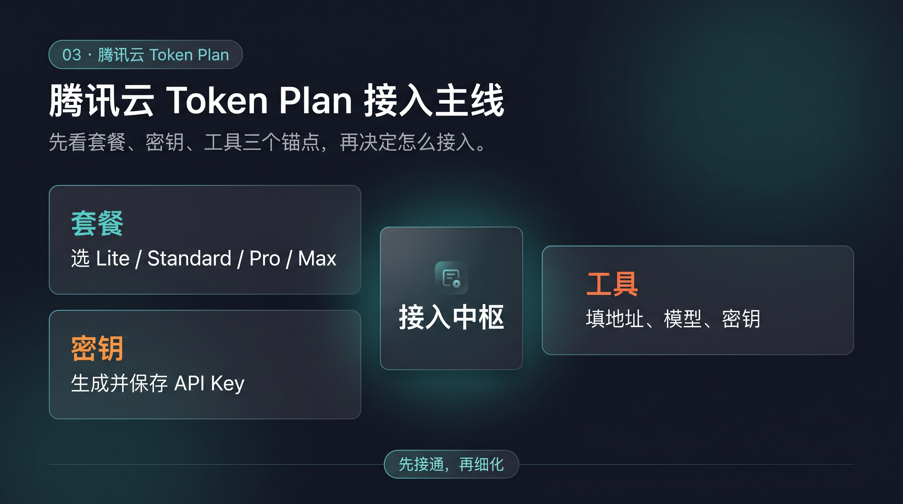
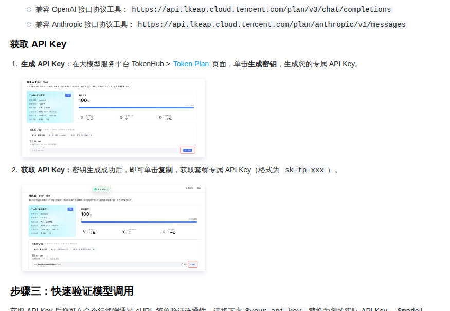

# 03-腾讯云 Token Plan

> 🎯 一句话先说清楚：如果你已经偏向腾讯云生态，或者你想先买一个能把国产主流模型和 AI 编程工具统一收口的套餐入口，腾讯云 Token Plan 值得先看。

这一页只解决一件事：帮你判断腾讯云 Token Plan 值不值得买，以及怎么按官方路径拿到套餐专属 API Key 并接进 Hermes。

这一页先不解决：
- 最低门槛按量起步应该选哪条路
- 单厂商会员权益型 Coding Plan 怎么买
- 你已经有 OneAPI / NewAPI / LM Studio / Ollama 时该怎么复用现成兼容层

## 🚀 先看主线

这张图只想帮你先抓住 4 个点：
- 这是一条“统一套餐入口”路线，不是最低门槛按量页
- 核心价值是腾讯云生态下的统一模型与工具接入
- 你真正要完成的是「选套餐 → 生成专属 Key → 写进工具 → 做最小验证」
- 如果你只是第一次跑通 Hermes，这页通常不是默认第一站

如果你当前更想先少花钱、少做选择、先验证链路能不能通，优先回看 [07-DeepSeek按量计费接口](./07-DeepSeek按量计费接口.md)。

## ✨ 这条路最适合谁

- 你已经在腾讯云生态里，想减少账号和平台分散
- 你想用一份统一订阅把国产主流模型与开发工具先串起来
- 你更关心“预算和入口先稳定”，再慢慢细化模型选择
- 你希望后续切模型、切工具时尽量不用重搭整条链路
- 你准备长期在腾讯云相关生态里继续扩展

## 🧭 先按你的当前状态分流

| 你的当前情况 | 直接建议 |
|---|---|
| 我只想先最低门槛把 Hermes 跑起来 | 先回看 [07-DeepSeek按量计费接口](./07-DeepSeek按量计费接口.md) |
| 我已经决定优先走腾讯云生态 | 留在这页继续 |
| 我想买一个统一套餐，再慢慢切模型 | 留在这页继续 |
| 我还在比较阿里云和腾讯云两条套餐线 | 先看完这页，再回看 [02-阿里云百炼 Token Plan](./02-阿里云百炼Token plan.md) |
| 我已经有稳定兼容层 | 优先看 [08-自定义兼容接口](./08-自定义兼容接口.md) |

如果你只记一句话：
- 想先买统一入口、又偏腾讯云生态 → 看腾讯云 Token Plan
- 只想先跑通 Hermes → 不要先在这页做套餐决策

## 💰 先看套餐，再判断值不值得买

| 套餐 | 月费 | Tokens | 适合谁 | 我怎么理解 |
|---|---:|---:|---|---|
| Lite | ¥39 / 月 | 3500 万 Tokens / 月 | 新手尝鲜、先体验 | 门槛最低 |
| Standard | ¥99 / 月 | 1 亿 Tokens / 月 | 日常使用、高性价比 | 最平衡的起步档 |
| Pro | ¥299 / 月 | 3.2 亿 Tokens / 月 | 高频 AI 开发 | 更适合作为主力入口 |
| Max | ¥599 / 月 | 6.5 亿 Tokens / 月 | 重度生产力用户 | 更像长期核心入口 |

补充判断：
- 同一主账号同时只能购买一个 Token Plan 套餐
- 额度耗尽后不会自动转为按量计费

### 这页该怎么判断套餐

最直接的判断方式不是先算“理论最低单价”，而是先问三件事：
- 你是不是已经接受“先买套餐”
- 你后面会不会长期用腾讯云这条入口
- 你是不是更想要一个统一入口，而不是继续一个个比较单次调用价格

如果答案都是“是”，这页值得继续；如果还没想清楚，先回按量页通常更轻。

## 🤖 它为什么值得单独看

### 1）它卖的是“云生态统一入口”

官方页能看到的代表模型包括：
- Tencent HY 2.0 Instruct
- Tencent HY 2.0 Think
- MiniMax-M2.5
- Kimi-K2.5
- GLM-5
- Hunyuan-T1
- Hunyuan-TurboS

这说明它的核心价值不是押中某一个模型，而是：
- 先买一个腾讯云里的统一入口
- 后面再根据任务切模型
- 把模型选择留到真正使用阶段再做细化

### 2）它把工具接入也当成卖点

官方页能看到的工具分成两类：

龙虾工具：
- OpenClaw
- AutoClaw
- WorkBuddy
- CoPaw
- Lighthouse OpenClaw

编程工具：
- CodeBuddy Code
- OpenCode
- Claude Code
- Codex CLI
- Cline
- Cursor
- Kilo CLI
- Kilo Code

对 Hermes 用户来说，真正重要的是：
- 这不是只适合官网里点点用的套餐
- 它本身就把开发工具接入当成官方场景在推
- 后面换模型时不用重搭整条链路

## 🔑 API Key 怎么拿，为什么它是这页核心

如果你要先把最关键的接入步骤跑通，先看这张真实截图：

这张图只证明两件事：
- 在 TokenHub > Token Plan 页面点击“生成密钥”
- 生成成功后复制套餐专属 API Key（格式类似 `sk-tp-xxx`）

这页最关键的不是背一堆参数，而是先拿到这把套餐专属 Key。

## 🧰 怎么把腾讯云 Token Plan 接进 Hermes

这页的接入逻辑可以收成 4 步：
- 先选套餐
- 再拿专属 Key
- 再写进你常用工具
- 最后做最小验证

### Step 1. 先确认你要走的是套餐主线

现在做什么：
- 先确认你这次的目标是“统一套餐入口”，不是“最低门槛按量起步”

为什么做：
- 因为这页适合已经接受套餐决策的人，不适合还没想好要不要买套餐的人

怎么做：
- 如果你已经决定优先走腾讯云生态，就留在这页继续
- 如果你只想先验证 Hermes 能不能通，回看 [07-DeepSeek按量计费接口](./07-DeepSeek按量计费接口.md)

看到什么算成功：
- 你已经明确自己要的是腾讯云套餐入口，不是最低门槛起步路线

失败先查什么：
- 如果你脑子里一直在比较“我为什么不先按量试跑”，说明你现在更适合先去按量页

### Step 2. 选一个当前够用的套餐

现在做什么：
- 按当前使用强度选一个最接近的档位

为什么做：
- 因为套餐本身就是这条路的前提，不先定档位，后面 Key 和预算都没有锚点

怎么做：
- 先试水 → Lite
- 日常使用 → Standard
- 高频开发 → Pro
- 重度生产力 → Max

看到什么算成功：
- 你已经能回答“我为什么选这一档”

失败先查什么：
- 是否还没想清自己是偶尔使用还是长期高频使用
- 是否误以为额度耗尽后会自动转按量计费

### Step 3. 在 Token Plan 页面生成并复制专属 API Key

现在做什么：
- 在官方 Token Plan 页面生成套餐专属 API Key

为什么做：
- 因为后面的 Hermes 或其他工具，接的就是这把 Key

怎么做：
- 打开 TokenHub > Token Plan 页面
- 点击“生成密钥”
- 复制保存这把专属 Key

看到什么算成功：
- 你已经拿到可复制的套餐专属 API Key

失败先查什么：
- 是否进错页面，不在 Token Plan 主页面
- 是否复制后没有保存，后面配置工具时需要重新生成

### Step 4. 先在 Hermes 里做最小验证

现在做什么：
- 把 Key 配进你实际要用的 Hermes / 工具链，并做一次最小验证

为什么做：
- 因为“买了套餐”和“真的能在 Hermes 里工作”是两件事

怎么做：
- 先按腾讯云官方接入说明把地址、模型、密钥填入工具
- 再进入 Hermes 发一条最简单的问题
- 先验证能正常返回一条结果，再继续细化模型选择

看到什么算成功：
- 不再提示 Key 或接入错误
- Hermes 能稳定返回一条正常回复

失败先查什么：
- 是否复制错 Key
- 是否套餐还未正确生效
- 是否模型名或接入方式和当前套餐支持范围不一致

## ❓FAQ

### 1. 这页为什么不是默认起步页？

因为这页要求你先接受“统一套餐 + 云生态选择 + 预算档位”这组决策。

如果你现在只是想先跑通 Hermes，按量页通常更轻、更快。

### 2. 腾讯云 Token Plan 最容易踩的坑是什么？

最常见的两个坑就是：
- 同一主账号同时只能购买一个套餐
- 额度耗尽后不会自动转按量计费

### 3. 为什么这页先强调专属 API Key，而不是先讲模型？

因为套餐主线里，真正决定你能不能开始接工具的，是那把专属 Key；模型细化可以放到后一步。

## ⚠️ 风险点与默认建议

### 风险点
- 其实只想试跑，却过早做了套餐决策
- 误以为额度耗尽后会自动转按量计费
- 没保存好专属 Key，后面配置工具时反复回去找入口

### 默认建议
- 如果你已经明确走腾讯云生态，再看这页最值
- 默认先从最接近当前真实使用强度的档位选起
- 默认先完成一次最小验证，再去精细化模型策略

## ➡️ 下一步

完成后进入：
- [04-智谱 GLM Coding Plan](./04-智谱GLM Coding Plan.md)

如果你想先回到上一阶段入口重新确认位置：
- [02-国内模型总览](./01-总览.md)

## 📎 官方依据

- https://cloud.tencent.com/act/pro/tokenplan?from=29759&Is=home
- https://cloud.tencent.com/document/product/1823/130060
- https://cloud.tencent.com/document/product/1823/130119
