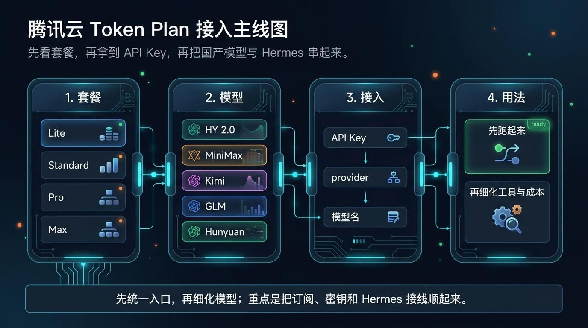
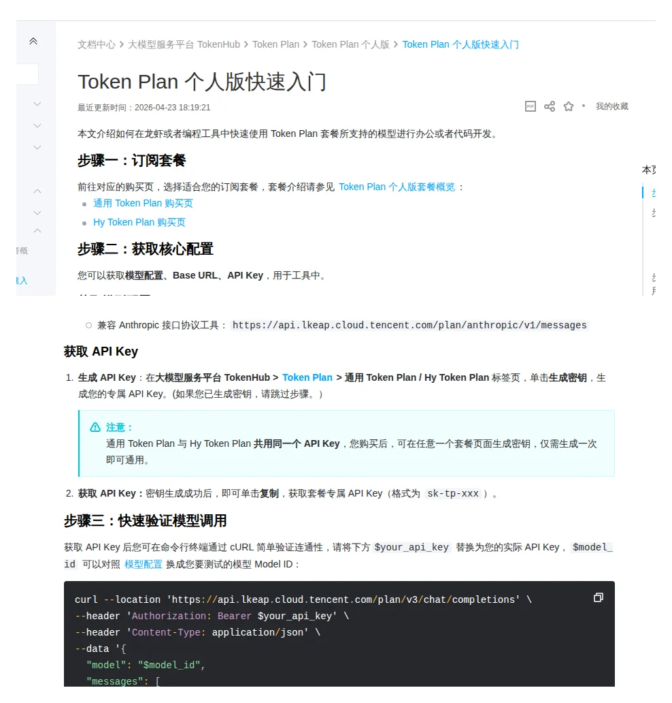

---
quick_reference:
  - checkedAt: '2026-10-03'
    hermesVersion: v2026.9.24
    verification: docs-reviewed
    kind: model
    id: tencent-token-plan-general-native
    vendor: 腾讯云
    product: Token Plan 个人版（通用）
    region: 中国区
    connection: native
    provider: tencent-tokenplan
    protocol: anthropic
    endpoint: 'https://api.lkeap.cloud.tencent.com/plan/anthropic'
    modelIds:
      - glm-5.3
      - minimax-m3
      - kimi-k2.7-code
    permissions: 个人专享，不共享；仅限允许的 AI 工具使用，不用于脚本、后端或非交互批量调用。通用与 Hy 共用 Key/URL，按模型消耗对应套餐；额度耗尽不会转为按量。企业产品与 TokenHub Key 不混用。
    configExample: |-
      hermes config set model.provider tencent-tokenplan
      hermes config unset model.base_url
      hermes config set TOKENPLAN_BASE_URL https://api.lkeap.cloud.tencent.com/plan/anthropic
      hermes config set model.api_mode anthropic_messages
      hermes config set TOKENPLAN_API_KEY "<YOUR_API_KEY>"
      hermes config set model.default glm-5.3
    diagnostics:
      - /docs/issues/provider-endpoint
    sources:
      - url: 'https://cloud.tencent.com/document/product/1823/130060'
      - url: 'https://cloud.tencent.com/document/product/1823/130076'
      - url: 'https://cloud.tencent.com/document/product/1823/136601'
      - url: 'https://raw.githubusercontent.com/NousResearch/hermes-agent/v2026.9.24/hermes_cli/auth.py'
        revision: v2026.9.24
  - checkedAt: '2026-10-03'
    hermesVersion: v2026.9.24
    verification: docs-reviewed
    kind: model
    id: tencent-token-plan-general-openai
    vendor: 腾讯云
    product: Token Plan 个人版（通用）
    region: 中国区
    connection: compatible
    provider: custom
    protocol: openai
    endpoint: 'https://api.lkeap.cloud.tencent.com/plan/v3'
    modelIds:
      - glm-5.3
      - minimax-m3
      - kimi-k2.7-code
    permissions: 个人专享，不共享；仅限允许的 AI 工具使用，不用于脚本、后端或非交互批量调用。通用与 Hy 共用 Key/URL，按模型消耗对应套餐；额度耗尽不会转为按量。企业产品与 TokenHub Key 不混用。
    configExample: |-
      hermes config set model.provider custom
      hermes config set model.base_url https://api.lkeap.cloud.tencent.com/plan/v3
      hermes config unset model.api_mode
      hermes config set model.api_key "<YOUR_API_KEY>"
      hermes config set model.default glm-5.3
    diagnostics:
      - /docs/issues/provider-endpoint
    sources:
      - url: 'https://cloud.tencent.com/document/product/1823/130060'
      - url: 'https://cloud.tencent.com/document/product/1823/130076'
      - url: 'https://cloud.tencent.com/document/product/1823/136601'
      - url: 'https://raw.githubusercontent.com/NousResearch/hermes-agent/v2026.9.24/hermes_cli/auth.py'
        revision: v2026.9.24
      - url: 'https://github.com/NousResearch/hermes-agent/blob/v2026.9.24/website/docs/integrations/providers.md'
        revision: v2026.9.24
  - checkedAt: '2026-10-03'
    hermesVersion: v2026.9.24
    verification: docs-reviewed
    kind: model
    id: tencent-token-plan-hy-native
    vendor: 腾讯云
    product: Token Plan 个人版（Hy）
    region: 中国区
    connection: native
    provider: tencent-tokenplan
    protocol: anthropic
    endpoint: 'https://api.lkeap.cloud.tencent.com/plan/anthropic'
    modelIds:
      - hy3
      - hy4-preview
    permissions: 个人专享，不共享；仅限允许的 AI 工具使用，不用于脚本、后端或非交互批量调用。通用与 Hy 共用 Key/URL，按模型消耗对应套餐；额度耗尽不会转为按量。企业产品与 TokenHub Key 不混用。
    configExample: |-
      hermes config set model.provider tencent-tokenplan
      hermes config unset model.base_url
      hermes config set TOKENPLAN_BASE_URL https://api.lkeap.cloud.tencent.com/plan/anthropic
      hermes config set model.api_mode anthropic_messages
      hermes config set TOKENPLAN_API_KEY "<YOUR_API_KEY>"
      hermes config set model.default hy3
    diagnostics:
      - /docs/issues/provider-endpoint
    sources:
      - url: 'https://cloud.tencent.com/document/product/1823/130060'
      - url: 'https://cloud.tencent.com/document/product/1823/130076'
      - url: 'https://cloud.tencent.com/document/product/1823/136601'
      - url: 'https://raw.githubusercontent.com/NousResearch/hermes-agent/v2026.9.24/hermes_cli/auth.py'
        revision: v2026.9.24
  - checkedAt: '2026-10-03'
    hermesVersion: v2026.9.24
    verification: docs-reviewed
    kind: model
    id: tencent-token-plan-hy-openai
    vendor: 腾讯云
    product: Token Plan 个人版（Hy）
    region: 中国区
    connection: compatible
    provider: custom
    protocol: openai
    endpoint: 'https://api.lkeap.cloud.tencent.com/plan/v3'
    modelIds:
      - hy3
      - hy4-preview
    permissions: 个人专享，不共享；仅限允许的 AI 工具使用，不用于脚本、后端或非交互批量调用。通用与 Hy 共用 Key/URL，按模型消耗对应套餐；额度耗尽不会转为按量。企业产品与 TokenHub Key 不混用。
    configExample: |-
      hermes config set model.provider custom
      hermes config set model.base_url https://api.lkeap.cloud.tencent.com/plan/v3
      hermes config unset model.api_mode
      hermes config set model.api_key "<YOUR_API_KEY>"
      hermes config set model.default hy3
    diagnostics:
      - /docs/issues/provider-endpoint
    sources:
      - url: 'https://cloud.tencent.com/document/product/1823/130060'
      - url: 'https://cloud.tencent.com/document/product/1823/130076'
      - url: 'https://cloud.tencent.com/document/product/1823/136601'
      - url: 'https://raw.githubusercontent.com/NousResearch/hermes-agent/v2026.9.24/hermes_cli/auth.py'
        revision: v2026.9.24
      - url: 'https://github.com/NousResearch/hermes-agent/blob/v2026.9.24/website/docs/integrations/providers.md'
        revision: v2026.9.24
---
# 腾讯云 Token Plan 接入 Hermes Agent：积分、API Key 与桌面配置

内容更新：2026-10-03（同源配置迁移）；原教程复核日期：2026-09-30；速查条目核验日期见配置卡。接入配置对照 Hermes 稳定标签 v2026.9.24；厂商模型与套餐按下列官方来源复核。未调用 API、购买套餐或完成桌面安装实测。

> 💡 **速答**：腾讯云 Token Plan 当前提供套餐专属 API Key；[官方 CC Switch 文档](https://cloud.tencent.com/document/product/1823/136601)
> 已包含 Hermes 的双协议配置。本页同时依据固定 Hermes 标签源码核对原生与兼容路线，
> 不将 CC Switch 配置说明视为独立认证或直连专项适配页；套餐、模型、Base URL 与 Key 仍以腾讯云当前说明为准。

> 🎯 一句话先说清楚：如果你已经偏向腾讯云生态，或者你想先买一个能把国产主流模型和 AI 编程工具统一收口的套餐入口，腾讯云 Token Plan 值得先看。

这一页只解决一件事：帮你判断腾讯云 Token Plan 值不值得买，以及怎么按官方路径拿到套餐专属 API Key 并接进 Hermes。

这一页先不解决：
- 最低门槛按量起步应该选哪条路
- 单厂商会员权益型 Coding Plan 怎么买
- 你已经有 OneAPI / NewAPI / LM Studio / Ollama 时该怎么复用现成兼容层

## 🔎 搜索收录速答

腾讯云 Token Plan 是本页的套餐产品：先区分个人通用/Hy 与企业产品，核对积分、套餐专属 API Key 和模型权限，再使用 Hermes 原生 `tencent-tokenplan`（默认 Anthropic）或 OpenAI 兼容备选配置。TokenHub 是另一条产品/provider 路线，不能将其 Key 或 endpoint 替代个人 Token Plan。[桌面默认模型配置](/docs/start/personalize/desktop-app)与[401/403 权限排查](/docs/issues/provider-endpoint)分别验收，保存成功不代表计费产品正确。

## 🚀 先看主线

这张图只想帮你先抓住 4 个点：
- 这是一条“统一套餐入口”路线，不是最低门槛按量页
- 核心价值是腾讯云生态下的统一模型与工具接入
- 你真正要完成的是「选套餐 → 生成专属 Key → 写进工具 → 做最小验证」
- 如果你只是第一次跑通 Hermes，这页通常不是默认第一站

如果你当前更想先少花钱、少做选择、先验证链路能不能通，优先回看 [07-DeepSeek按量计费接口](./07-DeepSeek按量计费接口.md)。

## ✨ 这条路最适合谁

- 你已经在腾讯云生态里，想减少账号和平台分散
- 你想用一份统一订阅把国产主流模型与开发工具先串起来
- 你更关心“预算和入口先稳定”，再慢慢细化模型选择
- 你希望后续切模型、切工具时尽量不用重搭整条链路
- 你准备长期在腾讯云相关生态里继续扩展

## 🧭 先按你的当前状态分流

| 你的当前情况 | 直接建议 |
|---|---|
| 我只想先最低门槛把 Hermes 跑起来 | 先回看 [07-DeepSeek按量计费接口](./07-DeepSeek按量计费接口.md) |
| 我已经决定优先走腾讯云生态 | 留在这页继续 |
| 我想买一个统一套餐，再慢慢切模型 | 留在这页继续 |
| 我还在比较阿里云和腾讯云两条套餐线 | 先看完这页，再回看 [02-阿里云百炼 Token Plan](<./02-%E9%98%BF%E9%87%8C%E4%BA%91%E7%99%BE%E7%82%BCToken%20plan.md>) |
| 我已经有稳定兼容层 | 优先看 [08-自定义兼容接口](./08-自定义兼容接口.md) |

如果你只记一句话：
- 想先买统一入口、又偏腾讯云生态 → 看腾讯云 Token Plan
- 只想先跑通 Hermes → 不要先在这页做套餐决策

## 💰 先看套餐，再判断值不值得买

| 通用套餐 | 月费 | 每订阅月积分 |
|---|---:|---:|
| Lite | ¥39 | 780 |
| Standard | ¥99 | 1,980 |
| Pro | ¥299 | 5,980 |
| Max | ¥599 | 11,980 |

自 2026-08-31 北京时间 17:00 起采用积分抵扣。旧文的固定 Token 月配额不再适用；问答轮次与 Token 量只能按模型和工作负载估算。Hy 系列有独立档位与价格，不能使用上表替代。

补充判断：
- 当前中国站说明为：每个主账号（含子账号）最多同时持有 1 个通用 Token Plan 和
  1 个 Hy Token Plan，不是“所有 Token Plan 合计只能买一个”
- 个人版每类套餐当前仅支持生成 1 个 API Key
- 套餐外模型会报错；额度耗尽后的行为应以控制台和当前 FAQ 为准，本页不作固定承诺

### 这页该怎么判断套餐

最直接的判断方式不是先算“理论最低单价”，而是先问三件事：
- 你是不是已经接受“先买套餐”
- 你后面会不会长期用腾讯云这条入口
- 你是不是更想要一个统一入口，而不是继续一个个比较单次调用价格

如果答案都是“是”，这页值得继续；如果还没想清楚，先回按量页通常更轻。

## 🤖 它为什么值得单独看

### 1）它卖的是“云生态统一入口”

截至 2026-09-30，通用库包含 Auto（`tc-code-latest`）、DeepSeek（例如 `deepseek/deepseek-flash`）、`glm-5.3`、`glm-5.3-flash`、`minimax-m3`、`kimi-k3` 和 `mimo-v2.6-flash` 等。这里是腾讯目录 ID，不能照搬厂商直连 ID。`glm-5` / `glm-5.1` 计划于 **2026-10-09** 下线，应提前检查固定任务配置。模型库动态变化，以套餐表为准。

### 2）它把工具接入也当成卖点

官方页能看到的工具分成两类：

龙虾工具：
- OpenClaw
- AutoClaw
- WorkBuddy
- CoPaw
- Lighthouse OpenClaw

编程工具：
- CodeBuddy Code
- OpenCode
- Claude Code
- Codex CLI
- Cline
- Cursor
- Kilo CLI
- Kilo Code

对 Hermes 用户来说，真正重要的是：
- 这不是只适合官网里点点用的套餐
- 它本身就把开发工具接入当成官方场景在推
- 官方 CCSwitch 文档已有 Hermes 步骤；仍需按自己的版本与套餐验证实际任务
- 优先按下文原生 provider 配置；已有兼容端点时保持协议一致，分别验收请求与用量

## 🔑 原生 provider 与账户限制

原生与兼容路线的 provider、密钥变量、协议及 endpoint 见[本页同源模型配置卡](/docs/china/models/tencent-token-plan#model-quick-reference)。不要把完整聊天请求 URL 填成 Base URL。

通用与 Hy 套餐共用 `sk-tp-` Key；实际模型仍需对应套餐权限。个人套餐不得多人共享。TokenHub、企业产品和个人 Token Plan 是不同路线，不把 `tokenhub` provider 或企业 Key 当成个人套餐配置。

## 🔑 API Key 怎么拿，为什么它是这页核心

如果你要先把最关键的接入步骤跑通，先看这张真实截图：

这张图只证明两件事：
- 历史截图展示旧控制台入口；当前应进入已购买产品的 Token Plan 密钥页面
- 生成成功后复制套餐专属 API Key（格式类似 `sk-tp-xxx`）

这页最关键的不是背一堆参数，而是先拿到这把套餐专属 Key。

## 🧰 怎么把腾讯云 Token Plan 接进 Hermes

这页的接入逻辑可以收成 4 步：
- 先选套餐
- 再拿专属 Key
- 再写进你常用工具
- 最后做最小验证

### Step 1. 先确认你要走的是套餐主线

现在做什么：
- 先确认你这次的目标是“统一套餐入口”，不是“最低门槛按量起步”

为什么做：
- 因为这页适合已经接受套餐决策的人，不适合还没想好要不要买套餐的人

怎么做：
- 如果你已经决定优先走腾讯云生态，就留在这页继续
- 如果你只想先验证 Hermes 能不能通，回看 [07-DeepSeek按量计费接口](./07-DeepSeek按量计费接口.md)

看到什么算成功：
- 你已经明确自己要的是腾讯云套餐入口，不是最低门槛起步路线

失败先查什么：
- 如果你脑子里一直在比较“我为什么不先按量试跑”，说明你现在更适合先去按量页

### Step 2. 选一个当前够用的套餐

现在做什么：
- 按当前使用强度选一个最接近的档位

为什么做：
- 因为套餐本身就是这条路的前提，不先定档位，后面 Key 和预算都没有锚点

怎么做：
- 先试水 → Lite
- 日常使用 → Standard
- 高频开发 → Pro
- 重度生产力 → Max

看到什么算成功：
- 你已经能回答“我为什么选这一档”

失败先查什么：
- 是否还没想清自己是偶尔使用还是长期高频使用
- 是否误以为额度耗尽后会自动转按量计费

### Step 3. 在 Token Plan 页面生成并复制专属 API Key

现在做什么：
- 在官方 Token Plan 页面生成套餐专属 API Key

为什么做：
- 因为后面的 Hermes 或其他工具，接的就是这把 Key

怎么做：
- 打开当前已购买产品的 Token Plan 密钥管理页面
- 点击“生成密钥”
- 复制保存这把专属 Key

看到什么算成功：
- 你已经拿到可复制的套餐专属 API Key

失败先查什么：
- 是否进错页面，不在 Token Plan 主页面
- 是否复制后没有保存，后面配置工具时需要重新生成

### Step 4. 把它作为兼容端点在 Hermes 里做最小验证

现在做什么：
- 从腾讯云当前接入说明取得 Base URL、模型名和 Key，再按 Hermes 的自定义兼容端点字段配置

为什么做：
- 因为原生与兼容端点的协议不同，不能把某个工具的字段原样搬入另一条路线

怎么做：
- 先从腾讯云官方接入说明确认地址、模型和密钥
- 在[本页同源模型配置卡](/docs/china/models/tencent-token-plan#model-quick-reference)按所购通用或 Hy 产品选择原生/兼容路线，复制配置并替换密钥占位符
- 进入 Hermes 发一条最简单的问题
- 先验证能正常返回一条结果，再继续细化模型选择

看到什么算成功：
- 不再提示 Key 或接入错误
- Hermes 能稳定返回一条正常回复，且没有 provider、endpoint、模型或鉴权错误

失败先查什么：
- 是否复制错 Key
- 是否套餐还未正确生效
- 是否模型名或接入方式和当前套餐支持范围不一致

## ❓FAQ

### 1. 这页为什么不是默认起步页？

因为这页要求你先接受“统一套餐 + 云生态选择 + 预算档位”这组决策。

如果你现在只是想先跑通 Hermes，按量页通常更轻、更快。

### 2. 腾讯云 Token Plan 最容易踩的坑是什么？

最常见的三个坑就是：
- 把旧的“同一主账号只能购买一个套餐”口径当作当前中国站规则
- 把套餐外模型写进配置
- 把腾讯云列出的通用兼容工具能力误写成 Hermes 官方专项适配

### 3. 为什么这页先强调专属 API Key，而不是先讲模型？

因为套餐主线里，真正决定你能不能开始接工具的，是那把专属 Key；模型细化可以放到后一步。

## ⚠️ 风险点与默认建议

### 风险点
- 其实只想试跑，却过早做了套餐决策
- 没有先核对当前可用模型、Base URL 和套餐规则
- 没保存好专属 Key，后面配置工具时反复回去找入口

### 默认建议
- 如果你已经明确走腾讯云生态，再看这页最值
- 默认先从最接近当前真实使用强度的档位选起
- 默认先完成一次最小验证，再去精细化模型策略

## 🖥️ 桌面短配置卡

1. 先在[本页同源模型配置卡](/docs/china/models/tencent-token-plan#model-quick-reference)确认产品、区域、接入方式与对应密钥字段，再选择同一条路线。
2. 打开 **Settings → Model** 设置当前 profile 默认模型，填[本页同源模型配置卡](/docs/china/models/tencent-token-plan#model-quick-reference)中的精确模型 ID。聊天输入框的模型选择只用于当前聊天，不能用它代替默认模型验收；首次选择及持久化行为以对应版本为准。
3. 若菜单没有模型，使用手动 ID 入口；空目录行为有版本差异，见[桌面教程](/docs/start/personalize/desktop-app)。远端连接时核对服务实际运行的 profile 和凭据位置。
4. 自行发送一条短问答，再执行一个只读取测试文件的工具任务；核对实际 provider、模型、结果及厂商用量记录。**Test、问答和工具任务会发请求，可能收费**，点击前确认余额与套餐允许的用法。
5. 本页只完成文档与源码复核，未进行真实 API、桌面安装或国内网络测试；保存配置或显示连接成功不等于任务和计费路线验证通过。

## 📚 本次复核来源

- [套餐、模型与积分](https://cloud.tencent.com/document/product/1823/130060)
- [积分规则](https://cloud.tencent.com/document/product/1823/133811)
- [FAQ](https://cloud.tencent.com/document/product/1823/130119)
- [CCSwitch/Hermes](https://cloud.tencent.com/document/product/1823/136601)
- [接入配置](https://cloud.tencent.com/document/product/1823/130076)
- [Hermes 稳定 Provider 文档](https://github.com/NousResearch/hermes-agent/blob/v2026.9.24/website/docs/integrations/providers.md)
- [稳定凭据注册与覆盖变量](https://github.com/NousResearch/hermes-agent/blob/v2026.9.24/hermes_cli/auth.py)

## ➡️ 下一步

完成后进入：
- [04-智谱 GLM Coding Plan](<./04-%E6%99%BA%E8%B0%B1GLM%20Coding%20Plan.md>)

如果你想先回到上一阶段入口重新确认位置：
- [02-国内模型总览](./01-总览.md)

## 📎 官方依据

- https://cloud.tencent.com/act/pro/tokenplan
- https://cloud.tencent.com/document/product/1823/130060
- https://cloud.tencent.com/document/product/1823/130119

## 🧾 R2 官方同步记录

- source_id: `tencent-cloud-models`
- checked_at: `2026-09-30`
- change_type: `official-source-confirmation`
- affected_doc: `docs/03-国内落地/02-国内模型/03-腾讯云Token Plan.md`
- 本轮结论：已确认当前中国站套餐定位、通用/Hy 购买上限、可用模型入口、工具清单与 API Key 管理路径；官方 CCSwitch 文档已提供 Hermes 步骤；原生 tencent-tokenplan 另按稳定源码配置。
- 后续规则：价格表是当前快照；套餐、可用模型、控制台按钮、额度限制和兼容端点仍以厂商官方页面实时显示为准，Hermes 必须单独做最小兼容验证。
- 官方来源：
  - https://cloud.tencent.com/act/pro/tokenplan
  - https://cloud.tencent.com/document/product/1823/130060
  - https://cloud.tencent.com/document/product/1823/130119

---

## 🔗 模型接入关联路径

- 还没部署 Hermes：先回到[国内部署](/docs/china/deploy)确认服务器和远程环境。
- 要换国内模型：优先比较[阿里云百炼](/docs/china/models/alibaba-bailian-token-plan)和[DeepSeek](/docs/china/models/deepseek-metered-api)。
- 使用非内置平台：看[自定义兼容接口](/docs/china/models/openai-compatible-endpoint)，再对照[模型 Provider 与自定义 endpoint 问题](/docs/issues/provider-endpoint)。
- 要查环境变量和配置项：进入[环境变量参考](/docs/reference/environment-variables)和[Profile 命令参考](/docs/reference/profile-commands)。
