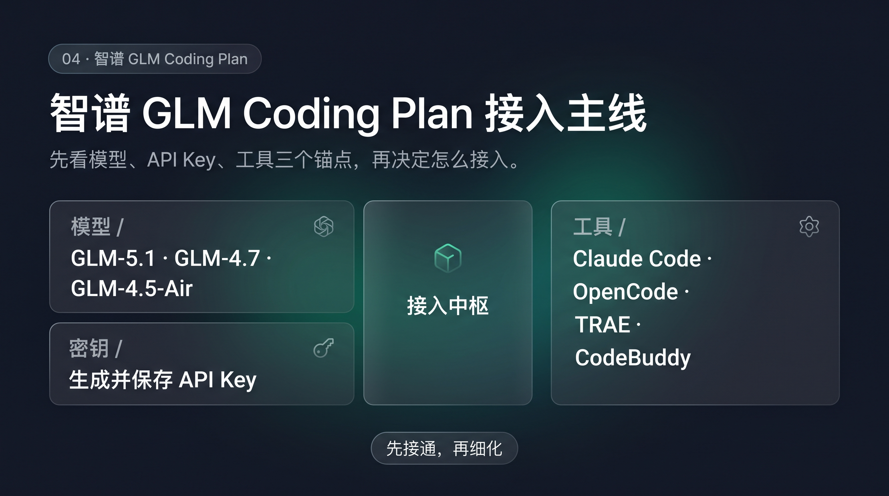

# 04-智谱GLM Coding Plan

> 🎯 一句话结论：如果你已经认准智谱，或者你想先走一条单厂商、路径直接、配置明确的 Coding Plan，GLM Coding Plan 值得先看。

## 🚀 接入主线图



先看图，先抓住模型、API Key、工具三个锚点，再看下面的细节。

## ✨ 这条路适合谁

- 你已经认准智谱，想少做横向比较
- 你更喜欢单厂商路径，判断更直接
- 你主要做中文编程、调试、代码库问答
- 你想先把编码工具跑通，再细化模型和工作流
- 你希望一条路里把模型、Key、工具关系看得更清楚

## 🧭 先看最短决策

| 场景 | 建议 |
|---|---|
| 已经决定走智谱这条线 | GLM Coding Plan |
| 重点是中文编码与工具兼容 | GLM Coding Plan |
| 还在多家路线间摇摆 | 先回 [国内模型总览](../01-总览.md) |

## 🤖 它支持哪些模型

官方说明里，GLM Coding Plan 支持这些代表项：

- GLM-5.1
- GLM-5-Turbo
- GLM-4.7
- GLM-4.5-Air

## 🧰 它兼容哪些工具

官方文档明确支持的主流编码工具包括：

- Claude Code
- OpenCode
- TRAE
- CodeBuddy
- Kilo Code
- OpenClaw

对我来说，重点不是工具名越多越好，而是：

- 你能不能先接通
- 接通后能不能稳定切换模型
- 你的日常工作流会不会被打散

## 🤝 Hermes 怎么接

官方文档给的是通用兼容示例，但对 Hermes 来说，接法可以直接按这套思路落地：把 Hermes 的兼容层指到智谱的 Coding API。

- 入口先认准专属 Coding API：`https://open.bigmodel.cn/api/coding/paas/v4`
- Hermes 兼容路径里，核心就是这组环境变量：
  - `ANTHROPIC_AUTH_TOKEN`：填你的 API Key
  - `ANTHROPIC_BASE_URL`：`https://open.bigmodel.cn/api/anthropic`
  - `ANTHROPIC_DEFAULT_OPUS_MODEL`：`glm-5.1`
  - `ANTHROPIC_DEFAULT_SONNET_MODEL`：`glm-4.7`
  - `ANTHROPIC_DEFAULT_HAIKU_MODEL`：`glm-4.5-air`

- 先跑通最小闭环，再细化模型和工具

## 🔑 接入时最需要记住的点

- 这是单厂商 Coding Plan，不是聚合订阅
- 只在官方支持的工具与产品环境中使用
- 专属 Coding API 端点是 `https://open.bigmodel.cn/api/coding/paas/v4`
- 不要把通用 API 端点当成主线入口
- API Key 先保存到环境变量或配置文件，不要硬编码

## 🧭 先把最短路径跑通

### 1）注册并订阅

- 访问智谱开放平台，完成注册/登录
- 进入 GLM Coding Plan 套餐页，选择适合你的订阅

### 2）获取 API Key

- 在个人中心里进入 API Keys
- 创建新的 API Key
- 复制后妥善保存到本地配置或环境变量

### 3）选择接入工具

- 这页的主线不是 Claude Code，而是看工具本身是否支持 OpenAI 协议
- 官方页面的示例是 Cursor，但同样适用于其他支持 OpenAI 协议的工具
- 如果 Hermes 侧提供 OpenAI-compatible Provider / Base URL 配置，也可以照着同一套思路接

### 4）配置 OpenAI 协议

官方文档的关键动作很清楚：

- 选择 OpenAI 协议
- API Key 填智谱开放平台的 Key
- 将 OpenAI Base URL 覆盖为：`https://open.bigmodel.cn/api/coding/paas/v4`
- 输入 GLM 模型，例如：`GLM-5.1`、`GLM-4.7`、`GLM-4.5-air`
- 注意模型名要用大写写法，不要写小写

如果你要把这套配置抽成一眼能看懂的写法，可以理解成：

```json
{
  "provider": "OpenAI-compatible",
  "api_key": "your_zhipu_api_key",
  "base_url": "https://open.bigmodel.cn/api/coding/paas/v4",
  "model": "GLM-5.1"
}
```

- 这不是 Claude Code 专属写法，而是工具侧 OpenAI 协议接法的通用表达
- 对 Hermes 来说，关键是它有没有对应的 OpenAI-compatible 配置入口

### 5）验证是否接通

- 能正常进入工具会话
- 能顺利调用 GLM 模型
- 日常任务可以从 GLM-4.7 开始，复杂任务再切到更高阶模型

## ⚠️ 什么时候先别选它

- 你现在只想最低门槛先试跑
- 你还没确定是不是要走单厂商订阅
- 你更想先在多家模型里横向切换

## ✅ 默认建议

- **先体验**：先用 GLM Coding Plan 跑通最小闭环
- **日常使用**：优先 GLM-4.7
- **复杂任务**：再切到 GLM-5.1 或 GLM-5-Turbo
- **工具选择**：先选一个最熟的工具，不要一开始铺太宽

## ➡️ 下一步

- 如果你想继续看另一条单厂商路线，继续看 [MiniMax Token Plan](./05-MiniMax Token Plan.md)
- 如果你还在横向比较，回 [国内模型总览](../01-总览.md)

## 📎 官方依据

- https://docs.bigmodel.cn/cn/coding-plan/overview
- https://docs.bigmodel.cn/cn/coding-plan/quick-start
- https://docs.bigmodel.cn/cn/coding-plan/faq
