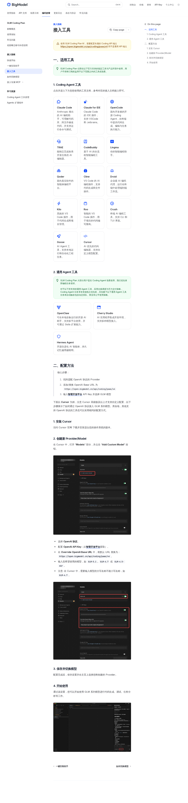

# 04-智谱GLM Coding Plan

> 🎯 一句话结论：如果你已经认准智谱，或者你想先走一条单厂商、路径直接、配置明确的 Coding Plan，GLM Coding Plan 值得先看。

## 🚀 接入主线图


先看图，先抓住模型、API Key、工具三个锚点，再看下面的细节。

## ✨ 这条路适合谁

- 你已经认准智谱，想少做横向比较
- 你更喜欢单厂商路径，判断更直接
- 你主要做中文编程、调试、代码库问答
- 你想先把编码工具跑通，再细化模型和工作流
- 你希望一条路里把模型、Key、工具关系看得更清楚

## 🧭 先看最短决策

| 场景 | 建议 |
|---|---|
| 已经决定走智谱这条线 | GLM Coding Plan |
| 重点是中文编码与工具兼容 | GLM Coding Plan |
| 还在多家路线间摇摆 | 先回 [国内模型总览](../01-总览.md) |

## 🤖 它支持哪些模型

官方说明里，GLM Coding Plan 支持这些代表项：

- GLM-5.1
- GLM-5-Turbo
- GLM-4.7
- GLM-4.5-Air

## 🧰 它兼容哪些工具

官方文档明确支持的主流编码工具包括：

- Claude Code
- OpenCode
- TRAE
- CodeBuddy
- Kilo Code
- OpenClaw

对我来说，重点不是工具名越多越好，而是：

- 你能不能先接通
- 接通后能不能稳定切换模型
- 你的日常工作流会不会被打散

## 🤝 Hermes 怎么接

这里要分清两条路：

1. Hermes 官方直连 GLM provider
   - 先用 `hermes model` 选择 Hermes 已内建支持的 provider / model
   - 如果是 GLM / Kimi / MiniMax / DashScope 这类已支持 provider，就把对应 API key 放进 `~/.hermes/.env`
   - 这条路不需要你手动配 `base_url`

2. 只有在你要接 OpenAI-compatible 自建网关时，才走 `custom endpoint` / `base_url`
   - 那时才需要指向真正的 OpenAI-compatible 接口
   - 这不是 Hermes 直连 GLM 的默认路径

所以，如果你的目标只是“让 Hermes 直接用 GLM”，优先看 Hermes 官方 provider 路线；不要先套 Claude Code 那组配置。

## 🔑 接入时最需要记住的点

- 这是单厂商 Coding Plan，不是聚合订阅
- 只在官方支持的工具与产品环境中使用
- 专属 Coding API 端点是 `https://open.bigmodel.cn/api/coding/paas/v4`
- 不要把通用 API 端点当成主线入口
- API Key 先保存到环境变量或配置文件，不要硬编码

## 🧭 先把最短路径跑通

### 1）注册并订阅

- 访问智谱开放平台，完成注册/登录
- 进入 GLM Coding Plan 套餐页，选择适合你的订阅

### 2）获取 API Key

- 在个人中心里进入 API Keys
- 创建新的 API Key
- 复制后妥善保存到本地配置或环境变量

### 3）选择接入工具

- 这页的主线不是 Claude Code，而是看工具本身是否支持 OpenAI 协议
- 官方页面的示例是 Cursor，但同样适用于其他支持 OpenAI 协议的工具
- 如果 Hermes 侧提供 OpenAI-compatible Provider / Base URL 配置，也可以照着同一套思路接
- 下面这段给的是官方工具页的详细接入方法和截图，适合直接照着操作

### 4）详细配置方法

官方文档里的关键动作可以拆成 4 步：

1. 选择 OpenAI 协议
2. 填智谱开放平台的 API Key
3. 把 OpenAI Base URL 改成 `https://open.bigmodel.cn/api/coding/paas/v4`
4. 输入 GLM 模型名，推荐从 `GLM-4.7` 或 `GLM-5.1` 开始

可以把它理解成下面这种最小配置：

```json
{
  "provider": "OpenAI-compatible",
  "api_key": "your_zhipu_api_key",
  "base_url": "https://open.bigmodel.cn/api/coding/paas/v4",
  "model": "GLM-5.1"
}
```

- 这不是 Claude Code 专属写法，而是工具侧 OpenAI 协议接法的通用表达
- 如果你用的工具支持自定义 Provider/Model，就按这个思路填
- 模型名记得用大写，不要写成小写

### 5）官方截图：配置方法长什么样

下面这张图就是智谱官方“接入工具”页面的截图。它展示了完整的工具接入路径：

- 上方是官方接入页的上下文
- 中间是“二、配置方法”
- 下面能看到 Cursor 的配置步骤
- 右侧/页面内说明里能确认这是官方工具接入页，而不是 Claude Code 配置页



### 6）验证是否接通

- 能正常进入工具会话
- 能顺利调用 GLM 模型
- 日常任务可以先从 GLM-4.7 开始
- 复杂任务再切到 GLM-5.1 或 GLM-5-Turbo

## ⚠️ 什么时候先别选它

- 你现在只想最低门槛先试跑
- 你还没确定是不是要走单厂商订阅
- 你更想先在多家模型里横向切换

## ✅ 默认建议

- **先体验**：先用 GLM Coding Plan 跑通最小闭环
- **日常使用**：优先 GLM-4.7
- **复杂任务**：再切到 GLM-5.1 或 GLM-5-Turbo
- **工具选择**：先选一个最熟的工具，不要一开始铺太宽

## ➡️ 下一步

- 如果你想继续看另一条单厂商路线，继续看 [MiniMax Token Plan](./05-MiniMax Token Plan.md)
- 如果你还在横向比较，回 [国内模型总览](../01-总览.md)

## 📎 官方依据

- https://docs.bigmodel.cn/cn/coding-plan/overview
- https://docs.bigmodel.cn/cn/coding-plan/quick-start
- https://docs.bigmodel.cn/cn/coding-plan/faq
