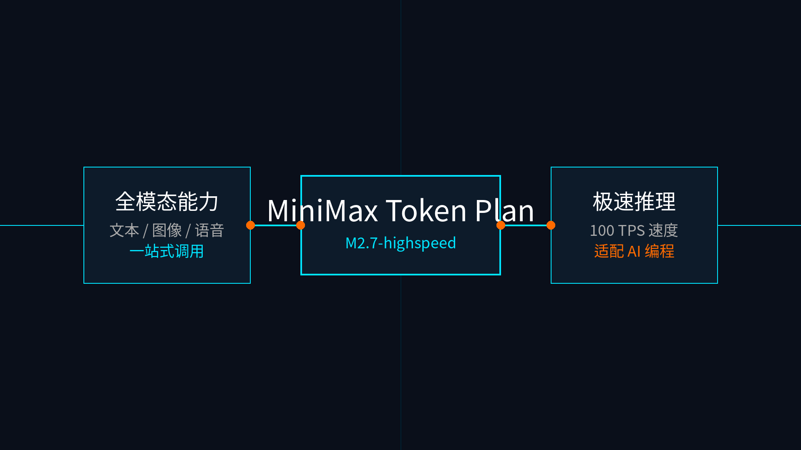

# 05-MiniMax Token Plan

> 🎯 一句话结论：如果你想买的不是“单一文本模型额度”，而是一份能把 M2.7 高速推理与全模态（图像、语音、音乐、视频）一并打通的订阅，MiniMax Token Plan 就是这页要重点看的路线。

## 🚀 接入主线图

先看图，MiniMax Token Plan 的核心卖点不仅是文本模型，而是 `M2.7-highspeed`（极速版）与全模态一站式接口的结合。

## ✨ 这条路适合谁

- 你想先买一份订阅，把 MiniMax 的全模态能力一起拿下
- 你不想只盯着“文本 token 单价”，而是更看重整体可用性与响应速度
- 你希望一个 API Key 就能同时接编程工具和未来的语音、图像能力
- 你要把 Hermes Agent 接起来，且希望走官方内建 provider 路线，而不是自己搞 custom endpoint

## 🧭 你最需要记住的点

如果你只想记住一句话：
- **先看你需要的是不是“极速版”（M2.7-highspeed）**
- **再去 Hermes 里直接把 provider 选定，填入 Token Plan 的 API Key**

### 1. 标准版 vs 极速版
- 标准版使用基础的 `M2.7` 模型。
- 极速版使用 `M2.7-highspeed` 模型，官方称具备近 100 TPS 的极速推理能力，对 AI 编程工具体验提升明显。

### 2. 原生支持
- Hermes 官方已内置 `MiniMax China (mainland China endpoint)`。
- 你不需要当成 OpenAI Compatible 接口配置 base_url，而是直接通过 `hermes model` 选择它。

## ⚠️ 什么时候先别选它

- 你现在只想最低门槛先跑起来，一分钱都不想先预充或订阅（请看按量接口路线）。
- 你更希望使用一个“能在多家不同厂商模型之间来回切换”的聚合池（请看腾讯云或阿里云的套餐）。

## ➡️ 下一步

完成后进入：

- 还没决定时，先回 [国内模型总览](../01-总览.md)
- 如果你已经决定走这条路，在购买 Token Plan 后进入 Token Plan 控制台，获取专用的 API Key（注意区分按量计费 Key 和 Token Plan Key），然后执行 `hermes model` 选择 MiniMax China 即可。

## 📎 官方依据

- https://platform.minimaxi.com/docs/token-plan/intro
- https://platform.minimaxi.com/docs/guides/pricing-tokenplan
- https://hermes-agent.nousresearch.com/docs/integrations/providers
