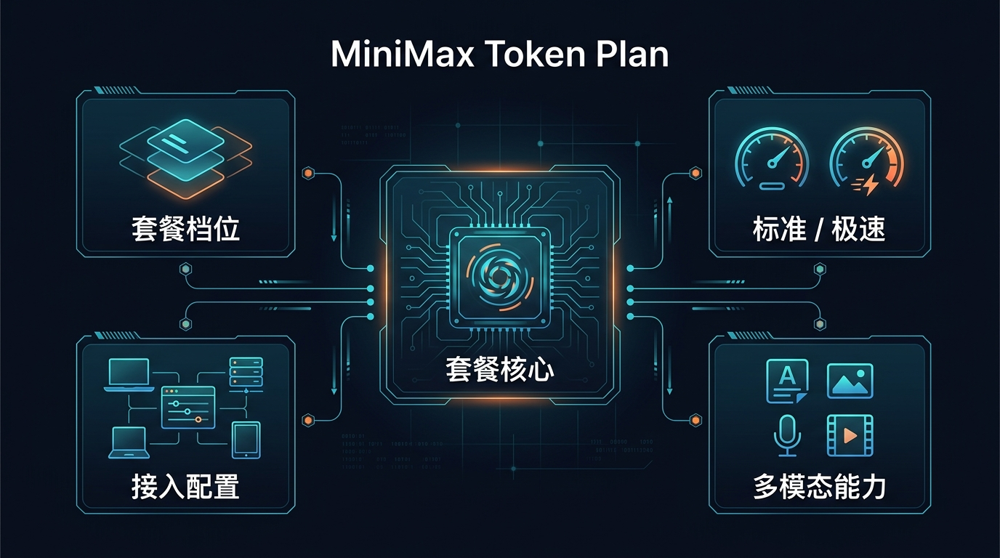
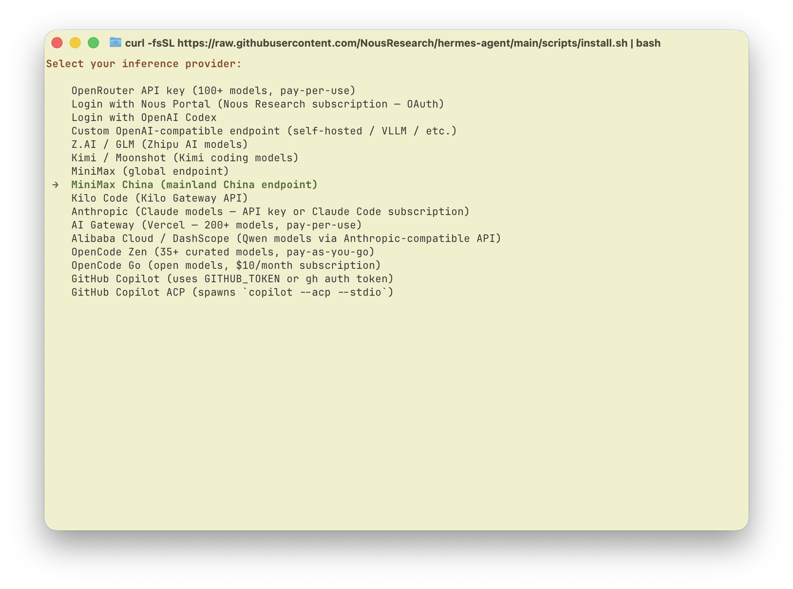
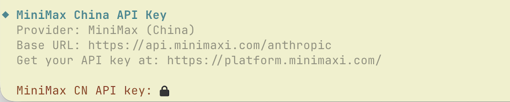
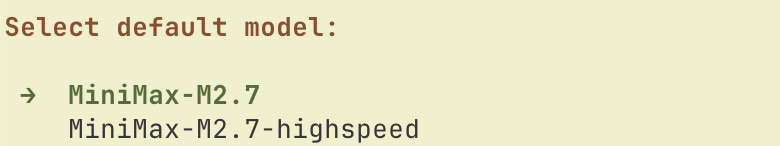

# 05-MiniMax Token Plan

> 🎯 一句话结论：如果你想买的不是“单一文本模型额度”，而是一份能把 M2.7、图像、语音、音乐、视频和 AI 编程工具一起打通的订阅，MiniMax Token Plan 就是这页要重点看的路线。

这一页保留 MiniMax 官方 Hermes Agent 接入主线，但结构上参考了前面几页更好读的写法：先讲适合谁、价格怎么选、它到底强在哪，再讲 Hermes 怎么接。

## 🚀 主线图



## ✨ 这条路适合谁

- 你想先买一份订阅，把 MiniMax 的多模态能力一起拿下
- 你不想只盯着“文本 token 单价”，而是更看重整体可用性
- 你希望一个 API Key 就能接编程工具、MCP、图像和语音能力
- 你已经决定重点看 MiniMax，不想先横跳太多家厂商
- 你要把 Hermes Agent 接起来，而且希望走官方内建 provider 路线

## 🧭 先看最短决策

| 你的情况 | 建议 |
|---|---|
| 先低门槛试用，先把 Hermes 跑通 | Starter |
| 已经进入日常开发使用 | Plus |
| 高频用 AI 编程 / 任务更重 | Max |
| 你最看重速度，愿意直接上高性能档 | Plus-极速版 / Max-极速版 |
| 你是重度团队或超高频使用者 | Ultra-极速版 |

如果你只想记住一句话：

- 先看价格和 5 小时调用额度够不够
- 再看你要不要 `M2.7-highspeed`
- 最后再去 Hermes 里把 provider、API Key、模型选好

## 💰 价格和套餐怎么选

MiniMax 官方订阅页当前把 Token Plan 放成两组套餐：

- 标准版：`Starter / Plus / Max`
- 极速版：`Plus-极速版 / Max-极速版 / Ultra-极速版`

官方订阅页当前默认展示的是“连续包年，立省 2 月”的价格，因此这一页先按官方当前展示价来写；如果你打开官网时切到了包月展示，请以官网实时页面为准。

### 标准版

| 套餐 | 官方当前展示价 | 核心额度 | 适合谁 | 我怎么理解 |
|---|---:|---|---|---|
| Starter | ¥290 / 年 | 600 次模型调用 / 5 小时 | 入门级开发场景 | 先把路跑通，门槛最低 |
| Plus | ¥490 / 年 | 1,500 次模型调用 / 5 小时 | 专业开发场景 | 适合作为个人主力档 |
| Max | ¥1,190 / 年 | 4,500 次模型调用 / 5 小时 | 高级开发 / 高频使用 | 更适合重度日常使用 |

### 极速版

| 套餐 | 官方当前展示价 | 核心额度 | 适合谁 | 我怎么理解 |
|---|---:|---|---|---|
| Plus-极速版 | ¥980 / 年 | 1,500 次 `M2.7-highspeed` 调用 / 5 小时 | 更看重速度的个人开发者 | 速度更强，适合正式高频使用 |
| Max-极速版 | ¥1,990 / 年 | 4,500 次 `M2.7-highspeed` 调用 / 5 小时 | 高频 AI 编程用户 | 兼顾量和速度 |
| Ultra-极速版 | ¥8,990 / 年 | 30,000 次 `M2.7-highspeed` 调用 / 5 小时 | 超高频 / 多 Agent / 团队场景 | 面向最重度生产力使用 |

## 🏆 它的核心优势到底是什么

这一页的核心不是“能不能接通”这么简单，而是：MiniMax Token Plan 到底值不值得单独介绍。官方材料里，它的优势主要集中在下面几件事。

### 1）不是只卖文本，而是卖“全模态一站式”

MiniMax 官方文档把 Token Plan 直接定义为：

- 一个订阅，满足你的所有 AI 需求
- 一个 Key，打通视频、语音、音乐、图像与文本能力

这和前面几页最大的区别在于：

- 阿里云百炼更像“多模型聚合入口”
- 腾讯云 Token Plan 更像“云生态统一订阅”
- GLM Coding Plan 更偏“单厂商编码计划”
- MiniMax Token Plan 的核心卖点更明显落在“全模态 + AI 编程工具 + 单 Key 统一使用”

### 2）M2.7 / M2.7-highspeed 是这页的主角

官方页面明确把 MiniMax-M2.7 作为主模型，把 `M2.7-highspeed` 作为更高性能路线来推。

你可以直接把它理解成两条主线：

- 标准版：优先用 `MiniMax-M2.7`
- 极速版：优先用 `MiniMax-M2.7-highspeed`

官方页面给出的优势描述包括：

- `M2.7-highspeed` 约 100 TPS 极速推理
- 同类产品 3 倍生成速度（官方订阅页原文）
- 所有方案都搭载最新 MiniMax M2.7 模型

如果你最关心的是“速度是不是够快”，那 MiniMax 这一页比前面几条路线更应该把极速版讲清楚。

### 3）固定订阅费，主打“成本可控”

官方文档把这条路线的价值直接写成：

- 极具性价比
- 固定订阅费即可获得大量用量额度
- 覆盖多种支持的模型，减少账单焦虑

订阅页首页还直接写了：

- `1小时1美金，成本不再是问题`

所以这页必须把“价格 + 优势”前置，而不是只写接入命令。

### 4）对 AI 编程工具很友好

官方订阅页明确写了：

- `10+ 工具已适配，一站式开发`
- 支持主流的编程工具，并持续扩展中
- 支持图像理解、联网搜索 MCP

当前官方页能直接看到的工具包括：

- Claude Code
- OpenCode
- Cursor
- TRAE
- Kilo Code
- Cline
- Codex CLI
- Grok CLI
- Droid
- Roo Code
- Hermes Agent

对 Hermes 用户来说，这一点很重要：

- 这不是一条只适合官网 Demo 的订阅
- 它本身就把“编程工具使用场景”当成重点能力在卖

## 🔍 用量结构有什么特别之处

MiniMax 官方文档里，对 Token Plan 的额度说明不是传统“统一 token 池”说法，而是按模型类型分别计算：

- `M2.7 / M2.7-highspeed`：按请求次数计算，且每 5 小时滚动重置
- 其他模型（语音、视频、音乐、图像）：按每日配额计算，每日重置

这意味着你在评估 MiniMax 时，不能只问“总 token 多少”，而应该问：

- 我的主场景是不是 M2.7 编程与文本任务
- 我会不会同时用到图像、语音、音乐、视频
- 我要不要为了 `highspeed` 速度去买极速版

## 🧰 Hermes 怎么接 MiniMax Token Plan

这里继续按 MiniMax 官方 Hermes Agent 文章主线来走。

### 1）前提条件

开始前先确认两件事：

- 你已经订阅了 MiniMax Token Plan
- 你有一台可访问终端的电脑（macOS、Linux 或 Windows WSL2）

### 2）安装 Hermes Agent

如果你还没装 Hermes，先执行：

```bash
curl -fsSL https://raw.githubusercontent.com/NousResearch/hermes-agent/main/scripts/install.sh | bash
```

安装后先验证：

```bash
hermes doctor
```

### 3）运行模型选择器

然后执行：

```bash
hermes model
```

进入 provider 列表后，选择：

- `MiniMax China (mainland China endpoint)`

下面这张图，就是 MiniMax 官方 Hermes Agent 文档里的 provider 选择界面：



### 4）输入 Token Plan API Key

接下来输入你从 Token Plan 页面拿到的：

- `Token Plan API Key`

注意这里最容易搞错的一点：

- Token Plan API Key
- 不等于按量付费 API Key

MiniMax 官方 Hermes 文档里，对应字段如下：



### 5）选择 MiniMax-M2.7

输入 Key 后，继续选择模型：

- `MiniMax-M2.7`

官方页面给出的模型选择界面如下：



如果你只是先把路线跑通，建议先从 `MiniMax-M2.7` 开始；等你已经明确更看重速度时，再考虑切到 `MiniMax-M2.7-highspeed` 对应的极速版节奏。

### 6）开始使用

配置完成后直接运行：

```bash
hermes
```

如果你能正常进入会话，而且没有继续提示 provider / API Key 错误，基本就说明这条路已经接通。

## ✅ 这页对 MiniMax 的默认建议

如果你问我：MiniMax Token Plan 这一页最该强调什么？

我的结论是：

- 不是先强调“命令怎么敲”
- 而是先强调“为什么它值得单独买”

对比前面几页后，MiniMax 这页最应该突出的差异化卖点就是：

- 价格和套餐层次清楚
- 全模态能力不是附加项，而是主卖点
- `M2.7 / M2.7-highspeed` 的标准版 / 极速版分层非常明确
- 一个 Key 就能覆盖编程工具与多模态能力

如果你是下面这类人，MiniMax Token Plan 值得优先看：

- 想把 AI 编程和多模态能力一起买下
- 不想拆多套订阅
- 对速度和体验有明确要求
- 准备把 Hermes 当成长期工作流入口

## ⚠️ 常见问题

### 1. 这一页为什么要把价格写这么前？

因为 MiniMax 官方首页本身就在卖“套餐 + 额度 + 优势”，而不是只卖一个 API 接入步骤。

如果不把价格和优势前置，这页就会失去 Token Plan 页面最核心的价值表达。

### 2. 我应该先选标准版还是极速版？

- 先跑通：标准版更稳
- 更看重速度：直接看极速版
- 高频任务明显增多：优先看 `Max` 或 `Max-极速版`

### 3. 为什么这一页要单独强调全模态？

因为这是 MiniMax Token Plan 跟前面几条路线最明显的差异之一。官方文档明确写的是：在一个订阅下覆盖文本、语音、图像、音乐、视频，而不是只做单模态调用。

### 4. Hermes 接入时最容易错什么？

最容易错的是把：

- `Token Plan API Key`

和：

- 按量计费 API Key

混在一起。

如果 Key 拿错，后面即使 provider 选对了，也可能配不通。

## ➡️ 下一步

完成后进入：

- 如果你想继续看下一条路线，继续看 [06-Kimi登月计划](./06-Kimi登月计划.md)
- 如果你还在横向比较，回 [国内模型总览](../01-总览.md)

## 📎 官方依据

- https://platform.minimaxi.com/subscribe/token-plan
- https://platform.minimaxi.com/docs/token-plan/intro
- https://platform.minimaxi.com/docs/token-plan/hermes-agent
- https://platform.minimaxi.com/docs/token-plan/faq
- https://hermes-agent.nousresearch.com/docs/integrations/providers
- https://hermes-agent.nousresearch.com/docs/reference/cli-commands
