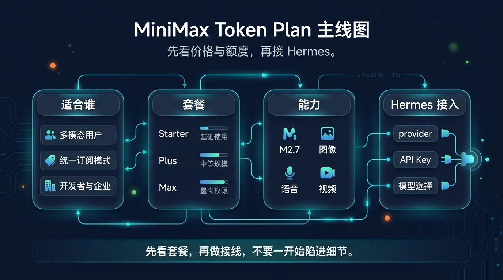
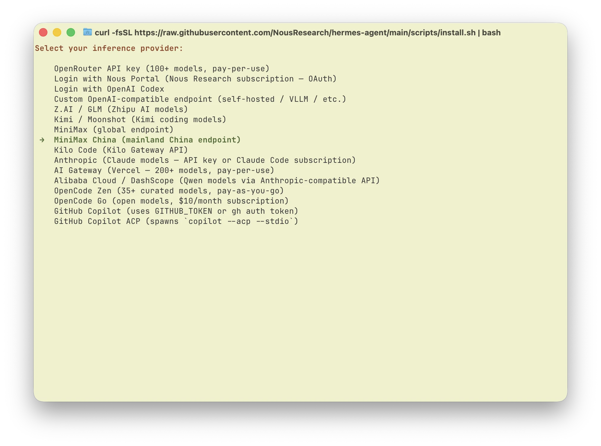
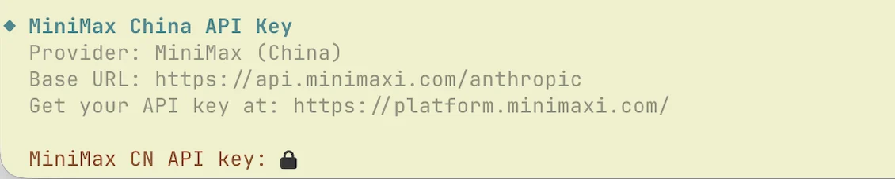
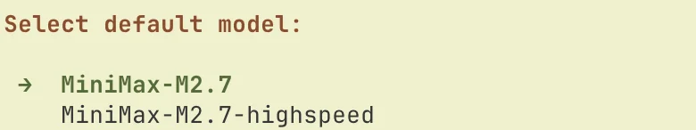

# 05-MiniMax Token Plan

> 🎯 一句话先说清楚：如果你想买的不只是文本能力，而是一份能把 MiniMax 的 M2.7、图像、语音、音乐、视频和开发工具一起打通的订阅，那么 MiniMax Token Plan 值得单独看。

这一页只解决一件事：帮你判断 MiniMax Token Plan 值不值得买，以及怎么按 Hermes 原生 `MiniMax China` provider 路线把它接起来。

这一页先不解决：
- 最低门槛按量起步应该选哪条路
- 统一聚合套餐该选阿里云还是腾讯云
- 你已经有 OneAPI / NewAPI / LM Studio / Ollama 时该怎么复用兼容层

## 🔎 搜索收录速答

MiniMax Token Plan 更适合重视中文长文本、角色对话或内容生成场景的 Hermes 用户。接入时先确认套餐模型名、兼容 endpoint、上下文长度和计费规则，再把它作为 Hermes 的一个独立 provider 验证。若目标是代码或通用 Agent，可以继续比较[智谱 GLM Coding Plan](/docs/china/models/glm-coding-plan)、[腾讯云 Token Plan](/docs/china/models/tencent-token-plan)和[阿里云百炼 Token Plan](/docs/china/models/alibaba-bailian-token-plan)。


## 🚀 先看主线



这张图只想帮你先抓住 4 个点：
- 这是一条“全模态订阅 + 官方原生 provider”路线
- 标准版和极速版要分开看
- 真正要跑通的是「选套餐 → 拿 Token Plan API Key → `hermes model` 选 MiniMax China → 做最小验证」
- 这页适合已经明确要重点看 MiniMax 的人，不适合第一次试跑的人

如果你现在更想先少花钱、少做选择、先验证 Hermes 能不能通，优先回看 [07-DeepSeek按量计费接口](./07-DeepSeek按量计费接口.md)。

## ✨ 这条路最适合谁

- 你想买一份订阅，把文本、图像、语音、音乐、视频和编程工具一起纳入同一个体系
- 你已经决定重点看 MiniMax，不想再在多家厂商之间来回横跳
- 你想走 Hermes 原生 provider 路线，而不是自己维护一层 custom endpoint
- 你更关心“整体可用性 + 固定订阅费”，而不是只比较文本 token 单价
- 你会长期在 AI 编程工具和多模态场景里一起使用这套能力

## 🧭 先按你的当前状态分流

| 你的当前情况 | 直接建议 |
|---|---|
| 我只想先最低门槛把 Hermes 跑起来 | 先回看 [07-DeepSeek按量计费接口](./07-DeepSeek按量计费接口.md) |
| 我已经认准 MiniMax | 留在这页继续 |
| 我更想先买统一多模型入口 | 先回看 [02-阿里云百炼 Token Plan](<./02-%E9%98%BF%E9%87%8C%E4%BA%91%E7%99%BE%E7%82%BCToken%20plan.md>) 或 [03-腾讯云 Token Plan](<./03-%E8%85%BE%E8%AE%AF%E4%BA%91Token%20Plan.md>) |
| 我已经有稳定兼容层 | 优先看 [08-自定义兼容接口](./08-自定义兼容接口.md) |

如果你只记一句话：
- 认准 MiniMax，并且要多模态订阅 + 原生 provider → 看这页
- 只是想先试跑 Hermes → 不要先在这页做复杂套餐决策

## 💰 先看价格和套餐，再决定值不值得买

MiniMax 官方当前把 Token Plan 分成两组：
- 标准版：`Starter / Plus / Max`
- 极速版：`Plus-极速版 / Max-极速版 / Ultra-极速版`

官方页面当前默认展示的是连续包年价格；如果你看到的界面切到了别的展示方式，请以官网实时页面为准。

### 标准版

| 套餐 | 官方当前展示价 | 核心额度 | 适合谁 | 我怎么理解 |
|---|---:|---|---|---|
| Starter | ¥290 / 年 | 600 次模型调用 / 5 小时 | 入门级开发 | 门槛最低 |
| Plus | ¥490 / 年 | 1,500 次模型调用 / 5 小时 | 专业开发场景 | 最适合作为个人主力 |
| Max | ¥1,190 / 年 | 4,500 次模型调用 / 5 小时 | 高频使用 | 更适合作为高频主力 |

### 极速版

| 套餐 | 官方当前展示价 | 核心额度 | 适合谁 | 我怎么理解 |
|---|---:|---|---|---|
| Plus-极速版 | ¥980 / 年 | 1,500 次 `M2.7-highspeed` 调用 / 5 小时 | 更看重速度的个人开发者 | 强调更快响应 |
| Max-极速版 | ¥1,990 / 年 | 4,500 次 `M2.7-highspeed` 调用 / 5 小时 | 高频 AI 编程用户 | 量和速度更平衡 |
| Ultra-极速版 | ¥8,990 / 年 | 30,000 次 `M2.7-highspeed` 调用 / 5 小时 | 超高频 / 团队场景 | 面向最重度使用 |

### 这页该怎么判断套餐

最直接的判断方式不是先比较绝对低价，而是先问三件事：
- 你是不是要把 MiniMax 当长期主力厂商
- 你是不是会同时用到文本之外的多模态能力
- 你是不是需要 `M2.7-highspeed` 这种“明确更快”的路线

如果答案都是“是”，这页值得继续；如果还没到这个阶段，先回按量页通常更轻。

## 🤖 它为什么值得单独看

### 1）它卖的不是单一文本模型，而是“全模态统一订阅”

官方材料把这条路线直接定义为：
- 一个订阅满足多种 AI 需求
- 一个 Key 打通视频、语音、音乐、图像与文本能力

这和其他页最大的区别是：
- 阿里云 / 腾讯云更偏统一入口
- GLM / Kimi 更偏单厂商编码路线
- MiniMax 的主卖点更明确落在“全模态 + 工具接入 + 单 Key 统一使用”

### 2）`M2.7` 和 `M2.7-highspeed` 才是这页真正要分清的两条线

你可以先把它理解成：
- 标准版：优先围绕 `MiniMax-M2.7`
- 极速版：优先围绕 `MiniMax-M2.7-highspeed`

如果你最关心“速度是不是足够快”，这页就必须把极速版讲清楚。

### 3）Hermes 已原生支持 `MiniMax China`

Hermes 官方 provider 文档已经明确列出：
- 环境变量：`MINIMAX_CN_API_KEY`
- provider：`minimax-cn`

这意味着：
- 不需要先把 MiniMax 包成 custom endpoint
- 直接按原生 provider 路线理解即可
- 整个接入过程会比兼容层更短、更容易排错

## 🧰 怎么把 MiniMax Token Plan 接进 Hermes

这里继续按 MiniMax 官方 Hermes 文章主线来走：
- 先订阅 Token Plan
- 再拿 Token Plan API Key
- 再在 Hermes 里选 `MiniMax China`
- 再做最小验证

### Step 1. 先确认你要走的是 MiniMax 原生 provider 路线

现在做什么：
- 先确认你接的是 MiniMax 官方 Token Plan，而不是第三方兼容层

为什么做：
- 因为这页讲的是 `MiniMax China` 原生 provider，不是自定义 endpoint

怎么做：
- 如果你手上是 Token Plan 官方 Key，就留在这页继续
- 如果你手上是第三方网关地址或聚合层，优先看 [08-自定义兼容接口](./08-自定义兼容接口.md)

看到什么算成功：
- 你已经明确这页主线是原生 provider，而不是兼容层

失败先查什么：
- 如果你一直在想 base_url 怎么填，说明你更像兼容层场景

### Step 2. 拿到 Token Plan API Key

现在做什么：
- 从 Token Plan 页面获取这条订阅对应的 API Key

为什么做：
- 因为 Hermes 后面读取的就是这把 Token Plan Key，不是按量付费 API Key

怎么做：
- 完成订阅
- 进入官方页面复制 Token Plan API Key
- 保存好这把 Key

看到什么算成功：
- 你已经拿到 Token Plan API Key

失败先查什么：
- 是否把 Token Plan API Key 和按量付费 API Key 搞混
- 是否还没真正开通订阅

### Step 3. 用 `hermes model` 选择 `MiniMax China`

现在做什么：
- 在 Hermes 里切到 MiniMax 中国大陆 provider

为什么做：
- 只有 provider 真正切过去，后面的会话才会走 MiniMax Token Plan

怎么做：
- 执行：

```bash
hermes model
```

- 在 provider 列表里选择：
  - `MiniMax China (mainland China endpoint)`

官方文档截图里的 provider 选择界面如下：



看到什么算成功：
- Hermes 已经切到 `MiniMax China`

失败先查什么：
- 是否还停留在别的 provider 上
- 是否误选成非中国大陆线路

### Step 4. 输入 Token Plan API Key

现在做什么：
- 把 Token Plan API Key 填进 MiniMax China provider

为什么做：
- 因为没有这把正确的 Key，provider 虽然选对了，也无法真正连通

怎么做：
- 在 provider 设置流程里输入你的 Token Plan API Key

官方依据截图里的关键字段如下：



看到什么算成功：
- Hermes 已正确保存当前 Key

失败先查什么：
- 是否填成了按量付费 Key
- 是否复制时混入了空格或残缺值

### Step 5. 先选择 `MiniMax-M2.7` 做最小验证

现在做什么：
- 先选一个最稳的默认文本模型做第一轮验证

为什么做：
- 因为先证明基本文本链路可用，比一开始就追速度档更重要

怎么做：
- 模型列表里先选：
  - `MiniMax-M2.7`

官方模型选择界面如下：



- 选完后启动 Hermes，先发一条最简单的问题

看到什么算成功：
- Hermes 能正常进入会话
- 不再提示 provider / API Key 错误
- `MiniMax-M2.7` 能稳定返回第一条回复

失败先查什么：
- provider 是否真切到 `MiniMax China`
- Token Plan API Key 是否正确
- 模型是否选到当前套餐不可用或不对应的线路

## ❓FAQ

### 1. 这页为什么不是默认起步页？

因为这页默认你已经认准 MiniMax，并接受“订阅 + 多模态 + 具体套餐层级”这组决策。

如果你只是想先跑通 Hermes，按量页通常更轻。

### 2. 这页最容易搞错的地方是什么？

最常见的错误就是把：
- Token Plan API Key
- 按量付费 API Key

混成一回事。

### 3. 为什么建议先从 `MiniMax-M2.7` 开始，而不是一上来就极速版？

因为这页的第一目标是先把链路跑通；速度升级应该发生在链路稳定之后。

## ⚠️ 风险点与默认建议

### 风险点
- 其实只想先跑通 Hermes，却过早进入多模态订阅决策
- 把 Token Plan API Key 和按量付费 API Key 搞混
- 一上来就想测试极速版，而不是先做最小验证

### 默认建议
- 如果你已经认准 MiniMax，再看这页最值
- 默认先走 `MiniMax China` 原生 provider
- 默认先用 `MiniMax-M2.7` 做第一轮验证，跑通后再考虑极速版

## ➡️ 下一步

完成后进入：
- [06-Kimi登月计划](./06-Kimi登月计划.md)

如果你想先回到上一阶段入口重新确认位置：
- [02-国内模型总览](./01-总览.md)

## 📎 官方依据

- https://hermes-agent.nousresearch.com/docs/integrations/providers
- https://www.minimax.io/
- https://www.minimax.io/platform/

## 🧾 R2 官方同步记录

- source_id: `minimax`
- checked_at: `2026-05-02`
- change_type: `official-source-confirmation`
- affected_doc: `docs/03-国内落地/02-国内模型/05-MiniMax Token Plan.md`
- 本轮结论：已确认 Token Plan quickstart、API Key 获取、Anthropic 推荐端点和 OpenAI-compatible 文本接口；页面保留“以官方模型/额度页为准”。
- 后续规则：涉及价格、套餐、可用模型、控制台按钮和额度限制时，仍以厂商官方页面实时显示为准，不在本文复制长期易变表格。
- 官方来源：
  - https://platform.minimax.io/docs/token-plan/quickstart
  - https://platform.minimax.io/docs/guides/quickstart-preparation
  - https://platform.minimax.io/docs/api-reference/text-openai-api

---

## 🔗 模型接入关联路径

- 还没部署 Hermes：先回到[国内部署](/docs/china/deploy)确认服务器和远程环境。
- 要换国内模型：优先比较[智谱 GLM](/docs/china/models/glm-coding-plan)、[腾讯云](/docs/china/models/tencent-token-plan)和[阿里云百炼](/docs/china/models/alibaba-bailian-token-plan)。
- 使用非内置平台：看[自定义兼容接口](/docs/china/models/openai-compatible-endpoint)，再对照[模型 Provider 与自定义 endpoint 问题](/docs/issues/provider-endpoint)。
- 要查环境变量和配置项：进入[环境变量参考](/docs/reference/environment-variables)和[Profile 命令参考](/docs/reference/profile-commands)。
