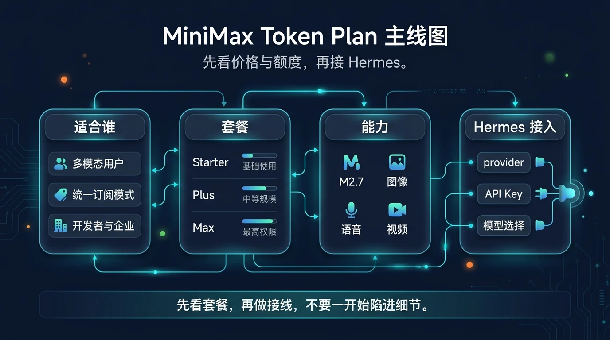
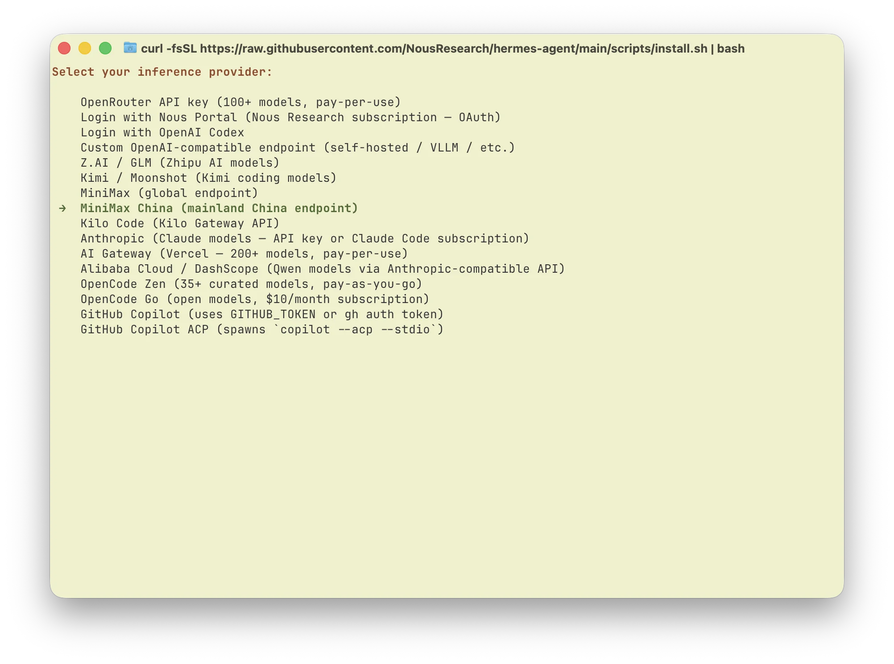
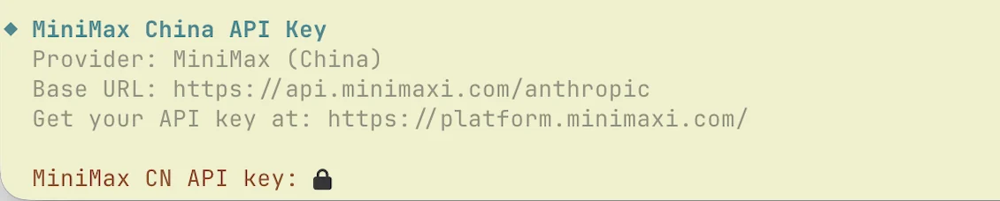
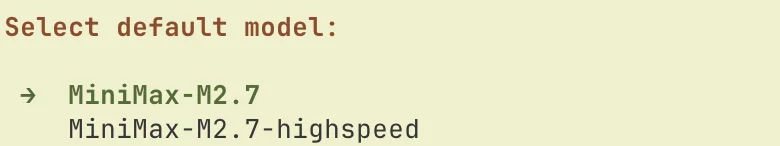

---
quick_reference:
  - checkedAt: '2026-10-03'
    hermesVersion: v2026.9.24
    verification: docs-reviewed
    kind: model
    id: minimax-token-plan-cn-native
    vendor: MiniMax
    product: Token Plan（订阅 Key）
    region: 中国区
    connection: native
    provider: minimax-cn
    protocol: anthropic
    endpoint: 'https://api.minimax.cn/anthropic'
    modelIds:
      - MiniMax-M3
      - MiniMax-M2.7
    permissions: 使用有订阅席位或积分权限的订阅 Key，与普通按量 Key 分开。额度受 5 小时与周窗口限制，有积分时可覆盖合规超额；当前官方 endpoint 与固定版默认地址不同，原生路线须显式覆盖。
    configExample: |-
      hermes config set model.provider minimax-cn
      hermes config unset model.base_url
      hermes config set MINIMAX_CN_BASE_URL https://api.minimax.cn/anthropic
      hermes config set model.api_mode anthropic_messages
      hermes config set MINIMAX_CN_API_KEY "<YOUR_API_KEY>"
      hermes config set model.default MiniMax-M3
    diagnostics:
      - /docs/issues/provider-endpoint
    sources:
      - url: 'https://platform.minimax.cn/docs/token-plan/hermes-agent'
      - url: 'https://platform.minimax.cn/docs/api-reference/text-chat-anthropic'
      - url: 'https://platform.minimax.cn/docs/token-plan/faq'
      - url: 'https://platform.minimax.cn/docs/guides/pricing-token-plan'
      - url: 'https://raw.githubusercontent.com/NousResearch/hermes-agent/v2026.9.24/hermes_cli/auth.py'
        revision: v2026.9.24
  - checkedAt: '2026-10-03'
    hermesVersion: v2026.9.24
    verification: docs-reviewed
    kind: model
    id: minimax-token-plan-cn-compatible
    vendor: MiniMax
    product: Token Plan（订阅 Key）
    region: 中国区
    connection: compatible
    provider: custom
    protocol: anthropic
    endpoint: 'https://api.minimax.cn/anthropic'
    modelIds:
      - MiniMax-M3
      - MiniMax-M2.7
    permissions: 使用有订阅席位或积分权限的订阅 Key，与普通按量 Key 分开。额度受 5 小时与周窗口限制，有积分时可覆盖合规超额；当前官方 endpoint 与固定版默认地址不同，原生路线须显式覆盖。
    configExample: |-
      hermes config set model.provider custom
      hermes config set model.base_url https://api.minimax.cn/anthropic
      hermes config set model.api_mode anthropic_messages
      hermes config set model.api_key "<YOUR_API_KEY>"
      hermes config set model.default MiniMax-M3
    diagnostics:
      - /docs/issues/provider-endpoint
    sources:
      - url: 'https://platform.minimax.cn/docs/token-plan/hermes-agent'
      - url: 'https://platform.minimax.cn/docs/api-reference/text-chat-anthropic'
      - url: 'https://platform.minimax.cn/docs/token-plan/faq'
      - url: 'https://platform.minimax.cn/docs/guides/pricing-token-plan'
      - url: 'https://raw.githubusercontent.com/NousResearch/hermes-agent/v2026.9.24/hermes_cli/auth.py'
        revision: v2026.9.24
      - url: 'https://github.com/NousResearch/hermes-agent/blob/v2026.9.24/website/docs/integrations/providers.md'
        revision: v2026.9.24
---
# 05-MiniMax Token Plan

> 速查核验（2026-10-03）：本次读取的[官方 Messages API](https://platform.minimax.cn/docs/api-reference/text-chat-anthropic)使用 `https://api.minimax.cn/anthropic`；固定 Hermes 注册默认地址仍为 `https://api.minimaxi.com/anthropic`。速查采用官方当前地址，原生配置显式写入 `MINIMAX_CN_BASE_URL`，不把旧默认地址当作本次已验证 endpoint。

内容更新：2026-10-03（同源配置迁移）；原教程复核日期：2026-09-30；速查条目核验日期见配置卡。接入配置对照 Hermes 稳定标签 v2026.9.24；厂商模型与套餐按下列官方来源复核。未调用 API、购买套餐或完成桌面安装实测。

> 🎯 一句话先说清楚：如果你想买的不只是文本能力，而是一份能把 MiniMax 的 M2.7、图像、语音、音乐、视频和开发工具一起打通的订阅，那么 MiniMax Token Plan 值得单独看。

这一页只解决一件事：帮你判断 MiniMax Token Plan 值不值得买，以及怎么按 Hermes 原生 `MiniMax China` provider 路线把它接起来。

这一页先不解决：
- 最低门槛按量起步应该选哪条路
- 统一聚合套餐该选阿里云还是腾讯云
- 你已经有 OneAPI / NewAPI / LM Studio / Ollama 时该怎么复用兼容层

## 🔎 搜索收录速答

MiniMax Token Plan 更适合重视中文长文本、角色对话或内容生成场景的 Hermes 用户。接入时先确认套餐模型名、兼容 endpoint、上下文长度和计费规则，再把它作为 Hermes 的一个独立 provider 验证。若目标是代码或通用 Agent，可以继续比较[智谱 GLM Coding Plan](/docs/china/models/glm-coding-plan)。


## 🚀 先看主线



这张图只想帮你先抓住 4 个点：
- 这是一条“模型订阅 + 官方原生 provider”路线
- 标准版和极速版要分开看
- 真正要跑通的是「选套餐 → 拿 Token Plan API Key → `hermes model` 选 MiniMax China → 做最小验证」
- 这页适合已经明确要重点看 MiniMax 的人，不适合第一次试跑的人

如果你现在更想先少花钱、少做选择、先验证 Hermes 能不能通，优先回看 [07-DeepSeek按量计费接口](./07-DeepSeek按量计费接口.md)。

## ✨ 这条路最适合谁

- 你想买一份订阅，把文本、图像、语音、音乐、视频和编程工具一起纳入同一个体系
- 你已经决定重点看 MiniMax，不想再在多家厂商之间来回横跳
- 你想走 Hermes 原生 provider 路线，而不是自己维护一层 custom endpoint
- 你更关心“整体可用性 + 固定订阅费”，而不是只比较文本 token 单价
- 你会长期在 AI 编程工具和多模态场景里一起使用这套能力

## 🧭 先按你的当前状态分流

| 你的当前情况 | 直接建议 |
|---|---|
| 我只想先最低门槛把 Hermes 跑起来 | 先回看 [07-DeepSeek按量计费接口](./07-DeepSeek按量计费接口.md) |
| 我已经认准 MiniMax | 留在这页继续 |
| 我更想先买统一多模型入口 | 先回到 [02-国内模型总览](./01-总览.md)按模型覆盖和接入方式重新选择 |
| 我已经有稳定兼容层 | 优先看 [08-自定义兼容接口](./08-自定义兼容接口.md) |

如果你只记一句话：
- 认准 MiniMax，并且要套餐 + 原生 provider → 看这页
- 只是想先试跑 Hermes → 不要先在这页做复杂套餐决策

## 💰 新购套餐与模型

截至 2026-09-30，新购 Token Plan 月费为 Plus ¥49、Max ¥119、Ultra ¥469，使用 5 小时和周额度窗口；实际额度与可用模型以订阅页为准。旧版 Starter/Plus/Max 与极速六档年费表不再作为新购建议，老订阅的迁移权益要在账户单独确认。

已核验的稳定文本模型 ID 见[本页同源模型配置卡](/docs/china/models/minimax-token-plan#model-quick-reference)；`MiniMax-M3.1-Flash-Preview` 是预览模型，单独核对账户权限，不写成稳定默认菜单。自 **2026-08-20** 起音乐不属于 Token Plan，不能继续声称一个套餐覆盖音乐、视频等所有模态。

## 🌏 中国区与国际区 endpoint

当前可复制的中国区 provider、密钥字段与 endpoint 见[本页同源模型配置卡](/docs/china/models/minimax-token-plan#model-quick-reference)。稳定标签默认地址与官网当前地址不同，见页首说明；旧域名不能仅因文档换域就宣称失效。国际 provider/Key 与中国区分开，不将国内套餐接到国际 endpoint。

> 本页配图保留旧界面用于辨认 provider 和 Key 输入位置，图中的旧模型选项不代表当前 M3 目录；填写 ID 以下文文字和官方模型表为准。

## 🧰 怎么把 MiniMax Token Plan 接进 Hermes

这里继续按 MiniMax 官方 Hermes 文章主线来走：
- 先订阅 Token Plan
- 再拿 Token Plan API Key
- 再在 Hermes 里选 `MiniMax China`
- 再做最小验证

### Step 1. 先确认你要走的是 MiniMax 原生 provider 路线

现在做什么：
- 先确认你接的是 MiniMax 官方 Token Plan，而不是第三方兼容层

为什么做：
- 因为这页讲的是 `MiniMax China` 原生 provider，不是自定义 endpoint

怎么做：
- 如果你手上是 Token Plan 官方 Key，就留在这页继续
- 如果你手上是第三方网关地址或聚合层，优先看 [08-自定义兼容接口](./08-自定义兼容接口.md)

看到什么算成功：
- 你已经明确这页主线是原生 provider，而不是兼容层

失败先查什么：
- 如果你一直在想 base_url 怎么填，说明你更像兼容层场景

### Step 2. 拿到 Token Plan API Key

现在做什么：
- 从 Token Plan 页面获取这条订阅对应的 API Key

为什么做：
- 因为 Hermes 后面读取的就是这把 Token Plan Key，不是按量付费 API Key

怎么做：
- 完成订阅
- 进入官方页面复制 Token Plan API Key
- 保存好这把 Key

看到什么算成功：
- 你已经拿到 Token Plan API Key

失败先查什么：
- 是否把 Token Plan API Key 和按量付费 API Key 搞混
- 是否还没真正开通订阅

### Step 3. 用 `hermes model` 选择 `MiniMax China`

现在做什么：
- 在 Hermes 里切到 MiniMax 中国大陆 provider

为什么做：
- 只有 provider 真正切过去，后面的会话才会走 MiniMax Token Plan

怎么做：
- 执行：

```bash
hermes model
```

- 在 provider 列表中按[本页同源模型配置卡](/docs/china/models/minimax-token-plan#model-quick-reference)选择中国区路线；菜单配置后核对卡中显式 endpoint 覆盖，避免遗留默认地址。

官方文档截图里的 provider 选择界面如下：



看到什么算成功：
- Hermes 已经切到 `MiniMax China`

失败先查什么：
- 是否还停留在别的 provider 上
- 是否误选成非中国大陆线路

### Step 4. 输入 Token Plan API Key

现在做什么：
- 把 Token Plan API Key 填进 MiniMax China provider

为什么做：
- 因为没有这把正确的 Key，provider 虽然选对了，也无法真正连通

怎么做：
- 在 provider 设置流程里输入你的 Token Plan API Key

官方依据截图里的关键字段如下：



看到什么算成功：
- Hermes 已正确保存当前 Key

失败先查什么：
- 是否填成了按量付费 Key
- 是否复制时混入了空格或残缺值

### Step 5. 先选择 `MiniMax-M3` 做最小验证

现在做什么：
- 先选一个最稳的默认文本模型做第一轮验证

为什么做：
- 因为先证明基本文本链路可用，比一开始就追速度档更重要

怎么做：
- 模型列表里先选：
  - `MiniMax-M3`

官方模型选择界面如下：



- 选完后启动 Hermes，先发一条最简单的问题

看到什么算成功：
- Hermes 能正常进入会话
- 不再提示 provider / API Key 错误
- `MiniMax-M3` 能稳定返回第一条回复

失败先查什么：
- provider 是否真切到 `MiniMax China`
- Token Plan API Key 是否正确
- 模型是否选到当前套餐不可用或不对应的线路

## ❓FAQ

### 1. 这页为什么不是默认起步页？

因为这页默认你已经认准 MiniMax，并接受“订阅 + 多模态 + 具体套餐层级”这组决策。

如果你只是想先跑通 Hermes，按量页通常更轻。

### 2. 这页最容易搞错的地方是什么？

最常见的错误就是把：
- Token Plan API Key
- 按量付费 API Key

混成一回事。

### 3. 为什么建议先从 `MiniMax-M3` 开始，而不是一上来就极速版？

因为这页的第一目标是先把链路跑通；速度升级应该发生在链路稳定之后。

## ⚠️ 风险点与默认建议

### 风险点
- 其实只想先跑通 Hermes，却过早进入套餐决策
- 把 Token Plan API Key 和按量付费 API Key 搞混
- 一上来就想测试极速版，而不是先做最小验证

### 默认建议
- 如果你已经认准 MiniMax，再看这页最值
- 默认先走 `MiniMax China` 原生 provider
- 默认先用 `MiniMax-M3` 做第一轮验证，跑通后再考虑极速版

## 🖥️ 桌面短配置卡

1. 先在[本页同源模型配置卡](/docs/china/models/minimax-token-plan#model-quick-reference)确认产品、区域、接入方式与对应密钥字段，再选择同一条路线。
2. 打开 **Settings → Model** 设置当前 profile 默认模型，填[本页同源模型配置卡](/docs/china/models/minimax-token-plan#model-quick-reference)中的精确模型 ID。聊天输入框的模型选择只用于当前聊天，不能用它代替默认模型验收；首次选择及持久化行为以对应版本为准。
3. 若菜单没有模型，使用手动 ID 入口；空目录行为有版本差异，见[桌面教程](/docs/start/personalize/desktop-app)。远端连接时核对服务实际运行的 profile 和凭据位置。
4. 自行发送一条短问答，再执行一个只读取测试文件的工具任务；核对实际 provider、模型、结果及厂商用量记录。**Test、问答和工具任务会发请求，可能收费**，点击前确认余额与套餐允许的用法。
5. 本页只完成文档与源码复核，未进行真实 API、桌面安装或国内网络测试；保存配置或显示连接成功不等于任务和计费路线验证通过。

## 📚 本次复核来源

- [官方 Hermes 配置](https://platform.minimax.cn/docs/token-plan/hermes-agent)
- [套餐价格](https://platform.minimax.cn/docs/guides/pricing-token-plan)
- [套餐范围与 FAQ](https://platform.minimax.cn/docs/token-plan/faq)
- [Anthropic 接口](https://platform.minimax.cn/docs/api-reference/text-anthropic-api)
- [Hermes 稳定 Provider 文档](https://github.com/NousResearch/hermes-agent/blob/v2026.9.24/website/docs/integrations/providers.md)
- [稳定凭据注册与覆盖变量](https://github.com/NousResearch/hermes-agent/blob/v2026.9.24/hermes_cli/auth.py)

## ➡️ 下一步

完成后进入：
- [06-Kimi登月计划](./06-Kimi登月计划.md)

如果你想先回到上一阶段入口重新确认位置：
- [02-国内模型总览](./01-总览.md)

## 📎 官方依据

- https://hermes-agent.nousresearch.com/docs/integrations/providers
- https://www.minimax.io/
- https://www.minimax.io/platform/

## 🧾 R2 官方同步记录

- source_id: `minimax`
- checked_at: `2026-09-30`
- change_type: `official-source-confirmation`
- affected_doc: `docs/03-国内落地/02-国内模型/05-MiniMax Token Plan.md`
- 本轮结论：已确认 Token Plan quickstart、API Key 获取、Anthropic 推荐端点和 OpenAI-compatible 文本接口；页面保留“以官方模型/额度页为准”。
- 后续规则：涉及价格、套餐、可用模型、控制台按钮和额度限制时，仍以厂商官方页面实时显示为准，不在本文复制长期易变表格。
- 官方来源：
  - https://platform.minimax.io/docs/token-plan/quickstart
  - https://platform.minimax.io/docs/guides/quickstart-preparation
  - https://platform.minimax.io/docs/api-reference/text-openai-api

---

## 🔗 模型接入关联路径

- 还没部署 Hermes：先回到[国内部署](/docs/china/deploy)确认服务器和远程环境。
- 要换国内模型：优先比较[智谱 GLM](/docs/china/models/glm-coding-plan)和[DeepSeek](/docs/china/models/deepseek-metered-api)。
- 使用非内置平台：看[自定义兼容接口](/docs/china/models/openai-compatible-endpoint)，再对照[模型 Provider 与自定义 endpoint 问题](/docs/issues/provider-endpoint)。
- 要查环境变量和配置项：进入[环境变量参考](/docs/reference/environment-variables)和[Profile 命令参考](/docs/reference/profile-commands)。
