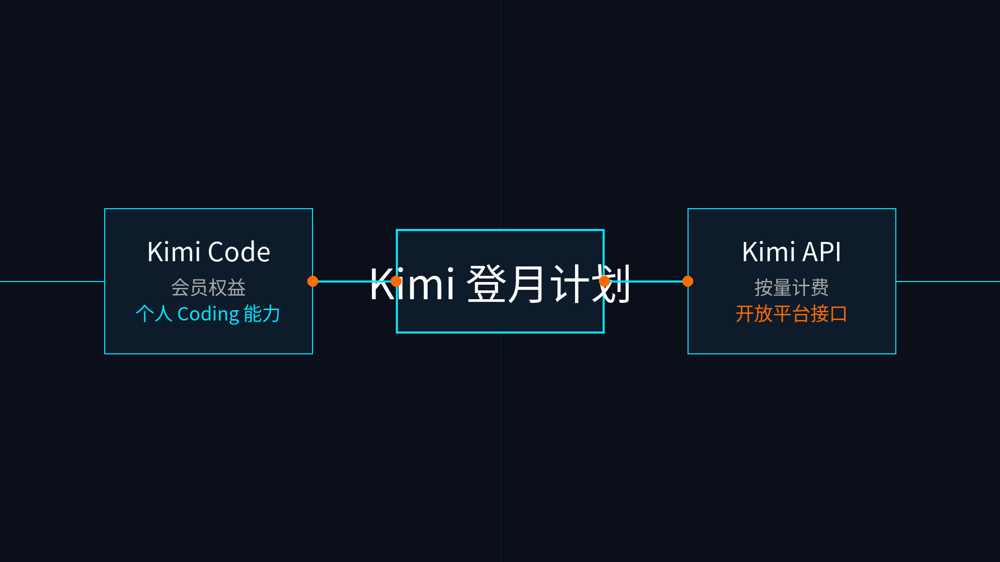

# 06-Kimi登月计划

> 🎯 一句话结论：如果你更看重 Kimi 的 Coding 体验，或者你需要在 Kimi 的会员生态与开放平台之间做抉择，请先看完这一页的拆解。

## 🚀 接入主线图

先看图，Kimi 这条线最重要的判断不是怎么直接配置工具，而是先认清两层的边界：左侧是偏会员权益的 **Kimi Code**，右侧是纯按量计费的 **Kimi API** 开放平台。

## ✨ 这条路适合谁

- 你已经对 Kimi 的 coding 能力有兴趣
- 你想先看会员型能力，再决定是否要走 API 路线
- 你希望在长文本写作、日常助理和编程之间保持灵活度
- 你不想把“会员权益里的代码能力”和“按量计费的纯接口”混为一谈

## 🧭 你最需要记住的点

Kimi 这页最重要的只有一件事：**分层**。

### 1. Kimi Code（偏会员权益）
- 这是 Kimi 会员体系（如登月计划）里的权益之一
- 面向个人开发者或重度使用者
- 内置于特定的官方编程插件或合作工具中
- 按会员包/额度进行结算，而不是单纯按 API Token 跑字数

### 2. Kimi API（开放平台接口）
- 这是 Moonshot 开放平台提供的按量计费纯接口
- 适合你自己配在 Hermes、Claude Code 或任何支持 OpenAI 兼容格式的工具里
- 没有会员门槛，用多少算多少
- 更纯粹的基础模型调用体验

把这两层分开，你后面配 Hermes 还是配编辑器，思路会清楚很多。

## ⚠️ 什么时候先别选它

- 你现在只想走 Hermes 最低门槛路线（请回头看 [07-DeepSeek按量计费接口](./07-DeepSeek按量计费接口.md)）
- 你还没决定是想包月还是按量
- 你想先把预算和调用方式一并压平再看，更倾向聚合订阅（请看 [03-腾讯云Token Plan](./03-腾讯云Token Plan.md)）

## ➡️ 下一步

完成后进入：

- 如果你已经明确要走 Kimi，去对应平台注册获取权限
- 如果还没决定，先回 [国内模型总览](../01-总览.md)

## 📎 官方依据

- https://www.kimi.com/code/docs/
- https://www.kimi.com/code/docs/benefits.html
- https://platform.moonshot.cn/docs/overview
