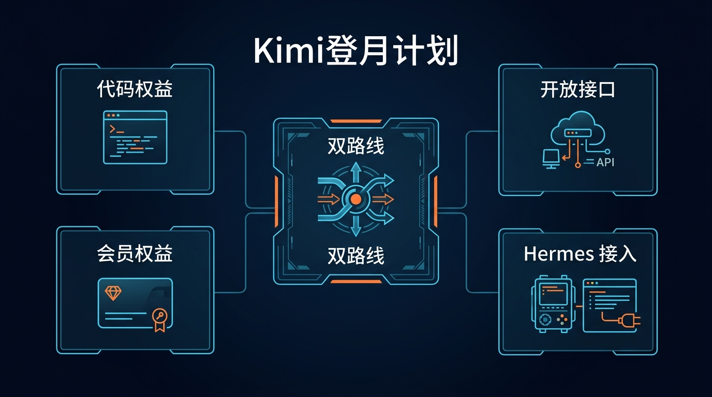

# 06-Kimi登月计划

> 🎯 一句话先说清楚：如果你最看重的是 Kimi 的 Coding 体验，或者你正在判断“先买会员权益”还是“直接走开放平台接口”，那这页必须拆成两条线看：`Kimi Code` 和 `Kimi API`。

这一页只解决一件事：帮你分清 Kimi Code 和 Kimi API 的边界，并告诉你哪一条才真正适合接 Hermes。

这一页先不解决：
- 最低门槛按量起步应该选哪条路
- 多厂商统一聚合套餐应该买哪家
- 你已经有 OneAPI / NewAPI / LM Studio / Ollama 时该怎么复用兼容层

## 🚀 先看主线



这张图只想帮你先抓住 4 个点：
- `Kimi Code` 是会员权益型路线
- `Kimi API` 是开放平台接口路线
- 真正适合接 Hermes 的主线通常是 API，不是先把会员权益当成默认接入口
- 这页适合已经准备认真比较 Kimi 的人，不适合第一次试跑的人

如果你现在更想先少花钱、少做选择、先验证 Hermes 能不能通，优先回看 [07-DeepSeek按量计费接口](./07-DeepSeek按量计费接口.md)。

## ✨ 这条路最适合谁

- 你已经对 Kimi 的 Coding 体验有兴趣，想认真判断值不值得买
- 你想先看会员权益，再判断是否还要走 API 路线
- 你不想把“会员型 Coding 权益”和“开放平台接口”混成一回事
- 你准备长期把 Kimi 放进开发工作流里，而不是只浅尝一下
- 你希望先把 Kimi 的产品路线看明白，再决定 Hermes 怎么接

## 🧭 先按你的当前状态分流

| 你的当前情况 | 直接建议 |
|---|---|
| 我只想先最低门槛把 Hermes 跑起来 | 先回看 [07-DeepSeek按量计费接口](./07-DeepSeek按量计费接口.md) |
| 我最想体验 Kimi 的 Coding 权益和整体体验 | 重点看 `Kimi Code` |
| 我真正想把 Hermes 接起来 | 重点看 `Kimi API` |
| 我还没想清楚自己要买体验还是买接口 | 先回 [02-国内模型总览](./01-总览.md) |

如果你只记一句话：
- 想买体验 → 看 Kimi Code
- 想接 Hermes → 看 Kimi API

## 💰 先看 Kimi Code 的权益，再判断值不值得买

Kimi 官方会员定价页当前默认展示的是年付视图；如果你打开官网时切到了别的展示方式，请以官网实时页面为准。

| 档位 | 官方当前展示价 | Kimi Code 权益 | 适合谁 | 我怎么理解 |
|---|---:|---|---|---|
| Moderato | $180 / 年 | Kimi Code 1x credits | 先体验 Kimi Code | 最轻的体验档 |
| Allegretto | $372 / 年 | Kimi Code 5x credits | 日常高频开发 | 更适合作为个人主力 |
| Allegro | $948 / 年 | Kimi Code 15x credits | 重度编码与多任务 | 更适合长期工具化使用 |
| Vivace | $1,908 / 年 | Kimi Code 30x credits | 大项目 / 高强度使用 | 面向最重度场景 |

### 这页该怎么判断值不值得买

最重要的不是先问“谁最便宜”，而是先问三件事：
- 你是不是已经准备为 Kimi 的整体 Coding 体验买单
- 你是不是更看重会员型工作流，而不是单次 API 调用灵活性
- 你真正要接 Hermes 时，是不是愿意走开放平台 API 这条线

如果你对前两件事的答案是“是”，那 Kimi Code 值得看；如果你真正目标是 Hermes 接入，那核心重点要切回 Kimi API。

## 🤖 它为什么值得单独看

### 1）Kimi Code 是“买体验”，不是“买接口”

Kimi Code 的核心价值在于：
- 更完整的开发体验
- 会员权益驱动的工作流能力
- 不只是给你一个孤立 API

所以它和单纯按量接口完全不是一个决策层级。

### 2）它对现有开发工具很友好

官方文档明确强调它可兼容：
- Kimi Code CLI
- Claude Code
- Roo Code

这说明它不是只在官网里展示的能力，而是明确面向开发工具链。

### 3）它同时又保留了 API 路线

这也是 Kimi 最容易让人看混的地方：
- `Kimi Code`：会员权益型路线
- `Kimi API`：开放平台接口路线

也正因为这样，这页必须先分边界，再谈接入。

### 4）Hermes 已原生支持 Kimi provider

Hermes 官方 provider 文档已经明确列出：
- `KIMI_API_KEY` → provider `kimi-coding`
- `KIMI_CN_API_KEY` → provider `kimi-coding-cn`

这意味着：
- 如果你走的是 Kimi 官方 API，就不需要先把它包装成 custom endpoint
- 对 Hermes 来说，优先应该走原生 provider 路线理解

## 🔀 Kimi Code 和 Kimi API 到底怎么分

### Kimi Code：偏“买体验”

更适合这类人：
- 想直接进入 Kimi 的 Coding 工作流
- 愿意为会员权益和整体体验付费
- 主要用 Kimi Code CLI、Claude Code、Roo Code 等工具

### Kimi API：偏“买接口”

更适合这类人：
- 想按量调用，自己控制接口使用方式
- 想把模型接到 Hermes、脚本或自定义 Agent 里
- 不想先买会员，只想先把接口跑通

这页最重要的结论就是：
- 想接 Hermes，重点看的是 Kimi API
- 想买 Coding 权益，重点看的是 Kimi Code

## 🧰 Hermes 怎么接 Kimi

这里不要把两条线混在一起。

### Step 1. 先确认你是在解决“买体验”还是“接接口”

现在做什么：
- 先明确你这次的目标是体验 Kimi Code，还是把 Hermes 接起来

为什么做：
- 因为这两条线不是一个问题，混在一起会越看越乱

怎么做：
- 如果你最关心的是会员权益和开发体验，就先沿着 Kimi Code 理解
- 如果你最关心的是 Hermes 接入，就把注意力切到 Kimi API

看到什么算成功：
- 你已经能明确说出自己要的是哪条线

失败先查什么：
- 如果你一边在看会员档位，一边又在问 Hermes 用什么 Key，说明你还没把两条线分开

### Step 2. 如果你要接 Hermes，先准备 Kimi API Key

现在做什么：
- 去 Kimi 开放平台申请 API Key

为什么做：
- 因为 Hermes 真正要接的是 API，而不是先把会员权益当默认入口

怎么做：
- 进入 Kimi 开放平台
- 生成并保存 API Key
- 如果你在中国大陆线路，按实际使用环境确认是否要走 `KIMI_CN_API_KEY`

看到什么算成功：
- 你已经拿到可用于开发者接口的 Kimi API Key

失败先查什么：
- 是否还停留在会员页而没进入开放平台
- 是否混淆了账号权益和真正的 API Key

### Step 3. 把 Kimi Key 写进 `~/.hermes/.env`

现在做什么：
- 把 Kimi 的开发者 Key 写进 Hermes 的环境变量文件

为什么做：
- 因为 Hermes 官方 provider 文档就是按环境变量读取 Kimi 凭据

怎么做：
- 如果走通用线路，写入：

```bash
KIMI_API_KEY=你的真实密钥
```

- 如果走中国大陆线路，按实际环境写入：

```bash
KIMI_CN_API_KEY=你的真实密钥
```

看到什么算成功：
- `~/.hermes/.env` 里已经有对应的一行 Kimi Key

失败先查什么：
- 是否变量名写错
- 是否把 Key 写进了别的文件
- 是否把会员权益信息误当作 API Key

### Step 4. 用 `hermes model` 选择 Kimi provider

现在做什么：
- 在 Hermes 里把 provider 切到 Kimi

为什么做：
- 只有 provider 真正切过去，后面的会话才会走 Kimi API

怎么做：
- 运行：

```bash
hermes model
```

- 根据你的线路选择：
  - `Kimi / Moonshot`
  - 或 `Kimi / Moonshot (China)`

看到什么算成功：
- Hermes 已经保存 Kimi 作为当前 provider

失败先查什么：
- 对应环境变量是否已经被 Hermes 正常读取
- 是否中国大陆线路和非大陆线路选反了

### Step 5. 先做一次最小验证

现在做什么：
- 先用一条最简单的问题证明链路能通

为什么做：
- 因为“Key 已写入”不等于“模型真的能返回结果”

怎么做：
- 启动 Hermes
- 先发一句最简单的问题，确认能正常返回结果

看到什么算成功：
- Hermes 能正常进入会话
- 不再报 provider / API Key 错误
- Kimi 模型能稳定返回一条回复

失败先查什么：
- Key 是否复制错误
- provider 是否没有切到 Kimi
- 当前线路是否和你使用的 Kimi Key 类型不一致

## ❓FAQ

### 1. 为什么这页必须先分 Kimi Code 和 Kimi API？

因为一个是会员权益，一个是开发者接口。

如果不拆开，你会把“买体验”和“接接口”混成同一件事。

### 2. 如果我只想接 Hermes，应该先看哪条？

优先看 [Kimi API 开放平台](https://platform.kimi.com/docs/overview)。

因为 Hermes 主线更适合按开发者接口来理解，而不是把会员权益当默认接入口。

### 3. 如果我更看重 Coding 体验，不在乎 API 灵活性呢？

那就优先看 [Kimi Code 官方文档](https://www.kimi.com/code/docs/en/)。

这条路的卖点不是最低门槛，而是更完整的开发体验。

## ⚠️ 风险点与默认建议

### 风险点
- 把 Kimi Code 和 Kimi API 混成一条线
- 其实要接 Hermes，却一直停留在会员权益页
- 线路和 Key 类型不匹配，导致 provider 虽然选对但还是报错

### 默认建议
- 如果你的目标是 Hermes 接入，默认先走 Kimi API
- 默认先完成一次最小验证，再决定要不要长期押 Kimi 这条路线
- 默认把“买体验”和“接接口”当两件事分别判断

## ➡️ 下一步

完成后进入：
- [07-DeepSeek按量计费接口](./07-DeepSeek按量计费接口.md)

如果你想先回到上一阶段入口重新确认位置：
- [02-国内模型总览](./01-总览.md)

## 📎 官方依据

- https://hermes-agent.nousresearch.com/docs/integrations/providers
- https://www.kimi.com/code/docs/en/
- https://www.kimi.com/membership/pricing
- https://platform.kimi.com/docs/overview

## 🧾 R2 官方同步记录

- source_id: `kimi-moonshot`
- checked_at: `2026-05-02`
- change_type: `official-source-confirmation`
- affected_doc: `docs/03-国内落地/02-国内模型/06-Kimi登月计划.md`
- 本轮结论：已确认 Kimi Code API 接入、Kimi API OpenAI SDK 示例、MOONSHOT_API_KEY 与 base_url 口径；具体模型名以后续官方文档为准。
- 后续规则：涉及价格、套餐、可用模型、控制台按钮和额度限制时，仍以厂商官方页面实时显示为准，不在本文复制长期易变表格。
- 官方来源：
  - https://www.kimi.com/code/docs/
  - https://platform.kimi.ai/docs/guide/start-using-kimi-api
  - https://platform.kimi.ai/docs/guide/kimi-k2-6-quickstart

---

## 🔗 模型接入关联路径

- 还没部署 Hermes：先回到[国内部署](/docs/china/deploy)确认服务器和远程环境。
- 要换国内模型：优先比较[DeepSeek](/docs/china/models/deepseek-metered-api)、[Kimi](/docs/china/models/kimi-plan)、[智谱 GLM](/docs/china/models/glm-coding-plan)、[阿里云百炼](/docs/china/models/alibaba-bailian-token-plan)和[腾讯云](/docs/china/models/tencent-token-plan)。
- 使用非内置平台：看[自定义兼容接口](/docs/china/models/openai-compatible-endpoint)，再对照[模型 Provider 与自定义 endpoint 问题](/docs/issues/provider-endpoint)。
- 要查环境变量和配置项：进入[环境变量参考](/docs/reference/environment-variables)和[Profile 命令参考](/docs/reference/profile-commands)。
