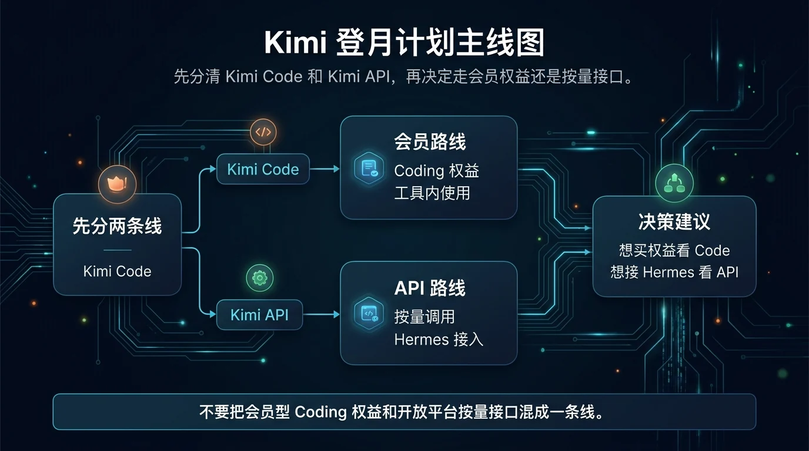

---
quick_reference:
  - checkedAt: '2026-10-05'
    hermesVersion: v2026.9.24
    verification: docs-reviewed
    kind: model
    id: kimi-code-cn-openai
    vendor: Kimi
    product: Kimi Code（有 Coding 额度的会员）
    region: 中国区
    connection: compatible
    provider: custom
    protocol: openai
    endpoint: 'https://api.kimi.com/coding/v1'
    modelIds:
      - kimi-for-coding
    permissions: >-
      使用 Kimi Code 会员 API Key。Go 不含 Coding 额度；Andante 及官方列明的 Plus/Pro 等档位支持
      kimi-for-coding。K3、高速版、上下文权益另查会员；不混用 Moonshot 按量 Key。
      新老套餐周窗口不同，均有 5 小时窗口和月总额度；全部 Key 共配额。开启 Extra Usage 后可续扣加油包，先检查月消费上限。
    configExample: |-
      hermes config set model.provider custom
      hermes config set model.base_url https://api.kimi.com/coding/v1
      hermes config unset model.api_mode
      hermes config set model.api_key "<YOUR_API_KEY>"
      hermes config set model.default kimi-for-coding
    diagnostics:
      - /docs/issues/provider-endpoint
    sources:
      - url: 'https://www.kimi.com/code/docs/kimi-code/membership.html'
      - url: 'https://www.kimi.com/code/docs/kimi-code/models.html'
      - url: 'https://www.kimi.com/code/docs/third-party-tools/hermes.html'
      - url: 'https://raw.githubusercontent.com/NousResearch/hermes-agent/v2026.9.24/hermes_cli/auth.py'
        revision: v2026.9.24
      - url: 'https://github.com/NousResearch/hermes-agent/blob/v2026.9.24/website/docs/integrations/providers.md'
        revision: v2026.9.24
  - checkedAt: '2026-10-05'
    hermesVersion: v2026.9.24
    verification: docs-reviewed
    kind: model
    id: kimi-code-cn-anthropic
    vendor: Kimi
    product: Kimi Code（有 Coding 额度的会员）
    region: 中国区
    connection: compatible
    provider: custom
    protocol: anthropic
    endpoint: 'https://api.kimi.com/coding'
    modelIds:
      - kimi-for-coding
    permissions: >-
      使用 Kimi Code 会员 API Key。Go 不含 Coding 额度；Andante 及官方列明的 Plus/Pro 等档位支持
      kimi-for-coding。K3、高速版、上下文权益另查会员；不混用 Moonshot 按量 Key。
      新老套餐周窗口不同，均有 5 小时窗口和月总额度；全部 Key 共配额。开启 Extra Usage 后可续扣加油包，先检查月消费上限。
    configExample: |-
      hermes config set model.provider custom
      hermes config set model.base_url https://api.kimi.com/coding
      hermes config set model.api_mode anthropic_messages
      hermes config set model.api_key "<YOUR_API_KEY>"
      hermes config set model.default kimi-for-coding
    diagnostics:
      - /docs/issues/provider-endpoint
    sources:
      - url: 'https://www.kimi.com/code/docs/kimi-code/membership.html'
      - url: 'https://www.kimi.com/code/docs/kimi-code/models.html'
      - url: 'https://www.kimi.com/code/docs/third-party-tools/hermes.html'
      - url: 'https://raw.githubusercontent.com/NousResearch/hermes-agent/v2026.9.24/hermes_cli/auth.py'
        revision: v2026.9.24
      - url: 'https://github.com/NousResearch/hermes-agent/blob/v2026.9.24/website/docs/integrations/providers.md'
        revision: v2026.9.24
---
# 🌙 06-Kimi登月计划

> 先分清手中的凭据属于 Moonshot 开放平台 API，还是 Kimi Code。Hermes 的 `kimi-coding` 名称不能单独说明计费路线：实际 endpoint 还取决于 Key 类型和显式覆盖配置。

内容更新：2026-10-05（额度与续扣边界复核）；原教程复核日期：2026-09-30；依据 Hermes 官方稳定标签 **v2026.9.24（v0.21.5）**。完成文档与源码核对，未购买套餐或进行 API 调用测试。价格、会员权限、额度和可用模型请在厂商页面核对。

## 👀 适合谁

已有 Kimi / Moonshot 凭据，想正确接入 Hermes 的用户。还没准备模型账户时，可先看[国内模型总览](./01-总览.md)和[DeepSeek 按量接口](./07-DeepSeek按量计费接口.md)。



> 图是历史产品路线示意，接入应以下面的官方原生 provider 与 Key 类型为准；不需要因为这张图先搭第三方代理。

## 🔀 两条产品路线和 Hermes 的实际映射

| 你持有的凭据 | Hermes 环境变量 / provider | 默认 endpoint | 需要核对 |
|---|---|---|---|
| Moonshot 国际开放平台 API Key | `KIMI_API_KEY` / `kimi-coding` | `https://api.moonshot.ai/v1` | 国际账户、余额、模型权限 |
| Moonshot 国内开放平台 API Key | `KIMI_CN_API_KEY` / `kimi-coding-cn` | `https://api.moonshot.cn/v1` | 国内账户、余额、模型权限 |
| Kimi Code Key | 见[模型接入速查](/docs/reference/model-quick-reference) | 见卡中对应协议的 endpoint | Code Key 是否有效、当前套餐是否允许目标用法 |

默认 Moonshot 映射不因 provider 名称含 `coding` 而失效。另一方面，稳定版源码也确实支持按 `sk-kimi-` 前缀识别 Code endpoint，因此不能写成“接 Hermes 只能走开放平台 API”。

`KIMI_BASE_URL` 显式覆盖会优先于 Key 前缀识别。排障时检查是否遗留覆盖，而不只是反复换 Key。会员登录凭据、普通网页会话与 API Key 是不同的东西；持有会员不等于已经生成可用 Key。

厂商 SDK 示例中的 `MOONSHOT_API_KEY` 是示例变量名，不能照搬成 Hermes 原生 provider 配置。使用上表中 Hermes 实际读取的变量。

## ✍️ 上手步骤

### 1. 确认账户与 Key 类型

在 [Kimi Code 文档](https://www.kimi.com/code/docs/)或 [Moonshot 开放平台](https://platform.kimi.ai/docs/guide/start-using-kimi-api)确认 Key 来源、模型权限及计费规则。套餐价格以[官方会员页](https://www.kimi.com/membership/pricing)实时显示为准。

### 🆔 API 模型与 Code 模型不是同一目录

Moonshot 开放平台模型包括 `kimi-k3`、`kimi-k2.7-code` 等，按 API 账户的模型目录与计费验证。本次已核验的 Kimi Code ID 与兼容配置见[模型接入速查](/docs/reference/model-quick-reference)；其它 Code ID 未纳入速查，不能把 API ID 填进 Code 套餐后假设可用。

Code 模型版本更新不等于套餐权限扩大。K3、长上下文和高速版分别受会员档位限制，401 也可能是能力权限不足。下面保留稳定标签的 Key/endpoint 识别规则，不因新的厂商模型名称重写已核实映射。

## 💳 额度用尽与 Extra Usage 续扣

按 [Kimi Code 官方会员权益](https://www.kimi.com/code/docs/kimi-code/membership.html)（2026-10-05 复核），新套餐取消周频率窗口，保留每 5 小时滚动窗口；老套餐仍以订阅日为起点每 7 天刷新。两类都与 Kimi 会员共享月总额度，所有设备与 API Key 共用配额，换 Key 不会新增额度。

开启 Extra Usage（额度加油包）后，订阅限额触顶可继续扣加油包余额，不一定先报限流。长任务前检查开关与**每月消费上限**；未开启月上限时不设该限额。会员网页与 Code 共用加油包，它与 Moonshot 开放平台按量余额分开，不能混查钱包。

排障先核对 endpoint 和 Key 产品：Code 路线检查新老套餐、5 小时窗口、月额度及加油包；Moonshot 路线检查开放平台余额。还有输出可能表示正在续扣，并不证明订阅额度未耗尽。费率以账户页面为准；本轮未购买或实测扣费。

## 2. 使用模型向导

```bash
hermes model
```

选择对应 Kimi provider，按向导输入 Key 与当前可用模型。默认 profile 的环境变量文件位于 `~/.hermes/.env`，自定义 profile 应使用自己的凭据范围。不要把 Key 粘到聊天记录、截图、教程或 Git 仓库中。

需要直接配置 `.env` 时，开放平台国际与国内 Key 分别使用：

```dotenv
# 国际开放平台：
KIMI_API_KEY=替换为真实密钥
# 国内开放平台：
KIMI_CN_API_KEY=替换为真实密钥
```

按自己的路线填写对应变量，不要把相同 Key 同时放进两种账户线路。Kimi Code 的本次可复制路线见[模型接入速查](/docs/reference/model-quick-reference)，按对应兼容协议配置；上述 Moonshot 原生识别教程未作为已核验产品收录。不要因为变量配置完成就认为账户权益已经验证。

### 3. 做一次最小问答

```bash
hermes doctor
hermes chat -Q -q "请只回复：连接正常。"
```

这是实际模型请求，可能消耗额度或产生费用。收到正常回复后，再在你的账户用量页面检查扣费或额度变化；一次成功不能证明持续稳定、所有模型或全部工具都可用。

### 4. 再验证实际任务

用不含敏感资料的小任务检查工具调用、流式回复和长上下文。如果换模型或 endpoint，需要重新验证；模型目录中有名字不等于账户具备调用权限。

## 🩺 常见问题

| 现象 | 先检查 |
|---|---|
| 401 / 无效 Key | Key 来源与 provider 匹配、变量名、profile、是否复制错误 |
| 余额不足或权益受限 | 开放平台余额与 Code 套餐分别核对，检查请求的实际 endpoint |
| 模型不存在 | 精确模型 ID、地区可用性、账户权限；不要沿用旧目录里的名字 |
| Code Key 去了 Moonshot endpoint | Key 是否为 `sk-kimi-` 前缀、是否存在 `KIMI_BASE_URL` 覆盖 |
| `.env` 已写但仍读旧配置 | 当前 profile、进程加载配置的时机；重启实际使用的入口后复测 |
| 流式输出异常 | 记录安装版本与错误；后续主干修复是否已进入你的安装版本需单独核对 |

## ✅ 过关标准

- 知道 Key 的产品与地区来源，能解释当前 provider 和实际 endpoint。
- 最小问答与目标任务成功，账户用量可核对。
- 没有把会员购买、模型目录或文档源码复核当成 API 联调通过。

## 📎 官方依据

- [稳定标签 Provider 说明](https://github.com/NousResearch/hermes-agent/blob/v2026.9.24/website/docs/integrations/providers.md)。
- [稳定标签凭据与 provider 注册](https://github.com/NousResearch/hermes-agent/blob/v2026.9.24/hermes_cli/auth.py)。
- [稳定标签 Kimi endpoint 解析](https://github.com/NousResearch/hermes-agent/blob/v2026.9.24/hermes_cli/auth_zai_kimi.py)：Key 前缀识别与显式覆盖优先级。
- [Kimi Code 官方文档](https://www.kimi.com/code/docs/)、[Moonshot API 官方文档](https://platform.kimi.ai/docs/guide/start-using-kimi-api)：使用时复核账户和模型。

## 🖥️ 桌面短配置卡

1. 先在[模型接入速查](/docs/reference/model-quick-reference)确认产品、区域、接入方式与对应密钥字段，再选择同一条路线。
2. 打开 **Settings → Model** 设置当前 profile 默认模型，填[模型接入速查](/docs/reference/model-quick-reference)中的精确模型 ID。聊天输入框的模型选择只用于当前聊天，不能用它代替默认模型验收；首次选择及持久化行为以对应版本为准。
3. 若菜单没有模型，使用手动 ID 入口；空目录行为有版本差异，见[桌面教程](/docs/start/personalize/desktop-app)。远端连接时核对服务实际运行的 profile 和凭据位置。
4. 自行发送一条短问答，再执行一个只读取测试文件的工具任务；核对实际 provider、模型、结果及厂商用量记录。**Test、问答和工具任务会发请求，可能收费**，点击前确认余额与套餐允许的用法。
5. 本页只完成文档与源码复核，未进行真实 API、桌面安装或国内网络测试；保存配置或显示连接成功不等于任务和计费路线验证通过。

## 📚 本次复核来源

- [API 模型](https://platform.kimi.ai/docs/models)
- [Code 模型](https://www.kimi.com/code/docs/kimi-code/models.html)
- [Code 动态](https://www.kimi.com/code/docs/kimi-code/whats-new.html)
- [官方 Hermes 接入](https://www.kimi.com/code/docs/third-party-tools/hermes.html)
- [Hermes 稳定 Provider 文档](https://github.com/NousResearch/hermes-agent/blob/v2026.9.24/website/docs/integrations/providers.md)
- [稳定凭据注册与覆盖变量](https://github.com/NousResearch/hermes-agent/blob/v2026.9.24/hermes_cli/auth.py)

## ➡️ 下一步

- 下一步：[07-DeepSeek 按量计费接口](./07-DeepSeek按量计费接口.md)
- 回到：[02-国内模型总览](./01-总览.md)
- 配置其他接口：[自定义兼容接口](/docs/china/models/openai-compatible-endpoint)
- 排障：[模型 Provider 与自定义 endpoint 问题](/docs/issues/provider-endpoint)
