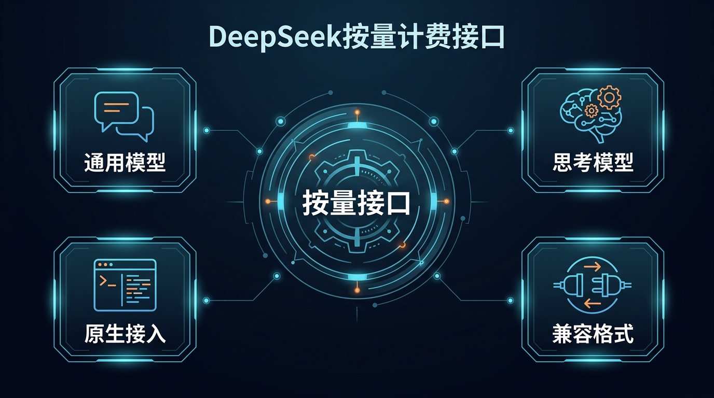

# 07-DeepSeek按量计费接口

> 🎯 一句话结论：如果你最想要的是“先跑起来，再按用量付费”，而且不想先做任何会员、套餐或年付决策，DeepSeek 这条按量接口路线通常就是整个模块里最值得先看的起步方案。

这一页沿用前面几页更清楚的写法：先讲适合谁、价格和模型怎么选、它到底强在哪，再讲 Hermes 里怎么把这条路真正跑通。

## 🚀 接入主线图



先看图，按量接口路线的优势不在于“权益最复杂”，而在于“路径最干净”：

- 没有订阅门槛
- 没有会员包月前置成本
- OpenAI 兼容格式清楚
- Hermes 已经原生支持

如果你的目标是先验证模型、API Key、Hermes 三者能不能稳定接通，DeepSeek 这条路的理解成本最低。

## ✨ 这条路适合谁

- 你想先把 Hermes 跑通，验证工具链连通性
- 你希望先少花钱、少做决策，再决定是否投入更多预算
- 你更接受按量付费，而不是先买一整套会员或套餐
- 你希望接口路径尽量直接，排查网络与配置问题更简单
- 你在意高性能通用模型与思考模型，但不想先把自己绑进订阅权益体系里

## 🧭 先看最短决策

| 你的情况 | 建议 |
|---|---|
| 你只想先跑起来，先验证 Hermes 能否稳定工作 | 走 **DeepSeek 按量接口** |
| 你想先低成本使用，再根据消耗量判断值不值得继续充钱 | 走 **DeepSeek 按量接口** |
| 你需要思考模型来处理更复杂推理任务 | 选 **deepseek-reasoner** |
| 你主要追求更通用、更轻量的日常对话与工具调用 | 选 **deepseek-chat** |
| 你更想买“编码权益 / 套餐 / 会员型体验” | 先回看前面的订阅型页面 |

如果你只想记住一句话：

- **先跑通 Hermes → DeepSeek 按量接口**
- **先分模型 → deepseek-chat / deepseek-reasoner**

## 💰 价格和模型怎么选

DeepSeek 官方中文文档当前给的是**按百万 tokens 计费**的标准价，这一页直接按官方中文价格表来写。

### DeepSeek 当前主模型

| 模型 | 模型版本 | 模式 | 上下文 | 输出长度 | 我怎么理解 |
|---|---|---|---:|---:|---|
| deepseek-chat | DeepSeek-V3.2 | 非思考模式 | 128K | 默认 4K，最大 8K | 更适合作为日常主力模型 |
| deepseek-reasoner | DeepSeek-V3.2 | 思考模式 | 128K | 默认 32K，最大 64K | 更适合复杂推理与深度思考任务 |

### 官方当前价格

| 计费项 | 官方当前价格 | 我怎么理解 |
|---|---:|---|
| 百万 tokens 输入（缓存命中） | 0.2 元 | 已命中缓存时成本极低 |
| 百万 tokens 输入（缓存未命中） | 2 元 | 正常输入成本仍然很低 |
| 百万 tokens 输出 | 3 元 | 真正算账时重点看输出消耗 |

### 这页真正该怎么看

DeepSeek 这页最重要的，不是“哪档会员更值”，因为它根本不是会员页。

你真正要看的只有三件事：

- **我到底用 deepseek-chat 还是 deepseek-reasoner**
- **我能不能接受按量付费、先充余额再扣费**
- **我是不是要一条 OpenAI 兼容、Hermes 可直接接入的干净路径**

如果你的目标是“先做第一把可用钥匙”，DeepSeek 往往比订阅型方案更适合起步。

## 🏆 它的核心优势到底是什么

这一页的关键不是“它能不能接 API”这么简单，而是：**为什么 DeepSeek 值得在国内模型模块里单独保留成一条默认起步路线。**

### 1）它是标准的按量接口，不是套餐页

DeepSeek 文档写得非常直接：

- 以百万 tokens 为单位计费
- 按输入 / 输出消耗扣费
- 直接从充值余额或赠送余额里扣减

这和会员型产品最不一样的地方在于：

- 你不需要先选月费包
- 你不需要先判断哪档权益更值
- 你只要充值、拿 Key、开始调用

### 2）它保持 OpenAI 兼容格式

官方文档明确说明：

- DeepSeek API 使用与 OpenAI 兼容的 API 格式
- `base_url` 可用 `https://api.deepseek.com`
- 出于 OpenAI 兼容考虑，也可用 `https://api.deepseek.com/v1`

这意味着：

- 迁移理解成本低
- 许多兼容 OpenAI 的工具也更容易接过去
- 对 Hermes 这类代理型工具来说更容易快速验证

### 3）它把“通用模型”和“思考模型”分得很清楚

DeepSeek 当前最值得记住的不是一长串模型列表，而是两条主线：

- **deepseek-chat**：非思考模式
- **deepseek-reasoner**：思考模式

这会让选型比很多套餐页更直接：

- 日常主力 → `deepseek-chat`
- 复杂推理 → `deepseek-reasoner`

### 4）它在 Hermes 里是原生 provider

Hermes 官方 provider 文档已经把 DeepSeek 明确列为内建 provider：

- 环境变量：`DEEPSEEK_API_KEY`
- provider：`deepseek`

这一点非常重要，因为它意味着：

- 不需要先把 DeepSeek 伪装成 custom endpoint
- 不需要先写一堆兼容层配置
- 你可以直接按 Hermes 的原生 provider 路线理解它

## 🔍 用量结构和扣费规则怎么理解

DeepSeek 官方中文定价文档里，真正重要的不是复杂套餐，而是下面几件事：

### 1）先分输入、输出

DeepSeek 的费用不是一个总包，而是拆成：

- 输入 tokens
- 输出 tokens

其中输出成本通常更值得你重点关注，因为它最容易在高频回答或长推理里拉高总消耗。

### 2）再看缓存是否命中

官方价格表把输入又拆成：

- 缓存命中
- 缓存未命中

这意味着如果你的工作流里有大量重复上下文、重复系统提示或稳定模板，实际成本还能进一步下降。

### 3）余额是直接扣减的

官方说明写得很直接：

- 费用直接从充值余额或赠送余额扣减
- 两者同时存在时，优先扣赠送余额

所以 DeepSeek 的使用逻辑不是“我买了一个档位”，而是“我先准备余额，再按实际消耗来扣”。

## 🧰 Hermes 怎么接 DeepSeek 这条线

这里的主线要比前面几页更简单。

### 1）先准备好 API Key

先去 DeepSeek 开放平台申请 API Key：

- 进入 DeepSeek 平台 API Key 页面
- 创建并复制 `DEEPSEEK_API_KEY`
- 先确保账户里有可用余额

### 2）Hermes 官方直连 DeepSeek provider

Hermes 官方 provider 文档已经给出了最直接的接法：

1. 在 `~/.hermes/.env` 中放入 `DEEPSEEK_API_KEY`
2. 运行 `hermes model`
3. 在 provider 列表里选择 `DeepSeek`
4. 再选择你要用的模型

这条路就是这页真正要介绍的主线：

- 不需要先手动配置复杂兼容层
- 不需要先走 custom endpoint
- 直接按 Hermes 原生 provider 来理解即可

最小理解可以写成：

```bash
DEEPSEEK_API_KEY=***
```

然后在 Hermes 里执行：

```bash
hermes model
# 选择 DeepSeek
# 再选择 deepseek-chat 或 deepseek-reasoner
```

### 3）关于 base_url 怎么理解

DeepSeek 官方文档明确写了：

- `https://api.deepseek.com`
- 或为了 OpenAI 兼容，使用 `https://api.deepseek.com/v1`

但如果你走的是 Hermes **原生 DeepSeek provider** 路线，你的优先理解应该是：

- 先按原生 provider 方式接
- 只有在你明确要走 custom endpoint 或其他兼容层时，才需要自己去手动处理 base_url

### 4）模型怎么选

如果你只是先把路线跑通：

- 先选 `deepseek-chat`

如果你已经明确有复杂推理需求：

- 再切到 `deepseek-reasoner`

这就是这页最短的实战顺序。

### 5）验证是否接通

当你完成配置后，至少要验证这几件事：

- Hermes 能正常进入会话
- 不再提示 provider / API Key 错误
- `deepseek-chat` 能稳定返回结果
- 如果再切到 `deepseek-reasoner`，推理类任务也能正常响应

## ✅ 这页对 DeepSeek 的默认建议

如果你问我：DeepSeek 这一页最该强调什么？

我的结论是：

- 不是先强调“模型有多强”
- 而是先强调 **它是整个模块里最干净的按量起步路线之一**

对比前面几页后，DeepSeek 这页最值得强调的差异点就是：

- 没有会员包月门槛
- OpenAI 兼容格式清楚
- Hermes 原生支持
- 模型选择逻辑简单：`chat` / `reasoner`

如果你是下面这类人，DeepSeek 这页最值得先看：

- 想先把 Hermes 跑通
- 对成本敏感，希望先少花钱验证路径
- 不想一开始就选套餐或权益
- 需要一条简单、稳定、容易排查问题的国内模型路线

## ⚠️ 常见问题

### 1. DeepSeek 这页为什么不先讲套餐？

因为它本身不是套餐路线，而是按量计费路线。

这页真正的主线不是“买哪档”，而是：

- 申请 Key
- 充值余额
- 选模型
- 接 Hermes

### 2. 我应该先选 deepseek-chat 还是 deepseek-reasoner？

最稳的起步方式是：

- **先跑通 → deepseek-chat**
- **再做复杂推理 → deepseek-reasoner**

### 3. 我如果已经决定买套餐型产品，还要先看 DeepSeek 吗？

不一定。

如果你已经明确要走会员 / 订阅型 Coding 权益，那应该优先看前面的订阅页；但如果你的目标是先把 Hermes 路线验证清楚，DeepSeek 依然是很强的起步候选。

## ➡️ 下一步

完成后进入：

- 如果你想继续看另一条“接口优先”的思路，再回 [国内模型总览](../01-总览.md)
- 如果你想横向比较会员权益型路线，回看 [06-Kimi登月计划](./06-Kimi登月计划.md) 或 [05-MiniMax Token Plan](./05-MiniMax Token Plan.md)

## 📎 官方依据

- https://api-docs.deepseek.com/zh-cn/
- https://api-docs.deepseek.com/zh-cn/quick_start/pricing/
- https://hermes-agent.nousresearch.com/docs/integrations/providers
