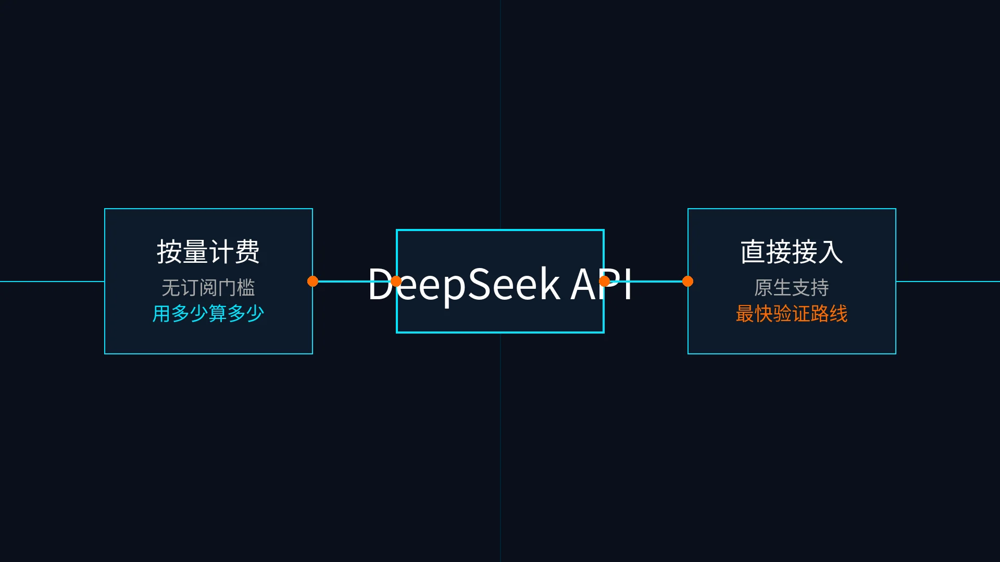

# 07-DeepSeek按量计费接口

> 💡 **速答**：Hermes Agent 接入 DeepSeek 只需三步——充值余额 → 创建 API Key → 写入 `~/.hermes/.env` 里的 `DEEPSEEK_API_KEY=***`。在 Hermes 里用 `hermes model` 选 DeepSeek provider，默认先选 `deepseek-v4-flash`（低成本起步档），不需要买套餐。

> 🎯 一句话先说清楚：如果你当前最重要的目标是"先用最低门槛把 Hermes 跑起来"，而不是先买会员、套餐或年付权益，那么 DeepSeek 这条按量接口路线通常就是 `02-国内模型` 里最值得先走的默认起步页。

这一页只解决一件事：帮你用 DeepSeek 的按量 API，把「充值余额 → 创建 Key → 接入 Hermes → 跑出第一条回复」这条最短链路真正跑通。

这一页先不解决：
- 多厂商统一套餐怎么选
- 会员权益型 Coding Plan 怎么买
- 已有 OneAPI / NewAPI / Ollama 兼容层时该怎么复用

## 🚀 先看主线



这张图只想帮你先抓住 4 个点：
- DeepSeek 这条路是按量计费，不是套餐页
- Hermes 已经原生支持 DeepSeek provider
- 先把 `API Key` 配进 `~/.hermes/.env`
- 再用 `hermes model` 选 DeepSeek 并做最小验证

如果你只是想先确认“模型、Key、Hermes 到底能不能接通”，这条路通常比订阅型方案更轻、更快，也更容易排查问题。

## ✨ 这条路最适合谁

- 你想先把 Hermes 真正跑起来，而不是先买一整套套餐
- 你希望成本尽量轻，先验证闭环，再决定后面要不要加预算
- 你更接受“先充值余额，再按实际消耗扣费”
- 你想走一条 OpenAI 兼容格式清楚、排错路径更短的国内模型路线
- 你不想一开始就把自己绑进会员权益、年付档位或复杂生态选择里

## 🧭 先按你的当前状态分流

| 你的当前情况 | 直接建议 |
|---|---|
| 我只想先跑通 Hermes，先证明链路是通的 | 先走 DeepSeek 按量接口 |
| 我对成本敏感，想先少花钱验证路径 | 先走 DeepSeek 按量接口 |
| 我已经知道自己需要更强推理，但仍然想走按量模式 | 先用 DeepSeek provider，再在模型里选更强档位 |
| 我其实想先买套餐 / 会员 / Coding 权益 | 先回 [02-国内模型总览](./01-总览.md) 改走套餐页 |
| 我已经有稳定兼容层，不想重复做上游接入 | 先看 [08-自定义兼容接口](./08-自定义兼容接口.md) |

如果你只记一句话：
- 先跑通 Hermes → 先看 DeepSeek
- 先买套餐 / 会员 → 不要在这页停太久

## 💰 先看价格和模型，不要先背命令

DeepSeek 当前官方中文价格页已经切到 `V4` 体系。

对这页来说，真正重要的不是把所有参数背下来，而是先分清：
- 你要的是更低成本的默认起步档，还是更强但更贵的高阶档
- 你能不能接受“先充值余额，再按 token 实际消耗扣费”
- 你是不是想走一条 Hermes 已原生支持的按量 provider 路线

### 当前官方主模型（按官方中文价格页）

| 模型 | 模型版本 | 上下文 | 最大输出 | 适合谁 | 我怎么理解 |
|---|---|---:|---:|---|---|
| `deepseek-v4-flash` | DeepSeek-V4-Flash | 1M | 384K | 先跑通、日常主力、优先控成本 | 默认先看这一档 |
| `deepseek-v4-pro` | DeepSeek-V4-Pro | 1M | 384K | 更高强度推理、复杂任务、更高预算 | 只有你明确需要更强能力时再上 |

### 当前官方价格（按官方中文价格页）

| 模型 | 百万 tokens 输入（缓存命中） | 百万 tokens 输入（缓存未命中） | 百万 tokens 输出 | 我怎么理解 |
|---|---:|---:|---:|---|
| `deepseek-v4-flash` | 0.2 元 | 1 元 | 2 元 | 默认起步最友好 |
| `deepseek-v4-pro` | 1 元 | 12 元 | 24 元 | 强很多，也贵很多 |

### 关于 `deepseek-chat` / `deepseek-reasoner` 怎么理解

DeepSeek 官方首页仍保留了这两个历史模型名的兼容说明：
- `deepseek-chat` 对应历史上的非思考模式
- `deepseek-reasoner` 对应历史上的思考模式
- 官方价格页已经明确提示：这两个名字后续会逐步弃用，并兼容映射到 `deepseek-v4-flash`

所以对 Hermes 用户，最稳的理解方式是：
- 如果你的 Hermes 模型列表里已经显示 `deepseek-v4-flash` / `deepseek-v4-pro`，优先按当前官方命名理解
- 如果你的现有配置或旧习惯里仍在用 `deepseek-chat` / `deepseek-reasoner`，把它理解成历史兼容名，不要再把它当长期主命名

## 🏆 为什么这页值得作为默认起步路线

### 1）它不是套餐页，而是最短按量页

DeepSeek 这条线最适合“先证明能跑”，因为你不需要先做这些决策：
- 不需要先选月费档位
- 不需要先判断会员权益值不值
- 不需要先在多家套餐里做复杂比较

你真正只要做的是：
- 充值余额
- 创建 API Key
- 配 Hermes
- 跑出第一条回复

### 2）它是标准 OpenAI 兼容格式

DeepSeek 官方中文首页明确写了：
- `base_url` 可以是 `https://api.deepseek.com`
- 出于 OpenAI 兼容考虑，也可以使用 `https://api.deepseek.com/v1`

这意味着它的理解成本很低：
- 你以后切别的兼容工具也更容易
- 你排查 Key / endpoint / 网络问题时路径更清楚
- 真要走兼容层，也不会从一个完全私有协议开始

### 3）Hermes 已经把它当原生 provider

Hermes 官方 provider 文档已经明确列出：
- 环境变量：`DEEPSEEK_API_KEY`
- provider：`deepseek`

这件事很关键，因为它意味着：
- 不需要先把 DeepSeek 伪装成 custom endpoint
- 不需要先走自定义兼容层
- 你可以直接按 Hermes 原生 provider 的心智去配置

## 🧰 最短接入链路：现在做什么、为什么做、怎么做、成功看什么

### Step 1. 先确认你要走的是“按量接口”，不是“套餐页”

现在做什么：
- 先决定这次的目标是不是“先跑通 Hermes”

为什么做：
- 因为这页最适合解决“先验证链路”，不适合解决“先买哪档权益”

怎么做：
- 如果你现在最关心的是第一个可验证闭环，就留在这页继续
- 如果你真正要做的是套餐 / 会员比较，先回 [02-国内模型总览](./01-总览.md)

看到什么算成功：
- 你已经明确自己要的是按量接口起步，而不是套餐决策

失败先查什么：
- 如果你心里一直在比较“月费档位哪家更值”，说明你选错页了，应该先回总览分流

### Step 2. 去 DeepSeek 平台准备余额并创建 API Key

现在做什么：
- 登录 DeepSeek 开放平台，确认账户可用余额，并创建 API Key

为什么做：
- 因为这条路线不是先买会员，而是先准备一把可调用的 Key

怎么做：
- 打开 DeepSeek 官方平台 / 文档入口
- 进入 API Key 页面创建一把新的 Key
- 确认账户里已经有可用余额，避免后面虽然 Key 正确但调用直接失败
- 把 Key 先临时保存到本地安全位置

看到什么算成功：
- 你已经拿到一把可复制的 `DEEPSEEK_API_KEY`
- 你确认账户不是零余额状态

失败先查什么：
- 是否进错了产品页，只看了文档没进平台
- 是否只创建了 Key，但没确认账户余额
- 是否复制时漏掉了完整值

### Step 3. 把 `DEEPSEEK_API_KEY` 写进 `~/.hermes/.env`

现在做什么：
- 在 Hermes 的环境变量文件里放入 DeepSeek Key

为什么做：
- 因为 Hermes 官方 provider 文档就是按这个环境变量读取 DeepSeek 凭据

怎么做：
- 打开 `~/.hermes/.env`
- 写入一行：

```bash
DEEPSEEK_API_KEY=你的真实密钥
```

- 保存文件

看到什么算成功：
- ~/.hermes/.env 里已经存在一行 DEEPSEEK_API_KEY=你的真实密钥

失败先查什么：
- 是否把 Key 写进了别的文件，而不是 `~/.hermes/.env`
- 是否把变量名写错了
- 是否复制进去了多余空格、引号或残缺值

### Step 4. 用 `hermes model` 选择 DeepSeek provider

现在做什么：
- 在 Hermes 里切到 DeepSeek provider，并选择你要用的模型

为什么做：
- 只有把 provider 和模型真正切过去，后面的会话才会走 DeepSeek

怎么做：
- 在终端里运行：

```bash
hermes model
```

- 在 provider 列表里选择 `DeepSeek`
- 模型选择时，默认先选更适合起步的档位
- 如果列表里同时出现历史兼容名与 V4 名称，优先按当前官方命名理解

看到什么算成功：
- Hermes 已经保存了 DeepSeek 作为当前 provider
- 模型已切到你准备测试的那一档

失败先查什么：
- `~/.hermes/.env` 是否已经被 Hermes 正常读取
- 当前终端是不是你实际在用的那个 Hermes 环境
- Key 是否已生效，还是只是写入但没重新进入 Hermes

### Step 5. 做最小验证：先跑出一条正常回复

现在做什么：
- 进入 Hermes，会话里先发一条最简单的问题，确认链路能通

为什么做：
- 因为“Key 已写入”不等于“模型真的能返回结果”

怎么做：
- 启动 Hermes
- 先发一条极短请求，例如让它做一句自我介绍或回答一个简单问题
- 先确认最小链路可用，再去跑更长、更复杂的任务

看到什么算成功：
- Hermes 能正常进入会话
- 不再报 provider / API Key 错误
- DeepSeek 模型能稳定返回第一条回复

失败先查什么：
- 是否余额不足
- 是否 Key 复制错误
- 是否模型选错到一个你当前账号不可用的档位
- 是否把本该走 DeepSeek provider 的流程误写成了自定义 endpoint 流程

## ✅ 默认建议

如果你不想自己做太多判断，直接按这个顺序走：

1. 先走 DeepSeek 按量接口
2. 先用更适合默认起步的低成本档完成第一轮验证
3. 先证明 Hermes 能返回稳定回复
4. 跑通以后，再决定要不要回头比较套餐页或兼容层页

一句话版本：
- 先跑通，比先买对更重要
- 先验证链路，比先研究高阶档更重要

## ❓FAQ

### 1. DeepSeek 这页为什么不先讲套餐？

因为它本来就不是套餐路线。

这页真正要你完成的是：
- 充值余额
- 创建 Key
- 接 Hermes
- 跑出第一条回复

如果你真正想解决的是“买哪家套餐最省心”，先回 [02-国内模型总览](./01-总览.md) 再分流。

### 2. 我应该先选低成本默认档，还是直接上更强档？

默认建议：
- 先用低成本默认档把 Hermes 跑通
- 只有你已经确认有更强推理需求时，再上更强档

这页的优先级一直都是：先闭环，再升级。

### 3. 我还需要手动配 `base_url` 吗？

如果你走的是 Hermes 原生 DeepSeek provider，优先按 provider 方式接，不要先把事情做复杂。

只有在这些情况下，才再去研究 `base_url`：
- 你明确要走自定义兼容接口
- 你已经有自己的 OpenAI-Compatible 代理层
- 你不是按 Hermes 原生 provider 路线在接

### 4. 我已经有 OneAPI / NewAPI / LM Studio / Ollama，还要走这页吗？

不一定。

如果你已经有稳定兼容层，优先看 [08-自定义兼容接口](./08-自定义兼容接口.md)。

这页的价值在于：
- 它是最短、最干净、最容易排错的官方按量起步路线

## ⚠️ 风险点与默认建议

### 风险点
- 只创建了 Key，但没确认余额，结果第一次调用就失败
- 把套餐比较问题带进这页，导致迟迟不开始验证
- 明明走的是 Hermes 原生 provider，却先去折腾 custom endpoint
- 还没跑通第一条回复，就急着上更贵、更复杂的高阶档

### 默认建议
- 默认先把这页当成“国内模型第一把钥匙”
- 默认先完成一次最小验证，再决定是否回头看套餐页
- 默认先走 Hermes 原生 DeepSeek provider，不要一开始就自定义兼容层

## 📎 官方依据

- https://api-docs.deepseek.com/zh-cn/
- https://api-docs.deepseek.com/zh-cn/quick_start/pricing/
- https://hermes-agent.nousresearch.com/docs/integrations/providers

## ➡️ 下一步

完成后进入：
- [08-自定义兼容接口](./08-自定义兼容接口.md)

如果你想先回到上一阶段入口重新确认位置：
- [02-国内模型总览](./01-总览.md)

## 🧾 R2 官方同步记录

- source_id: `deepseek`
- checked_at: `2026-05-02`
- change_type: `official-source-confirmation`
- affected_doc: `docs/03-国内落地/02-国内模型/07-DeepSeek按量计费接口.md`
- 本轮结论：已确认 DeepSeek 官方 OpenAI/Anthropic 兼容、base_url、当前模型名与旧模型名弃用提示；页面不写死密钥或账户信息。
- 后续规则：涉及价格、套餐、可用模型、控制台按钮和额度限制时，仍以厂商官方页面实时显示为准，不在本文复制长期易变表格。
- 官方来源：
  - https://api-docs.deepseek.com/
  - https://api-docs.deepseek.com/guides/anthropic_api

---

## 🔗 模型接入关联路径

- 还没部署 Hermes：先回到[国内部署](/docs/china/deploy)确认服务器和远程环境。
- 要换国内模型：优先比较[Kimi](/docs/china/models/kimi-plan)、[阿里云百炼](/docs/china/models/alibaba-bailian-token-plan)和[腾讯云](/docs/china/models/tencent-token-plan)。
- 使用非内置平台：看[自定义兼容接口](/docs/china/models/openai-compatible-endpoint)，再对照[模型 Provider 与自定义 endpoint 问题](/docs/issues/provider-endpoint)。
- 要查环境变量和配置项：进入[环境变量参考](/docs/reference/environment-variables)和[Profile 命令参考](/docs/reference/profile-commands)。
