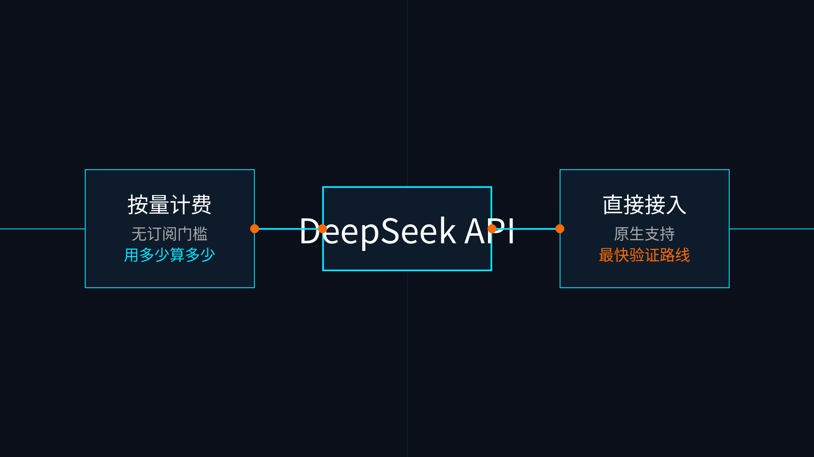

# 07-DeepSeek按量计费接口

> 🎯 一句话结论：如果你最想要的是“先跑起来，再按用量付费”，且不想做任何预充值或套餐决策，DeepSeek 这条按量接口路线通常是最值得先看的。

## 🚀 接入主线图

先看图，按量接口路线的优势不在于“功能最花哨”，而是“起步最干净”：没有订阅门槛，用多少算多少，且已经被 Hermes 原生支持。

## ✨ 这条路适合谁

- 你想先把 Hermes 跑通，验证工具链连通性
- 你希望先少花钱、少做决策
- 你更接受纯正的按量付费（Pay as you go），而不是先买套餐
- 你希望接口路径尽量直接，排查网络问题更简单
- 你不在意平台是否打包了专门的“编码套件”，因为你会把重点放在自己配置的工具端

## 🧭 你最需要记住的点

如果你现在最关心的是先验证 Hermes 是否能稳定工作，这条路通常会排在很前面。

### 1. 无订阅门槛
- 不需要比较月付和年付
- 不需要比较并发限制包
- 注册、充值少量金额、拿 Key、直接跑

### 2. 原生支持
- 已经在 Hermes 中作为一级 provider 受到支持
- 无需修改 base_url，直接选择 `DeepSeek` 即可

## ⚠️ 什么时候先别选它

- 你已经确定要用带有专门“编码加速”的订阅型套餐
- 你更想通过一份套餐切换多家模型（请看 [02-阿里云百炼Token plan](./02-阿里云百炼Token plan.md) 或 [03-腾讯云Token Plan](./03-腾讯云Token Plan.md)）
- 你的场景需要超高并发的专属独享通道

## ➡️ 下一步

完成后进入：

- 还没决定时，先回 [国内模型总览](../01-总览.md)
- 如果你想先跑通，再回头比较订阅型方案，直接去 DeepSeek 开放平台注册并充值。

## 📎 官方依据

- https://api-docs.deepseek.com/
- https://api-docs.deepseek.com/faq
- https://api-docs.deepseek.com/quick_start/pricing
