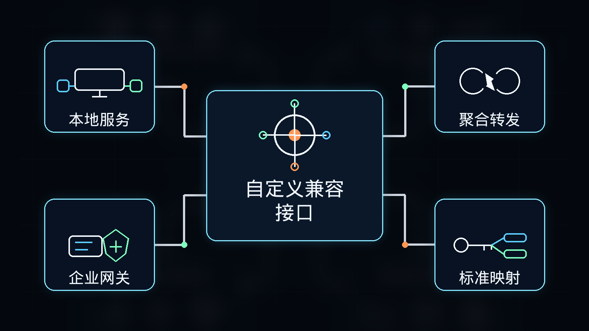

# 08-自定义兼容接口

> 🎯 一句话先说清楚：如果你手上已经有一个稳定的 OpenAI-Compatible 入口——不管它是 LM Studio、Ollama、OneAPI、NewAPI，还是企业自己的私有网关——那么“自定义兼容接口”就是最省重复劳动的一条路线；前提是你真的已经有这个入口。

这一页只解决一件事：帮你判断什么时候该走 custom endpoint，以及怎么把现成的 `base_url`、`api_key` 和模型名正确映射进 Hermes。

这一页先不解决：
- 第一次跑 Hermes 应该选哪条最低门槛路线
- 你还没拿到任何上游入口时该买哪家套餐或 API
- 某一个具体厂商的官方原生 provider 该怎么接

## 🚀 先看主线



这张图只想帮你先抓住 4 个点：
- 这不是第一次用 Hermes 的默认起点
- 它的价值不是“多一个 provider”，而是“把你现有入口复用起来”
- 你最终要映射的只有三项：`base_url`、`api_key`、`model.name`
- 真正要跑通的是「确认兼容层稳定 → `hermes model` 选 Custom Endpoint → 填三项映射 → 做最小验证」

如果你现在还没有现成入口，只是第一次上手 Hermes，优先回看：
- [07-DeepSeek按量计费接口](./07-DeepSeek按量计费接口.md)
- 或对应厂商的原生 provider 页面

## ✨ 这条路最适合谁

- 你已经有一个可工作的 OpenAI-Compatible 入口，不想重做一整套迁移
- 你要接的是本地模型服务、第三方聚合层或企业私有网关
- 你已经知道自己为什么需要中间层，而不是只想先跑通 Hermes
- 你想把多个模型或多个后端统一收口到一个地址
- 你愿意自己承担兼容层带来的调试责任

## 🧭 先按你的当前状态分流

| 你的当前情况 | 直接建议 |
|---|---|
| 我只是第一次跑 Hermes，还没有现成兼容层 | 不要先走这条，优先回看 [07-DeepSeek按量计费接口](./07-DeepSeek按量计费接口.md) |
| 我本地已经在跑 LM Studio | 走本地兼容接口 |
| 我本地已经在跑 Ollama | 走本地兼容接口 |
| 我已经有 OneAPI / NewAPI / 自建聚合池 | 走第三方聚合中转层 |
| 我在企业里需要统一鉴权、审计、限流 | 走企业私有网关 |

如果你只记一句话：
- 没有现成入口 → 不要先选自定义兼容接口
- 已有稳定 OpenAI-Compatible 入口 → 直接走 Custom Endpoint

## 💡 这条路真正值不值得选

这页最重要的不是“高级不高级”，而是：它能不能帮你减少重复配置。

你真正要判断的是三件事：
- 我是不是已经有一个稳定的 OpenAI-Compatible 入口
- 我愿不愿意自己承担中间层的调试成本
- 我是不是要把多个模型或多个服务统一收口到一个地址

如果答案都是“是”，这条路就值得走；如果不是，这条路通常只会增加复杂度。

## 🏆 它为什么值得单独看

### 1）它是“统一入口”，不是“新 provider”

自定义兼容接口的本质不是新的模型厂商，而是：
- 把已有服务统一成一个兼容 OpenAI 的入口
- 用一个 `base_url` 承接多个模型或多个后端
- 把 Hermes 的接法收敛成固定配置

它的价值在于“收口”，不是“额外能力”。

### 2）它既能接本地，也能接远端

Hermes 官方 provider 文档已经明确提供：
- `hermes model`
- 选择 `Custom Endpoint`
- 配置写入 `config.yaml`

这意味着它既可以接：
- 本地服务（LM Studio / Ollama）
- 云端聚合层（OneAPI / NewAPI / 企业网关）
- 你自己控制的代理与转发层

### 3）它特别适合做“兼容层迁移”

如果你团队已经在别的工具里广泛使用 OpenAI SDK 或 OpenAI-compatible 配置，这条路的优势很明显：
- 不用重做整套模型切换逻辑
- 不用按 Hermes 原生 provider 一个个重新理解
- 可以先复用现有地址、Key 和模型名，再逐步清理

### 4）它的代价是“调试责任回到你自己”

这也是这条路最大的成本：
- Hermes 不再替你兜住某个原生 provider 的细节
- 你的中间层是否支持 Chat Completions、Tools、流式输出、模型列表，都会影响最终体验
- 一旦网关丢字段、改格式、兼容不完整，问题就需要你自己排查

## 🔀 三类自定义兼容入口怎么分

### 1）本地兼容接口：LM Studio / Ollama

适合这类人：
- 主要想本地跑模型
- 想让 Hermes 连本地推理服务
- 接受自己管理模型加载、端口和性能

#### LM Studio

LM Studio 官方文档明确说明：
- 支持 OpenAI Compatible Endpoints
- 常见基础地址是：`http://localhost:1234/v1`
- 支持 `/v1/models`、`/v1/chat/completions`、`/v1/responses` 等接口

#### Ollama

Ollama 官方文档明确说明：
- 提供 OpenAI compatibility
- 默认 OpenAI 兼容入口是：`http://localhost:11434/v1`
- 使用 OpenAI SDK 时，`api_key` 必填但会被忽略，常用占位值是 `ollama`

### 2）第三方聚合中转层：OneAPI / NewAPI / 聚合池

适合这类人：
- 希望多个上游模型统一收口
- 想统一结算、限流、权限和监控
- 已经在其他工具里用同一个聚合地址跑通了

优点：
- 同一个 `base_url` 下可切多个模型
- 迁移成本低
- 团队统一管理更方便

但要注意：
- 聚合层不一定完整支持所有 OpenAI 能力
- Tool Calling、流式输出、图像、嵌入等支持度可能不一致
- 你必须自己验证它和 Hermes 的实际兼容性

### 3）企业私有网关：企业安全 / 审计 / 路由

适合这类人：
- 企业内网环境
- 有鉴权、日志审计、配额管理要求
- 需要把所有模型请求纳入统一安全边界

价值：
- 可控
- 可审计
- 可统一路由

代价：
- 维护成本更高
- 排查链路更长
- 兼容层问题会直接反映到 Hermes 上

## 🧰 Hermes 怎么接自定义兼容接口

这里的主线就是：把你现成的 OpenAI-Compatible 入口映射进 Hermes。

### Step 1. 先搞清三项映射

现在做什么：
- 先确认你手上的兼容层最终暴露的是哪三项

为什么做：
- 因为无论你接本地还是远端，Hermes 里最终都要对齐：`base_url`、`api_key`、`model.name`

怎么做：
- 把你的入口理解成：
  - `base_url` = 兼容接口地址
  - `api_key` = 鉴权凭证（本地有时可用占位值）
  - `model.name` = 这个兼容层真正识别的模型字符串

看到什么算成功：
- 你已经能准确写出这三项分别是什么

失败先查什么：
- 如果你连模型名都不知道，就不要急着进 Hermes 配置

### Step 2. 在 Hermes 里选 `Custom Endpoint`

现在做什么：
- 在 Hermes provider 列表里选择自定义兼容入口

为什么做：
- 因为这是 Hermes 官方支持的标准入口，不需要自己手改一堆底层配置

怎么做：
- 运行：

```bash
hermes model
```

- 在 provider 列表里选择 `Custom Endpoint`
- 按提示填写 `base_url`、`api_key`、`model.name`

看到什么算成功：
- Hermes 已经保存 Custom Endpoint 作为当前 provider

失败先查什么：
- 是否仍停留在别的 provider
- 是否三项映射本身就不完整

### Step 3. 如果你接的是 LM Studio

现在做什么：
- 把 LM Studio 本地服务当作一个 OpenAI-Compatible 入口映射进 Hermes

为什么做：
- 因为 LM Studio 已经明确提供兼容端点，适合直接按兼容层理解

怎么做：
- 常见映射是：
  - `base_url` → `http://localhost:1234/v1`
  - `api_key` → 若本地服务未强制校验，可填占位值
  - `model.name` → LM Studio 当前实际暴露的模型名

看到什么算成功：
- Hermes 能通过 LM Studio 返回一条正常回复

失败先查什么：
- LM Studio 本地服务是否真的已启动
- 模型是否已实际加载
- 端口是否还是默认 `1234`

### Step 4. 如果你接的是 Ollama

现在做什么：
- 把 Ollama 本地服务映射进 Hermes

为什么做：
- 因为 Ollama 也提供 OpenAI-compatible 路径，适合直接走 Custom Endpoint

怎么做：
- 常见映射是：
  - `base_url` → `http://localhost:11434/v1`
  - `api_key` → `ollama`
  - `model.name` → 你本地实际可调用的 Ollama 模型名

看到什么算成功：
- Hermes 能通过 Ollama 返回一条正常回复

失败先查什么：
- Ollama 服务是否已启动
- 你填的模型名是不是本地真实存在的模型名
- 是否把 `/v1` 路径漏掉了

### Step 5. 如果你接的是 OneAPI / NewAPI / 企业网关

现在做什么：
- 把你的聚合层或私有网关映射进 Hermes

为什么做：
- 因为这类入口的核心价值就是“统一收口”

怎么做：
- 常见映射是：
  - `base_url` → 你的网关地址（通常以 `/v1` 结尾）
  - `api_key` → 你的平台密钥
  - `model.name` → 网关实际支持的模型名

看到什么算成功：
- Hermes 已经能通过你的网关返回一条文本结果

失败先查什么：
- 网关暴露的模型名到底是什么
- 它是否真的兼容 `/v1/chat/completions`
- 它是否能稳定返回 Hermes 需要的字段

### Step 6. 一定要做最小验证

现在做什么：
- 无论你接哪类兼容层，都先做一次最小文本验证

为什么做：
- 因为“配进去了”不等于“真的稳定可用”

怎么做：
- 启动 Hermes
- 先发一条最简单的问题
- 如果后面要用 Tools，再单独验证 Tool Calling

看到什么算成功：
- Hermes 能正常进入会话
- 不再提示 `base_url` / `api_key` / 模型错误
- 模型能正常返回文本结果

失败先查什么：
- 兼容层本身是否稳定
- `model.name` 是否填对
- 工具能力是否是兼容层缺失，而不是 Hermes 本身问题

## ❓FAQ

### 1. 为什么这页不是默认起步页？

因为这页默认你手上已经有一个稳定兼容层。

如果你还没有入口，只是第一次上手 Hermes，这条路通常只会增加复杂度。

### 2. 这页最核心的配置到底是什么？

就是三项映射：
- `base_url`
- `api_key`
- `model.name`

把这三项搞错，后面所有问题都会放大。

### 3. 兼容层报错时，问题一定在 Hermes 吗？

不一定。

很多时候问题更可能在兼容层本身：
- 字段不完整
- 模型名不一致
- Tool Calling 支持不完整
- OpenAI 格式兼容并不彻底

## ⚠️ 风险点与默认建议

### 风险点
- 还没有现成入口，就过早选择了自定义兼容接口
- 自己都不确定模型名是什么，就急着开始配置
- 兼容层其实不完整，却误以为问题一定在 Hermes

### 默认建议
- 没有稳定入口时，不要先走这页
- 默认先做最小文本验证，再去测 Tool Calling 或更复杂能力
- 默认把问题优先定位到兼容层本身，而不是先怀疑 Hermes

## ➡️ 下一步

完成后进入：
- [02-国内模型总览](./01-总览.md)

如果你想先回到上一阶段入口重新确认位置：
- [03-国内落地总览](../01-总览.md)

## 📎 官方依据

- https://hermes-agent.nousresearch.com/docs/integrations/providers
- https://lmstudio.ai/docs/
- https://docs.ollama.com/openai

---

## 🔗 模型接入关联路径

- 还没部署 Hermes：先回到[国内部署](/docs/china/deploy)确认服务器和远程环境。
- 要换国内模型：优先比较[DeepSeek](/docs/china/models/deepseek-metered-api)、[Kimi](/docs/china/models/kimi-plan)、[智谱 GLM](/docs/china/models/glm-coding-plan)、[阿里云百炼](/docs/china/models/alibaba-bailian-token-plan)和[腾讯云](/docs/china/models/tencent-token-plan)。
- 使用非内置平台：看[自定义兼容接口](/docs/china/models/openai-compatible-endpoint)，再对照[模型 Provider 与自定义 endpoint 问题](/docs/issues/provider-endpoint)。
- 要查环境变量和配置项：进入[环境变量参考](/docs/reference/environment-variables)和[Profile 命令参考](/docs/reference/profile-commands)。
