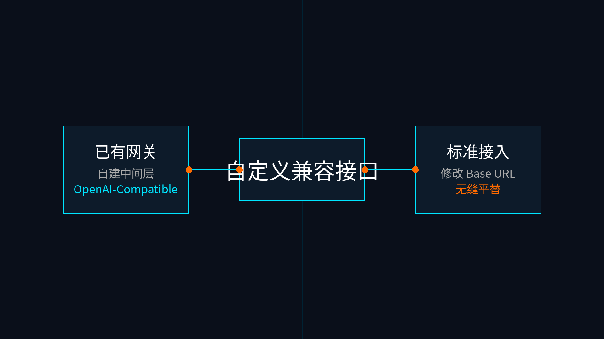

# 08-自定义兼容接口

> 🎯 一句话结论：如果你手上已经有一个 OpenAI-Compatible 的中转网关、第三方聚合层或自建代理，你可以通过修改 base_url 直接把它接入 Hermes，这是“已经有稳定入口”时的平替路线。

## 🚀 接入主线图

先看图，自定义兼容接口不是一条“从零开始”的推荐路线，而是当你已经有了 `OpenAI-Compatible` 入口时的适配方案。

## ✨ 这条路适合谁

- 你手里已经有兼容接口（比如 OneAPI、NewAPI 或其他聚合池）
- 你要对接的是企业自建网关或安全代理层
- 你本来就不打算从官方原生直连路径开始
- 你已经知道怎么管理自己的请求转发

## 🧭 你最需要记住的点

自定义兼容接口的前提不是“更高级”，而是“你已经有一个稳定入口”。

### 1. 修改 Base URL
在 Hermes 中，选择 `custom` provider 时，你需要显式地填入：
- `model.base_url`（通常以 `/v1` 结尾）
- `model.api_key`
- 具体的模型名称字符串

### 2. OpenAI 兼容性
你的中间层必须实现标准的 OpenAI Chat Completions 接口格式，否则 Hermes 无法正确解析工具调用（Tool Calling）相关的返回。

## ⚠️ 什么时候先别选它

- 你现在只是想第一次跑通 Hermes，手里也没有现成的网关
- 你不确定中间层是否完美支持了 Tool Calling 协议
- 你不想处理“因为中间层丢字段导致 Agent 崩溃”的额外调试成本

## ➡️ 下一步

完成后进入：

- 还没决定时，先回 [国内模型总览](../01-总览.md)
- 如果你已经有兼容接口，就直接在终端运行 `hermes model`，选最下面的 custom，按你的现有环境往下走。

## 📎 官方依据

- https://hermes-agent.nousresearch.com/docs/integrations/providers
- 你自己的 OpenAI-Compatible / 自建兼容层文档
