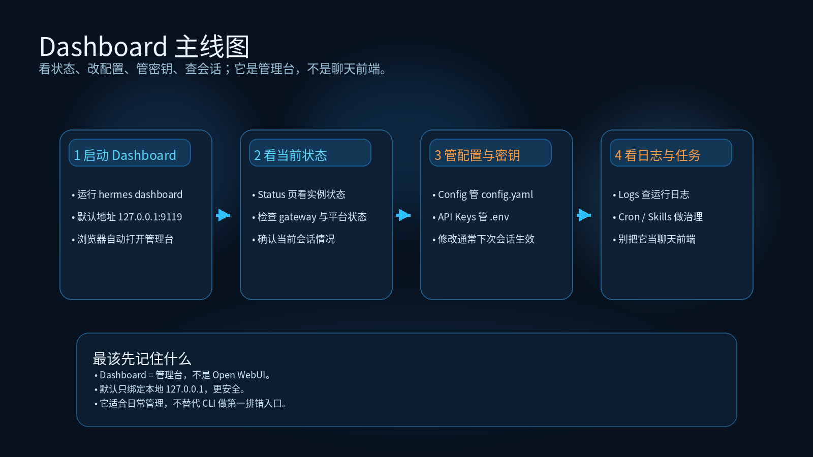

# 02-网页控制台（Dashboard）

> 🎯 一句话结论：如果你要的是一个**本地浏览器里的管理面板**，方便看状态、改配置、管 API Key、查会话和看日志，那 Dashboard 值得用；但它不是 Open WebUI 那种聊天前端，也不是替代 CLI 的第一主入口。

这一页只解决一件事：把 Dashboard 的定位彻底讲清楚，避免你把“管理面板”“网页聊天前端”“API 后端服务”混成一件事。

## 🚀 Dashboard 主线图



先看图，再记住这页真正的主线：

- 先启动 `hermes dashboard`
- 再看 Status 页确认实例状态
- 再去 Config / API Keys 管配置和密钥
- 最后用 Logs / Cron / Skills 做日常治理

这张图要表达的不是“怎么聊天”，而是：

- Dashboard 是管理台
- 它更适合管理、查看、配置和巡检
- 它不是网页聊天前端

## 🚀 先记住这页的核心判断

Dashboard 的作用是：

- 看状态
- 改配置
- 管 API Key
- 查会话
- 看日志
- 管 cron / skills / analytics

Dashboard 不负责：

- 充当 Open WebUI 那种聊天前端
- 替代 CLI 作为最完整的排错入口
- 替代 API Server 作为对外提供 OpenAI-Compatible 接口的后端

如果你先把这三层边界记住，后面就不会越用越乱。

## ✨ 它适合谁

- 你已经能跑 Hermes，但不想总是直接改 YAML 或 `.env`
- 你想用浏览器集中管理配置、API Key 和会话
- 你希望先看清当前实例的状态，再决定下一步排错方向
- 你需要一个本地控制台，而不是一个新的聊天产品
- 你已经知道 CLI 仍然是第一主入口，只是希望日常管理更方便

## 📌 它到底是什么，不是什么

### 它是什么

官方文档对 Web Dashboard 的定义非常直接：

- 一个基于浏览器的本地 UI
- 用来管理 Hermes Agent 安装
- 替代直接编辑 YAML 或频繁敲 CLI 配置命令

默认访问地址是：

- `http://127.0.0.1:9119`

默认行为也是本地优先：

- 默认只绑定 `127.0.0.1`
- 默认不把数据暴露到局域网外

### 它不是什么

这页最关键的是把误解提前拦住：

- 它不是 Open WebUI 那样的聊天前端
- 它不是给团队成员直接对话的网页入口
- 它不是 API Server
- 它不是替代 CLI 的万能入口

如果你真正想要的是“网页聊天界面”，下一页该看的是 [03-API 服务与 Open WebUI](<./03-API%20%E6%9C%8D%E5%8A%A1%E4%B8%8E%20Open%20WebUI.md>)，而不是把 Dashboard 当聊天壳子。

## 🧭 最短决策

| 你的情况 | 建议 |
|---|---|
| 你还在第一次配置 Hermes、还要频繁排错 | 先用 CLI，Dashboard 先不急 |
| 你已经把 Hermes 跑起来，想更方便地改配置和看状态 | 可以开始用 Dashboard |
| 你想做网页聊天界面 | 不要先看 Dashboard，先看 API 服务与 Open WebUI |
| 你要把 Hermes 暴露给网页前端、第三方前端或其他客户端 | 核心不是 Dashboard，而是 API Server |
| 你需要统一查看日志、会话、配置、env | Dashboard 很合适 |

如果你只想记一句话：

- **想管理 Hermes → Dashboard**
- **想聊天前端 → Open WebUI**
- **想完整排错与配置 → CLI**

## 🧱 Dashboard 里到底能做什么

根据 Hermes 官方文档，这个控制台至少覆盖这些主页面：

### 1）Status
这是 Dashboard 的落地首页，用来快速看当前实例是不是活着。

你能在这里看到：

- 版本
- gateway 状态
- 平台状态
- 活跃 session 数量

它适合回答的不是“我怎么聊天”，而是：

- 我的 Hermes 现在是不是正常运行
- 哪些平台连上了
- 有没有活跃会话

### 2）Config
这是对 `config.yaml` 的表单化管理界面。

官方文档说明：

- 配置字段会从 `DEFAULT_CONFIG` 自动发现
- 布尔值会渲染成 toggle
- 一些枚举值会渲染成 dropdown
- 其他值会用文本框编辑

这意味着它最适合做的是：

- 管理已有配置
- 调整参数
- 减少直接改 YAML 的频率

但你也要记住：

- 配置变更通常在**下一个 agent session 或 gateway restart** 才会生效

### 3）API Keys
这是 `.env` 的管理入口。

你能在这里做的事包括：

- 查看哪些 key 已设置 / 未设置
- 看红acted 状态
- 按类别管理常用与高级 key
- 直接改 Hermes 所依赖的 `.env`

这对国内环境尤其有用，因为很多时候你要切：

- 模型 key
- gateway key
- API server key
- 平台接入 key

但也正因为这里会改 `.env`，所以它是高权限区域，不适合随便暴露出去。

### 4）Sessions
这是会话浏览页。

你能在这里看到：

- session 标题
- 来源平台（CLI / Telegram / Discord / Slack / cron 等）
- 当前模型
- 消息数
- 工具调用数
- 最后活跃时间

它更像“运行现场的总览”，而不是聊天 UI 本身。

### 5）Logs / Analytics / Cron / Skills
这些页面分别解决：

- **Logs**：看日志、筛日志、tail 日志
- **Analytics**：看使用量与成本趋势
- **Cron**：管理定时任务
- **Skills**：查看、搜索和启停技能 / toolsets

这就是为什么我会说 Dashboard 本质是**控制台**，不是聊天前端。

## 🔑 怎么启动 Dashboard

官方最短启动命令是：

```bash
hermes dashboard
```

默认行为：

- 启动本地 web server
- 自动打开浏览器
- 默认地址：`http://127.0.0.1:9119`

常见参数：

```bash
# 自定义端口
hermes dashboard --port 8080

# 绑定到所有网卡（谨慎）
hermes dashboard --host 0.0.0.0

# 只启动，不自动打开浏览器
hermes dashboard --no-open
```

## ⚙️ 启动前你要知道的依赖

官方文档说明，Dashboard 依赖：

- FastAPI
- Uvicorn

如果你没装 web 依赖，通常需要：

```bash
pip install hermes-agent[web]
```

如果你装的是完整版：

```bash
pip install hermes-agent[all]
```

那 web 依赖通常已经包含在内。

## 🆚 Dashboard、CLI、API Server 到底怎么分

| 入口 | 它负责什么 | 它不负责什么 |
|---|---|---|
| Dashboard | 管理、查看、配置、日志、会话、key | 不负责网页聊天前端 |
| CLI | 最完整的原生入口，适合排错、模型切换、配置与验证 | 不负责图形化管理体验 |
| API Server | 把 Hermes 暴露成 OpenAI-Compatible 后端 | 不负责配置面板 |
| Open WebUI | 作为聊天前端连接 API Server | 不负责 Hermes 的系统管理 |

如果你脑子里只有一句话，就记这个：

- **Dashboard = 管理台**
- **CLI = 主入口**
- **API Server = 后端**
- **Open WebUI = 前端**

### 默认建议

如果你问我：Dashboard 这页最稳的使用顺序是什么？

我会给你这个顺序：

1. 先把 CLI 跑顺
2. 再用 Dashboard 管理配置、会话和密钥
3. 如果你要网页聊天前端，再进入 API 服务与 Open WebUI

也就是说：

- Dashboard 很有用
- 但它不是入口顺序里的第一个锚点
- 它是“已经跑起来之后的管理增强层”

## ❓FAQ

### 1. Dashboard 和 Open WebUI 是不是同一个东西？
不是。

- Dashboard = 管理台
- Open WebUI = 浏览器聊天前端

### 2. Dashboard 能不能替代 CLI？
不能。

Dashboard 很适合：

- 看状态
- 管配置
- 管 API Key
- 查会话和日志

但第一主入口和最稳的排错入口仍然是 CLI。

### 3. 为什么很多配置改完没有立刻生效？
因为 Dashboard 管的是：

- `config.yaml`
- `.env`

而这些改动通常要在：

- 下一个 agent session
- 或 Gateway 重启

之后才会真正体现出来。

### 4. Dashboard 适不适合直接暴露到公网？
默认不适合。

因为这一页会直接碰到：

- 配置文件
- API keys
- 平台凭据

而且 Dashboard 本身没有内建认证层。

## ⚠️ 风险点与默认建议


这一页一定要单独把安全提醒讲出来，因为 Dashboard 会直接读写：

- `config.yaml`
- `.env`

而 `.env` 里往往有：

- 模型 API keys
- 平台密钥
- API Server key
- 其他敏感凭据

Hermes 官方文档明确提醒：

- Dashboard 默认绑定 `127.0.0.1`
- 如果你改成 `0.0.0.0`
- 且没有额外保护
- 那么同一网络里的人就可能访问并修改你的凭据

还要特别记住一件事：

- **Dashboard 自己没有认证层**

所以在国内部署场景里，最稳的默认做法仍然是：

- 只绑定本地
- 只给自己用
- 不把它当公网管理台去裸露

## 📎 官方依据

- https://hermes-agent.nousresearch.com/docs/user-guide/features/web-dashboard
- https://hermes-agent.nousresearch.com/docs/user-guide/features/api-server
- https://hermes-agent.nousresearch.com/docs/user-guide/messaging/open-webui

## ➡️ 下一步

- 前进到 [03-API 服务与 Open WebUI](<./03-API%20%E6%9C%8D%E5%8A%A1%E4%B8%8E%20Open%20WebUI.md>)
- 回 [01-总览](./01-总览.md)
