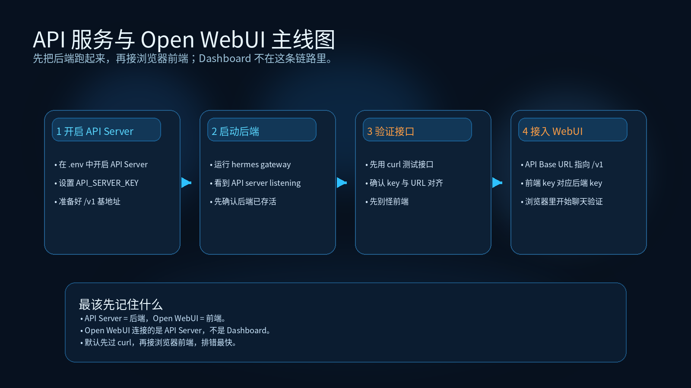

# 03-API 服务与 Open WebUI

> 🎯 一句话结论：如果你真正想要的是“网页聊天界面”，重点不是先折腾 Dashboard，而是先把 **Hermes API Server** 作为后端跑起来，再让 **Open WebUI** 这样的前端连上它。

这一页只讲一件事：把 **后端服务** 和 **网页前端** 这两层关系讲清楚，并给你一条最短接入路径。

## 🚀 API 服务与 Open WebUI 主线图



先看图，再记住这页真正的主线：

- 先在 `.env` 里开启 API Server
- 再启动 Hermes 后端
- 先用 `curl` 验证接口
- 最后再让 Open WebUI 连接 Hermes

这张图最重要的提醒是：

- API Server 是后端
- Open WebUI 是前端
- Dashboard 不在这条接入链路里

## 🚀 先记住这页最重要的判断

这一页最核心的判断只有 3 个：

1. **API Server 是后端。**
2. **Open WebUI 是聊天前端。**
3. **Dashboard 不是 Open WebUI，也不是 API Server。**

如果你先把这 3 句分清，后面就不会把“控制台”“聊天页面”“对外接口”全搅在一起。

## ✨ 这条路适合谁

- 你想让 Hermes 出现在浏览器聊天界面里，而不是只用 CLI
- 你想把 Hermes 接到 Open WebUI、LobeChat、LibreChat 这类 OpenAI-compatible 前端
- 你需要一个能承接 Hermes 全工具能力的网页聊天前端
- 你已经明白 Dashboard 是管理台，不是聊天壳子
- 你希望先跑一个最标准、最容易理解的 Web 前端接法

## 📌 它到底是什么，不是什么

### 它是什么

根据 Hermes 官方文档：

- **API Server** 会把 Hermes 暴露成一个 **OpenAI-compatible HTTP endpoint**
- **Open WebUI** 可以像连接 OpenAI 一样连接 Hermes
- 前端负责聊天体验，后端负责真正调用 Hermes 的工具、模型和上下文能力

也就是说，这一页讲的是一个标准组合：

- **Hermes API Server = 后端服务**
- **Open WebUI = 浏览器聊天前端**

### 它不是什么

这页也要先把边界拦清楚：

- 它不是 Dashboard 页的变体
- 它不是告诉你怎么管理 Hermes 配置
- 它不是在讲模型怎么买
- 它不是在讲消息平台 Gateway

如果你真正想做的是：

- 管理配置 / 看日志 / 看状态 → 回 Dashboard
- 先把 Hermes 跑顺、切模型、排错 → 回 CLI
- 做团队消息入口 → 去飞书 / 企业微信 / 钉钉 / 微信页

## 🧭 最短决策

| 你的情况 | 建议 |
|---|---|
| 你想要浏览器聊天界面 | 走 **API Server + Open WebUI** |
| 你还在第一次排错、第一次配模型 | 先走 CLI，不要先上网页前端 |
| 你只是想看状态、改配置、查日志 | 先回 Dashboard，不要把它当聊天前端 |
| 你想让 Open WebUI 或其他兼容前端接 Hermes | 核心是 API Server，不是 Dashboard |
| 你想少走弯路地验证这条路 | 先用官方给的 Open WebUI 接法跑通 |

如果你只想记一句话：

- **想聊天前端 → Open WebUI**
- **想后端接口 → API Server**
- **想管理台 → Dashboard**

## 🏗️ 这套结构到底怎么工作

先把结构关系看明白：

```text
浏览器中的 Open WebUI
        ↓
Hermes API Server（OpenAI-compatible）
        ↓
Hermes Agent 本体
        ↓
工具 / 模型 / Memory / Skills / Terminal
```

这就是为什么 Hermes 官方文档会明确说：

- Open WebUI 连接的是 Hermes 的 API server
- Hermes 返回的不是普通聊天壳，而是带完整工具能力的 Agent 响应

所以这页的真正重点，不是“网页长什么样”，而是：

- 后端是不是先跑起来
- Key 能不能对上
- 前端是不是连对了 URL

## 🔧 API Server 到底负责什么

Hermes 官方文档给 API Server 的定义非常清楚：

- 把 `hermes-agent` 暴露成 **OpenAI-compatible HTTP endpoint**
- 支持标准前端通过 `/v1/chat/completions` 或 `/v1/responses` 来访问
- 支持 Hermes 的完整工具能力：
  - terminal
  - file operations
  - web search
  - memory
  - skills

这意味着：

- 对 Open WebUI 来说，Hermes 看起来就像一个 OpenAI-compatible 后端
- 对你来说，真正关键的是 **后端先起来、鉴权先对上、base URL 先写对**

## 🌐 Open WebUI 到底负责什么

Open WebUI 这层解决的是：

- 浏览器聊天界面
- 会话管理
- 用户账户
- 聊天产品化体验

但它本身不负责：

- 跑 Hermes agent
- 提供 Hermes 工具执行能力
- 管理 Hermes 本地配置文件

所以这条路里，Open WebUI 再好看，也只是前端。

真正让它“能用 Hermes”的核心还是：

- Hermes API Server 已启用
- API key 对上
- base URL 对上

## 🧱 最短接法：先把 API Server 跑起来

官方最短步骤很明确。

### 1）先在 `~/.hermes/.env` 里开启 API Server

```dotenv
API_SERVER_ENABLED=true
API_SERVER_KEY=your-secret-key
```

如果你的浏览器要直接跨域访问 Hermes，才需要再考虑：

```dotenv
# 只有浏览器必须直连 Hermes 时才需要
API_SERVER_CORS_ORIGINS=http://localhost:3000
```

但对于 Open WebUI 这条路，官方明确提醒：

- **Open WebUI 和 Hermes 是 server-to-server 通信**
- 所以通常 **不需要 `API_SERVER_CORS_ORIGINS`**

### 2）启动 Hermes gateway

```bash
hermes gateway
```

如果成功，你应该看到类似输出：

```text
[API Server] API server listening on http://127.0.0.1:8642
```

这一步的成功标志很明确：

- 不是“我觉得应该起来了”
- 而是你真的看到 API server listening 的地址输出

### 3）确认后端基地址

默认情况下，你真正要提供给前端的基地址是：

```text
http://localhost:8642/v1
```

这一条要记牢，因为后面无论是 Open WebUI，还是别的 OpenAI-compatible 前端，核心都围绕这个地址。

## ✅ 先不用 Open WebUI，先验证后端通没通

这一步很重要。

不要一上来就先看网页里有没有聊天框，先验证后端是不是活着。

官方给的最短测试方式可以直接用 `curl`：

```bash
curl http://localhost:8642/v1/chat/completions \
  -H "Authorization: Bearer change-me-local-dev" \
  -H "Content-Type: application/json" \
  -d '{"model": "hermes-agent", "messages": [{"role": "user", "content": "Hello!"}]}'
```

如果这一步都没通，你先不要怪 Open WebUI。

你应该先查：

- `API_SERVER_ENABLED` 是否开了
- `API_SERVER_KEY` 是否设置了
- `hermes gateway` 是否真的在运行
- `localhost:8642/v1` 是否写对了

## 🖥️ Open WebUI 最短接法

在官方文档里，Open WebUI 的最短 Docker 路线是：

```bash
docker run -d -p 3000:8080 \
  -e OPENAI_API_BASE_URL=http://host.docker.internal:8642/v1 \
  -e OPENAI_API_KEY=your-secret-key \
  --add-host=host.docker.internal:host-gateway \
  -v open-webui:/app/backend/data \
  --name open-webui \
  --restart always \
  ghcr.io/open-webui/open-webui:main
```

跑起来后，默认访问：

```text
http://localhost:3000
```

第一次打开时，还要记住两个点：

- 第一个创建的用户会成为 admin
- 模型下拉框里应该能看到你的 agent 名称（默认 profile 下常见是 `hermes-agent`）

## 🧪 这条路真正的成功标志是什么

很多人会把“Open WebUI 页面打开了”误认为已经成功。

其实这条路至少有 3 个成功标志：

### 成功标志 1：Hermes API Server 真起来了
你能在 gateway 输出里看到：

```text
[API Server] API server listening on http://127.0.0.1:8642
```

### 成功标志 2：前端配对成功
Open WebUI 能正确连接 Hermes，对应表现通常是：

- 前端能打开
- 模型下拉里能出现 Hermes agent
- 不会一发消息就直接报鉴权或连接错误

### 成功标志 3：真正发消息可用
真正发送消息后：

- Hermes 能返回正常响应
- 若触发工具，前端能看到工具进度或最后结果
- 你确认它不是只打开了一个空壳子页面

## ⚠️ 最容易踩的坑

### 1. 把 Dashboard 的地址当成 Open WebUI 要连的后端
这就是最常见的错法。

你必须分清：

- Dashboard 地址：管理控制台
- API Server 地址：前端后端连接点

Open WebUI 要连的是：

```text
http://localhost:8642/v1
```

不是 Dashboard 地址。

### 2. API key 没对上
官方说明得很明确：

- Open WebUI 里的 `OPENAI_API_KEY`
- 必须和 Hermes 里的 `API_SERVER_KEY`
- 完全一致

只要这两边不一致，前端就算能打开，也连不上 Hermes。

### 3. 误以为所有设置改环境变量后都会自动更新
Open WebUI 官方文档明确提醒：

- 环境变量通常只在**第一次启动**时生效
- 后面连接设置会写进 Open WebUI 自己的内部数据库

这意味着：

- 你不是改了 Docker 环境变量就一定马上生效
- 之后要改连接，通常要进 Admin UI 改，或者清掉 volume 重来

### 4. 还没把 CLI 跑顺，就先叠前端
如果 CLI 本身都没跑顺，这条链上多一层前端，只会让你更难排错。

所以默认顺序仍然应该是：

1. CLI 先跑通
2. API Server 再开启
3. Open WebUI 再接入

## 🆚 Dashboard、API Server、Open WebUI 怎么分

| 组件 | 它负责什么 | 它不负责什么 |
|---|---|---|
| Dashboard | 配置、状态、日志、会话、管理 | 不负责聊天前端 |
| API Server | 暴露 OpenAI-compatible 后端接口 | 不负责图形化管理 |
| Open WebUI | 提供浏览器聊天界面 | 不负责 Hermes 系统管理 |
| CLI | 最完整的原生入口、排错入口 | 不负责网页聊天体验 |

这页要你最后记住的，其实就是这张表。

## ✅ 默认建议

如果你问我：这条路最稳的使用顺序是什么？

我会建议你按这个顺序：

1. 先确认 CLI 已经跑顺
2. 再启用 API Server
3. 先用 `curl` 验证后端
4. 最后再接 Open WebUI

这样做的好处是：

- 出问题时你知道是后端问题还是前端问题
- 不会把 Dashboard、API Server、Open WebUI 混成一团
- 你能更快把“网页前端”这条路稳定接起来

## ➡️ 下一步

完成后进入：

- 如果你想回到入口模块重新确认位置，回 [01-总览](./01-总览.md)
- 如果你还没把环境准备好，先回 [01-国内部署 / 01-总览](../01-国内部署/01-总览.md)
- 如果你还没决定模型路线，先回 [02-国内模型 / 01-总览](../02-国内模型/01-总览.md)

## 📎 官方依据

- https://hermes-agent.nousresearch.com/docs/user-guide/features/api-server
- https://hermes-agent.nousresearch.com/docs/user-guide/messaging/open-webui
- https://docs.openwebui.com/getting-started/quick-start/connect-an-agent/hermes-agent/
