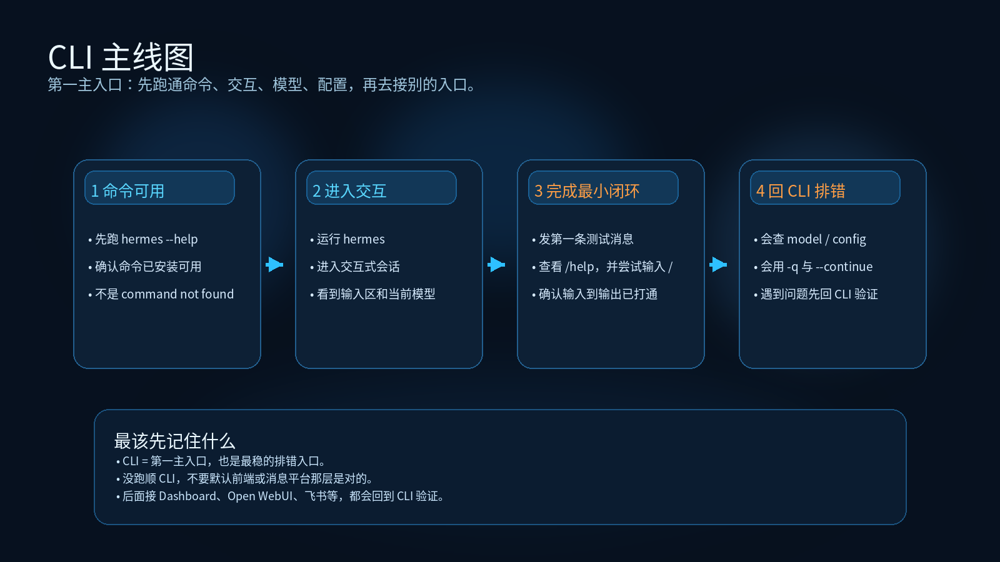

# 04-命令行（CLI）

> 🎯 一句话结论：如果你要选一个**最完整、最适合排错、最适合先跑顺 Hermes** 的入口，那默认就应该是 CLI。无论你后面要接 Dashboard、Open WebUI，还是飞书、企业微信、钉钉，这一页都应该先跑通。

这一页不是抽象介绍“CLI 很强”，而是直接带你完成一条最短闭环：

- 确认 CLI 能启动
- 确认你能正常聊天
- 确认你会切模型 / 看配置 / 看帮助
- 确认你知道哪些命令是日常高频入口

## 🚀 CLI 主线图



先看图，再记住这页真正的主线：

- 先确认 `hermes --help` 可用
- 再进入 `hermes` 交互会话
- 再发第一条测试消息，完成最小闭环
- 最后学会回到 CLI 做模型、配置和会话排错

这张图真正要传达的是：

- CLI 是第一主入口
- 它也是最稳的排错入口
- 后面的 Dashboard、Open WebUI、消息平台问题，最终都会回到 CLI 验证

## 🚀 先记住这页最重要的判断

CLI 在 Hermes 里的定位，不是“另一个入口”，而是：

- **第一主入口**
- **最完整的原生入口**
- **最适合排错与配置的入口**

如果你还没把 CLI 跑顺，就先不要急着上：

- Dashboard
- Open WebUI
- 飞书 / 企业微信 / 钉钉 / 微信 Gateway

因为一旦后面这些入口出问题，你必须能回到 CLI 来判断：

- 是模型问题
- 是配置问题
- 是服务问题
- 还是平台接入问题

## ✨ 这条路适合谁

- 你第一次用 Hermes，想先把最核心的交互跑通
- 你要排错、切模型、改配置、看状态
- 你希望最先拿到“确定可用”的成功标志
- 你暂时不想引入浏览器前端或消息平台，先验证 agent 本体
- 你要把 Hermes 当成日常工作入口，而不是只试一次 Demo

## 📌 CLI 到底是什么，不是什么

### 它是什么

根据 Hermes 官方文档，CLI 是一个：

- **terminal-first TUI**
- 支持 interactive mode 和 single-query mode
- 支持 slash command、历史记录、模型切换、tool progress、session resume

也就是说，它不是“只能打一行命令”的极简壳子，而是 Hermes 最完整的原生使用面。

### 它不是什么

这页也要先把边界讲清：

- 它不是浏览器聊天前端
- 它不是 Dashboard 管理面板
- 它不是 API Server
- 它不是消息平台入口

如果你想要的是：

- 浏览器聊天界面 → 去 [03-API 服务与 Open WebUI](<./03-API%20%E6%9C%8D%E5%8A%A1%E4%B8%8E%20Open%20WebUI.md>)
- 管理配置 / 会话 / 日志 → 去 [02-网页控制台（Dashboard）](./02-网页控制台（Dashboard）.md)
- 团队消息触达 → 去 [05-飞书](./05-飞书.md) / [06-企业微信（AI Bot）](<./06-%E4%BC%81%E4%B8%9A%E5%BE%AE%E4%BF%A1%EF%BC%88AI%20Bot%EF%BC%89.md>) / [07-钉钉](./07-钉钉.md) / [08-个人微信](./08-个人微信.md)

但如果你要的是**先把 Hermes 本体跑顺**，就直接回 [04-命令行（CLI）](./04-命令行（CLI）.md)。

## 🧭 最短决策

| 你的情况 | 建议 |
|---|---|
| 你第一次用 Hermes | 先看 CLI |
| 你要验证模型、配置、工具链是不是通的 | 先看 CLI |
| 你已经遇到问题，需要判断卡在哪一层 | 回 CLI 排错 |
| 你只想用浏览器聊天 | 也建议先把 CLI 跑通，再去接前端 |
| 你打算接消息平台 | 也建议先把 CLI 跑通，再去做 Gateway |

如果你只想记一句话：

- **没跑顺 CLI，就不要默认后面那层一定是对的。**

## 🧱 CLI 里你最常用的是哪几类命令

Hermes 官方文档把 CLI 能力分得很清楚。你真正需要先掌握的是 4 类：

### 1）启动与恢复
常用命令：

```bash
hermes
hermes chat -q "Hello"
hermes chat --continue
hermes chat --resume <id>
```

这组命令解决的是：

- 启动交互式会话
- 发单次问题
- 继续最近一次会话
- 恢复指定 session

### 2）模型与 provider
常用命令：

```bash
hermes model
hermes chat --model <name>
hermes chat --provider <name>
```

这组命令解决的是：

- 切 provider
- 切模型
- 明确当前到底是哪个后端在工作

### 3）配置与排错
常用命令：

```bash
hermes config
hermes config set KEY VAL
hermes config check
hermes doctor
hermes status
```

这组命令解决的是：

- 当前配置长什么样
- 我改的配置有没有写进去
- 有没有缺失项
- 为什么现在跑不通

### 4）Gateway 与后续入口
常用命令：

```bash
hermes gateway
hermes gateway setup
hermes gateway status
```

这组命令不应该先于 CLI 主线，但你要知道：

- 后面消息入口和 API Server 路线，本质上都会回到这些系统级命令

## ✅ 先跑一条最短成功闭环

下面这部分才是这页真正最重要的内容：

**一步一步先把 CLI 跑顺。**

---

## 第 1 步：先确认 Hermes 命令可用

现在做什么：
- 先确认你当前环境里已经能直接调用 `hermes`

为什么先做这一步：
- 如果连命令本身都不可用，后面所有入口都不用继续看

怎么做：

```bash
hermes --help
```

看到什么算成功：
- 终端正常输出帮助信息
- 你能看到 Hermes 的命令列表，而不是 `command not found`

如果没成功先查什么：
- Hermes 是否已经安装
- 当前 shell / 虚拟环境是否正确
- PATH 是否包含 Hermes 可执行文件

---

## 第 2 步：启动一次交互式 CLI

现在做什么：
- 直接进入 Hermes 交互会话

为什么做：
- 这是所有后续入口里最基础的“agent 真能工作”验证

怎么做：

```bash
hermes
```

看到什么算成功：
- 终端里出现 Hermes 的交互界面
- 能看到当前模型 / 工作目录 / 可用工具等基本信息
- 底部有输入区，说明 CLI 已经进入交互态

如果没成功先查什么：
- 当前默认模型是否已配置
- `.env` 中是否已有可用 API key
- 配置文件是否损坏

---

## 第 3 步：发送一条最简单的测试消息

现在做什么：
- 在 CLI 里发一条最简单的文本，确认能正常返回回复

为什么做：
- 先验证最小闭环：输入 → 模型 → 输出

怎么做：

直接在 CLI 中输入：

```text
你好，给我一句简短的自我介绍
```

看到什么算成功：
- Hermes 正常返回一段可读回复
- 没有立即报 provider / auth / model 错误

如果没成功先查什么：
- 模型 key 是否正确
- 当前 provider 是否可用
- 网络是否能访问对应模型服务

---

## 第 4 步：确认你会看帮助和 slash command

现在做什么：
- 在交互态里先认识 CLI 的内建命令面

为什么做：
- 后面你改配置、切模型、查状态，都离不开这层能力

怎么做：

在 CLI 中输入：

```text
/help
```

然后再输入：

```text
/
```

看到什么算成功：
- `/help` 能显示可用命令说明
- 输入 `/` 时能看到 slash command 的提示或自动补全能力

如果没成功先查什么：
- 当前是不是 Hermes 的交互式 CLI，而不是普通 shell
- 终端是否正确渲染 TUI / prompt_toolkit 组件

---

## 第 5 步：确认你会看当前配置

现在做什么：
- 看一眼当前 CLI 所依赖的配置状态

为什么做：
- 很多问题不是“CLI 坏了”，而是你根本不知道自己现在在用什么配置

怎么做：

先在 shell 里执行：

```bash
hermes config
```

如果你已经在交互态里，也可以试：

```text
/config
```

看到什么算成功：
- 能看到当前配置内容或配置摘要
- 至少知道自己当前正在使用哪套配置

如果没成功先查什么：
- `config.yaml` 是否存在
- CLI 当前 profile 是否异常

---

## 第 6 步：确认你会切模型

现在做什么：
- 学会切 provider / model

为什么做：
- 后面你无论走国内模型、兼容接口还是别的入口，模型切换都是高频动作

怎么做：

最稳的方式是：

```bash
hermes model
```

如果你要临时指定，也可以：

```bash
hermes chat --model <name>
hermes chat --provider <name>
```

看到什么算成功：
- 你能在交互式选择器里看到 provider / model
- 切换后重新进入会话时，能明确知道当前使用的是哪一个模型

如果没成功先查什么：
- 目标 provider 是否已配置 key
- 当前 profile 下是否有可选模型
- 你是不是在交互会话里误以为 `/model` 能新增 provider（官方限制是：新增 provider 一般要回 shell 跑 `hermes model`）

---

## 第 7 步：学会单次查询模式

现在做什么：
- 试一次 non-interactive 单次调用

为什么做：
- 这很适合快速验证，也适合脚本化或只问一条问题

怎么做：

```bash
hermes chat -q "Hello"
```

看到什么算成功：
- 终端直接输出 Hermes 的回复
- 执行结束后返回 shell

如果没成功先查什么：
- 默认模型是否可用
- 当前环境变量是否加载成功

---

## 第 8 步：知道怎么恢复会话

现在做什么：
- 学会继续最近一次 session

为什么做：
- CLI 不只是一次性工具，很多实际工作都是跨多轮持续进行的

怎么做：

```bash
hermes chat --continue
```

或者：

```bash
hermes chat --resume <id>
```

看到什么算成功：
- 你能回到之前的会话上下文
- CLI 显示出之前会话摘要或上下文延续

如果没成功先查什么：
- 当前 session 数据是否存在
- 你填的 `<id>` 是否正确

## 🔍 CLI 真正适合做什么

从入口角度看，CLI 最适合做 4 类事情：

### 1. 第一次跑通
这是它最重要的角色。

因为它能最快回答：

- Hermes 本体是不是活的
- 模型是不是可用
- 配置是不是生效

### 2. 排错
当 Dashboard、Open WebUI、飞书、企业微信、钉钉或微信入口出问题时，最稳的回退点仍然是 CLI。

### 3. 配置和切模型
很多修改在 CLI 里最直接、最明确：

- `hermes model`
- `hermes config`
- `hermes config set`
- `hermes doctor`

### 4. 日常高频使用
如果你本来就习惯终端工作流，CLI 往往不只是“第一入口”，而是长期主入口。

## 🆚 CLI、Dashboard、API Server 怎么分

| 入口 | 它负责什么 | 它不负责什么 |
|---|---|---|
| CLI | 最完整的原生使用、排错、切模型、配置 | 不负责浏览器聊天前端 |
| Dashboard | 管理、查看、配置、日志、会话 | 不负责主要聊天交互 |
| API Server | 对外提供 OpenAI-compatible 后端 | 不负责配置管理界面 |
| Open WebUI | 浏览器聊天前端 | 不负责 Hermes 系统管理 |

如果你要一句最短结论：

- **CLI = 主入口**
- **Dashboard = 管理台**
- **API Server = 后端**
- **Open WebUI = 前端**

### 默认建议

如果你完全不想自己判断，直接按这个顺序走：

1. 先把 `hermes --help` 跑通
2. 再把 `hermes` 交互会话跑通
3. 再发第一条测试消息
4. 再确认 `hermes model`、`hermes config`、`/help` 这些基本动作都可用
5. 然后再决定要不要接 Dashboard、Open WebUI 或消息平台

这条顺序最稳，因为它让你先拿到一个**最可验证的成功闭环**。

## ❓FAQ

### 1. 为什么这页总说 CLI 是第一主入口？
因为 CLI 能最直接回答：

- Hermes 本体是不是活的
- 模型是不是可用
- 配置是不是生效

别的入口出问题，最后也要回 CLI 验证。

### 2. `hermes --help` 和直接 `hermes` 的区别是什么？
- `hermes --help`：先确认命令本身存在、可调用
- `hermes`：真正进入交互式会话

前者是命令层检查，后者是会话层检查。

### 3. 为什么还要学 `hermes model`、`hermes config`、`chat -q`、`--continue`？
因为 CLI 不只是“能聊一下”，它还是：

- 模型切换入口
- 配置检查入口
- 单次验证入口
- 会话恢复入口

### 4. 为什么我想用浏览器或消息平台，也还是要先看 CLI？
因为如果 CLI 没跑顺：

- 浏览器前端问题难拆
- 消息平台问题更难判断
- 你很难知道自己卡在模型、配置、服务还是平台层

## ⚠️ 风险点与默认建议

### 1. 一上来就去接前端或消息平台
这会让你失去最短排错路径。

### 2. 不知道自己当前到底在用哪个模型
如果你不先确认 provider / model，很多“感觉怪怪的”其实只是你根本没用到以为自己在用的模型。

### 3. 把 CLI 当成一次性安装测试
CLI 不只是“安装完成后打个 hello”的入口，它也是：

- 排错入口
- 配置入口
- 恢复会话入口
- 切模型入口

## 📎 官方依据

- https://hermes-agent.nousresearch.com/docs/user-guide/cli
- https://hermes-agent.nousresearch.com/docs/reference/cli-commands
- https://hermes-agent.nousresearch.com/docs/reference/slash-commands

## ➡️ 下一步

- 前进到 [05-飞书](./05-飞书.md)
- 回 [01-总览](./01-总览.md)
