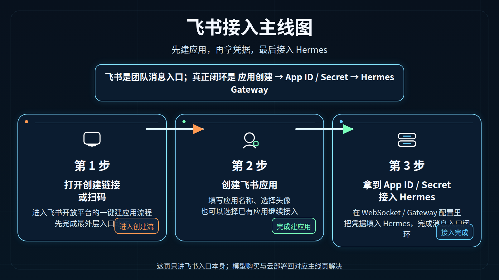
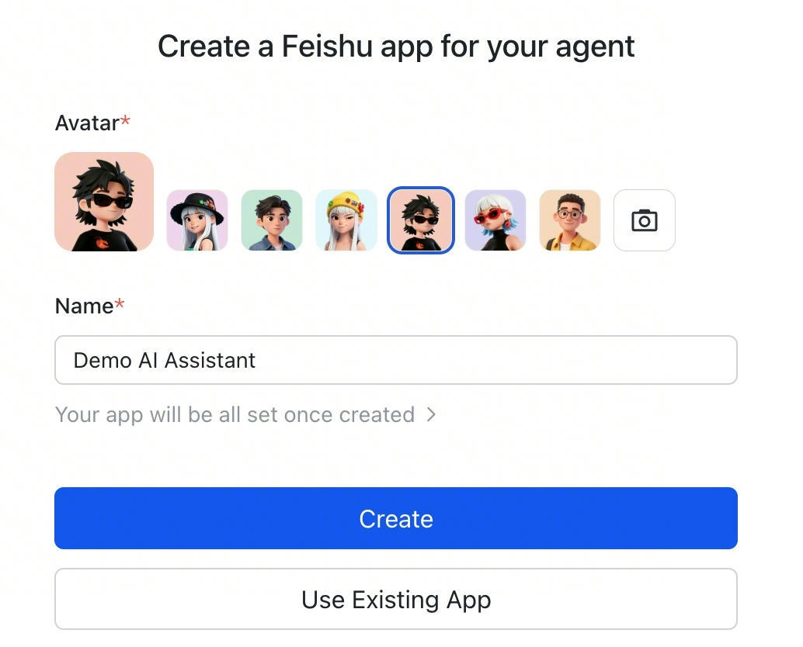

# 05-飞书

> 🎯 一句话结论：如果你想让团队成员在国内环境里先通过一个熟悉的消息入口触达 Hermes，飞书通常是最值得优先落地的第一站；但这页讲的是**飞书入口接入**，不是模型购买，也不是云部署。

这一页只解决一件事：把 **飞书作为 Gateway 消息入口** 的接入路径讲清楚，并且把“创建应用 → 拿到凭据 → 填回 Hermes”这条主线跑顺。

## 🚀 飞书接入主线图

先看图，再记住这页的核心闭环：

- 先进入飞书开放平台的一键建应用流程
- 再创建飞书应用，拿到 App ID / App Secret
- 最后把这些凭据填回 Hermes Gateway

这页不展开讲模型，不展开讲服务器购买，也不把 Dashboard / Open WebUI 和消息入口混在一起。

## ✨ 飞书这条路适合谁

- 你想先给团队做一个国内可用的消息触达入口
- 你所在团队已经把飞书当成主要协作平台
- 你希望成员不用进终端，也能在聊天里直接触达 Hermes
- 你想先把“组织内部消息入口”打通，再决定后续扩展到企业微信、钉钉或个人微信
- 你已经能接受：消息入口是触达层，不是最完整的排错层

## 📌 先记住这页的核心判断

飞书页最重要的不是“飞书能不能聊天”，而是要先分清它在整个系统里的位置：

1. **飞书属于 Gateway 消息入口。**
2. **它优先服务团队触达，不是第一排错入口。**
3. **真正要填回 Hermes 的，是飞书应用创建后返回的 App ID / App Secret。**
4. **如果 CLI 还没跑顺，飞书接入出了问题会更难排查。**

所以这页默认服务的是：

- Hermes 本体已经大致可用
- 你现在开始把它接进飞书

## 🧭 最短决策

| 你的情况 | 建议 |
|---|---|
| 你第一次用 Hermes，还没把模型和配置跑顺 | 先回 CLI，不要先上飞书 |
| 你已经有 Hermes 可用实例，想给团队做消息触达 | 直接看飞书这页 |
| 你还没准备好部署环境 | 先回部署页 |
| 你还没决定模型路线 | 先回模型总览 |
| 你需要一个国内团队常用、协作成本低的入口 | 飞书值得优先做 |

如果你只想记一句话：

- **飞书 = 团队消息入口**
- **CLI = 第一主入口**

## 🧱 飞书接入到底分几步

从接入角度，这页的主线可以压缩成 3 步：

### 第 1 步：进入飞书的一键建应用流程
你可以通过官方给出的创建链接或扫码方式进入。

### 第 2 步：创建飞书应用
在飞书应用创建界面里：

- 选择头像
- 填写应用名称
- 创建新应用，或接入已有应用

### 第 3 步：拿到 App ID / App Secret，填回 Hermes
应用创建完成后，官方流程会返回应用凭据。真正的闭环不是“页面开了”，而是：

- 你把凭据拿到了
- 你把凭据填回 Hermes Gateway
- Hermes 可以通过飞书与用户收发消息

## 🖼️ 官方截图：进入飞书新建应用入口

这张官方中文后台截图证明的是：

- 你已经进入飞书低代码平台的**开发中心**
- 页面右上角明确存在 **+ 新建应用** 入口
- 当前截图适合证明“已经到达新建应用入口所在页面”

这张图不直接证明“创建表单已经提交完成”，所以真正的闭环仍然是：

- 进入新建应用流程
- 填写应用名称、图标等基础信息
- 创建完成后拿到 App ID / App Secret
- 再把凭据填回 Hermes

## 🔧 官方这条路到底帮你省了什么

根据官方文档，这个“一键创建飞书 Agent 应用”的流程，真正省掉的是手动做这些事情的成本：

- 手工创建应用
- 手工配置权限范围（scopes）
- 手工配置事件订阅（event subscriptions）

官方文档明确说明：

- 这套流程会自动预配置常见 AI Agent 所需的权限
- 用户只需要扫码或打开链接确认
- 创建完成后即可获得 App ID 和 App Secret

所以这页真正该理解的，不是“我学会点几个按钮”，而是：

- **飞书官方已经把 Agent 型应用的默认权限和事件订阅预设好了**
- 你不用从零手配完整后台

## ✅ 先把最短闭环跑通

下面这部分是这页真正最关键的操作顺序。

---

## 第 1 步：确认你不是在错误时机做飞书接入

现在做什么：
- 先判断自己是不是已经具备接飞书的最低前提

为什么做：
- 飞书入口是触达层，不是底层排错层
- 如果你连 Hermes 本体都没跑顺，飞书问题会变成多层叠加问题

先确认这 3 件事：

- Hermes 至少已经能在 CLI 里正常工作
- 你已经有可用模型入口
- 你当前环境具备运行 Gateway 的条件

看到什么算成功：
- 你已经能明确回答“CLI 是通的”“模型是可用的”“现在只是开始接消息入口”

如果没成功先查什么：
- 回 [04-命令行（CLI）](./04-命令行（CLI）.md)
- 回 [01-国内部署 | 总览](../01-国内部署/01-总览.md)
- 回 [02-国内模型 | 总览](../02-国内模型/01-总览.md)

---

## 第 2 步：进入官方一键建应用流程

现在做什么：
- 打开官方文档提供的创建链接或扫码流程

为什么做：
- 飞书这条线的核心不是先去后台手搓应用，而是先进入官方已经封装好的 Agent 应用创建流程

你现在该理解的官方动作是：

- 用户打开创建链接或扫码
- 进入飞书应用创建页面
- 再选择“创建新应用”或“使用已有应用”

看到什么算成功：
- 你进入飞书应用创建页面
- 能看到创建表单，而不是留在普通文档页

如果没成功先查什么：
- 是否打开了错误页面
- 是否还停留在说明文档，没有进入真正的创建流程
- 飞书账号是否已登录

---

## 第 3 步：创建飞书应用

现在做什么：
- 在飞书应用创建界面里填写名称、选择头像并创建应用

为什么做：
- 这一步才是真正把“消息入口”从概念变成一个可绑定 Hermes 的飞书应用

怎么做：
- 在创建页面填写应用名称
- 选择头像
- 点击创建新应用
- 如果已有应用，也可以按官方流程选择已有应用继续接入

看到什么算成功：
- 系统确认应用已创建
- 你可以继续进入下一步获取应用凭据

如果没成功先查什么：
- 是否有必填项没填
- 是否用了没有权限的账号
- 是否选错了已有应用 / 新建应用分支

---

## 第 4 步：拿到 App ID 与 App Secret

现在做什么：
- 获取飞书应用创建后返回的核心凭据

为什么做：
- 对 Hermes 来说，真正关键的不是“你创建了应用”，而是你有没有把应用凭据带回来

这页最关键的配置资产就是：

- `App ID`
- `App Secret`

官方文档已经明确写了：

- 完成创建后，会返回应用凭据
- 你可以立刻用这些凭据去调用飞书 API 或接入 Agent 服务

看到什么算成功：
- 你已经能读取并保存 App ID / App Secret
- 不是只停留在“应用创建成功”的提示页

如果没成功先查什么：
- 是否真的走完了创建流程
- 是否只看到成功页，但没进入凭据查看环节
- 是否把成功提示误当成最终接入完成

---

## 第 5 步：把凭据填回 Hermes Gateway

现在做什么：
- 把飞书应用返回的 App ID / App Secret 填回 Hermes

为什么做：
- 这一步才是飞书入口真正接回 Hermes 的地方

这页先不展开到平台细节配置项逐个字段，因为这一模块当前重点是“入口主线和边界”。

你在这一页最少要建立的正确理解是：

- 飞书官方流程负责帮你快速创建一个合适的 Agent 应用
- Hermes 侧需要接住这个应用返回的凭据
- 真正的完成标志不是“应用建好了”，而是“Gateway 能用这些凭据跑起来”

看到什么算成功：
- Hermes Gateway 侧已经完成飞书应用凭据填写
- 你进入的是“可以实际收发消息”的状态，而不是只停留在飞书后台创建成功

如果没成功先查什么：
- App ID / App Secret 是否填错
- 是否漏填某一项
- Hermes Gateway 是否真的已启动

## ❓FAQ

### 1. 飞书是不是 Hermes 的第一主入口？
不是。

第一主入口仍然是 CLI。
飞书是团队消息触达入口。

### 2. 飞书和 Dashboard 是不是一回事？
不是。

- Dashboard 是管理面板
- 飞书是消息入口

### 3. 飞书和 Open WebUI 是不是一回事？
不是。

- Open WebUI 是网页聊天前端
- 飞书是消息平台入口

### 4. 我已经创建了飞书应用，为什么还不算完成？
因为真正的闭环还包括：

- 拿到 App ID / Secret
- 把凭据填回 Hermes
- Gateway 能实际运行

### 5. 我现在该先做飞书还是先做 CLI？
默认先做 CLI。

只有在 CLI 已经跑顺之后，再做飞书，排错成本才最低。

## ⚠️ 风险点与默认建议

### 1. 不要把“应用创建成功”当成“消息已经通了”
这是最常见误判。

- 应用创建成功，只说明飞书应用侧准备好了
- 不代表 Hermes 已经接住它
- 真正成功还要看 Hermes 侧是否完成绑定与运行

### 2. 不要还没跑顺 CLI 就先做飞书
如果基础链路都没跑顺：

- 模型问题
- gateway 问题
- 平台权限问题

会一起叠在飞书入口上，很难拆开排查。

### 3. 不要把飞书页写成“模型页”或“部署页”
飞书这页只讲：

- 入口
- 应用创建
- 凭据回填
- Gateway 闭环

不重复展开：

- 模型套餐值不值
- 服务器怎么买
- Dashboard / Open WebUI 的区别细节

### 默认建议

如果你问我：飞书这页到底应该怎么用？

我的默认顺序是：

1. 先确认 Hermes CLI 已经跑顺
2. 再进入飞书官方一键建应用流程
3. 创建应用，拿到 App ID / App Secret
4. 再把这些凭据填回 Hermes Gateway

也就是说：

- 飞书非常适合做国内团队入口
- 但它不是第一步
- 它是“本体已经大致可用之后的团队触达层”

## 📎 官方依据

- https://open.feishu.cn/document/mcp_open_tools/integrating-agents-with-feishu/overview

## ➡️ 下一步

- 前进到 [06-企业微信（AI Bot）](<./06-%E4%BC%81%E4%B8%9A%E5%BE%AE%E4%BF%A1%EF%BC%88AI%20Bot%EF%BC%89.md>)
- 回 [01-总览](./01-总览.md)
