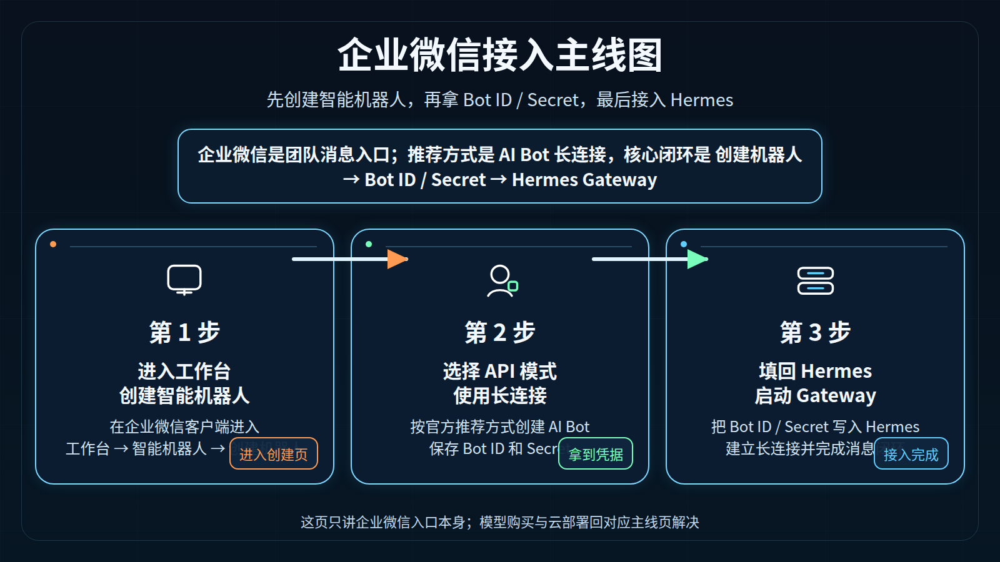
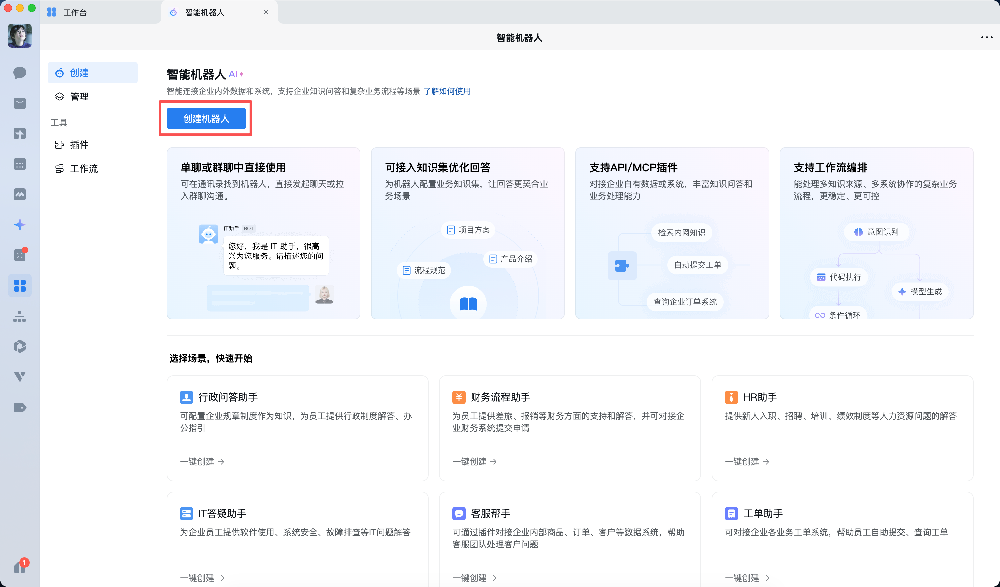

# 06-企业微信（AI Bot）

> 💡 **速答**：Hermes Agent 接入企业微信走官方推荐的 AI Bot 长连接模式——在企业微信里创建智能机器人 → 选 API 模式 + 长连接 → 拿到 Bot ID / Secret → 填入 Hermes 的 `WECOM_BOT_ID` 和 `WECOM_SECRET` → 启动 Gateway。不需要公网回调地址。

> 🎯 一句话结论：如果你的团队主协作平台是企业微信，而且你希望用**官方推荐的 AI Bot 长连接方式**把 Hermes 接进去，那么这页要帮你先把"创建机器人 → 获取 Bot ID / Secret → 填回 Hermes"这条主线走顺。

这一页只讲**企业微信消息入口**本身，不重复展开：

- 模型怎么买
- 云服务器怎么买
- Dashboard / Open WebUI 怎么配

## 🚀 企业微信接入主线图



先看图，再记住这页真正的闭环：

- 在企业微信里创建智能机器人
- 选择 API 模式 + 长连接
- 拿到 Bot ID / Secret
- 把凭据填回 Hermes Gateway

## ✨ 这条路适合谁

- 你的组织已经把企业微信作为主协作平台
- 你希望 Hermes 直接进入企业内部聊天与协作场景
- 你更看重企业内触达，而不是公网聊天入口
- 你希望走官方推荐的 AI Bot 长连接方式，而不是先自己搭 URL 回调
- 你已经理解：企业微信页讲的是消息入口，不是第一排错入口

## 📌 先记住这页的核心判断

企业微信这页最重要的，不是“聊天页面开没开”，而是先把 4 件事分清：

1. **企业微信属于 Gateway 消息入口。**
2. **Hermes 官方 WeCom 适配器优先对应的是 AI Bot 长连接网关。**
3. **真正关键的凭据是 Bot ID 和 Secret。**
4. **如果 CLI 没跑顺，企业微信入口出了问题会更难排查。**

所以这页默认服务的是：

- Hermes 本体已经大致可用
- 你现在开始接团队消息入口

## 🧭 最短决策

| 你的情况 | 建议 |
|---|---|
| 你第一次用 Hermes，还没跑顺 CLI | 先回 CLI，不要先做企业微信 |
| 你已经有 Hermes 可用实例，想把它接进企业微信 | 直接看这页 |
| 你需要企业内部正式协作入口 | 企业微信值得优先做 |
| 你只想做浏览器聊天前端 | 不要先做企业微信，先回 Open WebUI |
| 你还没准备好部署环境或模型入口 | 先回对应主线页 |

如果你只想记一句话：

- **企业微信 = 团队消息入口**
- **CLI = 第一主入口**

## 🧱 企业微信这条路到底分几步

从接入角度，这页主线可以压缩成 3 步：

### 第 1 步：在企业微信里创建智能机器人
进入：

- 工作台
- 智能机器人
- 创建机器人

### 第 2 步：选择 API 模式 + 长连接
这是官方对接 Agent 的推荐方式，重点是：

- 用 API 模式创建
- 连接方式选“使用长连接”
- 创建后妥善保存 Bot ID 和 Secret

### 第 3 步：把 Bot ID / Secret 填回 Hermes
Hermes 这边真正需要接住的是：

- `WECOM_BOT_ID`
- `WECOM_SECRET`

然后启动 gateway，让 Hermes 与企业微信的 AI Bot 网关建立长连接。

## 🖼️ 操作截图：进入创建企业微信智能机器人入口



这张官方截图证明的是：

- 你进入的是企业微信的**智能机器人**页面
- 当前所在的是“创建”页
- 页面上已经明确给出 **创建机器人** 的入口按钮

这张图适合作为“进入创建机器人入口”这一步的官方操作证据。

## 🔧 官方推荐方式到底是什么

结合企业微信官方文档和 Hermes 官方 WeCom 文档，这页最关键的技术判断其实非常清楚：

### 企业微信官方推荐的机器人创建方式
企业微信官方文档明确指出：

- 推荐通过 **API 模式（长连接）** 创建智能机器人
- 这种方式支持：
  - 被动回复多条消息
  - 主动向用户发消息
- 并且会生成：
  - `Bot ID`
  - `Secret`

### Hermes 官方 WeCom 适配器对应的接入方式
Hermes 官方文档则明确写了：

- WeCom adapter 使用 **WeCom AI Bot WebSocket gateway**
- 核心连接地址是：
  - `wss://openws.work.weixin.qq.com`
- 并且：
  - **不需要公网回调地址 / webhook**
  - 本质上走的是**长连接**而不是公开 HTTP callback

所以把这两边对上以后，你会发现这页真正的推荐路线是一致的：

- 企业微信侧：创建 AI Bot，选 API 模式 + 长连接
- Hermes 侧：填入 `WECOM_BOT_ID` 和 `WECOM_SECRET`，启动 gateway 建立 WebSocket 长连接

## ✅ 先把最短闭环跑通

下面这部分是这页真正的操作主线。

---

## 第 1 步：先确认现在适不适合做企业微信接入

现在做什么：
- 先判断当前环境是否已经具备接企业微信的最小前提

为什么做：
- 企业微信是消息触达层，不是基础排错层
- 如果 Hermes 本体还没跑顺，这里出问题会很难判断是哪一层错了

先确认这 3 件事：

- Hermes 至少已经能在 CLI 里正常工作
- 你已经有可用模型入口
- 当前环境已经具备运行 gateway 的条件

看到什么算成功：
- 你已经能确认“CLI 是通的”“模型是可用的”“现在只是开始接企业微信入口”

如果没成功先查什么：
- 回 [04-命令行（CLI）](./04-命令行（CLI）.md)
- 回 [01-国内部署 | 总览](../01-国内部署/01-总览.md)
- 回 [02-国内模型 | 总览](../02-国内模型/01-总览.md)

---

## 第 2 步：在企业微信里进入创建机器人入口

现在做什么：
- 在企业微信客户端里进入智能机器人创建页

为什么做：
- 企业微信这条路的第一动作，不是先改 Hermes 配置，而是先在企业微信里拥有一个真正的 AI Bot

官方路径可以理解成：

- 工作台
- 智能机器人
- 创建机器人
- 手动创建

看到什么算成功：
- 你进入的是智能机器人创建流程
- 能看到创建机器人入口，而不是普通群机器人页或其他应用页

如果没成功先查什么：
- 是否进入了错误的菜单
- 当前企业微信版本是否过旧
- 你是否具备创建智能机器人的权限

---

## 第 3 步：选择 API 模式，并使用长连接

现在做什么：
- 在创建机器人过程中选择 **API 模式**，连接方式选 **使用长连接**

为什么做：
- 这是企业微信官方文档中对接 Agent 的推荐方式
- Hermes 官方 WeCom adapter 也正是围绕 AI Bot WebSocket 长连接来设计的

你在这一页至少要记住：

- 不要先默认走 URL 回调
- 长连接方式对 Hermes 这条主线更自然
- 页面里会生成 Bot ID 和 Secret，后面 Hermes 要用

看到什么算成功：
- 页面已经进入 API 配置区
- 连接方式明确选中了“使用长连接”
- 系统生成或展示 Bot ID 与 Secret

如果没成功先查什么：
- 是否选错了创建模式
- 是否还停留在普通创建页
- 是否误把 URL 回调方式当主线

---

## 第 4 步：保存 Bot ID 与 Secret

现在做什么：
- 保存企业微信返回的 Bot ID 和 Secret

为什么做：
- 这两个值是 Hermes 侧最关键的入口凭据

Hermes 官方 WeCom 适配器需要的就是：

```dotenv
WECOM_BOT_ID=your-bot-id
WECOM_SECRET=your-secret
```

看到什么算成功：
- 你已经能读取并保存 Bot ID / Secret
- 不是只停留在“机器人建好了”的页面

如果没成功先查什么：
- 是否真正完成了 API 模式创建
- 是否只看到了创建向导，但没有保存凭据
- 是否忽略了 Secret 的保密要求

---

## 第 5 步：把凭据填回 Hermes

现在做什么：
- 把 Bot ID / Secret 写入 Hermes

为什么做：
- 企业微信应用创建成功，不等于 Hermes 已经接通
- 真正的闭环是 Hermes gateway 用这些凭据连到企业微信 AI Bot 网关

Hermes 官方文档给出的最短 `.env` 形态是：

```dotenv
WECOM_BOT_ID=your-bot-id
WECOM_SECRET=your-secret
```

如果你还要做访问控制，还可以再加：

```dotenv
WECOM_ALLOWED_USERS=user_id_1,user_id_2
WECOM_HOME_CHANNEL=chat_id
```

看到什么算成功：
- Hermes 已经写入所需凭据
- 不是只在企业微信后台完成了应用创建

如果没成功先查什么：
- 凭据是否填错
- `.env` 是否真的生效
- 是否把别的企业微信 Secret / 应用 Secret 混进来了

---

## 第 6 步：启动 Hermes Gateway

现在做什么：
- 启动 gateway，让 Hermes 与企业微信建立实际连接

怎么做：

```bash
hermes gateway
```

为什么做：
- 这一步才是让企业微信入口真正“活起来”的动作

看到什么算成功：
- Gateway 正常启动
- 企业微信入口没有立即报错缺失凭据
- 后续可以在企业微信中与 Hermes 进行实际消息交互

如果没成功先查什么：
- `WECOM_BOT_ID` 是否填写
- `WECOM_SECRET` 是否填写
- Gateway 是否使用了正确配置文件 / profile

## ❓FAQ

### 1. 企业微信是不是 Hermes 的第一主入口？
不是。

第一主入口仍然是 CLI。
企业微信是团队消息触达入口。

### 2. 企业微信页和飞书页的本质区别是什么？
两者都属于团队消息入口，但企业微信这页更明确强调：

- 官方推荐的是 AI Bot 长连接模式
- Hermes 官方 WeCom adapter 也是围绕这条线设计的

### 3. 企业微信一定要公网回调地址吗？
对 Hermes 官方 WeCom adapter 这条主线来说，不是必须。

因为 Hermes 官方文档明确指出：

- WeCom adapter 使用 AI Bot WebSocket gateway
- **no public endpoint or webhook needed**

### 4. 企业微信机器人创建完成后，为什么 Hermes 还不能用？
因为“创建完成”只代表企业微信侧准备好了。

你还需要：

- 保存 Bot ID / Secret
- 写入 Hermes
- 启动 Gateway

### 5. 我现在应该先做企业微信，还是先做 CLI？
默认还是先做 CLI。

只有在 CLI 已经跑顺之后，再做企业微信接入，排错成本才最低。

## ⚠️ 风险点与默认建议

### 1. 不要把“创建机器人成功”当成“接入已经完成”
企业微信里看到机器人创建成功，只说明企业微信侧准备好了。

真正完成还要看：

- Bot ID / Secret 是否保存好了
- Hermes 是否写入这些凭据
- Gateway 是否成功建立连接

### 2. 不要把企业微信入口当成第一排错层
如果 CLI 没跑顺、模型没配好、Gateway 没跑起来，你在企业微信里看到的可能只是“机器人不回话”，但根本不知道错在哪层。

### 3. Bot Secret 必须当作敏感凭据管理
Hermes 官方文档明确提醒：

- 拿到这个 Secret 的人，就可以冒充你的机器人。

也就是说：

- Secret 不能随便传播
- 不能直接写进公开文档或截图
- 不能把敏感凭据长期裸露在群里或工单里

### 默认建议

如果你问我：企业微信这页最稳的使用顺序是什么？

我会建议你按这个顺序：

1. 先确认 CLI 已经跑顺
2. 再在企业微信里创建智能机器人
3. 明确选 API 模式 + 长连接
4. 保存 Bot ID / Secret
5. 再把凭据填回 Hermes Gateway

也就是说：

- 企业微信非常适合做企业内部消息入口
- 但它不是第一步
- 它是“本体已经大致可用之后的团队触达层”

## 📎 官方依据

- https://hermes-agent.nousresearch.com/docs/user-guide/messaging/wecom
- https://open.work.weixin.qq.com/help2/pc/21657
- https://developer.work.weixin.qq.com/document/path/101463

## ➡️ 下一步

- 前进到 [07-钉钉](./07-钉钉.md)
- 回 [01-总览](./01-总览.md)

---

## 🔗 国内入口关联路径

- 还没选模型：先看[国内模型](/docs/china/models)，避免入口跑通后模型不可用。
- 想暴露给前端或 Open WebUI：看[把 Hermes 暴露成后端服务](/docs/start/build/api-server)和[API 服务与 Open WebUI](/docs/china/entry/api-service-open-webui)。
- 要接消息平台：先看[飞书](/docs/china/entry/feishu)、[企业微信](/docs/china/entry/wecom-ai-bot)、[钉钉](/docs/china/entry/dingtalk)或[个人微信](/docs/china/entry/personal-wechat)。
- 推送或回调异常：去[Gateway Messaging 与推送问题](/docs/issues/gateway-messaging)排查。
