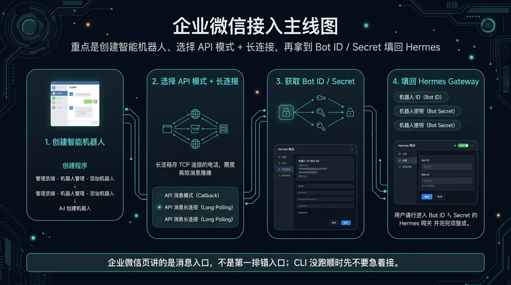
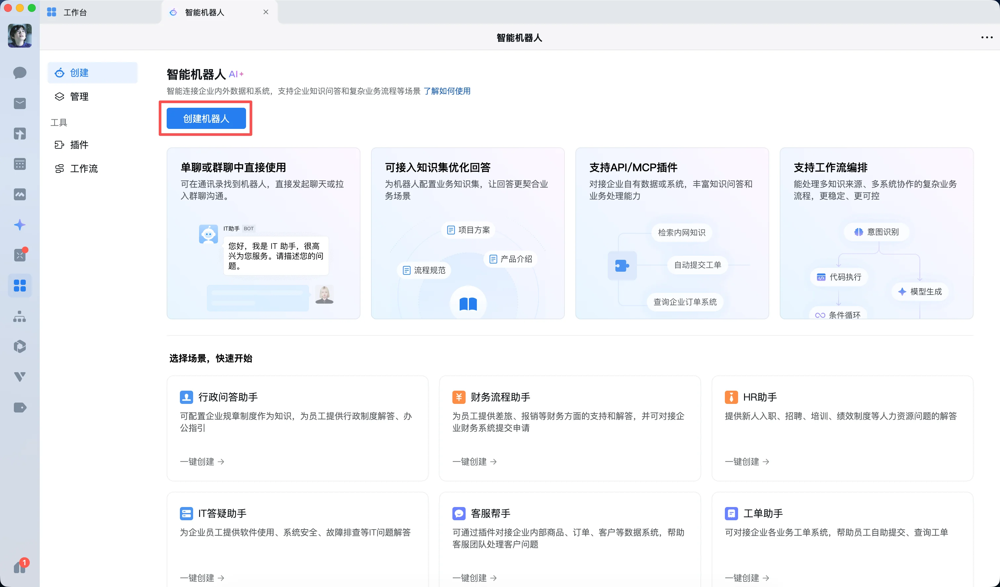

# 企业微信接入指南 (AI Bot)

如果你的团队主协作平台是企业微信，那么这一页将帮你把 Hermes Agent 无缝地“请”进团队，成为每个人的智能助理。

我们将走官方推荐的 **AI Bot 长连接**路线，这种方式无需公网 IP 和复杂的回调配置，稳定又高效。



> **一句话结论**：先在企业微信后台创建 AI 机器人拿到凭据，再把凭据填回 Hermes 启动 Gateway，两边就通了。

## 🔎 搜索收录速答

企业微信机器人适合把 Hermes 接到团队群、运维群或内容协作群里，核心链路是：企业微信回调接收消息、服务端调用 Hermes、再把结果回写到群聊。上线前要先处理公网 HTTPS、签名校验、超时重试和权限边界。相关入口还可以对比[飞书](/docs/china/entry/feishu)、[钉钉](/docs/china/entry/dingtalk)和[API 服务与 Open WebUI](/docs/china/entry/api-service-open-webui)。


## 🚀 接入三步走

在开始之前，请确保你的 Hermes Agent 至少已经在命令行（CLI）里跑通了。企业微信是消息入口，不是排错的第一站。

### 第 1 步：在企业微信创建 AI Bot

进入企业微信工作台，找到“智能机器人”功能，创建一个新的机器人。

- **关键点**：选择 **API 模式**，连接方式选择 **使用长连接**。

这是企业微信官方为 Agent 类应用推荐的方式，也是 Hermes 适配器支持得最好的方式。



### 第 2 步：获取凭据

创建成功后，企业微信会提供给你两样关键的东西：
- **Bot ID**
- **Secret**

请妥善保管它们，尤其是 `Secret`，它就像是机器人的密码，绝不能泄露。

### 第 3 步：配置并启动 Hermes Gateway

现在，回到 Hermes Agent 这边。你需要将刚才获取的凭据配置到 `.env` 文件中：

```dotenv
WECOM_BOT_ID=your-bot-id
WECOM_SECRET=your-secret
```

配置好后，启动 Gateway 服务：

```bash
hermes gateway
```

如果终端没有报错，恭喜你！你的 Hermes Agent 已经成功接入企业微信，你可以在对应的机器人聊天窗口里和它对话了。

## 💡 应用场景示例：把 Agent 变成你的团队助理

仅仅是接入对话还不够，企业微信真正的威力在于成为自动化工作流的“通知中心”和“交互入口”。

### 场景一：7x24 小时服务器状态监控与告警

让 Agent 成为一名“数字运维工程师”，不知疲倦地监控服务器状态，并在异常发生时第一时间通过企业微信告警。

**目标**：定时监控服务器的磁盘空间和 Nginx 服务状态。当指标异常时，立即通过企业微信发送告警；一切正常时，则保持沉默。


**核心思路**：
1.  创建一个高频（例如每 5 分钟）运行的 `cronjob` 定时任务。
2.  这个任务不直接执行 prompt，而是执行一个本地的监控脚本 (`script`)。
3.  监控脚本负责检查系统状态，**只在发现异常时才打印告警信息**。
4.  Cron 任务会将脚本的输出（也就是告警信息）通过企业微信发送出来。如果脚本没有输出，则万事大吉，企微保持安静。

**1. 监控脚本示例 (`/opt/hermes/scripts/server_watchdog.sh`)**
```bash
#!/bin/bash
DISK_USAGE_THRESHOLD=90

# 检查磁盘使用率
DISK_USAGE=$(df -h / | awk 'NR==2 {print $5}' | sed 's/%//')
if [ "$DISK_USAGE" -gt "$DISK_USAGE_THRESHOLD" ]; then
  echo "🚨 **【一级告警：磁盘空间不足】**
- **服务器**: prod-server-01
- **当前使用率**: $DISK_USAGE% (阈值: $DISK_USAGE_THRESHOLD%)
- **建议**: 请立即登录服务器清理空间！"
fi

# 检查 Nginx 服务状态
if ! systemctl is-active --quiet nginx; then
  echo "🔥 **【紧急告警：Nginx 服务已停止】**
- **服务器**: prod-server-01
- **服务**: Nginx
- **建议**: 请立即重启服务并检查日志！"
fi
```

**2. 创建 Cron 任务**
```
cronjob(
  action='create',
  name='server-watchdog-alert',
  schedule='every 5m',
  script='/opt/hermes/scripts/server_watchdog.sh',
  no_agent=True, # 直接运行脚本，高效稳定
  deliver='wecom:your_admin_chat_id' # 将结果发送到指定的企微群或用户
)
```
这样，你就拥有了一个 7x24 小时工作的、任劳任怨且“健康则沉默”的运维助理。

### 场景二：每日信息聚合与推送

让 Agent 成为团队的“信息官”，每天自动搜集特定主题的最新动态，整理成日报推送到团队群。

**目标**：创建一个定时任务，每天早上 9 点自动搜索“AI Agent”的最新资讯，并将摘要发送到企业微信群。

**核心思路**：
1.  创建一个每天早上 9 点执行的 `cronjob`。
2.  这次我们使用 `prompt`，让 Agent 自己去执行搜索、分析和总结的任务。
3.  将 `deliver` 参数指定为目标企业微信群。

**创建 Cron 任务**
```
cronjob(
  action='create',
  name='ai-agent-daily-briefing',
  schedule='0 9 * * *',
  prompt="""
  请使用 web_search 搜索最新的'AI Agent'相关技术文章和新闻（过去24小时内），
  然后将最重要的 3-5 条结果汇总成一个摘要。
  摘要应包含标题、链接和一句话介绍。
  请确保排版清晰，适合在企业微信群中阅读。
  """,
  deliver='wecom:your_team_chat_id'
)
```
设置好后，你的团队就能每天准时收到一份高质量的行业动态简报，轻松保持信息同步。

## ➡️ 下一步
- **探索更多场景**：你可以举一反三，创造更多工作流，例如审批提醒、知识库更新同步等。
- **深入了解 Cron Job**：阅读 Cron Job 的相关文档，学习更多高级用法。

## 📖 出处
- [Hermes Agent 官方文档：cronjob](/docs/hermes-agent/tools/cronjob)
- [Hermes Agent 官方文档：gateway](/docs/hermes-agent/concepts/gateway)
