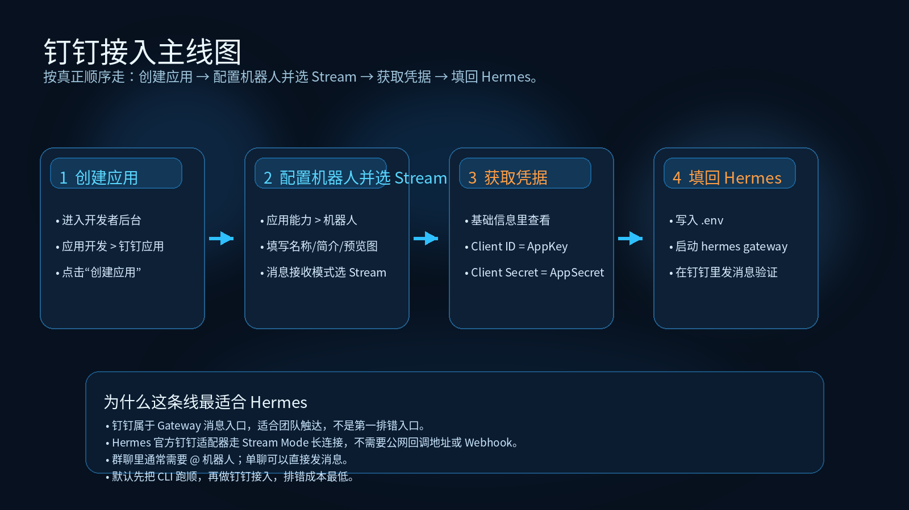
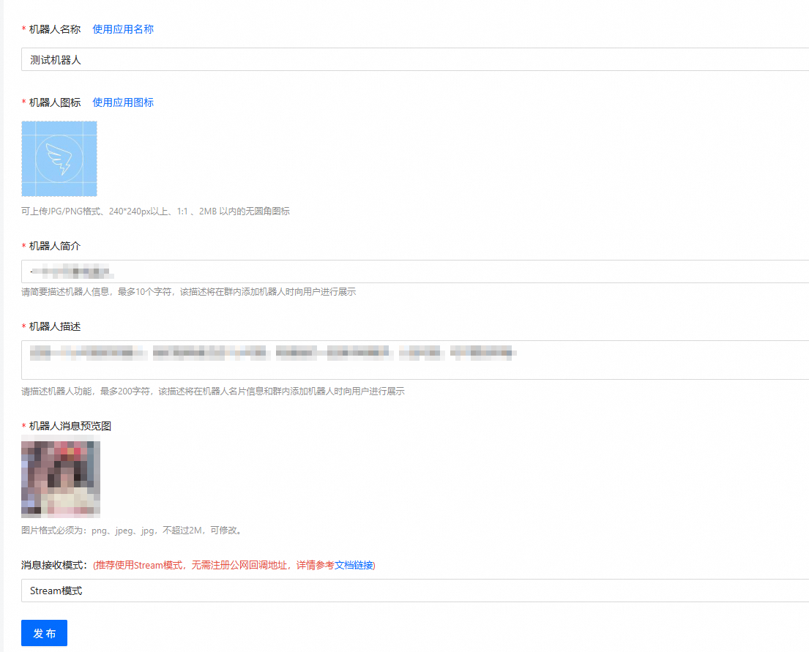

# 07-钉钉

> 🎯 一句话结论：如果你的团队本来就在钉钉里协作，而且你希望用 **官方推荐的 Stream 模式** 把 Hermes 接进去，那么这页要帮你先把“创建应用 → 配置机器人并选 Stream → 获取 Client ID / Client Secret → 填回 Hermes”这条主线跑顺。

这一页只讲 **钉钉消息入口** 本身，不重复展开：

- 模型怎么买
- 云服务器怎么买
- Dashboard / Open WebUI 怎么配

## 🚀 钉钉接入主线图



先看图，再记住这页真正的闭环：

- 在钉钉开发者后台创建应用
- 打开应用能力里的机器人配置
- 消息接收模式选择 **Stream**
- 拿到 `Client ID` / `Client Secret`
- 把凭据填回 Hermes Gateway

## ✨ 这条路适合谁

- 你的组织已经把钉钉作为主协作平台
- 你希望 Hermes 直接进入团队日常沟通场景
- 你希望走钉钉官方推荐的 Stream 模式，而不是先搭公网回调地址
- 你需要群聊 / 单聊里的团队触达入口
- 你已经理解：钉钉页讲的是消息入口，不是第一排错入口

## 📌 先记住这页的核心判断

钉钉这页最重要的，不是“机器人能不能回话”，而是先把 5 件事分清：

1. **钉钉属于 Gateway 消息入口。**
2. **Hermes 官方钉钉适配器走的是 Stream Mode 长连接。**
3. **这条主线不需要公网回调地址 / Webhook。**
4. **真正关键的凭据是 `DINGTALK_CLIENT_ID` 和 `DINGTALK_CLIENT_SECRET`。**
5. **如果 CLI 没跑顺，钉钉入口出了问题会更难排查。**

所以这页默认服务的是：

- Hermes 本体已经大致可用
- 你现在开始接团队消息入口

## 🧭 最短决策

| 你的情况 | 建议 |
|---|---|
| 你第一次用 Hermes，还没跑顺 CLI | 先回 CLI，不要先做钉钉 |
| 你已经有 Hermes 可用实例，想接入钉钉 | 直接看这页 |
| 你需要企业团队统一入口 | 钉钉值得优先做 |
| 你只想先做浏览器聊天前端 | 不要先做钉钉，先回 Open WebUI |
| 你还没准备好部署环境或模型入口 | 先回对应主线页 |

如果你只想记一句话：

- **钉钉 = 团队消息入口**
- **CLI = 第一主入口**

## 🧱 钉钉这条路到底分几步

从接入角度，这页主线可以压缩成 4 步：

### 第 1 步：创建钉钉应用
进入钉钉开发者后台后，先走：

- 应用开发
- 企业内部应用
- 钉钉应用
- 创建应用

### 第 2 步：配置机器人，并把消息接收模式选成 Stream
在应用详情页里：

- 进入 **应用能力 > 机器人**
- 填写机器人名称、简介、描述、预览图
- 消息接收模式选 **Stream 模式**

### 第 3 步：拿到 Client ID / Client Secret
应用创建完成后，去：

- 基础信息
- 凭证与基础信息

这里要拿到的就是：

- `Client ID`（对应 AppKey）
- `Client Secret`（对应 AppSecret）

### 第 4 步：把凭据填回 Hermes 并启动 Gateway
Hermes 这边最关键的是：

- `DINGTALK_CLIENT_ID`
- `DINGTALK_CLIENT_SECRET`
- `DINGTALK_ALLOWED_USERS`

然后启动 gateway，让 Hermes 真正连上钉钉 Stream Mode。

## 🖼️ 操作截图：配置机器人并选择 Stream 模式



这张官方截图证明的是：

- 你进入的是钉钉的**机器人配置表单**
- 页面里可以填写机器人名称、简介、描述、消息预览图
- 页面底部存在 **消息接收模式** 配置项
- 当前接收模式已经明确选择为 **Stream 模式**

这张图适合作为“配置机器人并选 Stream”这一步的官方操作证据。

## 🔧 官方推荐方式到底是什么

把钉钉官方文档和 Hermes 官方钉钉文档对在一起看，这条路线其实非常清楚。

### 钉钉官方推荐的接入方式
钉钉官方 Stream 模式文档明确强调：

- Stream 模式通过 **WebSocket 长连接** 与钉钉平台通信
- 不需要公网服务器、IP、域名
- 不需要先走传统 Webhook 回调模式
- 机器人回调的固定 topic 是：`/v1.0/im/bot/messages/get`

### Hermes 官方钉钉适配器对应的方式
Hermes 官方钉钉文档也明确写了：

- Hermes 钉钉适配器使用 **Stream Mode**
- 不需要 public URL / webhook server
- 主要凭据是：
  - `DINGTALK_CLIENT_ID`
  - `DINGTALK_CLIENT_SECRET`
- 建议设置：
  - `DINGTALK_ALLOWED_USERS`

所以把两边对上以后，你会发现这页真正的主线是一致的：

- 钉钉侧：创建应用，开启机器人能力，消息接收模式选 Stream
- Hermes 侧：填写 `DINGTALK_CLIENT_ID` / `DINGTALK_CLIENT_SECRET`，启动 gateway 通过 Stream Mode 建立长连接

## ✅ 先把最短闭环跑通

下面这部分是这页真正的操作主线。

---

## 第 1 步：先确认现在适不适合做钉钉接入

现在做什么：
- 先判断当前环境是否已经具备接钉钉的最小前提

为什么做：
- 钉钉是消息触达层，不是基础排错层
- 如果 Hermes 本体还没跑顺，这里出问题会很难分清是哪一层错了

先确认这 3 件事：

- Hermes 至少已经能在 CLI 里正常工作
- 你已经有可用模型入口
- 当前环境已经具备运行 gateway 的条件

看到什么算成功：
- 你已经能确认“CLI 是通的”“模型是可用的”“现在只是开始接钉钉入口”

如果没成功先查什么：
- 回 CLI 页
- 回部署总览
- 回模型总览

---

## 第 2 步：在钉钉开发者后台创建应用

现在做什么：
- 登录钉钉开发者后台，先创建一个企业内部应用

为什么做：
- 钉钉入口不是先改 Hermes 配置，而是先在钉钉侧拥有一个真正可接机器人的应用容器

怎么做：
- 进入钉钉开发者后台
- 走 **应用开发 > 企业内部应用 > 钉钉应用 > 创建应用**
- 填写应用名称、应用描述
- 保存后进入应用详情页

看到什么算成功：
- 应用已经创建成功
- 你能进入这个应用的详情页，而不是还停留在应用列表页

如果没成功先查什么：
- 是否进入了错误的后台页面
- 是否没有创建企业内部应用权限
- 是否还停留在“创建应用”入口，没有真正保存成功

---

## 第 3 步：开启机器人能力，并把消息接收模式选成 Stream

现在做什么：
- 在应用详情页中配置机器人，并把接收模式选成 **Stream**

为什么做：
- 这一页的关键不是“有了应用”就结束，而是要让这个应用变成一个真正能和 Hermes 连起来的钉钉机器人入口

怎么做：
- 进入 **应用能力 > 机器人**
- 填写机器人名称、机器人简介、机器人描述、机器人消息预览图
- 在 **消息接收模式** 中选择 **Stream 模式**
- 保存 / 发布机器人配置

看到什么算成功：
- 机器人配置已经保存
- 页面中的消息接收模式明确是 **Stream 模式**
- 你不是停在 HTTP 回调模式

如果没成功先查什么：
- 是否进入了错误的应用能力页
- 是否还没真正开启机器人能力
- 是否误把 HTTP 模式当成主线

---

## 第 4 步：找到 Client ID 与 Client Secret

现在做什么：
- 在应用基础信息页里查看凭据

为什么做：
- 对 Hermes 来说，真正关键的不是“你创建了应用”，而是你有没有把应用凭据带回来

怎么做：
- 进入 **基础信息 > 凭证与基础信息**
- 记录：
  - `Client ID`
  - `Client Secret`

这两个值在理解上可以直接对应成：

- `Client ID = AppKey`
- `Client Secret = AppSecret`

看到什么算成功：
- 你已经能读取并保存 Client ID / Client Secret
- 不是只停留在“应用创建完成”或“机器人配置完成”的页面

如果没成功先查什么：
- 是否真的进入了基础信息页
- 是否只创建了应用，但还没找到凭据页
- 是否漏保存了 Client Secret

---

## 第 5 步：把凭据填回 Hermes

现在做什么：
- 把钉钉凭据写入 Hermes 配置

为什么做：
- 钉钉应用创建成功，不等于 Hermes 已经接通
- 真正闭环是 Hermes gateway 用这些凭据连上钉钉 Stream Mode

Hermes 官方文档给出的最短 `.env` 形态可以理解成：

```dotenv
DINGTALK_CLIENT_ID=your-app-key
DINGTALK_CLIENT_SECRET=your-app-secret
DINGTALK_ALLOWED_USERS=your-user-id
```

这里最值得先记住的是：

- `DINGTALK_CLIENT_ID` 和 `DINGTALK_CLIENT_SECRET` 是入口必填凭据
- `DINGTALK_ALLOWED_USERS` 用来限制谁可以和机器人交互
- 不建议把一个对所有人开放的机器人直接裸跑起来

看到什么算成功：
- Hermes 已经写入所需钉钉凭据
- 不是只在钉钉后台完成了应用创建

如果没成功先查什么：
- 凭据是否填错
- `.env` 是否真的生效
- 是否忘了设置允许交互用户

---

## 第 6 步：启动 Hermes Gateway 并做第一条验证

现在做什么：
- 启动 gateway，让 Hermes 和钉钉建立实际连接

怎么做：

```bash
pip install "hermes-agent[dingtalk]"
hermes gateway
```

为什么做：
- 这一步才是让钉钉入口真正“活起来”的动作

看到什么算成功：
- Gateway 正常启动
- 没有立即报错缺失 `DINGTALK_CLIENT_ID` / `DINGTALK_CLIENT_SECRET`
- 你可以在钉钉里给机器人发第一条测试消息

这里还要记住一条平台行为：

- **单聊**：通常可以直接给机器人发消息
- **群聊**：通常需要 **@机器人**，否则 Hermes 不会响应

如果没成功先查什么：
- `DINGTALK_CLIENT_ID` 是否填写
- `DINGTALK_CLIENT_SECRET` 是否填写
- `DINGTALK_ALLOWED_USERS` 是否包含当前钉钉用户 ID
- 当前是在群聊里没 @ 机器人，还是根本没有连上 gateway

## 🔒 这页最需要注意的风险点

### 1. 不要把“应用建好了”当成“钉钉入口已经通了”
钉钉后台里看到应用存在，只说明钉钉侧准备好了。

真正完成还要看：

- 机器人能力是否配置完成
- 消息接收模式是否是 Stream
- Client ID / Client Secret 是否已经写回 Hermes
- Gateway 是否真的启动并连上

### 2. 不要把 HTTP 回调模式当成默认主线
这页默认主线不是先去做公网回调地址，而是：

- 创建应用
- 配置机器人
- 直接选 Stream 模式
- 让 Hermes 通过长连接接入

如果你没特殊理由，不建议先绕去做 HTTP 回调那条线。

### 3. Client Secret 要当作敏感凭据管理
和企业微信一样，钉钉的 Client Secret 也不能乱传、不能进公开仓库、不能贴到截图里长期暴露。

### 4. 不要忘了限制可交互用户
如果你不设置 `DINGTALK_ALLOWED_USERS`，后面最常见的问题会变成：

- 谁能用机器人你心里没数
- 机器人看起来在线，但访问控制很混乱

### 5. 不要还没跑顺 CLI 就先做钉钉
如果基础链路没跑通，钉钉里的现象通常只会表现为“机器人没反应”，但你很难快速判断问题到底出在：

- 模型
- Hermes 配置
- Gateway
- 平台权限

## ❓FAQ

### 1. 钉钉是不是 Hermes 的第一主入口？
不是。

第一主入口仍然是 CLI。
钉钉是团队消息触达入口。

### 2. 钉钉这页和企业微信 / 飞书页的本质区别是什么？
三者都属于团队消息入口，但钉钉这页更明确强调：

- 钉钉官方推荐的是 **Stream 模式**
- Hermes 官方钉钉适配器也正是围绕这条线设计的

### 3. 钉钉一定要公网回调地址吗？
对 Hermes 官方钉钉适配器这条主线来说，不是必须。

因为官方 Stream 模式文档明确说明：

- 通过 WebSocket 长连接接入
- 不需要公网服务器、IP、域名

### 4. 我已经创建了钉钉应用，为什么 Hermes 还不能用？
因为“应用创建完成”只代表钉钉侧有了容器。

你还需要：

- 开启机器人能力
- 选择 Stream 模式
- 保存 Client ID / Client Secret
- 写入 Hermes
- 启动 gateway

### 5. 群里为什么机器人不回话？
最常见先查两件事：

- 你是不是在群聊里没有 **@机器人**
- `DINGTALK_ALLOWED_USERS` 里有没有你的钉钉用户 ID

### 6. 我现在应该先做钉钉，还是先做 CLI？
默认还是先做 CLI。

只有在 CLI 已经跑顺之后，再做钉钉接入，排错成本才最低。

## ✅ 默认建议

如果你问我：钉钉这页最稳的使用顺序是什么？

我会建议你按这个顺序：

1. 先确认 CLI 已经跑顺
2. 在钉钉开发者后台创建应用
3. 配置机器人，并把消息接收模式选成 Stream
4. 保存 Client ID / Client Secret
5. 再把凭据填回 Hermes Gateway
6. 启动 gateway，在钉钉里做第一条消息验证

也就是说：

- 钉钉非常适合做团队内部消息入口
- 但它不是第一步
- 它是“本体已经大致可用之后的团队触达层”

## ➡️ 下一步

完成后进入：

- 如果你想回到入口模块重新确认位置，回 [01-总览](./01-总览.md)
- 如果你还没把 Hermes 本体跑顺，先回 [04-命令行（CLI）](./04-命令行（CLI）.md)
- 如果你还没把环境准备好，先回 [01-国内部署 / 01-总览](../01-国内部署/01-总览.md)
- 如果你还没决定模型路线，先回 [02-国内模型 / 01-总览](../02-国内模型/01-总览.md)

## 📎 官方依据

- https://hermes-agent.nousresearch.com/docs/user-guide/messaging/dingtalk
- https://open.dingtalk.com/document/development/introduction-to-stream-mode
- https://open.dingtalk.com/document/dingstart/create-application
- https://open.dingtalk.com/document/dingstart/configure-the-robot-application
