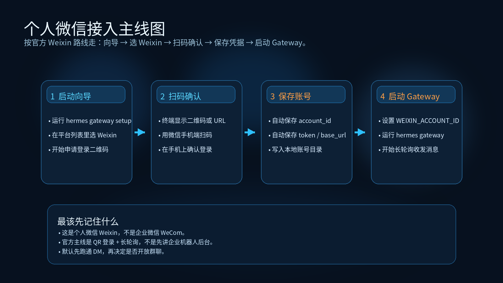
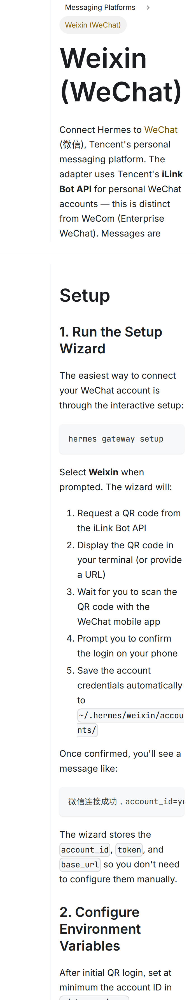

# 08-个人微信

> 🎯 一句话结论：如果你希望把 Hermes 放进自己最常用的移动端聊天入口里，随时随地直接发消息提问，那么这页要帮你先把“运行 Setup Wizard → 选择 Weixin → 扫终端二维码 → 手机确认登录 → 保存账号凭据 → 启动 Gateway”这条主线跑顺。

这一页只讲 **个人微信消息入口** 本身，不重复展开：

- 模型怎么买
- 云服务器怎么买
- Dashboard / Open WebUI 怎么配

## 🚀 个人微信接入主线图



先看图，再记住这页真正的闭环：

- 运行 `hermes gateway setup`
- 在平台列表中选择 **Weixin**
- 让终端显示二维码或登录 URL
- 用微信手机端扫码，并在手机上确认登录
- 让 Hermes 自动保存 `account_id` / `token` / `base_url`
- 再启动 `hermes gateway` 开始长轮询收发消息

## ✨ 这条路适合谁

- 你想把 Hermes 放进自己最常用的个人移动端入口
- 你更在意“随手可问、随手可回”，而不是先搭一个团队平台
- 你希望通过扫码登录快速打通个人微信入口
- 你想先做个人触达、轻量测试、日常陪跑使用
- 你已经理解：个人微信页讲的是消息入口，不是第一排错入口

## 📌 先记住这页的核心判断

个人微信这页最重要的，不是“微信能不能聊天”，而是先把 5 件事分清：

1. **个人微信属于 Gateway 消息入口。**
2. **这页讲的是 Hermes 官方 Weixin adapter，不是企业微信（WeCom）。**
3. **Hermes 官方当前主线是腾讯 iLink Bot API + QR 登录。**
4. **这条线不需要公网回调地址 / Webhook。**
5. **如果 CLI 没跑顺，个人微信入口出了问题会更难排查。**

所以这页默认服务的是：

- Hermes 本体已经大致可用
- 你现在开始接一个个人移动端入口

## 🧭 最短决策

| 你的情况 | 建议 |
|---|---|
| 你第一次用 Hermes，还没跑顺 CLI | 先回 CLI，不要先做个人微信 |
| 你已经有 Hermes 可用实例，想给自己加一个随手可问入口 | 直接看这页 |
| 你想做团队正式协作入口 | 不要先做个人微信，先回飞书 / 企业微信 / 钉钉 |
| 你只想做浏览器聊天前端 | 不要先做个人微信，先回 Open WebUI |
| 你还没准备好部署环境或模型入口 | 先回对应主线页 |

如果你只想记一句话：

- **个人微信 = 个人移动端消息入口**
- **CLI = 第一主入口**

## 🧱 个人微信这条路到底分几步

从接入角度，这页主线可以压缩成 4 步：

### 第 1 步：运行 Hermes 的 Setup Wizard
先从最短主线进入：

- `hermes gateway setup`
- 在交互式向导里选择 **Weixin**

### 第 2 步：扫码并在手机上确认登录
官方文档这一步的核心不是去某个平台后台建应用，而是：

- 请求二维码
- 在终端显示二维码或 URL
- 用微信手机端扫码
- 在手机上确认登录

### 第 3 步：让 Hermes 自动保存个人微信账号凭据
登录完成后，Hermes 会自动保存：

- `account_id`
- `token`
- `base_url`

并把账号信息写到：

- `~/.hermes/weixin/accounts/`

### 第 4 步：把最低限度配置写好，再启动 Gateway
这一页最关键的最小配置是：

- `WEIXIN_ACCOUNT_ID`
- `WEIXIN_DM_POLICY`
- （按需要）`WEIXIN_ALLOWED_USERS`

然后启动 `hermes gateway`，让 Hermes 开始通过长轮询收发个人微信消息。

## 🖼️ 官方文档截图：Setup Wizard + QR 登录主线



这张官方文档截图证明的是：

- 你进入的是 Hermes 的 **Weixin (WeChat)** 文档页
- 页面里明确有 **1. Run the Setup Wizard**
- 命令就是：`hermes gateway setup`
- 后面紧接着就是 **二维码登录 + 手机确认 + 自动保存账号凭据** 的步骤说明

这张图适合作为“个人微信接入主线”的官方操作证据。

## 🔧 官方推荐方式到底是什么

把 Hermes 官方 Weixin 文档对着看，这条线其实非常清楚。

### Hermes 官方 Weixin adapter 的接入方式
官方文档明确写了：

- 这是 **personal WeChat accounts（个人微信）** 的接入页
- 使用的是 **Tencent iLink Bot API**
- 消息通过 **HTTP long-polling** 送达
- **不需要 public endpoint / webhook**
- Setup Wizard 会自动保存：
  - `account_id`
  - `token`
  - `base_url`

### 这页最应该建立的正确理解
和飞书、企业微信、钉钉不一样，个人微信这条线最核心的动作不是先去控制台建机器人，而是：

- 运行 gateway setup
- 选 Weixin
- 扫码登录
- 让 Hermes 自动保存账号
- 再启动 gateway

所以这页真正的主线是：

- 微信侧：扫码 + 手机确认
- Hermes 侧：恢复保存的账号信息，长轮询接入 iLink API

## ✅ 先把最短闭环跑通

下面这部分是这页真正的操作主线。

---

## 第 1 步：先确认现在适不适合做个人微信接入

现在做什么：
- 先判断当前环境是否已经具备接个人微信的最小前提

为什么做：
- 个人微信是消息触达层，不是基础排错层
- 如果 Hermes 本体还没跑顺，这里出问题会很难分清是哪一层错了

先确认这 3 件事：

- Hermes 至少已经能在 CLI 里正常工作
- 你已经有可用模型入口
- 当前环境已经具备运行 gateway 的条件

看到什么算成功：
- 你已经能确认“CLI 是通的”“模型是可用的”“现在只是开始接个人微信入口”

如果没成功先查什么：
- 回 CLI 页
- 回部署总览
- 回模型总览

---

## 第 2 步：运行 Setup Wizard，并选择 Weixin

现在做什么：
- 运行 Hermes 的交互式消息平台向导，并在平台列表中选择 Weixin

为什么做：
- 个人微信这条路的第一动作不是去外部后台手工建应用，而是先让 Hermes 自己拉起官方文档里的 QR 登录流程

怎么做：

```bash
hermes gateway setup
```

然后：

- 在交互式平台列表里选择 **Weixin**
- 继续进入二维码登录流程

看到什么算成功：
- 你已经进入 Weixin 的 setup 分支
- 不是还停在普通说明页或其它平台的配置项里

如果没成功先查什么：
- 是否运行错了命令
- 是否在向导中选错平台
- 当前 Hermes 环境是否缺少消息平台依赖

---

## 第 3 步：让终端给出二维码，并用手机扫码确认

现在做什么：
- 让向导请求二维码，然后用微信手机端扫码，并在手机上确认登录

为什么做：
- 这一步才是个人微信入口真正建立账号绑定关系的动作

怎么做：
- 向导会请求二维码
- 终端中会显示二维码，或者给你一个 URL
- 用微信手机端扫码
- 在手机上确认登录

看到什么算成功：
- 你已经完成扫码与手机确认
- 向导继续往后走，而不是停在“等待扫码”状态

如果没成功先查什么：
- 是否真的用微信手机客户端扫码
- 是否扫码后忘了在手机上确认
- 当前终端二维码是否已经过期，需要重新获取

---

## 第 4 步：确认账号凭据已经自动保存

现在做什么：
- 确认 Hermes 已经自动保存本次登录得到的账号信息

为什么做：
- 对 Hermes 来说，真正关键的不是“你扫过码”，而是登录凭据有没有被保存下来，后续 gateway 能不能恢复它

官方文档明确说明会自动保存：

- `account_id`
- `token`
- `base_url`

保存位置是：

- `~/.hermes/weixin/accounts/`

看到什么算成功：
- 你看到类似：`微信连接成功，account_id=...` 的成功提示
- Hermes 已经写入该账号的凭据文件

如果没成功先查什么：
- 是否真的完成了手机确认
- 是否只扫了码，但流程没有最终确认
- 是否把“看到了二维码”误当成“登录已经完成”

---

## 第 5 步：把最低限度配置写好

现在做什么：
- 在 `.env` 里写入至少能跑起来的个人微信配置

为什么做：
- 向导能自动保存凭据，但你仍然需要把最小使用策略明确下来，至少让 Hermes 知道当前要用哪个账号

最小可以先理解成：

```dotenv
WEIXIN_ACCOUNT_ID=your-account-id
WEIXIN_DM_POLICY=open
```

如果你还想限制谁可以私聊你，可以再加：

```dotenv
WEIXIN_DM_POLICY=allowlist
WEIXIN_ALLOWED_USERS=user_id_1,user_id_2
```

如果你要控制群聊响应范围，还会涉及：

```dotenv
WEIXIN_GROUP_POLICY=disabled
WEIXIN_GROUP_ALLOWED_USERS=group_id_1,group_id_2
```

这页最值得先记住的是：

- `WEIXIN_ACCOUNT_ID` 是最小必填识别项
- 个人微信默认更适合先跑通私聊
- 群聊策略建议后开，不要一开始就放太大范围

看到什么算成功：
- `.env` 已经有可识别的个人微信账号配置
- 你知道当前是开放 DM、白名单 DM，还是先禁掉群聊

如果没成功先查什么：
- 是否漏填 `WEIXIN_ACCOUNT_ID`
- 是否把 DM / Group policy 写混了
- 是否忘了先决定“先跑通私聊还是先开群聊”

---

## 第 6 步：启动 Hermes Gateway，并先验证私聊闭环

现在做什么：
- 启动 gateway，让 Hermes 通过 Weixin adapter 开始长轮询收发消息

怎么做：

```bash
hermes gateway
```

为什么做：
- 这一步才是让个人微信入口真正“活起来”的动作

看到什么算成功：
- Gateway 正常启动
- 没有立即报错缺失 `WEIXIN_ACCOUNT_ID` 或 `WEIXIN_TOKEN`
- 你能先在个人微信里给 Hermes 发第一条私聊测试消息

这页还要记住两条默认行为：

- **私聊（DM）**：是最适合先跑通的主线
- **群聊（Group）**：默认策略更保守，官方文档里默认 `group_policy` 就不是开放优先

如果没成功先查什么：
- `WEIXIN_ACCOUNT_ID` 是否填写
- 保存的账号凭据是否真的存在
- 当前是否误把 group policy 当成 DM policy
- 是私聊都不通，还是只是群聊没开

## 🔒 这页最需要注意的风险点

### 1. 不要把“扫码成功”当成“个人微信入口已经通了”
扫码只是中间动作，不是最终完成。

真正完成还要看：

- 手机是否确认登录
- 凭据是否被自动保存
- `WEIXIN_ACCOUNT_ID` 是否已配置
- Gateway 是否真正启动并开始长轮询

### 2. 不要把个人微信和企业微信混成一条线
这页讲的是：

- **Weixin（个人微信）**
- Hermes 官方 Weixin adapter
- iLink Bot API
- QR 登录

不是：

- 企业微信 AI Bot
- WeCom WebSocket 网关
- 企业后台建机器人

### 3. 不要一开始就默认放开群聊
官方文档里个人微信的默认群策略就更保守，这不是偶然。

更稳的顺序是：

- 先把 DM 跑通
- 再决定要不要开群
- 再决定群白名单怎么配

### 4. 不要把个人微信当成第一排错入口
如果 CLI 没跑顺、模型没配好、Gateway 没跑起来，你在微信里看到的通常只有“没回话”，但很难立刻知道错在哪层。

### 5. 这页只讲官方 Weixin adapter，不混写别的社区桥接路线
如果你在别处看过 GeWeChat 或其它个人微信桥接方案，这页当前不展开那些路线。

原因很简单：

- 这页只按 Hermes 官方 Weixin 文档主线来写
- 不把官方主线和社区替代路线混成一页

## ❓FAQ

### 1. 个人微信是不是 Hermes 的第一主入口？
不是。

第一主入口仍然是 CLI。
个人微信是个人移动端消息入口。

### 2. 这页为什么不叫企业微信？
因为这页讲的是 **Weixin（个人微信）**，不是 **WeCom（企业微信）**。

两者在官方文档里本来就是两条不同路线。

### 3. 个人微信这条线需要公网回调地址吗？
对 Hermes 官方 Weixin adapter 这条主线来说，不需要。

因为官方文档明确写的是：

- 通过 HTTP long-polling 收消息
- 不需要 public endpoint / webhook

### 4. 我已经扫过二维码，为什么 Hermes 还不能用？
因为真正闭环还包括：

- 手机确认登录
- 自动保存 `account_id` / `token` / `base_url`
- `.env` 至少写入 `WEIXIN_ACCOUNT_ID`
- Gateway 成功启动

### 5. 个人微信默认先开私聊还是先开群聊？
默认先开私聊。

因为官方文档里的默认 group policy 就更保守，先把 DM 跑通，排错成本最低。

### 6. 我现在应该先做个人微信，还是先做 CLI？
默认还是先做 CLI。

只有在 CLI 已经跑顺之后，再做个人微信接入，排错成本才最低。

## ✅ 默认建议

如果你问我：个人微信这页最稳的使用顺序是什么？

我会建议你按这个顺序：

1. 先确认 CLI 已经跑顺
2. 运行 `hermes gateway setup`
3. 在向导里选择 Weixin
4. 扫终端二维码，并在手机上确认登录
5. 确认账号凭据已经自动保存
6. 先把 `WEIXIN_ACCOUNT_ID` 和私聊策略写好
7. 再启动 `hermes gateway` 做第一条私聊验证

也就是说：

- 个人微信非常适合做个人移动端消息入口
- 但它不是第一步
- 它是“本体已经大致可用之后的随手触达层”

## ➡️ 下一步

- 回 [01-总览](./01-%E6%80%BB%E8%A7%88.md)


## 📎 官方依据

- https://hermes-agent.nousresearch.com/docs/user-guide/messaging/weixin
- https://hermes-agent.nousresearch.com/docs/user-guide/messaging/
