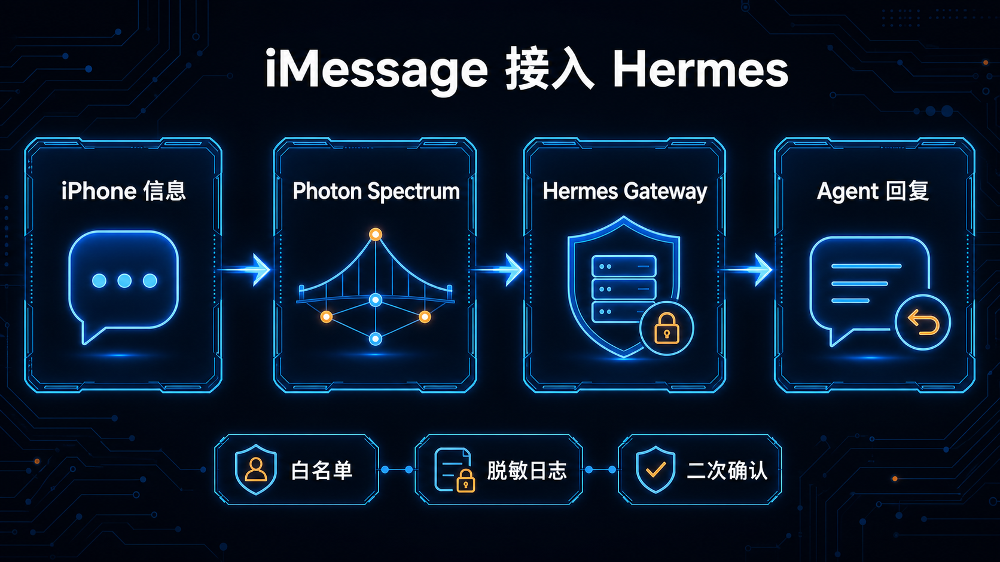

# 09-iMessage 接入（Photon Spectrum）

> 💡 **速答**：iMessage 接入让你可以在苹果设备的原生“信息”里和 Hermes Agent 对话。Photon Spectrum 的目标是降低传统“必须常开一台 Mac 做转发”的门槛，让 iPhone、iPad、Mac 用户有更自然的 Agent 入口。



---

## 适合谁

- 主要使用 iPhone、iPad 或 Mac 的个人用户。
- 希望用原生 iMessage 作为 Agent 入口的人。
- 不想每天打开网页控制台或命令行的人。
- 想把 Hermes 变成随手可问的私人助理的人。

---

## 放在这里的原因

这篇属于：

```text
03-国内落地 / 03-国内入口
```

它不是“玩出花样”里的模型能力，也不是通用深入学习模块。它解决的是入口问题：用户如何在自己常用的通讯入口里触达 Hermes。

---

## 接入前先理解边界

iMessage 接入不是简单的网页聊天，也不是企业微信机器人。它有几个天然边界：

1. **账号和设备要求更高**：通常需要 Apple ID、设备信任链和相关授权。
2. **稳定性取决于网关状态**：消息能否及时到达，取决于 Photon Spectrum 网关是否在线。
3. **安全要求更高**：聊天入口接近私人通信场景，必须谨慎处理日志、Token 和个人信息。
4. **适合轻量交互**：适合提问、提醒、摘要、触发任务，不适合长时间盯着复杂输出。

---

## 工作流概览

一个典型链路是：

```text
iPhone / iPad / Mac
        ↓
iMessage 消息入口
        ↓
Photon Spectrum 网关
        ↓
Hermes Gateway
        ↓
Hermes Agent / Tools / Skills
        ↓
回复回到 iMessage
```

你可以把 Photon Spectrum 理解成“iMessage 世界”和“Hermes Agent 世界”之间的协议桥。

---

## 你可以用它做什么

### 场景 1：随手问 Agent

```text
帮我总结今天这个项目还卡在哪里。
```

Hermes 可以读取项目上下文，返回简短结论。

### 场景 2：触发一个固定任务

```text
检查中文站今天是否有 404，并把异常发给我。
```

如果你已经有对应 Skill 或 cron 任务，iMessage 可以成为触发入口。

### 场景 3：移动端确认

```text
这次部署验证通过了吗？如果通过就继续下一阶段。
```

适合 PM 在外面快速做决策。

---

## 不适合什么

- 大段代码编辑。
- 复杂多文件 review。
- 需要大量表格展示的任务。
- 需要上传大量附件的任务。
- 涉及敏感凭据的直接输入。

这些任务更适合 CLI、桌面端或网页控制台。

---

## 接入准备

正式接入前，请先确认：

- Hermes Gateway 可以正常启动。
- 当前 Hermes profile 已经配置好模型和工具。
- 你知道要把消息路由到哪个 profile。
- Photon Spectrum 的账号、设备或 token 已准备好。
- 你有关闭入口的回滚方案。

建议先在测试 profile 里接入，不要直接接到生产 PM profile。

---

## 示例配置

不同部署方式可能不同，下面是概念示例：

```yaml
imessage:
  enabled: true
  provider: photon-spectrum
  gateway_url: http://127.0.0.1:8640
  profile: default
  allow_senders:
    - "+8613800000000"
  log_level: info
```

关键点：

- `enabled` 控制入口是否开启。
- `gateway_url` 指向 Hermes Gateway。
- `profile` 决定消息进入哪个 Hermes 身份。
- `allow_senders` 用来限制谁能发消息。

实际字段以 Photon Spectrum 和 Hermes 当前版本文档为准。

---

## 实操步骤

### 第一步：确认 Hermes Gateway 可用

```bash
hermes gateway
```

如果是服务器部署，建议用 systemd 或进程管理工具守护，并确认端口只暴露在必要范围内。

### 第二步：配置 Photon Spectrum

准备 Apple/iMessage 相关认证，并把回调目标指向 Hermes Gateway。

示例流程：

```text
photon-spectrum login
photon-spectrum devices
photon-spectrum bind hermes
```

如果你的版本命令不同，以实际工具输出为准。

### 第三步：发送测试消息

从允许的设备发送：

```text
ping
```

期望返回：

```text
pong / Hermes is online
```

### 第四步：测试一个真实任务

```text
总结当前项目最近一次 Dispatch 状态。
```

如果能返回项目状态，说明入口链路已经打通。

---

## 安全建议

### 1. 不要开放任意发送者

入口必须有 allowlist。不要让任意号码都能唤起你的 Agent。

### 2. 不要在 iMessage 里发送密钥

Token、API Key、SSH 私钥等不要通过聊天发送。需要配置时使用安全的服务器环境变量或 secret 文件。

### 3. 日志要脱敏

iMessage 内容可能包含私人信息。日志里应该避免完整记录消息正文，至少要脱敏。

### 4. 高风险动作要二次确认

例如部署、删除、转账、修改 DNS 这类操作，不应该因为一条消息直接执行。

---

## 常见问题

### 收不到回复怎么办

按顺序检查：

1. Hermes Gateway 是否在线。
2. Photon Spectrum 是否在线。
3. 设备是否完成认证。
4. 发送者是否在 allowlist。
5. 日志里是否出现转发失败。

### 为什么回复很慢

可能原因：

- 模型响应慢。
- Gateway 到 Agent 的任务排队。
- Photon Spectrum 网关网络不稳定。
- 消息被拆分或重试。

### 能不能接多个 Hermes profile

可以，但必须明确路由规则。不要让私人消息误入 PM 或生产运维 profile。

---

## 验收方法

完成接入后，用下面清单验收：

- [ ] `hermes gateway` 正常运行。
- [ ] Photon Spectrum 网关在线。
- [ ] allowlist 生效，非授权发送者无法触发 Agent。
- [ ] iMessage 发送 `ping` 能收到回复。
- [ ] 能触发一个只读任务。
- [ ] 高风险任务不会绕过确认。
- [ ] 日志没有明文 Token 或敏感正文。

---

## 推荐使用方式

把 iMessage 当成轻量入口，而不是完整工作台：

- 用它问状态。
- 用它触发已定义任务。
- 用它做确认。
- 用它接收短报告。

复杂配置、代码修改和大规模审计，仍然回到 CLI、桌面端或网页控制台。

---

## ➡️ 下一步

- 上一步：[08-个人微信](./08-个人微信.md)
- 先验证基础交互：[04-命令行（CLI）](/docs/china/entry/cli)
- 下一阶段：[04-从 OpenClaw 过来](../../04-从OpenClaw过来/01-总览.md)
- 回到目录：[03-国内入口](./01-总览.md)
