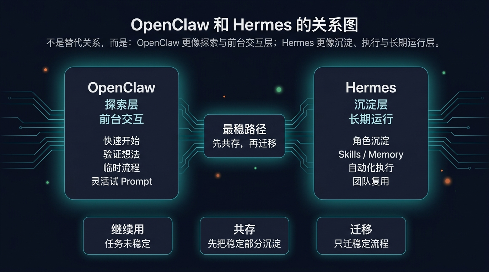
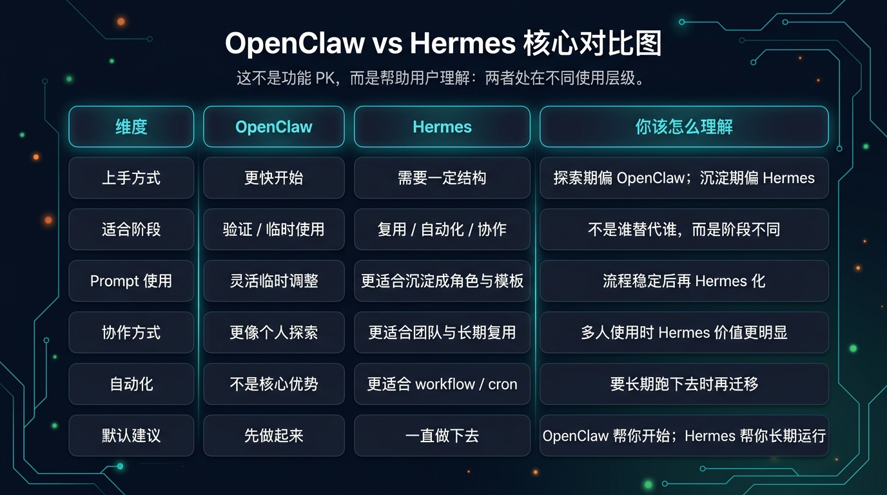

# OpenClaw 和 Hermes 的关系

> 一句话先说清楚：如果你把 Hermes 理解成 OpenClaw 的直接替代品，一开始就容易做错判断。更准确的理解是：OpenClaw 更像实验场，Hermes 更像沉淀层和长期运行层。

## 🎯 这页只解决什么

这一页不教你迁移，也不教你配置。
它只帮你先想清 3 件事：
1. OpenClaw 和 Hermes 不是简单替代关系
2. 它们分别适合什么阶段
3. 为什么大多数用户不该一上来就迁移

如果你现在真正要解决的是“我该继续用、共存，还是迁移”，下一页再看：
- [继续用、共存，还是迁移](./03-继续用、共存，还是迁移.md)

---

## 🧭 一句话先讲清楚

OpenClaw 帮你先做起来，Hermes 帮你一直做下去。

你可以先用这 3 组短句理解：
- OpenClaw：先跑起来 ｜ Hermes：长期跑下去
- OpenClaw：适合探索 ｜ Hermes：适合沉淀
- OpenClaw：更像前台交互 ｜ Hermes：更像后台系统

---

## 🧱 结构图：两者不是替代关系，而是不同层级

这张图最重要的不是“谁更强”，而是先把位置摆对：
- OpenClaw 更适合快速开始、验证需求、试 prompt、试流程
- Hermes 更适合把已经跑通的流程沉淀成角色、技能、模板、记忆和长期执行系统
- 对多数用户来说，最稳的升级方式不是立刻替换，而是先共存、后迁移

---

## 📊 真正会影响判断的差异是什么

这页不是功能 PK 页，也不是拉踩页。真正值得你先看的，不是“谁功能更多”，而是下面这些会改变工作方式的差异：
- 你是继续围绕现有流程微调，还是准备沉淀一套长期复用系统
- 你更在意快速开始，还是更在意后续扩展、协作和自动化
- 你需要的是临时探索，还是稳定流程的长期维护

如果这些差异和你当前工作流无关，它们就不该成为你现在迁移与否的核心理由。

---

## 🧩 用真实场景理解两者关系

### 场景 1：你只是想快速写一段内容
推荐：OpenClaw 即可。

原因：
- 不需要复杂沉淀
- 临时对话就够
- 重点是快试、快改、快验证

### 场景 2：你每周都要做类似内容
推荐：OpenClaw + Hermes 共存。

原因：
- OpenClaw 继续负责探索和前台交互
- Hermes 负责沉淀稳定流程、角色边界和复用能力
- 这时最稳的不是马上全迁，而是先把稳定部分单独沉淀出来

### 场景 3：你的团队要固定使用一套流程
推荐：Hermes 为主。

原因：
- 需要 profiles、skills、memory、workflow
- 需要多人共享
- 需要长期运行和更明确的结构化能力

---

## 🚦 如果你现在只想快速判断自己在哪一层

直接按当前状态走：
- 还在试 prompt、试流程、试 agent → 你更像在 OpenClaw 的探索层
- 已经有重复任务，开始想复用稳定部分 → 你更像该进入共存层
- 已经有稳定流程，要多人共享、接入口、做自动化 → 你更像该进入 Hermes 的沉淀层

如果你现在发现自己还在第一层，就不要急着看迁移清单。
先去下一页判断是否该共存：
- [继续用、共存，还是迁移](./03-继续用、共存，还是迁移.md)

---

## ⚠️ 不要这样理解

错误理解：
- Hermes 更高级，所以必须迁移
- OpenClaw 跑通的内容都要搬到 Hermes
- 共存只是临时过渡
- Hermes 只是另一个聊天工具

正确理解：
- OpenClaw 和 Hermes 不是简单替代关系
- OpenClaw 偏探索，Hermes 偏沉淀
- 共存本身就是合理阶段
- 迁移不是默认选项
- Hermes 的价值在于结构化、复用和长期运行

---

## ✅ 看完这页你应该能立刻判断什么

看完后你应该能直接回答这 4 个问题：
1. OpenClaw 和 Hermes 是替代关系，还是互补关系？
2. 我现在更需要探索层，还是沉淀层？
3. 为什么大多数用户不该一上来就迁移？
4. 我下一页应该进入迁移判断，还是先去看共存指南？

---

## ➡️ 下一步

完成后进入：
- [继续用、共存，还是迁移](./03-继续用、共存，还是迁移.md)

如果你想先回到上一阶段入口重新确认位置：
- [04-从OpenClaw过来 | 总览](./01-总览.md)
