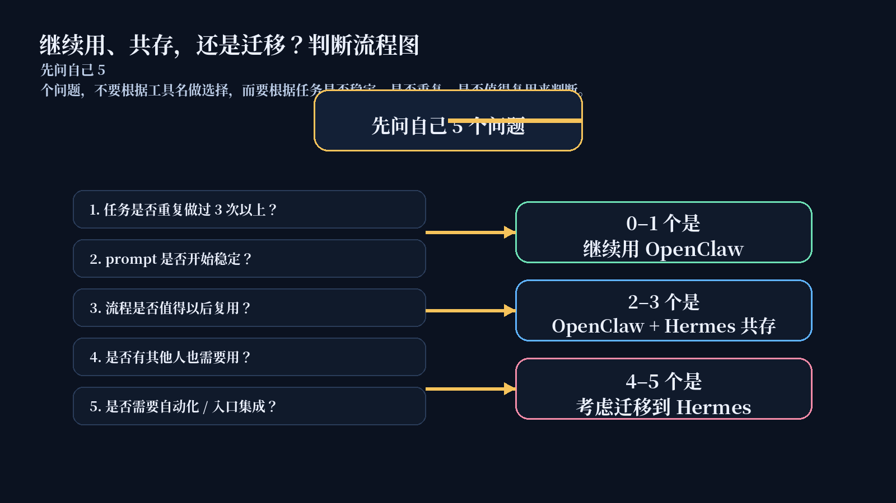
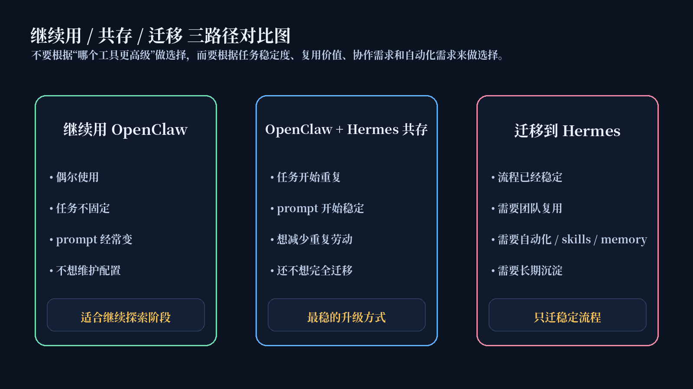
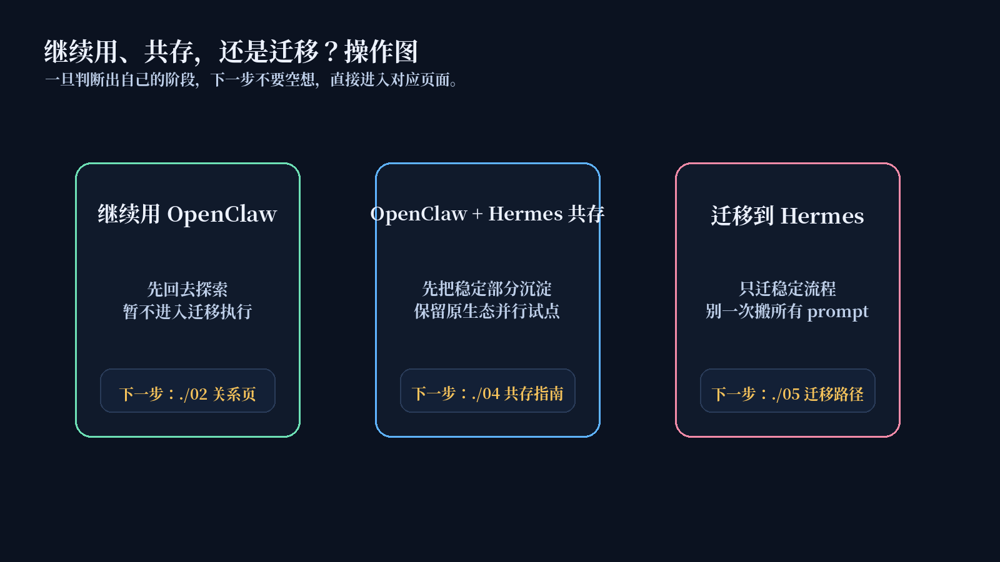

# 继续用、共存，还是迁移

不要根据工具名做选择，而要根据你的任务是否稳定、是否重复、是否值得复用，以及你是不是已经需要自动化和团队协作来做选择。

这一页只解决一件事：帮你判断自己现在更适合继续用 OpenClaw、OpenClaw + Hermes 共存，还是逐步迁移到 Hermes。

## 🎯 先问自己 5 个问题

在做决定前，先问自己下面这 5 个问题：

1. 这个任务是否已经重复做过 3 次以上？
2. 你的 prompt 是否开始稳定？
3. 这个流程是否值得以后复用？
4. 是否有其他人也需要用？
5. 是否需要接入飞书、企业微信、钉钉、Web UI 或 CLI？

如果这些问题你还答不上来，通常就不该直接进入迁移执行。

## 🧭 判断流程图：先判断阶段，再决定动作

可以先按这个最短规则理解：

- 0–1 个是 → 继续用 OpenClaw
- 2–3 个是 → OpenClaw + Hermes 共存
- 4–5 个是 → 考虑迁移到 Hermes

这不是绝对数学题，但它能帮你先把阶段判断拉出来，而不是直接被“要不要迁移”这个大问题拖走。

## 📊 三路径对比图：三种选择分别适合谁

### 路径 A：继续用 OpenClaw
适合：

- 只是偶尔使用
- 任务还不固定
- 还在试不同 prompt
- 还不知道最终工作流长什么样
- 不需要多人复用
- 不想维护配置

继续用 OpenClaw 不是落后，而是符合当前阶段。

### 路径 B：OpenClaw + Hermes 共存
适合：

- 同类任务已经出现多次
- prompt 开始稳定
- 输出格式开始固定
- 有些步骤每次都重复
- 你想减少重复劳动
- 但还不想完全迁移

对多数用户来说，这是最稳的升级路径。

### 路径 C：迁移到 Hermes
适合：

- 流程稳定
- 任务频繁重复
- 需要团队共享
- 需要定时执行
- 需要 memory / skills / profiles
- 需要接飞书 / 企业微信 / 钉钉
- 需要把经验沉淀成长期资产

迁移不是为了换工具，而是为了把稳定流程变成长期资产。

## 🛠️ 操作图：判断完以后，下一步到底点哪一页

判断完成后，不要停留在态度上，更不要一上来就去看迁移清单。更稳的动作顺序是：

- 判断结果是“继续用” → 先回关系页，把边界想清楚，继续探索
- 判断结果是“共存” → 先看 [OpenClaw + Hermes 共存指南](./04-OpenClaw + Hermes 共存指南.md)
- 判断结果是“迁移” → 先看 [从 OpenClaw 到 Hermes：迁移路径](./05-从 OpenClaw 到 Hermes：迁移路径.md)，但只迁稳定流程

## 📋 决策表：哪种情况更适合哪条路

| 你的情况 | 推荐路径 | 原因 |
|---|---|---|
| 偶尔问答 | 继续用 OpenClaw | 不需要结构化 |
| 还在试 prompt | 继续用 OpenClaw | 过早沉淀会增加成本 |
| 同类任务做了 3 次以上 | 共存 | 可以开始抽象稳定部分 |
| 输出格式已经固定 | 共存 | 适合先做 template / example / role 沉淀 |
| 想减少重复输入 | 共存 | Hermes 可以开始沉淀 profile / skill |
| 团队要一起用 | 迁移 Hermes | 需要复用与更清晰的边界 |
| 要接企业工具 | 迁移 Hermes | 需要稳定入口 |
| 要定时执行 | 迁移 Hermes | 需要自动化能力 |

## ⚠️ 最容易做错的决定

不要：

- 因为看到 Hermes 就马上迁移
- 流程没稳定就写 skill
- 把所有 prompt 一次性搬走
- 把 Hermes 当成另一个聊天窗口
- 忽略模型、入口、成本问题

真正最容易做错的，不是“不迁”，而是“没想清楚就迁”。

## ⭐ 默认主线

如果你完全不想自己判断，默认先走这条线：

1. 先完成这页的判断
2. 再看 [OpenClaw + Hermes 共存指南](./04-OpenClaw + Hermes 共存指南.md)
3. 只有在流程已经稳定时，再进入 [从 OpenClaw 到 Hermes：迁移路径](./05-从 OpenClaw 到 Hermes：迁移路径.md)

为什么默认先推这条线：

- 大多数用户真正需要的不是马上迁移，而是先找到更稳的升级节奏
- 共存能先验证收益，再决定要不要扩大迁移范围
- 这样做最不容易把原本稳定的链路一起带进风险里

## ✅ 看完这页你应该能立刻判断什么

看完后你应该能直接回答这 4 个问题：

1. 我现在处在继续用、共存，还是迁移中的哪一类？
2. 为什么不应该一上来就迁移？
3. 我判断完后，下一页该先点哪一页？
4. 我现在是不是更适合先共存，而不是直接搬家？

## ➡️ 下一步

- 前进到 [OpenClaw + Hermes 共存指南](./04-OpenClaw + Hermes 共存指南.md)
- 回 [从 OpenClaw 过来，不一定要马上迁移](./01-总览.md)
