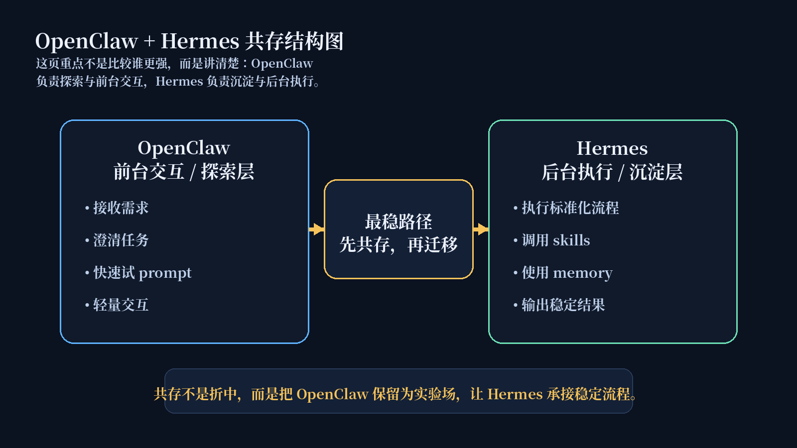
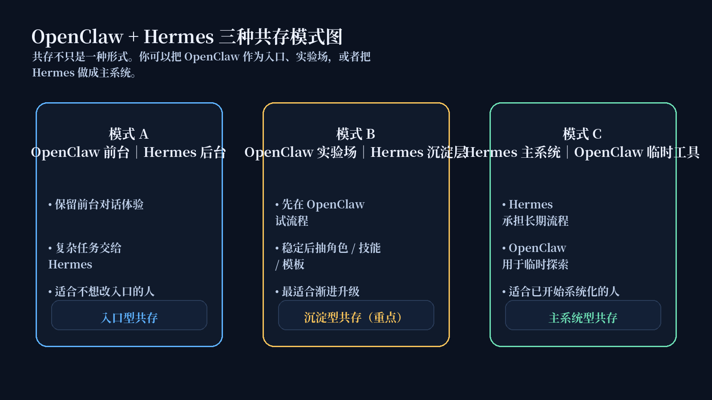
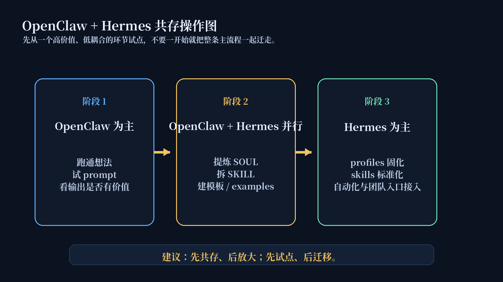

# OpenClaw + Hermes 共存指南

OpenClaw 负责探索与交互，Hermes 负责沉淀与执行。共存不是折中，而是从临时使用走向长期复用的更稳路径。

这一页不讨论“要不要立刻迁移”，而是只解决一件事：如果你现在不想全迁，怎样让 OpenClaw 和 Hermes 长期互补共存。

## 🎯 先记住这一页最重要的判断

对大多数 OpenClaw 用户来说，最稳的路线不是马上迁移，而是先共存。

你可以继续用 OpenClaw 做前台交互和需求探索，同时让 Hermes 承接那些已经稳定、重复、值得沉淀的流程。

## 🧭 结构图：OpenClaw 做前台，Hermes 做后台

这张图要表达的重点不是“谁更强”，而是：

- OpenClaw 继续负责接收需求、澄清任务、快速试 prompt
- Hermes 负责执行标准化流程、调用 skills、使用 memory、输出稳定结果
- 共存的价值在于：你不用推翻已有生态，就能先把稳定部分抽出来沉淀

## 🧩 三种共存模式图：不是只有一种共存方式

### 模式 A：OpenClaw 做前台，Hermes 做后台
适合：

- 习惯 OpenClaw 的交互方式
- 希望保留前台对话体验
- 但希望复杂任务由 Hermes 执行

这条模式适合把 OpenClaw 当作入口，把 Hermes 当作执行系统。

### 模式 B：OpenClaw 做实验场，Hermes 做沉淀层
适合：

- 还在试 prompt
- 已经发现某些任务会重复
- 想把稳定经验沉淀下来
- 但不想一次性迁移全部流程

这是本页最重要的一种模式，因为它能解释：

> OpenClaw 不是被替代，而是成为 Hermes 资产沉淀的前置实验场。

### 模式 C：Hermes 做主系统，OpenClaw 做临时工具
适合：

- 已经以 Hermes 为主要工作系统
- 已经有 profiles / skills / memory
- 但仍然需要 OpenClaw 做临时探索

这条模式更适合已经开始系统化的人，而不是刚开始接触共存的人。

## 📋 从 OpenClaw 到 Hermes：哪些内容适合先沉淀

当你选择模式 B 时，最重要的问题不是“搬什么文件”，而是“哪些经验已经值得沉淀”。

| OpenClaw 中的内容 | 更适合沉淀到 Hermes 的方式 |
|---|---|
| 临时 prompt | SOUL / Profile |
| agent 人设 | SOUL.md |
| 工具调用 | SKILL.md |
| 多轮对话经验 | Memory |
| 重复步骤 | Workflow |
| 输出格式 | Template |
| 成功输出 | Example |
| 失败经验 | Known Issues / 注意事项 |

关键不是复制 prompt，而是把已经被验证过的经验，转成 Hermes 可以长期维护的结构。

## 🛠️ 操作图：共存应该怎么一步步推进

一个更稳的推进顺序通常是：

### 阶段 1：OpenClaw 为主
重点：

- 找到真实需求
- 试 prompt
- 试 agent 组合
- 看输出是否有价值

这个阶段不要急着写 skills，也不要急着设计复杂结构。

### 阶段 2：OpenClaw + Hermes 并行
重点：

- 提炼 SOUL
- 拆 SKILL
- 收集 examples
- 建 templates
- 选择模型和入口

这个阶段的目标不是一次性迁完，而是把稳定部分单独沉淀出来。

### 阶段 3：Hermes 为主
重点：

- profiles 固化
- skills 标准化
- memory 持续积累
- cron / workflow 自动化
- 团队入口接入

只有当前两个阶段已经跑顺，才值得进入这一层。

## ✅ 共存成功标准

如果共存做对了，应该出现这些结果：

- 不再每次重复写 prompt
- 同类任务输出更稳定
- 角色边界更清楚
- 关键流程可以复用
- 可以换模型
- 可以接 Web UI / CLI / 飞书 / 企业微信 / 钉钉
- 可以逐步自动化
- 成本更可控

## ⚠️ 共存不适合谁

不适合：

- 只是偶尔问答
- 没有重复任务
- 不需要沉淀
- 不想维护任何配置
- 连一个稳定案例都没有跑通

如果你还没有跑通过一个稳定案例，先继续用 OpenClaw 探索，不要急着进入共存阶段。

## ⭐ 默认主线

如果你完全不想自己判断，默认先走这条线：

1. 先保留当前 OpenClaw 生态不动
2. 只挑一个高价值、低耦合的环节让 Hermes 接入
3. 并行观察一段时间，再决定是否扩大范围

为什么默认先推这条线：

- 它不会伤到原本稳定的主链
- 它能先验证 Hermes 的真实收益
- 它最符合多数用户“先证明价值，再决定扩不扩大”的节奏

## ✅ 看完这页你应该能立刻判断什么

看完后你应该能直接回答这 4 个问题：

1. 共存是不是妥协，还是最稳的升级方式？
2. 我更适合哪一种共存模式？
3. 我应该先把哪个环节交给 Hermes？
4. 我现在是不是还没到该迁移主系统的时候？

## ➡️ 下一步

- 前进到 [从 OpenClaw 到 Hermes：迁移路径](./05-迁移清单.md)
- 回 [继续用、共存，还是迁移](./03-%E7%BB%A7%E7%BB%AD%E7%94%A8%E3%80%81%E5%85%B1%E5%AD%98%EF%BC%8C%E8%BF%98%E6%98%AF%E8%BF%81%E7%A7%BB.md)
