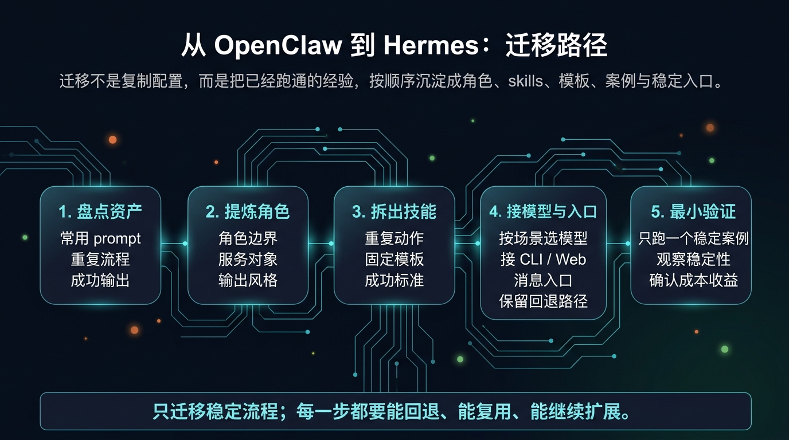
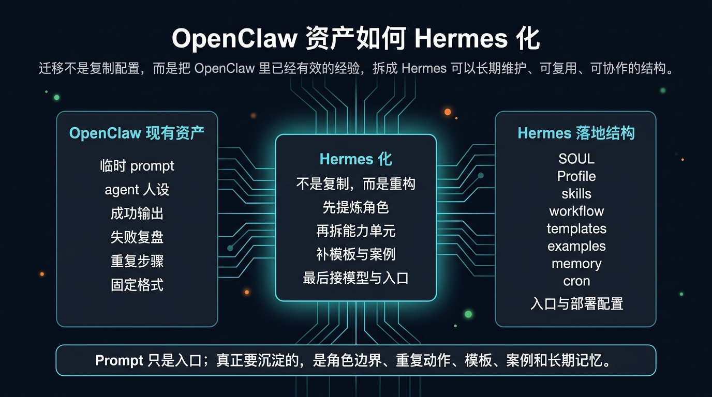
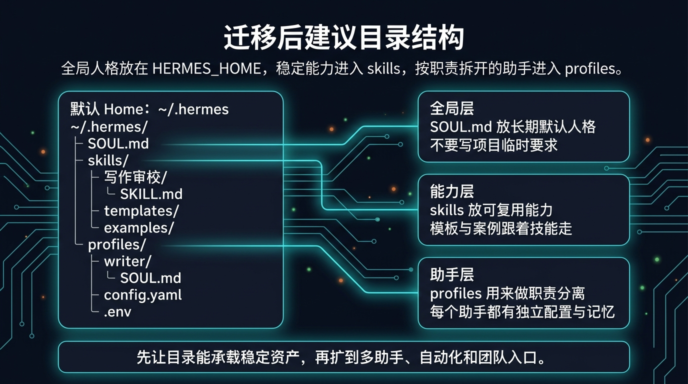

# 从 OpenClaw 到 Hermes：迁移路径

迁移不是复制配置，而是把 OpenClaw 中已经跑通的经验，重构成 Hermes 中可复用的角色、技能、模板和工作流。

这一页不做“要不要迁移”的判断，只服务已经完成判断、决定迁移稳定流程的用户。

## ⚠️ 迁移前先判断：不要迁移一个还没稳定的流程

如果下面这些问题你大多数还答不上来，先不要迁移，先回到 [OpenClaw + Hermes 共存指南](./04-OpenClaw + Hermes 共存指南.md)：

- 这个流程是否已经做过 3 次以上？
- prompt 是否已经比较稳定？
- 输出格式是否已经基本固定？
- 角色边界是否已经清楚？
- 这个流程以后是否还会继续复用？
- 是否需要多人一起用？
- 是否需要接外部入口或自动化？
- 是否已经有成功案例和失败案例可供复盘？

如果大多数答案是否定的，说明你更适合继续共存，而不是直接迁移。

## 🧭 迁移步骤图：先盘点，再 Hermes 化，再最小验证



这页真正要做的，不是“大迁移”，而是按顺序完成这 5 步：

1. 先盘点 OpenClaw 里已经有效的资产
2. 再把 prompt 提炼成角色边界与长期人格
3. 再把重复动作拆成可复用能力
4. 最后才接模型、入口与部署方式
5. 只用一个最小稳定案例做验证，不一次性迁完整链路

## 🔁 迁移不是搬家，而是 Hermes 化

错误理解：

- 把 OpenClaw 里的 prompt 全部复制到 Hermes
- 把所有要求继续塞进一个超长 prompt
- 只改一个工具名，就当成已经迁移完成

正确理解：

- 先提炼角色，再确定它该做什么、不该做什么
- 把重复动作拆成 skills，而不是继续堆长 prompt
- 把输出格式、案例、失败经验一起沉淀下来
- 把模型、入口、部署放到最后接线，而不是最前面乱选

## 🧩 OpenClaw 资产如何 Hermes 化



| OpenClaw 里已有的东西 | 更适合沉淀到 Hermes 的方式 |
|---|---|
| 临时 prompt | `SOUL.md` / Profile |
| agent 人设 | 角色边界 + `SOUL.md` |
| 重复动作 | `SKILL.md` / skills |
| 固定输出格式 | templates |
| 成功输出 | examples |
| 失败复盘 | examples / 注意事项 |
| 多轮对话经验 | memory |
| 重复执行顺序 | workflow / cron / 固定入口 |

一句话记住：

> Prompt 只是入口；真正要沉淀的，是角色边界、重复动作、模板、案例和长期记忆。

## 🛠️ 迁移 5 步：每一步都要能回退、能复用、能继续扩展

### Step 1：盘点 OpenClaw 中已有资产

现在做什么：
- 把已经跑通过的内容单独列出来，而不是边迁边想。

为什么做：
- 迁移最容易出问题的地方，不是不会写，而是根本不知道哪些东西值得沉淀。

具体盘点什么：
- 常用 prompt
- 固定角色口吻
- 重复出现的任务
- 成功输出样例
- 失败案例与修改意见
- 固定格式与交付要求

看到什么算成功：
- 你已经能列出一份“哪些东西要迁、哪些东西先不迁”的清单。

如果还做不到：
- 说明你还在探索阶段，先回到 [OpenClaw + Hermes 共存指南](./04-OpenClaw + Hermes 共存指南.md)。

### Step 2：提炼角色

现在做什么：
- 从长 prompt 里提炼出：角色定位、服务对象、任务范围、输出风格、禁止事项、质量标准。

为什么做：
- Hermes 不是靠一段超长 prompt 长期维护的。角色先清楚，后面的 skill、memory、入口才不会混乱。

具体怎么做：
- 把“你是谁、服务谁、擅长什么、不能做什么”写成一份稳定的角色定义
- 需要长期默认人格时，写进 [`SOUL.md`](../01-从这开始/03-玩出花样/02-让 Hermes 更像你.md)
- 需要按职责拆多个助手时，进入 [多个助手一起工作](../01-从这开始/04-自己造东西/02-多个助手一起工作.md)

看到什么算成功：
- 你已经能不用那段长 prompt，也能说明这个助手的边界和风格。

如果还做不到：
- 说明你还没把经验抽象成角色，不要急着进入 skill 设计。

### Step 3：拆出技能

现在做什么：
- 把重复动作拆成稳定能力单元，而不是继续放在主 prompt 里。

为什么做：
- 只有拆成 skill，后面才有机会复用、组合、替换模型、做自动化。

具体怎么做：
- 找出你每次都会重复做的动作，例如：搜集资料、整理结构、写初稿、审校、按格式输出
- 把输入、处理方式、输出要求、成功标准写清楚
- 需要补基础认知时，可回看 [常用 Skills（按日常使用场景精选）](../01-从这开始/02-开始上手/04-常用 Skills（按日常使用场景精选）.md)

看到什么算成功：
- 你已经能清楚说出“这个 skill 输入什么、怎么处理、输出什么、什么算通过”。

如果还做不到：
- 说明你拆出来的不是 skill，而只是另一段 prompt。

### Step 4：接模型、入口和部署方式

现在做什么：
- 只给已经稳定的角色和 skill 接上合适的模型与入口。

为什么做：
- 模型、CLI、Web、消息入口、部署方式都不该在前面乱选；它们应该服务稳定流程，而不是制造新的变量。

具体怎么做：
- 先根据任务类型选择模型与入口
- 再根据成本、部署和团队协作需求决定接线方式
- 需要模型、入口、部署选型时，去 [国内落地总览](../03-国内落地/01-总览.md)

看到什么算成功：
- 你已经知道这个流程该走什么模型、什么入口、什么部署路径，而不是“先随便接一个再说”。

如果还做不到：
- 不要急着扩大迁移范围，先把角色和 skill 定下来。

### Step 5：跑一个最小验证案例

现在做什么：
- 只选一个最稳定、最容易回退、最容易看出收益的场景试跑。

为什么做：
- 最小验证比一次性完整迁移更重要。只有这样你才知道问题到底出在角色、skill、模型还是入口。

具体怎么做：
- 只跑一个案例
- 连续观察输出稳定性
- 看是否能复用、能定位错误、能接受成本

看到什么算成功：
- 能跑通
- 输出稳定
- 配置可复用
- 出错能定位
- 成本可接受
- 后续能继续扩展

如果还做不到：
- 先不要扩大迁移范围，先修这个最小案例。

## 🗂️ 迁移后建议目录结构



这页只给最小可用结构，不做大而全方案包：

```text
~/.hermes/
├─ SOUL.md
├─ skills/
│  └─ 写作审校/
│     ├─ SKILL.md
│     ├─ templates/
│     └─ examples/
└─ profiles/
   └─ writer/
      ├─ SOUL.md
      ├─ config.yaml
      └─ .env
```

你可以这样理解：

- `SOUL.md`：放长期默认人格，不放项目临时要求
- `skills/`：放稳定、可复用能力；模板和案例跟着技能走
- `profiles/`：当你开始按职责拆助手时，再给不同助手独立配置与记忆

## ❌ 最容易做错的迁移动作

不要：

- 直接复制 prompt，就以为已经迁移完成
- 还没稳定就一次性迁整个主链
- 所有能力继续堆在一个大 prompt 里
- 没有 examples 就开始扩大范围
- 没跑最小验证就改模型、入口、部署和 workflow
- 把模型与入口选择放在最前面乱试

真正最容易翻车的，不是迁得慢，而是一次迁太多、变量改太多。

## ⭐ 默认主线

如果你已经决定迁，但不想把事情做大，默认先走这条线：

1. 只挑一个已经稳定的高价值场景
2. 先完成角色提炼和 skill 拆分
3. 再接模型、入口和部署
4. 最后只做一个最小验证案例

这条线的好处是：

- 原本稳定主链不会被一起拖进风险
- 你能判断收益到底来自哪一层
- 后面扩大范围时，更容易复制成功方法

## ✅ 看完这页你应该能立刻判断什么

看完后你应该能直接回答这 4 个问题：

1. 为什么迁移不是复制 prompt？
2. 我手里的哪些 OpenClaw 资产已经值得 Hermes 化？
3. 我应该先迁哪个最小场景，而不是一口气迁全部？
4. 迁移后角色、skills 和 profiles 分别该放在哪一层？

## ➡️ 下一步

- 前进到 [OpenClaw 用户常见问题与检查清单](./06-OpenClaw 用户常见问题与检查清单.md)
- 再前进到 [国内落地总览](../03-国内落地/01-总览.md)
- 回 [OpenClaw + Hermes 共存指南](./04-OpenClaw + Hermes 共存指南.md)
- 回 [从 OpenClaw 过来](./01-总览.md)
