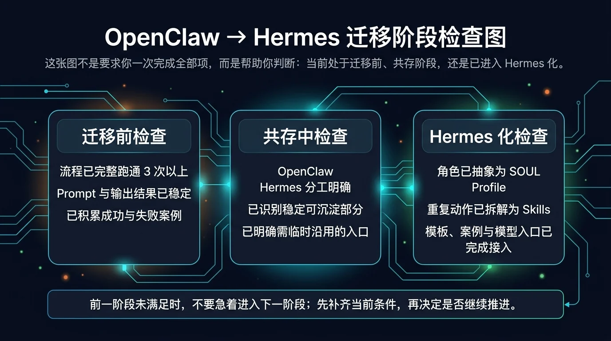
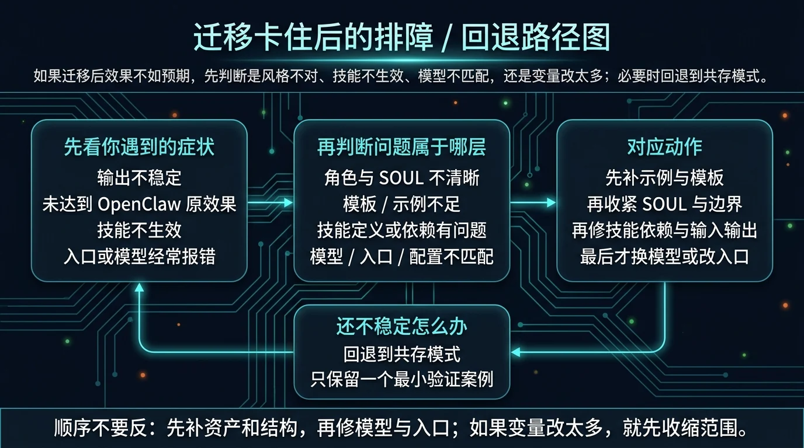

# OpenClaw 用户常见问题与检查清单

> 一句话先说清楚：这一页不是替你重做迁移判断，而是帮你把“共存 / 迁移过程中卡住的问题”先分到正确类别，再用最小检查单收缩问题范围。

如果你现在已经开始焦虑，只先记住一句：
> 不要一看到效果不对，就同时改 prompt、模型、入口、memory、skills。先把问题分层，再决定回哪一页修。

---

## ⚡ 快速定位：先看你现在最像哪一类问题

如果你不想从头读到底，先按眼前症状直接跳：

### 🧠 认知 / 判断层
- 我是不是必须迁移？
- 现在到底该继续用、共存，还是迁移？
- 我是不是把 Hermes 当成了另一个聊天窗口？
- 👉 先回：[继续用、共存，还是迁移](./03-继续用、共存，还是迁移.md)

### 🧩 共存 / 迁移节奏层
- 共存边界越来越乱
- 一边保留 OpenClaw，一边引入 Hermes，但职责越改越糊
- 迁移时一次动了太多变量
- 👉 先回：[OpenClaw + Hermes 共存指南](<./04-OpenClaw%20%2B%20Hermes%20%E5%85%B1%E5%AD%98%E6%8C%87%E5%8D%97.md>)

### 🛠️ Hermes 化结构层
- 长 prompt 搬过去以后效果更差
- skill 不生效 / 不稳定
- examples、template、SOUL 没补齐
- 👉 先回：[从 OpenClaw 到 Hermes：迁移路径](<./05-%E4%BB%8E%20OpenClaw%20%E5%88%B0%20Hermes%EF%BC%9A%E8%BF%81%E7%A7%BB%E8%B7%AF%E5%BE%84.md>)

### 🔐 模型 / 入口层
- 模型报错、额度问题、endpoint 不对
- CLI / Web / 消息平台入口选错
- 入口跑得通，但效果和原来不一致
- 👉 先看：[03-国内落地总览](../03-国内落地/01-总览.md)

### 🧰 Skills / Memory / 单助手调优层
- 我不确定是 skill 没装好，还是我根本没拆成 skill
- 我不确定是 memory 问题，还是 SOUL / template / examples 问题
- 我不确定是工具开关问题，还是模型问题
- 👉 先看：
  - [常用 Skills（按日常使用场景精选）](<../01-%E4%BB%8E%E8%BF%99%E5%BC%80%E5%A7%8B/02-%E5%BC%80%E5%A7%8B%E4%B8%8A%E6%89%8B/04-%E5%B8%B8%E7%94%A8%20Skills%EF%BC%88%E6%8C%89%E6%97%A5%E5%B8%B8%E4%BD%BF%E7%94%A8%E5%9C%BA%E6%99%AF%E7%B2%BE%E9%80%89%EF%BC%89.md>)
  - [让 Hermes 记住你](<../01-%E4%BB%8E%E8%BF%99%E5%BC%80%E5%A7%8B/03-%E7%8E%A9%E5%87%BA%E8%8A%B1%E6%A0%B7/03-%E8%AE%A9%20Hermes%20%E8%AE%B0%E4%BD%8F%E4%BD%A0.md>)
  - [让 Hermes 更像你](<../01-%E4%BB%8E%E8%BF%99%E5%BC%80%E5%A7%8B/03-%E7%8E%A9%E5%87%BA%E8%8A%B1%E6%A0%B7/02-%E8%AE%A9%20Hermes%20%E6%9B%B4%E5%83%8F%E4%BD%A0.md>)

---

## ✅ 先做完成度检查：你现在卡在迁移前、共存中，还是 Hermes 化阶段？

这张图不是让你一次全勾完，而是帮你确认：
- 你现在是不是还没到迁移阶段
- 你是不是更适合继续共存
- 你是不是已经进入真正的 Hermes 化

### 迁移前检查
如果下面这些多数还不成立，先不要迁移：
- 这个流程做过 3 次以上
- prompt 已经比较稳定
- 输出格式基本固定
- 这个流程以后还会继续用
- 有成功案例和失败案例可以复盘
- 知道这个流程更适合什么模型和入口

如果你现在勾不满，先不要继续往后硬走。
先回：
- [从 OpenClaw 到 Hermes：迁移路径](<./05-%E4%BB%8E%20OpenClaw%20%E5%88%B0%20Hermes%EF%BC%9A%E8%BF%81%E7%A7%BB%E8%B7%AF%E5%BE%84.md>)

### 共存中检查
如果你还在共存阶段，先看这些条件是否成立：
- OpenClaw 负责什么已经说清楚
- Hermes 负责什么已经说清楚
- 哪些流程继续临时使用已经明确
- 哪些流程准备沉淀已经明确
- 已经挑出稳定 prompt、模板或可拆分 skill
- 已经知道当前保留哪个入口继续试错

如果这些还不稳，先回：
- [OpenClaw + Hermes 共存指南](<./04-OpenClaw%20%2B%20Hermes%20%E5%85%B1%E5%AD%98%E6%8C%87%E5%8D%97.md>)

### Hermes 化检查
如果你已经开始迁移，继续检查：
- Prompt 是否已经提炼成角色边界
- 是否已经写出稳定的 SOUL / Profile
- 是否已经拆出可复用 skills
- 是否准备好 templates 和 examples
- 是否已经记录失败样例，而不是只留成功案例
- 是否已经明确模型、入口和部署路径

如果这些还不完整，说明你还在“把经验搬过去”，还没真正完成 Hermes 化。

---

## ❓ 常见问题 01：我是不是必须从 OpenClaw 迁移到 Hermes？

### 先说结论
不是。

### 先做什么
先问自己两个问题：
1. 这个流程是不是已经稳定、重复、值得复用？
2. 我现在最需要的是继续探索，还是开始沉淀？

### 什么时候该回哪页
- 还在探索 → 回 [继续用、共存，还是迁移](./03-继续用、共存，还是迁移.md)
- 已经开始稳定，但还不想搬家 → 回 [OpenClaw + Hermes 共存指南](<./04-OpenClaw%20%2B%20Hermes%20%E5%85%B1%E5%AD%98%E6%8C%87%E5%8D%97.md>)

---

## ❓ 常见问题 02：为什么我把原来的长 prompt 复制过去，效果反而更差？

### 先说结论
最常见的原因不是模型不行，而是你只是“复制 prompt”，没有完成 Hermes 化。

### 先做什么
按这个顺序检查：
1. 有没有把角色边界拆出来
2. 有没有把重复动作拆成 skills
3. 有没有补 examples 和 template
4. 有没有把长期默认人格写进 SOUL / Profile

### 什么时候该回哪页
- 你还在“复制 prompt”阶段 → 回 [从 OpenClaw 到 Hermes：迁移路径](<./05-%E4%BB%8E%20OpenClaw%20%E5%88%B0%20Hermes%EF%BC%9A%E8%BF%81%E7%A7%BB%E8%B7%AF%E5%BE%84.md>)
- 你怀疑是人格边界问题 → 回 [让 Hermes 更像你](<../01-%E4%BB%8E%E8%BF%99%E5%BC%80%E5%A7%8B/03-%E7%8E%A9%E5%87%BA%E8%8A%B1%E6%A0%B7/02-%E8%AE%A9%20Hermes%20%E6%9B%B4%E5%83%8F%E4%BD%A0.md>)

---

## ❓ 常见问题 03：为什么 skills 不生效，或者我根本看不出它是不是 skill？

### 先说结论
很多时候你写出来的不是 skill，而只是另一段更长的 prompt。

### 先做什么
先检查这 4 件事：
1. skill 有没有正确安装 / 落位
2. Hermes 能不能识别它
3. 输入、处理、输出是否写清楚
4. 你拆出来的是“重复动作”，还是只是“更长的说明”

### 什么时候该回哪页
- 需要补 skill 基础理解 → 回 [常用 Skills（按日常使用场景精选）](<../01-%E4%BB%8E%E8%BF%99%E5%BC%80%E5%A7%8B/02-%E5%BC%80%E5%A7%8B%E4%B8%8A%E6%89%8B/04-%E5%B8%B8%E7%94%A8%20Skills%EF%BC%88%E6%8C%89%E6%97%A5%E5%B8%B8%E4%BD%BF%E7%94%A8%E5%9C%BA%E6%99%AF%E7%B2%BE%E9%80%89%EF%BC%89.md>)
- 需要回看迁移步骤 → 回 [从 OpenClaw 到 Hermes：迁移路径](<./05-%E4%BB%8E%20OpenClaw%20%E5%88%B0%20Hermes%EF%BC%9A%E8%BF%81%E7%A7%BB%E8%B7%AF%E5%BE%84.md>)

---

## ❓ 常见问题 04：为什么效果不像原来的 OpenClaw？

### 先说结论
最常见的不是“模型不行”，而是下面这些结构没补齐：
- SOUL 不清晰
- template 不固定
- examples 太少
- 只是复制了 prompt，没有迁移上下文
- 模型和任务类型不匹配

### 先做什么
更稳的顺序是：
1. 先回到 OpenClaw 找 3 个成功输出
2. 把它们沉淀成 examples
3. 再收紧 template 和输出格式
4. 再检查 SOUL / Profile 是否把风格边界写清楚
5. 最后才考虑换模型

### 什么时候该回哪页
- 补 examples / template / 结构 → 回 [从 OpenClaw 到 Hermes：迁移路径](<./05-%E4%BB%8E%20OpenClaw%20%E5%88%B0%20Hermes%EF%BC%9A%E8%BF%81%E7%A7%BB%E8%B7%AF%E5%BE%84.md>)
- 补人格边界 → 回 [让 Hermes 更像你](<../01-%E4%BB%8E%E8%BF%99%E5%BC%80%E5%A7%8B/03-%E7%8E%A9%E5%87%BA%E8%8A%B1%E6%A0%B7/02-%E8%AE%A9%20Hermes%20%E6%9B%B4%E5%83%8F%E4%BD%A0.md>)
- 补模型选择 → 回 [03-国内落地 / 02-国内模型 / 01-总览](../03-国内落地/02-国内模型/01-总览.md)

---

## ❓ 常见问题 05：我怎么判断现在该修模型、入口，还是先修结构？

### 先说结论
顺序不要反。先补资产和结构，再修模型与入口；如果变量改太多，就先收缩范围。

### 先做什么
按这个顺序处理：
1. 输出不稳定 / 不像原效果 → 先补 examples、template、SOUL
2. skill 不生效 → 先看 skill 结构、路径、依赖、输入输出定义
3. 入口或模型经常报错 → 再去看模型、入口、配置链路
4. 同时改了太多变量 → 立刻缩回一个最小验证案例
5. 还是不稳定 → 退回共存模式，保留一个最小稳定场景继续试

### 什么时候该回哪页
- 结构没补齐 → 回 [从 OpenClaw 到 Hermes：迁移路径](<./05-%E4%BB%8E%20OpenClaw%20%E5%88%B0%20Hermes%EF%BC%9A%E8%BF%81%E7%A7%BB%E8%B7%AF%E5%BE%84.md>)
- 共存边界已经乱了 → 回 [OpenClaw + Hermes 共存指南](<./04-OpenClaw%20%2B%20Hermes%20%E5%85%B1%E5%AD%98%E6%8C%87%E5%8D%97.md>)
- 模型 / 入口经常报错 → 回 [03-国内落地总览](../03-国内落地/01-总览.md)

---

## 🛠️ 技术检查清单：模型、入口、skills、memory 分别看什么

### 模型检查
去 [国内模型总览](../03-国内落地/02-国内模型/01-总览.md) 之前，先确认：
- API Key 正确
- endpoint 正确
- provider 配置正确
- 模型适合当前任务，而不是只看便宜或热门
- 模型支持当前 system role 需求，或你已有兼容方案
- 额度没有用完

### 入口检查
去 [国内入口总览](../03-国内落地/03-国内入口/01-总览.md) 之前，先确认：
- 你现在要解决的是 CLI、Web UI，还是消息入口问题
- 当前入口是否真的适合这个场景
- 回调、权限、认证、连接链路是否配置正确
- 你不是同时在改模型、入口和部署三件事

如果你卡在 CLI，先回看：
- [常用斜杠命令与会话管理](../01-从这开始/02-开始上手/03-常用斜杠命令与会话管理.md)

### Skills 检查
如果你怀疑是能力层的问题，先确认：
- skill 是否已经安装 / 落位正确
- Hermes 是否能识别它
- 输入、处理、输出是否定义清楚
- skill 依赖是否缺失
- 你写出来的是 skill，还是只是另一段更长的 prompt

### Memory 检查
如果你怀疑是记忆层导致混乱，先确认：
- memory 是否已经开启
- 长期记忆和临时信息是否混淆
- 你有没有把项目临时要求误写成长期记忆
- 当前问题到底该修 memory，还是该修 SOUL / template / examples

如果你对记忆层理解还不稳，回看：
- [让 Hermes 记住你](<../01-%E4%BB%8E%E8%BF%99%E5%BC%80%E5%A7%8B/03-%E7%8E%A9%E5%87%BA%E8%8A%B1%E6%A0%B7/03-%E8%AE%A9%20Hermes%20%E8%AE%B0%E4%BD%8F%E4%BD%A0.md>)

---

## 🔁 回退路径：如果迁移后越改越乱，怎么收回来

如果你已经改到自己都说不清问题在哪，按这个顺序收回来：
1. 停止同时改多层变量
2. 只保留一个最小验证案例
3. 只保留一个当前最稳的模型与入口
4. 先补 examples / template / SOUL
5. 还不稳，就退回 [OpenClaw + Hermes 共存指南](<./04-OpenClaw%20%2B%20Hermes%20%E5%85%B1%E5%AD%98%E6%8C%87%E5%8D%97.md>)

这里的硬规则是：
- 可以退回共存，不等于失败
- 真正的失败，是变量已经乱成一团还继续往前推

---

## 📍 出错后该回哪一页

如果你已经知道问题属于哪类，直接回对应页面：
- 还没判断清楚该不该迁移 → [继续用、共存，还是迁移](./03-继续用、共存，还是迁移.md)
- 共存边界不清楚 → [OpenClaw + Hermes 共存指南](<./04-OpenClaw%20%2B%20Hermes%20%E5%85%B1%E5%AD%98%E6%8C%87%E5%8D%97.md>)
- 迁移步骤没做稳 → [从 OpenClaw 到 Hermes：迁移路径](<./05-%E4%BB%8E%20OpenClaw%20%E5%88%B0%20Hermes%EF%BC%9A%E8%BF%81%E7%A7%BB%E8%B7%AF%E5%BE%84.md>)
- 模型选择有问题 → [国内模型总览](../03-国内落地/02-国内模型/01-总览.md)
- 入口选择有问题 → [国内入口总览](../03-国内落地/03-国内入口/01-总览.md)
- CLI 不熟 / 会话管理乱 → [常用斜杠命令与会话管理](../01-从这开始/02-开始上手/03-常用斜杠命令与会话管理.md)
- skills 基础不牢 → [常用 Skills（按日常使用场景精选）](<../01-%E4%BB%8E%E8%BF%99%E5%BC%80%E5%A7%8B/02-%E5%BC%80%E5%A7%8B%E4%B8%8A%E6%89%8B/04-%E5%B8%B8%E7%94%A8%20Skills%EF%BC%88%E6%8C%89%E6%97%A5%E5%B8%B8%E4%BD%BF%E7%94%A8%E5%9C%BA%E6%99%AF%E7%B2%BE%E9%80%89%EF%BC%89.md>)
- memory 理解混乱 → [让 Hermes 记住你](<../01-%E4%BB%8E%E8%BF%99%E5%BC%80%E5%A7%8B/03-%E7%8E%A9%E5%87%BA%E8%8A%B1%E6%A0%B7/03-%E8%AE%A9%20Hermes%20%E8%AE%B0%E4%BD%8F%E4%BD%A0.md>)

---

## ✅ 看完这页你应该能立刻做到什么

看完后你应该能直接做到这 4 件事：
1. 判断自己当前是认知问题、结构问题，还是模型 / 入口问题
2. 用检查清单确认自己卡在迁移前、共存中，还是 Hermes 化阶段
3. 知道输出质量差时，应该先补 examples / template / SOUL，而不是直接换模型
4. 知道迁移失败时，什么时候该退回共存，而不是一条路硬走到底

---

## ➡️ 下一步

完成后进入：
- [03-国内落地总览](../03-国内落地/01-总览.md)

如果你想先回到上一阶段入口重新确认位置：
- [04-从OpenClaw过来 | 总览](./01-总览.md)

---

## 🔗 检查后继续处理

- 想回到选择分岔：看[继续用、共存，还是迁移](/docs/openclaw/decision)。
- 决定共存：看[OpenClaw + Hermes 共存指南](/docs/openclaw/coexistence)。
- 决定迁移：看[迁移路径](/docs/openclaw/migration-path)。
- 如果问题不只来自 OpenClaw：进入[遇到问题](/docs/issues)按安装、模型、CLI、Gateway、Tools、Profiles 分类排查。
