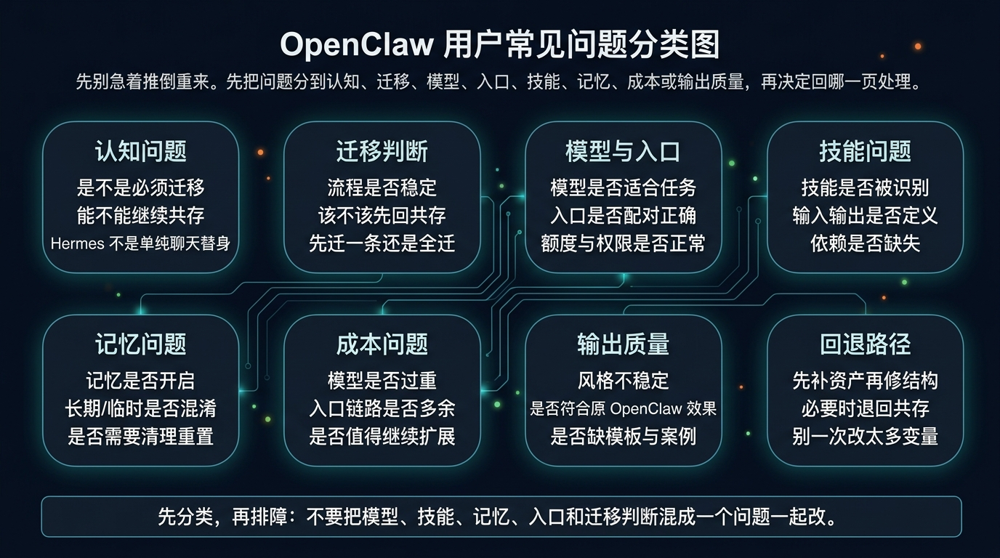
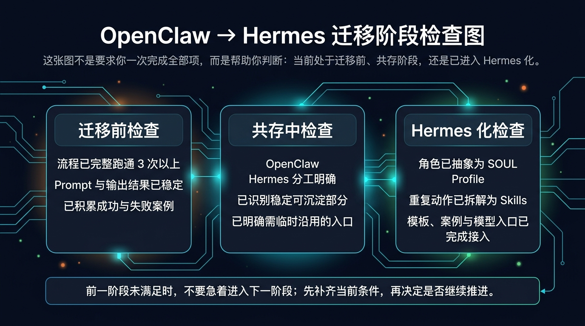
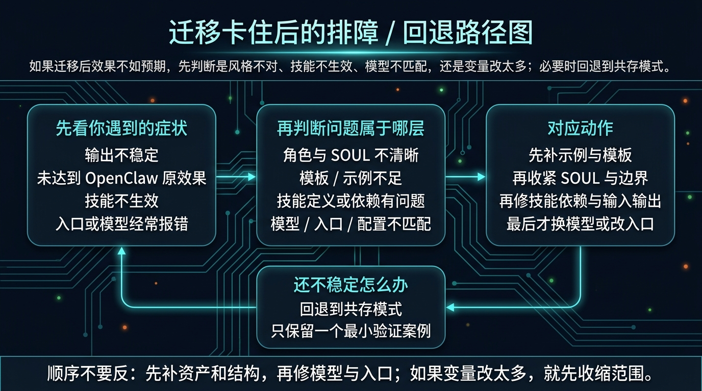

# OpenClaw 用户常见问题与检查清单

如果你在共存或迁移过程中卡住了，先不要推倒重来。多数问题都能先分到认知、迁移、模型、入口、skills、memory、成本或输出质量里，再决定该修哪一层。

这一页是本模块的收口页：它不负责替你做迁移决策，但会帮你自查、排障，并避免因为一次失败就把 Hermes 整体判掉。

## 🧭 先判断你属于哪类问题

最稳的顺序不是“看到不对就一起改”，而是先分类：

- 如果你在问“我是不是必须迁移” → 这是认知 / 迁移判断问题
- 如果你在问“为什么 skills 不生效” → 这是能力结构或依赖问题
- 如果你在问“为什么效果不像 OpenClaw” → 先看 examples、template、SOUL，而不是先怪模型
- 如果你在问“为什么一改就更乱了” → 先收缩变量，必要时退回共存模式

## ❓ 认知问题：先把这些最常见误解清掉

### Q：我是不是必须从 OpenClaw 迁移到 Hermes？

不是。

只有当你的流程已经稳定、重复、值得复用，才需要考虑迁移。否则继续用 OpenClaw，或者先走 [OpenClaw + Hermes 共存指南](./04-OpenClaw + Hermes 共存指南.md)，通常更合理。

### Q：OpenClaw 和 Hermes 能不能一起用？

可以，而且对多数用户来说，先共存再迁移，本来就是更稳的路径。

如果你还没把边界想清楚，先回到 [继续用、共存，还是迁移](./03-继续用、共存，还是迁移.md) 和 [OpenClaw + Hermes 共存指南](./04-OpenClaw + Hermes 共存指南.md)。

### Q：Hermes 是不是另一个聊天工具？

不是。

Hermes 的重点不是临时聊天，而是把角色、skills、memory、workflow 和入口组织成长期可复用的系统。

如果你只是把长 prompt 直接复制过去，通常得到的不会是“迁移完成”，而只是“换了一个窗口继续临时操作”。

## ✅ 先做完成度检查：你卡在迁移前、共存中，还是 Hermes 化阶段？

这张图不是让你一次全勾完，而是帮你确认：
- 你现在是不是还没到迁移阶段
- 你是不是更适合继续共存
- 你是不是已经进入真正的 Hermes 化

### 迁移前检查

如果下面这些多数还不成立，先不要迁移：

- 这个流程做过 3 次以上
- prompt 已经比较稳定
- 输出格式基本固定
- 这个流程以后还会继续用
- 有成功案例和失败案例可以复盘
- 知道这个流程更适合什么模型和入口

如果你现在勾不满，先回到 [从 OpenClaw 到 Hermes：迁移路径](./05-从 OpenClaw 到 Hermes：迁移路径.md)，把“盘点资产”和“最小验证”做完整。

### 共存中检查

如果你还在共存阶段，先看这些条件是否成立：

- OpenClaw 负责什么已经说清楚
- Hermes 负责什么已经说清楚
- 哪些流程继续临时使用已经明确
- 哪些流程准备沉淀已经明确
- 已经挑出稳定 prompt、模板或可拆分 skill
- 已经知道当前保留哪个入口继续试错

如果这些还不稳，先回到 [OpenClaw + Hermes 共存指南](./04-OpenClaw + Hermes 共存指南.md)，不要急着扩大迁移范围。

### Hermes 化检查

如果你已经开始迁移，继续检查：

- Prompt 是否已经提炼成角色边界
- 是否已经写出稳定的 SOUL / Profile
- 是否已经拆出可复用 skills
- 是否准备好 templates 和 examples
- 是否已经记录失败样例，而不是只留成功案例
- 是否已经明确模型、入口和部署路径

如果这些还不完整，说明你还在“把经验搬过去”，还没真正完成 Hermes 化。

## 🛠️ 技术检查清单：模型、入口、skills、memory 分别看什么

### 模型检查

去 [国内模型总览](../03-国内落地/02-国内模型/01-总览.md) 之前，先确认：

- API Key 正确
- endpoint 正确
- provider 配置正确
- 模型适合当前任务，而不是只看便宜或热门
- 模型支持当前系统提示 / system role 需求，或你已有兼容方案
- 额度没有用完

### 入口检查

去 [国内入口总览](../03-国内落地/03-国内入口/01-总览.md) 之前，先确认：

- 你现在要解决的是 CLI、Web UI，还是消息入口问题
- 当前入口是否真的适合这个场景
- 回调、权限、认证、连接链路是否配置正确
- 你不是同时在改模型、入口和部署三件事

如果你卡在 CLI，先回看 [常用斜杠命令与会话管理](../01-从这开始/02-开始上手/03-常用斜杠命令与会话管理.md)。

### Skills 检查

如果你怀疑是能力层的问题，先确认：

- skill 是否已经安装 / 落位正确
- Hermes 是否能识别它
- 输入、处理、输出是否定义清楚
- skill 依赖是否缺失
- 你写出来的是 skill，还是只是另一段更长的 prompt

需要回补基础理解时，回看 [常用 Skills（按日常使用场景精选）](../01-从这开始/02-开始上手/04-常用 Skills（按日常使用场景精选）.md)。

### Memory 检查

如果你怀疑是记忆层导致混乱，先确认：

- memory 是否已经开启
- 长期记忆和临时信息是否混淆
- 你有没有把项目临时要求误写成长期记忆
- 当前问题到底该修 memory，还是该修 SOUL / template / examples

如果你对记忆层理解还不稳，回看 [让 Hermes 记住你](../01-从这开始/03-玩出花样/03-让 Hermes 记住你.md)。

## ⚠️ 输出质量问题：为什么效果不像原来的 OpenClaw

最常见的不是“模型不行”，而是下面这些结构没补齐：

- SOUL 不清晰
- template 不固定
- examples 太少
- 只是复制了 prompt，没有迁移上下文
- 模型和任务类型不匹配

遇到这种情况，更稳的顺序是：

1. 先回到 OpenClaw 找 3 个成功输出
2. 把它们沉淀成 examples
3. 再收紧 template 和输出格式
4. 再检查 SOUL / Profile 是否把风格边界写清楚
5. 最后才考虑换模型

## 🔁 排障 / 回退路径：如果迁移后越改越乱，怎么收回来

这张图要表达的是一个硬规则：

> 顺序不要反。先补资产和结构，再修模型与入口；如果变量改太多，就先收缩范围。

你可以按这个顺序处理：

- 输出不稳定 / 不像原效果 → 先补 examples、template、SOUL
- skill 不生效 → 先看 skill 结构、路径、依赖、输入输出定义
- 入口或模型经常报错 → 再去看模型、入口、配置链路
- 同时改了太多变量 → 立刻缩回一个最小验证案例
- 还是不稳定 → 退回 [OpenClaw + Hermes 共存指南](./04-OpenClaw + Hermes 共存指南.md)，保留一个最小稳定场景继续试

## 📍 出错后该回哪一页

如果你已经知道问题属于哪类，直接回对应页面：

- 还没判断清楚该不该迁移 → [继续用、共存，还是迁移](./03-继续用、共存，还是迁移.md)
- 共存边界不清楚 → [OpenClaw + Hermes 共存指南](./04-OpenClaw + Hermes 共存指南.md)
- 迁移步骤没做稳 → [从 OpenClaw 到 Hermes：迁移路径](./05-从 OpenClaw 到 Hermes：迁移路径.md)
- 模型选择有问题 → [国内模型总览](../03-国内落地/02-国内模型/01-总览.md)
- 入口选择有问题 → [国内入口总览](../03-国内落地/03-国内入口/01-总览.md)
- CLI 不熟 / 会话管理乱 → [常用斜杠命令与会话管理](../01-从这开始/02-开始上手/03-常用斜杠命令与会话管理.md)
- skills 基础不牢 → [常用 Skills（按日常使用场景精选）](../01-从这开始/02-开始上手/04-常用 Skills（按日常使用场景精选）.md)
- memory 理解混乱 → [让 Hermes 记住你](../01-从这开始/03-玩出花样/03-让 Hermes 记住你.md)

## ✅ 看完这页你应该能立刻做到什么

看完后你应该能直接做到这 4 件事：

1. 判断自己当前是认知问题、结构问题，还是模型 / 入口问题
2. 用检查清单确认自己卡在迁移前、共存中，还是 Hermes 化阶段
3. 知道输出质量差时，应该先补 examples / template / SOUL，而不是直接换模型
4. 知道迁移失败时，什么时候该退回共存，而不是一条路硬走到底

## ➡️ 下一步

- 前进到 [国内落地总览](../03-国内落地/01-总览.md)
- 回 [从 OpenClaw 到 Hermes：迁移路径](./05-从 OpenClaw 到 Hermes：迁移路径.md)
- 回 [从 OpenClaw 过来](./01-总览.md)
