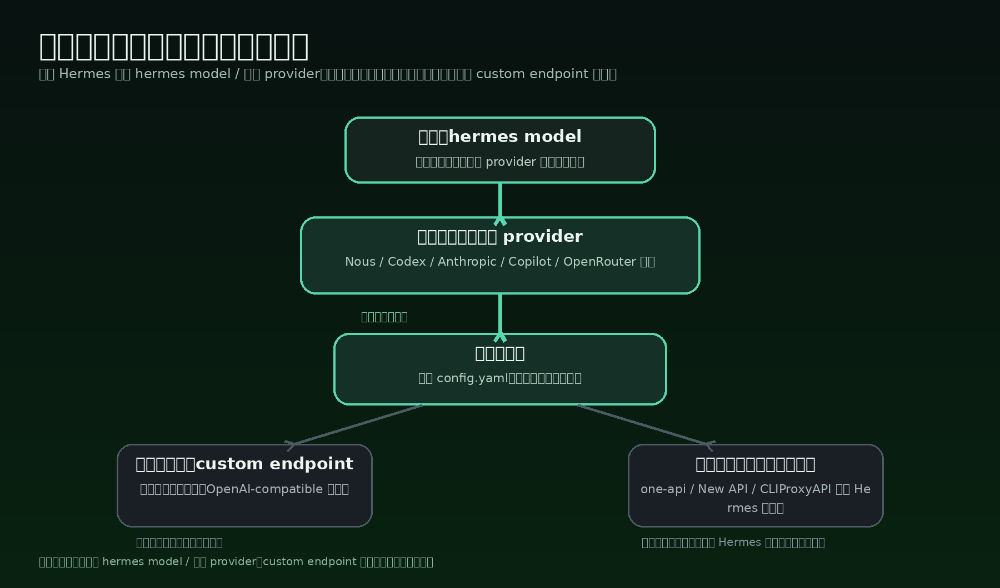
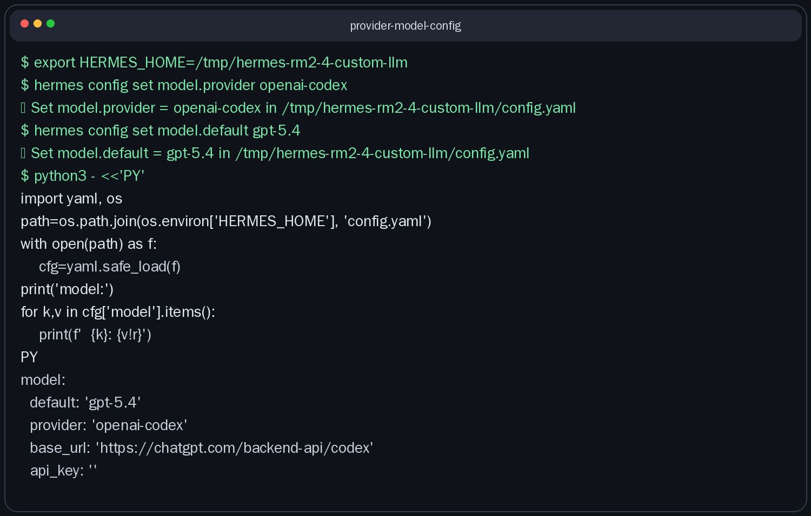
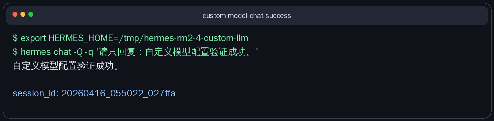

# 给 Hermes 接上更适合你的 AI 大模型

这一页只解决一件事：
把一个已经会用的 Hermes，接到更适合你自己成本、速度、来源和稳定性的模型上。



---

## 什么时候你才需要动模型层

先说结论：
不是一装好 Hermes 就必须折腾模型层。

通常只有在下面这些情况，你才值得动：

- 你已经能正常聊天了，但想换更快、更便宜、或更强的模型
- 你已经有固定订阅或 API 来源，想让 Hermes 直接吃那一路
- 你想把“主模型”和“备用模型”分开，提升稳定性
- 你手里有多个同 provider 的 key，想做轮换抗限流
- 你公司或团队已经有统一 OpenAI-compatible 网关，想把 Hermes 接进去
- 你在用本地 / 自托管模型，需要把 Hermes 指到自家 endpoint

如果你现在只是“还没连上任何模型”，那不是这一页的重点。
先用默认可行路线接通，再来做优化。

---

## 最推荐的主路：先用 `hermes model`

官方给得很明确：
切 provider 和默认模型，优先走 `hermes model`。

为什么推荐它：

- 这是官方一等入口
- 它会把 provider / model 持久化到 `config.yaml`
- OAuth 类 provider 还会把认证放进 `auth.json`
- 你不容易把 `.env`、`config.yaml`、认证状态改乱

对大多数人，主路就两种：

1. 直接选官方第一方 provider
   - Nous Portal
   - OpenAI Codex
   - Anthropic
   - GitHub Copilot
   - 以及 Hermes 已内建支持的其它 provider

2. provider 有现成 API key，就把 key 放进 `~/.hermes/.env`
   - 比如 `OPENROUTER_API_KEY`
   - 或 GLM / Kimi / MiniMax / DashScope 这类 provider 自己的 key

你可以先记一句：
优先先决定“我要用哪个官方 provider”，再决定“具体哪个模型”。
不要一上来就把 `custom` / `base_url` 当默认入口。

顺手提醒一个很容易漏掉的官方点：
即使你的主模型已经配成 Nous / Codex / custom endpoint，一些辅助任务默认还是会走 auxiliary model；官方默认常见路径是 OpenRouter。想让 vision、网页摘要这类体验更稳，通常还要补一把 `OPENROUTER_API_KEY`，或者明确改 auxiliary 配置。

---

## 如果要手动，或接 OpenAI-compatible / custom endpoint，至少要知道什么

只有在下面这些情况，才建议你走 custom endpoint：

- 你要接本地模型
- 你要接 vLLM / Ollama / LM Studio / SGLang 之类服务
- 你要接 one-api / New API / CLIProxyAPI / 企业统一网关
- 你需要一个“北向只暴露一个 OpenAI-compatible 入口”的接法

这时最少要弄清 4 件事：

1. `provider`
   - 官方 provider 就写对应 provider 名
   - 只有在直连 OpenAI-compatible endpoint 时，才是 `provider: custom`

2. `model`
   - 也就是 Hermes 默认要调哪个模型 ID
   - 在 `config.yaml` 里写 `default:` 或 `model:` 都可以，官方说两者等价

3. `base_url`
   - 只在 custom endpoint 路线需要
   - 目标要真的是 OpenAI-compatible，通常要有 `/v1/chat/completions`
   - 官方也提到 Hermes 会把 model / provider / base_url 持久化到 `config.yaml`

4. 认证怎么放
   - 官方 provider：优先走 `hermes model` / `hermes auth`
   - API key：放 `~/.hermes/.env`
   - 不要再依赖旧的 `OPENAI_BASE_URL` / `LLM_MODEL` 环境变量思路；官方现在已经把模型与 endpoint 的真来源收束到 `config.yaml`

如果你是接本地或自托管模型，还要再补一条：

5. 真实可用上下文到底多少
   - 这不是“模型宣传多少”
   - 而是“你的服务实际给 Hermes 开了多少”
   - 官方特别提醒：像 Ollama 这类服务，context length 不能靠 OpenAI-compatible API 临时设置，得在服务端或模型配置里设

所以，用户视角最小集合其实就是：
“接谁、模型名是什么、地址在哪、怎么认证、真实上下文有多少。”

---

## 为什么我建议你尽量从 64K 上下文起步

这里先说严谨版本：
官方没有把 64K 写成硬门槛。

但官方明确给了两个很重要的边界：

- 对带工具的 agent，至少需要 16K～32K，上下文太小会被系统提示和工具 schema 吃掉
- 在本地 / 自托管模型场景里，32K～64K 是适合 agent 使用的好范围

所以落到用户配置建议，我会直接收束成一句：
如果你在认真给 Hermes 配长期主模型，能上 64K，就尽量别只停在 16K 或 32K。

原因很简单：

- Hermes 不是纯单轮问答
- 系统提示本身就不短
- 工具 schema、文件上下文、历史对话都会吃窗口
- 你一旦开始做代码、排障、读文档，32K 很容易很快变紧

把 64K 理解成什么？
不是“越大越酷”。
而是“从这个量级开始，你比较不容易天天撞墙”。

如果你用的是本地服务，再记住官方那个最关键的坑：
你不能指望 Hermes 通过 `/v1/chat/completions` 帮你把上下文变大。
这件事要在服务端本身解决。

---

## 想更稳时：`fallback_model` 和多密钥轮换分别解决什么

这两个经常被混在一起。
其实它们解决的不是同一层问题。

### 1) 多密钥轮换：解决“同一家 provider 的 key 不稳”

官方把这个叫 credential pools。
它的重点是：
同一个 provider 下放多个 key 或 OAuth 凭证，让 Hermes 自动轮换。

它更适合这些情况：

- 你主要问题是 429 限流
- 某个 key 容易撞 quota
- 你想把同一 provider 的请求摊开

你该怎么理解它：
同 provider 内部补冗余，不改模型路线。

### 2) `fallback_model`：解决“主 provider 整条路挂了”

官方把这个叫 primary model fallback。
配置在 `config.yaml` 的 `fallback_model:`。

它更适合这些情况：

- 主 provider 偶发 5xx
- 主路鉴权失效
- 主模型临时不可用
- 你不想整段会话直接中断

你该怎么理解它：
跨 provider 的备用路线。
不是多 key 轮换的替代品。

最短记忆法：

- 多密钥轮换：先保同一路 provider 更稳
- `fallback_model`：再保主路挂了还能切到另一条路

官方顺序也是这样：
先尝试同 provider 的 credential pool；全耗尽后，才进入 fallback provider。

---

## one-api / New API / CLIProxyAPI 这种统一模型网关，适合放在哪一层

最实用的理解方式是：
把它们放在 Hermes 的下面，不要放在 Hermes 的上面。

也就是：

```text
Hermes → 统一网关 → 各家真实模型 / 多个 key / 多个后端
```

它们适合解决的是：

- 你想统一 API 入口
- 你想把多个 provider / key / 计费收在一个网关里
- 你希望团队只暴露一个 OpenAI-compatible 地址给 Hermes

这时对 Hermes 来说，它通常就只是一个 custom endpoint。

什么时候适合这么做：

- 你已经很清楚自己为什么要网关
- 你需要统一审计、配额、路由、账单或权限
- 你不想让每台 Hermes 客户端都直接知道底层 provider 细节

什么时候不值得一上来就这么做：

- 你只是个人日常使用
- 你还在试不同 provider
- 你还没把“主 provider 是谁”想清楚

一句话：
统一模型网关是“模型层下面的一层路由器”，不是 Hermes 用户一开始的默认主路。

---

## 怎么验证是不是已经配成功

最稳的方法：
用临时 `HERMES_HOME` 做验证，不污染你现在的真实环境。

推荐顺序：

1. 复制现有可用的 `config.yaml`、`.env`、`auth.json` 到临时目录
2. 在临时目录里只改 provider / model
3. 先看配置有没有真的写进去
4. 再跑一条最小 query，看模型能不能正常回话

下面两张图就是这一页对应的真实终端证据。
第一张证明：provider / model 已保存到临时环境。
第二张证明：配置后的模型已经成功返回正常回复。





你验证时，重点只看这 3 件事：

- `config.yaml` 里主模型路由是不是你想要的 provider / model
- 如果是 custom endpoint，`base_url` 有没有指到对的服务
- 一条最小 query 能不能稳定拿到正常回复

---

## 什么时候算通过

当下面这些状态已经成立，这一页就通过：

- 你知道什么情况下才值得动模型层  
- 你知道默认主路应优先走 `hermes model` / 官方 provider  
- 你知道 custom endpoint 不是默认起手式，而是高级分支  
- 你知道手动配置至少要看 provider、model、base_url、auth、真实上下文  
- 你知道为什么 64K 更适合作为长期 agent 主模型的起步线  
- 你知道多密钥轮换和 `fallback_model` 分别在解决什么  
- 你知道 one-api / New API / CLIProxyAPI 更适合放在 Hermes 下游这一层  
- 你能用临时 `HERMES_HOME` 完成一次“保存成功 + 回答成功”的真实验证  

---

## 👉 下一步去哪

下一步会进入“工具怎么开、怎么收、怎么组合更顺手”。
但当前仓还没有那一页，所以这里先不放假链接。

如果你想先回到这一阶段入口重新确认位置：
- [玩出花样](./index.md)

---

## 官方依据

这一页主要依据这些官方页面整理：

- AI Providers：`https://hermes-agent.nousresearch.com/docs/integrations/providers`
- Configuration：`https://hermes-agent.nousresearch.com/docs/user-guide/configuration`
- FAQ & Troubleshooting：`https://hermes-agent.nousresearch.com/docs/reference/faq`
- Fallback Providers：`https://hermes-agent.nousresearch.com/docs/user-guide/features/fallback-providers`
- Credential Pools：`https://hermes-agent.nousresearch.com/docs/user-guide/features/credential-pools`
