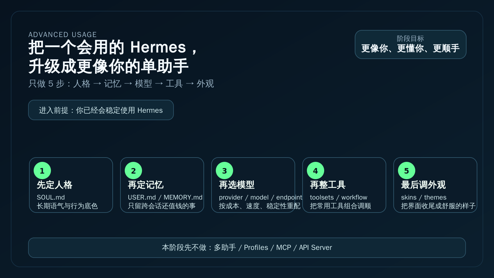

# 玩出花样

如果你已经会正常使用 Hermes，这一阶段只做一件事：
把“已经能用的一个助手”继续调成“更像你、更懂你、更顺手”的长期助手。

这一页仍然只围绕一个助手。
先不进入多助手、MCP、API Server、Profiles 这些更重的系统层玩法。

---

## ✅ 你现在适不适合进入这一阶段

符合下面 4 条，就直接继续：

- 你已经完成过 [开始上手](../get-started/index.md)
- 你已经能自然进入 Hermes 做日常提问
- 你已经知道会话怎么保存、继续、接回来
- 你现在想解决的是“怎么调得更贴合自己”，不是“怎么搭一整套系统”

如果你还没到这个状态，先回到：
- [开始上手](../get-started/index.md)

---

## 🎯 这一阶段会帮你拿到什么

走完这一阶段，你会逐步拿到这 5 个能力：

1. 让 Hermes 的语气、风格、默认行为更贴近你  
2. 让 Hermes 记住真正值得长期保留的用户偏好和环境事实  
3. 按你的模型来源、成本和稳定性，换成更合适的 LLM 配置  
4. 把工具开关、工具组合和常用工作方式调顺  
5. 让终端外观更清楚、更舒服、更符合你的使用习惯  

一句话说完：
这一阶段不是学更多功能名词，而是把同一个 Hermes 助手调成更适合长期陪你做事的样子。

---

## 🧭 这 5 页就是完整路径

<table>
  <colgroup>
    <col style="width: 17%;" />
    <col style="width: 24%;" />
    <col style="width: 34%;" />
    <col style="width: 25%;" />
  </colgroup>
  <thead>
    <tr>
      <th>步骤</th>
      <th>主题</th>
      <th>这一页会解决什么</th>
      <th>目标路径</th>
    </tr>
  </thead>
  <tbody>
    <tr>
      <td><strong>第 1 步</strong></td>
      <td><strong>让 Hermes 更像你</strong></td>
      <td>先把长期人格放对位置，分清什么该写进 SOUL.md，什么不该塞进去。</td>
      <td><a href="./soul-and-personality.md">./soul-and-personality.md</a></td>
    </tr>
    <tr>
      <td><strong>第 2 步</strong></td>
      <td><strong>让 Hermes 记住你</strong></td>
      <td>学会持久记忆的边界，只留下真的该跨会话保留的信息。</td>
      <td><a href="./persistent-memory.md">./persistent-memory.md</a></td>
    </tr>
    <tr>
      <td><strong>第 3 步</strong></td>
      <td><strong>自定义 AI 大模型</strong></td>
      <td>把默认模型选择，推进到适合你成本、速度、来源和可控性的配置。</td>
      <td><a href="./custom-llm.md">./custom-llm.md</a></td>
    </tr>
    <tr>
      <td><strong>第 4 步</strong></td>
      <td><strong>让工具更顺手</strong></td>
      <td>开始按场景整理 toolsets、工具开关和常用 workflow，而不是全开全背。</td>
      <td><a href="./toolsets-and-workflow.md">./toolsets-and-workflow.md</a></td>
    </tr>
    <tr>
      <td><strong>第 5 步</strong></td>
      <td><strong>让终端更顺眼</strong></td>
      <td>最后再调 skins 和 themes，把视觉层收尾，不和人格层混在一起。</td>
      <td><a href="./skins-and-themes.md">./skins-and-themes.md</a></td>
    </tr>
  </tbody>
</table>

现在 5 页都已经落仓，所以这里直接给真实跳转，不再保留占位文本。

---

## 🚦 默认顺序怎么走

最稳的顺序就是：

1. 先调人格，再调记忆  
2. 再决定模型怎么配  
3. 再整理工具和工作方式  
4. 最后再改外观  

别一上来先折腾皮肤。
也别还没想清楚人格和记忆边界，就急着上多模型、多系统、多助手。

如果你只想记一句：
先把“这个助手是谁、记什么、用什么模型、开哪些工具”理顺，再管它长什么样。

---

## 🧩 先别急着碰这些

这一阶段先别碰这些更重的玩法：

- 多助手协作
- Profiles
- MCP Server / Plugins 深接入
- API Server
- Cron / 自动化编排
- 更重的系统级上下文工程

这些内容会进入下一阶段“自己造东西”。
这一阶段先把一个助手调顺，不把路走散。

---

## 🌱 什么时候算过关

当下面这些状态已经成立，这一阶段就算通过：

- 你有一份稳定、克制、长期可用的人格设定  
- 你知道哪些信息该进持久记忆，哪些不该记  
- 你已经把模型配置调到适合自己的日常使用方式  
- 你已经整理出一套自己常用的工具组合和使用习惯  
- 你能一眼分清：人格是人格，记忆是记忆，工具是工具，外观是外观  

真正的变化是：
Hermes 不再只是“官方默认助手”，而是开始变成“你的那个 Hermes”。

---

## 👉 现在就开始

这一阶段的下一页是：
- [让 Hermes 更像你](./soul-and-personality.md)

如果你想先回到上一阶段入口重新确认位置：
- [开始上手](../get-started/index.md)

如果你想知道再往后会去哪里：
- 下一阶段是“自己造东西”
