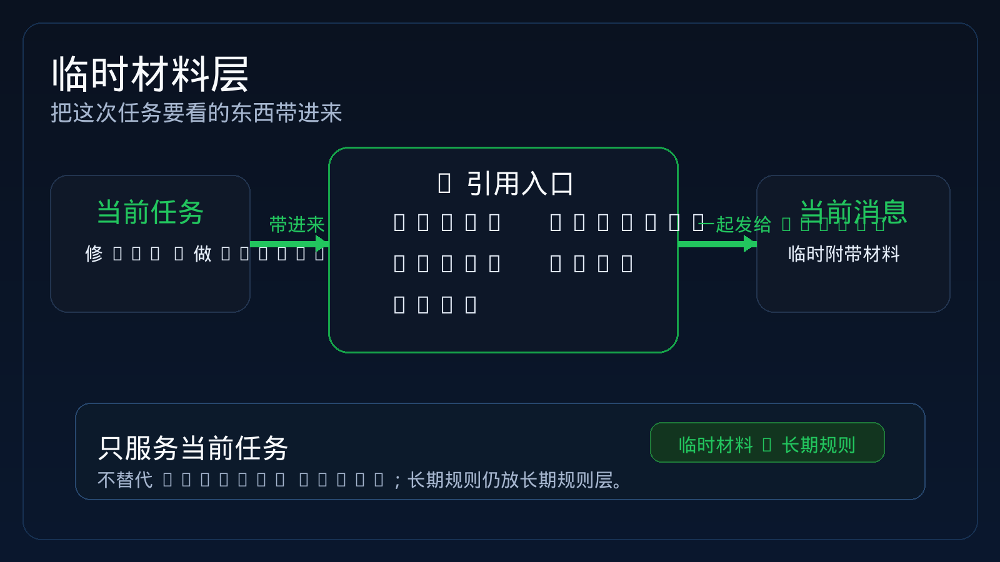

# context references：把这次任务要看的材料临时带进来

这一页只讲一件事：
context references 是 Hermes 的临时材料层。它用 `@` 引用把当前任务需要看的文件、目录、diff 或网页，临时附带进当前消息。



---

## context references 解决什么

很多任务不是缺规则。
而是缺“这次到底要看什么材料”。

常见情况有这些：

- 让 Hermes 看一个文件再改
- 只解释某几行代码
- 先看一个目录再判断从哪下手
- 直接基于当前 diff 做 review
- 回看最近几次提交在改什么
- 带一篇网页资料进来让它总结

context references 就是解决这个问题的。

你可以把它理解成：
这是你在做当前任务时，临时递给 Hermes 的材料。

重点有两个：

- 它服务当前任务
- 它不是长期规则

---

## 最常用的 6 类 @ 引用

先记最常用的 6 类就够了。

### 1) `@file:path`

适合场景：

- 让 Hermes 直接看某个文件
- 讨论一个配置文件、脚本、组件或文档
- 改动前先让它理解原文

例子：

```text
请先看 @file:src/app.py，再告诉我这里的启动流程。
```

### 2) `@file:path:10-25`

适合场景：

- 只看一小段，不把整个文件都塞进来
- 指定报错附近几行
- 让讨论范围收得更准

例子：

```text
解释一下 @file:src/app.py:10-25 这一段为什么会报错。
```

### 3) `@folder:path`

适合场景：

- 先让 Hermes 认识一个目录的结构
- 不确定入口文件在哪时先看目录
- 让它判断该从哪个文件开始读

例子：

```text
先看 @folder:src/features/auth，再告诉我这个模块的主入口在哪。
```

### 4) `@diff` / `@staged`

适合场景：

- 做代码 review
- 检查这次改动有没有漏测、越界或风格问题
- 区分“工作区未暂存改动”和“已经暂存准备提交的改动”

例子：

```text
帮我 review 这次改动：@diff
```

```text
只看我准备提交的内容：@staged
```

### 5) `@git:N`

适合场景：

- 回看最近几次提交的变化脉络
- 让 Hermes 快速理解这个分支最近在做什么
- 调查某个回归问题从哪几次提交开始出现

例子：

```text
看一下最近的提交脉络：@git:5
```

### 6) `@url:https://...`

适合场景：

- 临时带一篇官方文档或网页资料进来
- 让 Hermes 结合外部资料解释当前任务
- 对照仓库代码与外部规范

例子：

```text
结合这篇文档说明改法：@url:https://example.com/spec
```

---

## 在什么场景下各用什么

如果你只想快速选型，可以直接按这个判断：

- 已经知道要看哪个文件：用 `@file`
- 只想看一小段：用 `@file:path:10-25`
- 还不知道入口，只想先看结构：用 `@folder`
- 想 review 当前改动：用 `@diff`
- 想只看已暂存改动：用 `@staged`
- 想补最近提交背景：用 `@git:N`
- 想带外部资料进来：用 `@url`

你会发现它们都在做同一件事：
把“这次任务需要的材料”临时附带进当前消息。

---

## 为什么它不替代 context files

因为两者解决的问题根本不同。

context references 解决的是：
“这次任务要看什么。”

context files 解决的是：
“这个项目长期应该怎么做。”

如果把长期规则写成 `@` 引用，会有几个直接问题：

- 每轮都要重新带一次
- 会话一换就容易丢
- Hermes 很难长期保持一致

所以最简单的分工是：

- 当前任务材料，用 context references
- 长期规则约束，用 [context files](./context-files.md)

一句话记住：
`@` 引用是临时带材料，不是长期立规矩。

---

## 为什么 CLI 是主入口

官方把 context references 设计成以 CLI 为主的能力。

原因很实际：

- 在交互式 CLI 里，输入 `@` 会触发补全
- 你能更快发现支持哪些引用类型
- 引用会在发送前展开，再连同消息一起发给 Hermes

对用户来说，这意味着：
CLI 里用 `@` 最顺手，也最符合官方原始设计。

这也是为什么很多“看文件、看 diff、看目录”的临时任务，在 CLI 里体验最好。

---

## 消息平台里为什么不要指望 @ 自动展开

在 Telegram、Discord 这类消息平台里，`@` 文本通常不会由网关自动展开。
消息大多会原样传进去。

这意味着两件事：

- 你不能默认平台会像 CLI 一样替你展开 `@file`、`@diff`、`@url`
- 平台侧更依赖 agent 自己调用工具去读文件、查目录、取网页

所以在消息平台里，正确心智不是：
“我发了一个 `@`，系统一定会替我展开。”

而是：
“CLI 才是 `@` 引用的主入口；消息平台更多靠工具完成同类动作。”

---

## 限制怎么理解

这一页不展开完整边界手册。
你只要先知道两点：

- 它有大小限制，材料太大时不一定会完整展开
- 它有安全限制，不是什么路径和内容都允许直接带入

实操上最稳的做法是：
一次只带当前任务真正需要的材料，不要贪多。

---

## 什么时候算用对了

当你出现下面这些结果，说明你基本用对了：

- 你带进来的材料只服务当前任务
- Hermes 不需要你再手贴大段原文也能开始工作
- 你选的是最小够用的引用，而不是把整个仓库都塞进去
- review 改动时优先用 `@diff` / `@staged`，而不是手动复制 patch
- 解释文件时优先用 `@file` 或行段引用，而不是贴一长串聊天记录
- 长期规则仍然放在 [context files](./context-files.md)，没有混到 `@` 引用里

如果一句话判断：
用对了，就是“这次任务看什么”更准了，但“长期怎么做”仍然由 context files 管。

---

## 👉 下一步去哪

如果你想先回上一层确认位置：

- [上下文系统](./index.md)
- [自己造东西](../index.md)
- [从这开始](../../index.md)

如果你想回看长期规则层：

- [context files](./context-files.md)

当前页通过后，后续路径是：
`docs/start-here/build-your-own/mcp-and-plugins/`

这个路径当前仓库里还没落地，这里只写路径，不造假链接。

---

## 官方依据

- [Context References（官方）](https://hermes-agent.nousresearch.com/docs/user-guide/features/context-references)
- [Context Files（官方）](https://hermes-agent.nousresearch.com/docs/user-guide/features/context-files)
