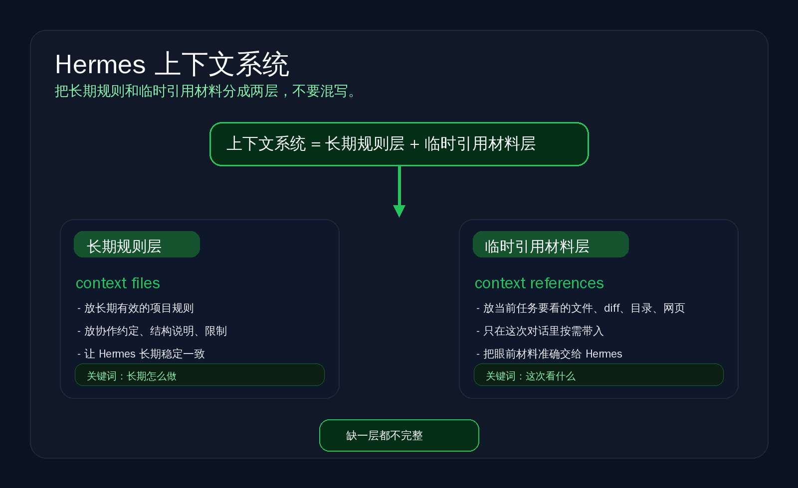

# 上下文系统：把长期规则和临时材料分开

这一页只讲一件事：
把 Hermes 的上下文分成两层来用——长期规则层，和临时引用材料层。

---

## 为什么系统化使用 Hermes 时需要上下文系统

单次聊天时，你可以靠临时描述把事说清。
但一旦你开始长期用 Hermes，很快会遇到 3 个问题：

- 同样的规则，要一遍遍重说
- 当前任务要看的材料，每次都得重新贴
- 长期约束和临时材料混在一起，越用越乱

上下文系统就是为了解决这个问题。
它不是多一个功能点。
它是把“什么该长期固定”与“什么只为这一轮任务服务”分开。

这样做的直接好处是：

- 稳定规则可以持续生效
- 当前任务材料可以按需带入
- 不同会话里，Hermes 更容易保持一致
- 你不需要每次都从头解释项目背景

---

## 上下文系统的两层结构

可以直接记成一句话：

- 长期规则层 = context files
- 临时材料层 = context references

这两层一起组成 Hermes 的上下文系统。
但它们解决的是两类完全不同的问题。

---

## 长期规则层解决什么

长期规则层对应官方的 context files。
它适合放那些“不是这次任务专用，而是希望持续影响 Hermes 行为”的内容。

最常见的是：

- 项目约定
- 目录结构说明
- 团队规则
- 编码风格
- 长期安全约束
- 固定的协作边界

你可以把它理解成：
这是 Hermes 进入一个项目后，应该长期记住的工作规则。

这一层的目标不是给它喂更多材料。
而是让它在长期使用里，少跑偏、少反复确认、少违反约定。

这一页先只建立这个心智：
context files 管的是“长期规则”。
具体有哪些文件、怎么发现、优先级怎么处理，放到下游页再讲。

---

## 临时材料层解决什么

临时材料层对应官方的 context references。
它适合放那些“只跟当前任务有关，引用完就可以结束”的材料。

最常见的是：

- 当前要看的文件
- 某个目录
- 这次改动的 diff
- 最近几次提交
- 临时网页资料
- 某一段需要解释的上下文

你可以把它理解成：
这是你在做当前任务时，临时递给 Hermes 的参考材料。

这一层的重点不是长期约束。
而是按任务把需要看的东西准确带进当前对话。

这一页也先只建立边界：
context references 管的是“临时引用材料”。
具体 `@` 怎么写、支持哪些引用类型、有什么大小限制，放到下游页再讲。

---

## 这两层为什么不能混写

因为它们的时间跨度不同，作用也不同。

如果把长期规则写成临时引用：

- 你每次都要重新带一次
- 会话一换，规则就容易丢
- Hermes 很难长期保持一致

如果把临时材料塞进长期规则：

- 规则文件会越来越脏
- 一次性的任务材料会污染长期上下文
- 真正重要的长期约束反而被淹没

最简单的判断方法是：

- 以后很多轮都会反复成立的，放长期规则层
- 只服务这次任务或这次查看的，放临时材料层

一句话总结：
长期规则要稳定，临时材料要按需。
这就是两层不能混写的原因。

---

## 下一步为什么分成 context-files / context-references 两页

因为你接下来要学的是两套不同动作：

- 一套是在系统里立长期规则
- 一套是在任务里临时带材料

如果把它们写在一页里，很容易出现两个问题：

- 你会把“长期配置”误当成“临时引用技巧”
- 你会把“当前任务材料”误塞进长期规则文件

所以后面必须拆开：

- `docs/start-here/build-your-own/context-system/context-files.md`
- `docs/start-here/build-your-own/context-system/context-references.md`

当前仓库里这两页还没落地。
这一页先把分工讲清，不造假链接，保证坏链为零。

---

## 现在你应该怎么记

如果你只带走一句话，就记这句：

Hermes 的上下文系统 = 长期规则层（context files）+ 临时引用材料层（context references）。

长期规则层负责“长期怎么做”。
临时材料层负责“这次看什么”。

---

## 返回和后续路径

如果你想回上一层确认位置：
- [自己造东西](../index.md)

如果你想回模块总入口看学习路线：
- [从这开始](../../index.md)

后续下游页路径是：
- `docs/start-here/build-your-own/context-system/context-files.md`
- `docs/start-here/build-your-own/context-system/context-references.md`

---

## 官方依据

- [Context Files（官方）](https://hermes-agent.nousresearch.com/docs/user-guide/features/context-files)
- [Context References（官方）](https://hermes-agent.nousresearch.com/docs/user-guide/features/context-references)
