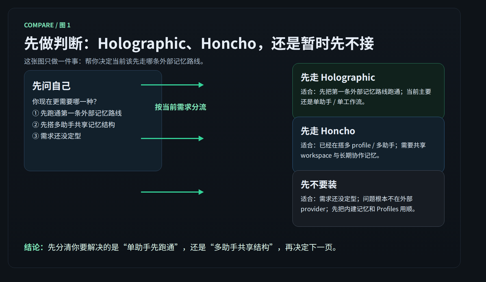

# Holographic vs Honcho：先选型，再决定要不要接外部记忆

这一页只解决一件事：
不讲安装，不讲配置，只帮你判断现在该先走 [Holographic](./holographic.md)、先走 [Honcho](./honcho.md)，还是先不要装外部 provider。

---

## 先记住的 2 个总边界

先别急着选。先把这 2 条钉死：

- 内建 `USER.md` / `MEMORY.md` 始终存在，外部 provider 只是 additive 叠加层，不是替代层
- 同一时刻只能激活 1 个外部 provider，不是 Holographic 和 Honcho 一起开

所以这页真正要回答的，不是“谁更高级”，而是：
“我现在这套系统，第一步到底该接哪一条外部记忆路线，还是暂时先别接。”

---

## 选型对照表

| 你现在更像哪种情况 | 先走 Holographic | 先走 Honcho | 先不要装外部 provider |
| --- | --- | --- | --- |
| 核心目标 | 先把第一条外部记忆路线跑通 | 先把多助手 / 多 profile 共享记忆结构搭起来 | 先把需求想清楚，再决定是否值得接 |
| 更像什么 | 单助手 / 单工作流的外部记忆起点 | multi-agent systems / cross-session context / user-agent alignment | 还在基础层，或问题根本不在外部记忆 |
| 为什么现在选它 | 路线最直，最容易先落地 | 结构更适合多个助手围绕同一用户和 workspace 长期协作 | 装了也不会自动解决方向不清的问题 |
| 记忆形态 | 更偏本地 SQLite fact store | 每个 profile 有自己的 AI peer，但可共享同一个 workspace | 继续先用 `USER.md` / `MEMORY.md` |
| 最适合的人 | 只是想先验证“外部 provider 已经接上并能工作” | 已经认真在做 Profiles、角色拆分、跨会话共享上下文 | 还没稳定使用内建记忆，或还没确认真实场景 |
| 现在不该选它的信号 | 你真正要解决的是多助手协作，不是单助手先跑通 | 你现在其实只有一个助手，只想先接最短路线 | 你已经非常明确自己要哪条路线，不需要继续停留 |
| 看哪一页 | [Holographic](./holographic.md) | [Honcho](./honcho.md) | 先回看 [外部记忆总览](./index.md) / [持久记忆](../../advanced-usage/persistent-memory.md) / [Profiles](../profiles.md) |

---

## 如果我只是想先把第一条外部记忆路线跑通，为什么该先走 Holographic

因为你此时最需要的，不是复杂架构，而是一条最容易成功的外部记忆入口。

直接看这 4 点：

- Holographic 更像第一条最容易跑通的外部记忆路线
- 它更偏本地 SQLite fact store，理解成本更低
- 它非常适合单助手 / 单工作流先落地
- 你可以先把“外部 provider 是怎么叠加在内建记忆之上”这件事跑明白

所以当你的真实问题是：
“我先把外部记忆接通，形成第一条可工作的路线。”
那 Holographic 通常就是默认答案。

---

## 如果我已经在搭多助手 / 多 profile 结构，为什么更该走 Honcho

因为这时你要解决的，已经不是“某一个助手多一层外部存储”，而是“多个助手怎样围绕同一个用户长期协作”。

先抓住 Honcho 最关键的结构点：

- 它更适合 multi-agent systems
- 它更强调 cross-session context
- 它更强调 user-agent alignment
- 每个 profile 有自己的 AI peer，但可以共享同一个 workspace

这意味着：

- 你不用把多个助手硬塞进同一个记忆人格里
- 你可以让不同 profile 保留各自身份
- 同时又围绕同一个 workspace 沉淀共享上下文

如果你已经在认真使用 [Profiles](../profiles.md)，或者已经明确自己要的是多助手长期协作，Honcho 比 Holographic 更对题。

---

## 如果我现在拿不准，为什么应该先停在 compare 做判断

因为 provider 一旦选错，你后面的理解会全偏。

这页值得先停一下，原因很简单：

- 外部 provider 同一时刻只能激活 1 个，不能靠“都装上再说”来回避判断
- Holographic 和 Honcho 服务的第一目标不同
- 你现在缺的可能不是“安装动作”，而是“系统边界判断”
- 先做分流，能避免把单助手问题误判成多助手问题，或反过来

如果你现在脑子里的问题还是：

- 我到底是在给一个助手加长期记忆，还是在搭多助手系统？
- 我现在缺的是外部 fact store，还是共享 workspace 结构？
- 我是不是其实还没到该接 provider 的阶段？

那你就应该先停在 compare，把问题判断清楚，再进下一页。

---

## 哪些情况其实先别装外部 provider

下面这些情况，通常先不要装：

- 你连内建 `USER.md` / `MEMORY.md` 都还没稳定用起来
- 你现在的问题主要是助手设定、工具、模型、流程还没跑顺
- 你还没有明确外部 provider 要服务什么场景
- 你现在只有很轻量的记忆需求，内建记忆已经够用
- 你只是觉得“先装一个更高级”，但并没有真实痛点
- 你还没判断清楚自己是单助手扩展，还是多助手系统建设

这种时候，更对的动作通常是先回去把基础层用顺：

- [持久记忆](../../advanced-usage/persistent-memory.md)
- [Profiles](../profiles.md)
- [外部记忆总览](./index.md)

一句话：
如果你连问题都还没定型，先别把外部 provider 当成答案。

---

## 最典型的分流判断题

直接做这 4 道判断题：

### 1）我现在最想要的是什么？

- 想先把第一条外部记忆路线跑通 → 去 [Holographic](./holographic.md)
- 想先把多助手共享记忆结构搭起来 → 去 [Honcho](./honcho.md)
- 还说不清 → 先停在这一页，不要急着装

### 2）我当前主要在服务几个助手？

- 主要还是一个助手 / 一个工作流 → 更偏 Holographic
- 已经是多个 profile / 多个助手 → 更偏 Honcho

### 3）我现在缺的是哪一层？

- 缺一个最容易落地的外部事实层 → 更偏 Holographic
- 缺跨会话共享上下文与用户对齐结构 → 更偏 Honcho
- 连缺什么都还没判断清楚 → 先别装

### 4）如果今天只能做一个正确动作，是什么？

- 先走最容易成功的一条外部路线 → Holographic
- 先按多助手系统的结构来设计 → Honcho
- 先把判断做对，避免后面白折腾 → 暂时停在 compare

---

## 什么时候算通过

当你已经能明确回答下面 5 个问题，这一页就算通过：

- 我知道内建 `USER.md` / `MEMORY.md` 会一直存在
- 我知道外部 provider 是 additive，而且同一时刻只能单选 1 个
- 我知道“先跑通第一条外部记忆路线”为什么更该先走 Holographic
- 我知道“多助手 / 多 profile / 共享 workspace”为什么更该先走 Honcho
- 我知道哪些情况其实应该先别装外部 provider

---

## 下一步去哪

按你刚才的判断直接走：

- 想先跑通第一条外部记忆路线 → [Holographic](./holographic.md)
- 想先搭多助手共享记忆结构 → [Honcho](./honcho.md)
- 想回到这一层重新确认边界 → [外部记忆总览](./index.md)
- 想先把内建记忆和边界搞扎实 → [持久记忆](../../advanced-usage/persistent-memory.md)
- 想先把多个助手的分工方式理顺 → [Profiles](../profiles.md)
- 想退回“自己造东西”这一层 → [自己造东西](../index.md)

---

## 官方依据

- [Memory Providers（官方）](https://hermes-agent.nousresearch.com/docs/user-guide/features/memory-providers)
- [Persistent Memory（官方）](https://hermes-agent.nousresearch.com/docs/user-guide/features/memory)
- [Profiles（官方）](https://hermes-agent.nousresearch.com/docs/user-guide/profiles)
