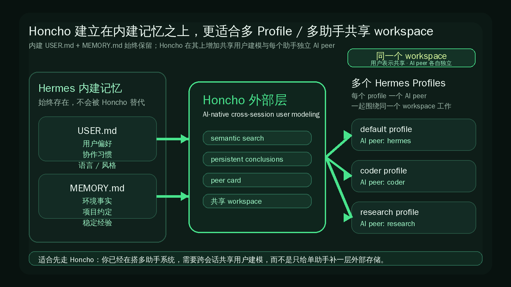

# 接入 Honcho：当你开始搭多助手共享记忆结构

这一页只解决一件事：
当你已经明确自己不是只想“先接一个外部 provider”，而是想把多 profile / 多助手围绕同一个用户与 workspace 长期协作起来时，怎样用最短路径把 Honcho 接上。



---

## 什么时候更适合先走 Honcho

如果你现在更像下面这种情况，通常就该先走 Honcho：

- 你已经不止一个助手，或者马上要认真使用多个 [Profiles](../profiles.md)
- 你要解决的是跨会话上下文，不只是单助手本地记忆够不够用
- 你希望多个助手围绕同一个用户持续对齐，而不是各记各的
- 你需要语义搜索、持久结论、peer card 这类更系统的用户建模能力
- 你在搭的是多助手系统，不只是给一个助手补一层外部存储

一句话判断：
如果你的重点是“多助手长期协作的共享记忆结构”，Honcho 比“先跑通一个外部 provider”更像正确起点。

---

## 它和内建记忆是什么关系

这里先只记住 3 个边界：

- 内建 `USER.md` / `MEMORY.md` 一直都在
- 外部 provider 是 additive 叠加层，不是替代层
- 同一时刻只能激活 1 个外部 provider

所以接上 Honcho 之后，真实结构是：

- `USER.md` 继续承接你的协作偏好、语言偏好、长期习惯
- `MEMORY.md` 继续承接环境、项目和稳定经验事实
- Honcho 再往上提供跨会话用户建模、语义搜索、持久结论与 peer card

不要把它理解成“我以后不用 `USER.md` / `MEMORY.md` 了”。
正确理解是：
“我保留内建记忆，再在上面接一个更适合多助手系统的外部层。”

如果你对内建记忆还不够熟，先回看：[让 Hermes 记住你：持久记忆只看 USER.md 和 MEMORY.md](../../advanced-usage/persistent-memory.md)

---

## 它为什么更适合多助手 / 多 profile / workspace

Honcho 最关键的点，不是“又多一个 provider 名字”，而是它的结构天然更适合多助手系统：

- 每个 Hermes profile 都会拿到自己的 Honcho AI peer
- 这些 profile 可以共享同一个 workspace
- 同一个用户表示会持续沉淀，不必每个助手各自重建
- 不同助手又能保留各自的身份和观察结果

你可以把它理解成：

- workspace 是共享场域
- user representation 是共享用户侧长期认知
- AI peer 是每个 profile 各自的助手身份

这也是它比 Holographic 更适合多助手系统的重要原因之一：
你要的不是“某个助手自己多一层外部记忆”，而是“多个助手围绕同一个用户与工作区长期协作”。

从能力名称上看，Honcho 这一层主要体现为：

- semantic search
- persistent conclusions
- peer card
- AI-native cross-session user modeling

如果你还没开始拆分助手，先回看：[多个助手一起工作：先理解 Profiles](../profiles.md)

---

## 最小接入路径

如果你的目标只是先接通，不要一上来研究完整参数。先按这 4 步走就够了。

### 1）先确认你要解决的是“多助手共享记忆结构”

在动手前，先确认两件事：

- 你已经知道外部 provider 不会替代内建记忆
- 你现在更关心多 profile / 多助手 / workspace，而不是单助手先跑通

如果这两件事都成立，就适合继续。

### 2）用最短入口接上 Honcho

最短入口有 3 条：

```bash
hermes honcho setup
```

或：

```bash
hermes memory setup
```

然后在交互选择里选：

```text
honcho
```

或者直接设成当前外部 provider：

```bash
hermes config set memory.provider honcho
```

### 3）知道 Honcho 配置会从哪里读

这一步不用背参数百科，只要知道 Honcho 的配置解析顺序：

```text
$HERMES_HOME/honcho.json
~/.hermes/honcho.json
~/.honcho/config.json
```

也就是说，你最常见要看的就是这 3 个位置。

### 4）接完后先看“结构有没有真的建立起来”

先不要急着调高级参数，先确认下面这些最基本的结果：

- 当前激活的外部 provider 已经是 `honcho`
- Honcho 配置已经落到上述 3 个路径之一
- 你知道当前 profile 对应的是自己的 AI peer，而不是和别的 profile 混成一个助手身份
- 多个 profile 仍然可以围绕同一个 workspace 工作

只要这几件事成立，就说明 Honcho 这条接入路线已经站住了。

---

## 接完之后看什么算成功

这页只看“是否接上”，不展开“怎样把 Honcho 调到最优”。

最稳的成功信号，通常是下面这些：

### 成功信号 1：状态层面已经显示 Honcho 在生效

优先看：

```bash
hermes memory status
```

如果你想直接看 Honcho 自己的解析结果，也可以看：

```bash
hermes honcho status
```

只要你能确认当前外部 provider 是 `honcho`，这是第一层成功信号。

### 成功信号 2：配置层面已经写到了正确位置

你能在配置里确认：

- `memory.provider` 已经指向 `honcho`
- Honcho 相关配置已经出现在 `$HERMES_HOME/honcho.json`、`~/.hermes/honcho.json` 或 `~/.honcho/config.json` 之一

这说明 Hermes 已经知道该把外部记忆交给 Honcho。

### 成功信号 3：你已经能说清多 profile 的结构

也就是你已经知道：

- 每个 profile 都有自己的 Honcho AI peer
- 它们可以共享同一个 workspace
- 内建 `USER.md` / `MEMORY.md` 仍然同时存在

这一步很重要。
因为 Honcho 的价值不只是“能开起来”，而是“你知道它为什么更适合多助手系统”。

---

## 哪些情况不该先走它

下面这些情况，通常不建议把 Honcho 当第一步：

- 你连内建 [持久记忆](../../advanced-usage/persistent-memory.md) 还没用顺
- 你现在其实只有一个助手，只是想先接一个最短外部 provider
- 你还没开始用 [Profiles](../profiles.md)，也没有明确的多助手结构
- 你目前的问题是助手基础层没跑顺，不是跨会话共享建模不够
- 你只是想把所有 provider 都装上再比较

简单说：
Honcho 适合“已经明确要做多助手共享记忆结构”的人，不适合在需求还没成形时拿来当默认第一步。

如果你后面发现自己真正需要的是先做选型，再回到 `docs/start-here/build-your-own/memory-providers/` 这一层看 compare 路径；如果只是想先跑通第一条外部记忆路线，则回到 `holographic.md`。

---

## 什么时候算通过

当你已经能明确回答下面 5 个问题，这一页就算通过：

- 我知道 Honcho 建立在内建 `USER.md` / `MEMORY.md` 之上，而不是替代它们
- 我知道 Honcho 更适合多助手 / 多 profile / 共享 workspace
- 我知道每个 profile 都有自己的 AI peer，但可以共享同一个 workspace
- 我知道最短接入方式是 `hermes honcho setup`、`hermes memory setup` 选 `honcho`，或直接 `hermes config set memory.provider honcho`
- 我知道接完后该检查 `hermes memory status`、`hermes honcho status` 和 Honcho 配置路径

---

## 下一步去哪

如果你已经接通 Honcho，下一步通常只需要回看两层：

- [外部记忆系统总览](./index.md)，确认它在整体路线里的位置
- [Profiles](../profiles.md)，继续把多助手拆分方式理顺

如果你想重新确认内建记忆应该放什么：

- [持久记忆](../../advanced-usage/persistent-memory.md)

如果你后面要做 provider 选型，回到 `docs/start-here/build-your-own/memory-providers/` 目录，再看 compare 路径；这页不展开。

---

## 官方依据

- [Memory Providers（官方）](https://hermes-agent.nousresearch.com/docs/user-guide/features/memory-providers)
- [Profiles（官方）](https://hermes-agent.nousresearch.com/docs/user-guide/profiles)
- [Honcho Memory Provider README](https://github.com/NousResearch/hermes-agent/blob/main/plugins/memory/honcho/README.md)
