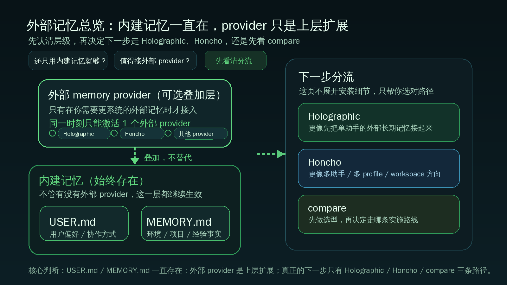

# 接入外部记忆系统：先看清它是在哪里加一层

这一页只解决一件事：
把外部 memory provider 放回正确位置，再决定你下一步该走 `holographic.md`、`honcho.md`，还是先去 `compare.md`。

---

## 为什么外部记忆不是替代内建记忆

先记住官方最重要的两句话：

- `USER.md` 和 `MEMORY.md` 一直都在
- 外部 memory provider 是 additive 叠加层，不是替代层

也就是说，就算你后面接了外部 provider：

- 内建 `USER.md` 还是继续负责用户偏好
- 内建 `MEMORY.md` 还是继续负责环境、项目、经验事实
- 外部 provider 只是把“跨会话记忆能力”再往上扩一层

所以正确理解不是：
“我以后不用 `USER.md` / `MEMORY.md` 了。”

而是：
“我保留内建记忆，同时在上面再接一个更正式的外部记忆系统。”

还有一个边界一定要先知道：

- 同一时刻只能激活 1 个外部 provider

不是同时把 Holographic、Honcho 全都打开，再让 Hermes 自己选。
你要先决定当前这套系统，到底让哪个外部 provider 生效。

---

## 什么时候还只用内建记忆就够

如果你现在主要还是：

- 只在用一个 Hermes 助手
- 主要想让它记住你的偏好、机器环境、项目约定
- 记忆内容还比较小，`USER.md` / `MEMORY.md` 完全够装
- 你还在熟悉 [持久记忆](../../advanced-usage/persistent-memory.md) 的边界
- 你还没明确需要“外部工作区”“跨 profile 协同”“更系统的记忆召回”

那先继续只用内建记忆，通常就是对的。

对很多用户来说，先把下面两件事写好，比立刻接 provider 更重要：

- `USER.md` 里写清协作偏好
- `MEMORY.md` 里写清环境、项目和稳定约定

如果这两层你都还没真正用起来，先不要急着加外部 provider。

---

## 什么时候值得走到外部 provider

当你开始遇到下面这些情况，才说明外部 provider 真的开始有价值：

- 你不只是在记“偏好”，而是在搭“长期可复用的系统记忆”
- 你已经有多个 profile，或者准备把多个助手长期分工
- 你希望跨会话记忆不只停留在本地两份小文件里
- 你开始关心更正式的召回、工作区、共享上下文或系统级沉淀
- 你已经知道自己要解决的是“记忆系统设计”，不是“记一两条用户习惯”

一句话判断：
当你觉得 `USER.md` / `MEMORY.md` 还是必要，但已经不够承接你的系统化用法时，就该看外部 provider 了。

---

## 这三条路径分别解决什么

这页后面只有 3 条真实下游路径：

1. `holographic.md`
2. `honcho.md`
3. `compare.md`

这一页不抢写它们的安装和配置细节，只先告诉你它们各自更像什么方向。

### 路径 1：Holographic 更像“先把单助手的外部长期记忆接起来”

如果你现在最关心的是：

- 我想先接上一个外部 provider，跑通一条清晰路径
- 我当前主要还是围绕单助手或单工作流使用
- 我想先理解“外部 provider 叠加在内建记忆之上”到底是什么感觉

那你通常会先去看：

- `docs/start-here/build-your-own/memory-providers/holographic.md`

这一条更像：
从“内建记忆够用”过渡到“外部记忆开始参与”的第一条落地路线。

### 路径 2：Honcho 更像“多助手 / 多 profile / 工作区型记忆”

如果你现在更关心的是：

- 你已经在认真使用 [Profiles](../profiles.md)
- 你希望多个助手围绕同一个用户或工作区长期协作
- 你需要比单助手本地记忆更系统的共享与建模方式

那你更该看：

- `docs/start-here/build-your-own/memory-providers/honcho.md`

这一条更像：
把记忆放进一个更适合多助手系统的方向里。

### 路径 3：compare 更像“先做选型，不急着装”

如果你现在最不确定的是：

- 我到底该先走 Holographic 还是 Honcho
- 我是单助手扩展，还是多助手系统
- 我想先看差异，再决定投入哪条路径

那先去：

- `docs/start-here/build-your-own/memory-providers/compare.md`

这条路适合“先比较，再实施”，而不是“先装一个再说”。

---

## 默认从哪条开始

默认建议这样走：

- 你只是第一次接外部 provider：先看 `holographic.md`
- 你已经明确是多 profile / 多助手系统：先看 `honcho.md`
- 你当前拿不准方向：先看 `compare.md`

你可以把它理解成一个很简单的分流规则：

- 想先跑通外部记忆入口 → Holographic
- 想先搭多助手记忆结构 → Honcho
- 想先做判断题 → compare

---

## 哪些情况先不要接外部记忆

下面这些情况，先别急着上 provider：

- 你连 `USER.md` / `MEMORY.md` 都还没稳定使用
- 你还在频繁调整 `SOUL.md`、模型、工具这些基础层
- 你现在的问题其实是“一个助手还没用顺”，不是“外部记忆不够”
- 你还没有明确外部 provider 要服务什么场景
- 你只是因为“看起来更高级”而想先装上

外部记忆不是越早越好。
它更像在单助手已经跑顺以后，再增加系统能力的一步。

如果你还处在“先把一个助手用好”的阶段，先回看：

- [让 Hermes 记住你：持久记忆只看 USER.md 和 MEMORY.md](../../advanced-usage/persistent-memory.md)
- [多个助手一起工作：先理解 Profiles](../profiles.md)

---

## 什么时候算通过

当你已经能明确回答下面 5 个问题，这一页就算通过：

- 我知道内建 `USER.md` / `MEMORY.md` 不会因为外部 provider 而消失
- 我知道外部 provider 是叠加层，不是替代层
- 我知道同一时刻只能激活 1 个外部 provider
- 我知道 Holographic、Honcho、compare 这三条路径分别解决什么
- 我知道自己下一步该去哪一页，而不是盲目开始安装

---

## 下一步去哪

如果你想继续往下走，下一步只有这 3 个真实目标：

- `docs/start-here/build-your-own/memory-providers/holographic.md`
- `docs/start-here/build-your-own/memory-providers/honcho.md`
- `docs/start-here/build-your-own/memory-providers/compare.md`

如果你想先退回上一层确认位置：

- [自己造东西](../index.md)

如果你想先回到内建记忆，把基础层做扎实：

- [持久记忆](../../advanced-usage/persistent-memory.md)

---

## 官方依据

- [Memory Providers（官方）](https://hermes-agent.nousresearch.com/docs/user-guide/features/memory-providers)
- [Persistent Memory（官方）](https://hermes-agent.nousresearch.com/docs/user-guide/features/memory)
- [Profiles（官方）](https://hermes-agent.nousresearch.com/docs/user-guide/profiles)
